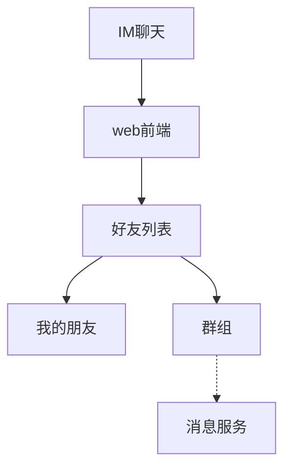

# Project Manager 插件 · 立项文档

> **交付形态**：DeepSeek Harness 插件（`@dsh-plugin/project-manager`），Host 面 + Web Client 面双入口。
> **一句话**：把「会话跑到哪了、还剩多少」从一堆说明文档，变成侧边栏里一张实时进度流程图。

**本文档怎么读**：本文只回答**为什么做、做什么、怎么做**。
每条需求都能挂回 §1 的某一痛点或 §2 的宗旨——挂不回去的需求不应该存在。
「实测踩过什么坑」「哪一批功能已经落地」属于实现记录，不在本文，见 `README.md`（当前进度）
与本仓变更记录（§附录 A）。

---

## 0. 速览

**问题**：长任务会话没有进度可见性。用户不知道当前阶段、还剩多少没做完，只能靠翻超长文档猜。

**答案**：单一流程图文档 `project-manager.md` + 侧边栏实时看板 + AI 通过工具读写节点。

**四条铁律**：

| # | 铁律 | 违反后果 |
|---|---|---|
| 1 | `project-manager.md` 内**只有标题和流程图**，无任何叙述文字 | 写入被拒绝（FR-02 校验器拦截） |
| 2 | 节点状态**只能**通过工具或右键菜单变更，不支持裸文本编辑 | 文档损坏、状态漂移 |
| 3 | 同一节点的并发写入**绝不静默覆盖**，冲突必须仲裁 | 进度与实际脱节 |
| 4 | 插件入口在**侧边栏**，配置在**设置图标 → 设置页** | 找不到入口 |

**看板回答三个问题**：

| 用户疑问 | 由什么回答 |
|---|---|
| 现在到哪个阶段了？ | 流程图高亮当前**枝** + 进行中叶节点 loading |
| 还剩多少没整完？ | 未完成叶节点计数 + 未完成任务列表 + 完成度 `38% (31/50)`（百分比按工作量，不按件数） |
| 先干哪些、哪些能放？ | 关注枝高亮 + 旁枝降饱和；改旁枝须过审核框（FR-50） |

**两个开关（都关乎 token）**：

| 能力 | 是否耗 token | 关闭后 |
|---|---|---|
| **自动扫描建树** | 零 token 骨架必做；AI 建树耗 token | 仅保留零 token 骨架（可后续手动触发 AI 建树） |
| **AI 权重测量** | **耗 token**（仅测关注枝内叶节点） | 全部走零 token 启发式轨：**有结构数据 → 工作量口径；无结构差异 → 如实降级为按件数并标注** |

> **不做无依据的周期估算**：看板只给百分比与未完成计数，**不给"还需多久"**。理由见 §9.4。

**技术基准**：**以 DSH 的 rc 版本为基准**——当前 `baselineDsh = 0.1.5-rc.2`，不等待稳定版，每个新 rc 发布后 24h 内巡检评估（§19）。

**外部确认通道（与铁律 3 同级）**：破坏性操作的人工确认**走 DSH 既有两条 seam**，不新造通道——
`ctx.approval`（一次性授权，策略 `ask` / `never`）与 `ctx.userQuestions`（结构化提问，`ask_user_question`）。
**通道不可用时以拒绝方式关闭（fail-closed），绝不静默放行**；`never` 下沙箱升权与审批一律确定性被拒（§6.8、FR-135 · FR-139）。

---

## 0.1 免责与使用边界（必读）

> **本插件只是一个方便工具，不保证任何结果，使用者需自行核实并承担全部后果。**

**为什么必须写这句**——不是法律套话，而是本插件有三处**技术上的固有不可靠**：

| # | 不可靠之处 | 技术原因 |
|---|---|---|
| 1 | **百分比是估算值** | 节点划分、状态判定、权重都含判断成分；AI 测量的工作量更是估算，不是事实 |
| 2 | **AI 判断可能出错** | 自动扫描会漏建任务、错建任务、误判完成；权重测量可能明显偏离实际 |
| 3 | **回滚无法保证完整恢复** | 只覆盖已记录的 `touchedPaths` 与快照 diff；**外部进程、其他工具、用户手动改动产生的副作用不在覆盖范围内**，无法还原 |

**使用者责任**：插件不代替你验证代码与产物，不代替你做发布决策。
**破坏性操作（删除、回滚、整枝操作）的最终后果由使用者承担。**

**边界声明（明确不做的事）**：

- 不保证任务清单完整——扫描是抽样与推断，不是穷举；
- 不保证百分比与"实际完成度"一致——它只反映**节点表的状态**；
- 不保证回滚能恢复到期望状态——回滚是尽力而为，不是事务；
- 不保证项目能按时收口——本插件不做无依据的周期估算（§9.4），更不构成任何工期承诺。

**插件提供的保险机制**（降低风险，而非消除风险）：

| 机制 | 作用 |
|---|---|
| 外部确认通道 | 破坏性操作交由人确认（`ctx.approval` / `ctx.userQuestions`）；通道不可用时**拒绝而非放行**（§6.8） |
| 回滚点（细粒度） | 给一个可退回的锚点，但不保证覆盖全部副作用 |
| 回滚可撤销 | `pre-rollback` 快照让误回滚可挽回 |
| 删除三方案 | 提供"仅注释、可恢复"选项，避免不可逆删除 |
| 冲突不静默覆盖 | 宁可停下来问，也不悄悄改数据（§10） |
| 全程留痕 | 每次写入可审计、可追溯来源 |

**声明的呈现位置**（不能只写在文档里）：

| 位置 | 形态 |
|---|---|
| 首次加载 | 引导页显式勾选「我已了解：本工具为辅助工具，需自行核实结果」后才继续 |
| 每个破坏性确认框 | 底部固定一行提示：「本操作不可保证完整恢复，请自行确认」 |
| 设置页「关于」 | 常驻完整声明文本，可随时查阅 |

---

## 1. 背景与痛点

**根因**：进度信息被编码在**非结构化自然语言**中。模型能理解，人不能一眼理解，且无法被校验。

**推论**：需要把进度抽成**结构化、可校验、可渲染**的一等实体，文档只是它的一个投影。

本插件的全部需求都服务下面三个痛点；**挂不回来的需求不立项**（唯一例外是 §2.1 的工程纪律类取向，它不指向外部痛点）。

| # | 痛点 | 现状 | 本方案覆盖 | 主要需求 |
|---|---|---|---|---|
| **P1** | 会话一直在跑，不知道当前阶段 | 会话进度只存在于模型的上下文里，用户不可见 | 看板「完成度 + 未完成计数」+ 枝级进行中高亮 | FR-30 · FR-34、FR-42、§9.1、§11.2 |
| **P2** | 还剩多少地方没整完，不知道 | 无任务清单，或清单散落在对话里 | 节点树 + 未完成计数 + 未完成任务列表 + 过滤视图 | FR-31–37、FR-43、FR-146 |
| **P3** | 文档说明特大，看得头疼，没有直观进度 | 说明性 md 膨胀，阅读成本高 | 文档强制极简（FR-02）+ 图形化渲染（FR-40） | FR-01–05、FR-40–49、§8 |

> **三个痛点共同的技术前提**：进度必须**可结构化、可校验、可渲染**——这正是 §1 推论、
> 铁律 1（文档只有标题与流程图）与 §7 数据模型的由来。

---

## 2. 项目主旨、目标与非目标

### 2.1 项目主旨（唯一宗旨）

> **以项目进度为主：让"还剩多少"一眼可见，并且这个数字来自可校验的结构化事实，而不是叙述文字。**

这条宗旨直接推出四条不可动摇的取向（它们是**排序依据**，冲突时按下表裁决）：

| # | 取向 | 含义 | 冲突时的裁决 |
|---|---|---|---|
| A1 | **进度主口径** | 节点上的数字表达的是"完成到哪了"，不是"还剩几件事没干" | 画布枝节点给 `总 n / 已完成 d`；未完成清单是**入口**而非主口径（FR-146） |
| A2 | **事实源唯一** | 存储是唯一事实源，`project-manager.md` 是派生投影 | 外部手改文档**永不**成为权威值，只做校验与规范化（§8.2、§12.4） |
| A3 | **不编造** | 没有依据就不给数字 | 权重没有来源就写"按件数"；无估算就不给"还需多久"（§9.3、§9.4） |
| A4 | **宁可停下问** | 冲突与破坏性操作不静默处理 | 并发冲突进仲裁；破坏性操作要人工确认，通道不可用即拒绝（§6.8、§10） |
| A5 | **每轮补记，不轮轮建节点** | 对话轮次是**对既有节点的补充修正**，不是"新建一批节点来记账" | 一轮里若干次修正 → 追加到**原节点**（轮次事实）；**只有真实的新功能点/新任务点才新增节点**。单轮跨多个任务改动时，**每个受影响节点都要逐一体现**（§9.3、§13.4、FR-152） |

### 2.2 目标（本期必达）

| ID | 目标 | 度量 |
|---|---|---|
| G1 | 任意时刻可读出整体/关注枝的完成度百分比与未完成计数 | 侧边栏看板首屏可见，刷新延迟 ≤ 1s |
| G2 | AI 会话/子任务/子代理能可靠地推进节点状态 | 单次会话内 `pm_*` 写工具调用中**首次尝试即成功**的比例 ≥ 99.5%（重试成功不计入成功、计入分母）；冲突率 = 触发 C1–C12 之一的调用数 / 总写调用数 ≤ 1%；采样窗口 = 最近 1000 次写调用 |
| G3 | `project-manager.md` 始终保持「标题 + 流程图」形态 | 非法写入拦截率 100% |
| G4 | 操作者能对任意节点执行关注/暂停/回滚/继续/拦停/放行/增删改/描述 | 12 项菜单按父/叶可见性全部可用，破坏性操作有确认框 |
| G5 | 暂停与拦停不丢任务上下文 | 生成交接文档，恢复后可从断点续跑 |

### 2.3 非目标（本期明确不做）

| ID | 不做 | 理由 |
|---|---|---|
| N1 | 不做通用项目管理（人员排期、甘特图、工时审批） | 面向 AI 会话收口，不是 Jira |
| N2 | 不替代会话历史与 todo 工具 | todo 是会话内瞬时清单，本插件是跨会话持久化项目进度 |
| N3 | 不做代码自动生成 | 只描述与推进任务，代码由会话/子代理执行 |
| N4 | 不做多用户协作与权限体系 | 单机单用户场景，共享写入仅指多会话/多子代理并发 |
| N5 | **不做无依据的周期估算** | 无任务级估计时不给"还需多久"、不做用时外推。`estimateMin` 仅供 AI 权重决策内部使用，**不对外展示为周期**（§9.4） |

### 2.4 需求编号的读法

- **必须** = 本期交付范围；**可选** = 可延后。级别逐条标在需求行内，多数分节表格第三列即是。
- 编号**一经分配永不复用、永不重排**（避免历史文档与提交记录对不上）。
  带字母后缀者（如 FR-39a、FR-69c、FR-140a）是**在已发布编号后追加的兄弟需求**，不是"修订次数"。
- 需求按章节聚集，编号不连续是正常现象（例如 §6.3 写入与存储用 FR-20 · FR-26 与 FR-119–125 两段）。
- **完整需求索引**见 §附录 B；每条需求在此可查到所属章节。

---

## 3. 术语表

> 术语先定义再使用，避免「节点/任务/功能」混用。

### 3.1 「链路」正名（重要）

口语里说的「链路」在本项目里实际指两件不同的事，必须分开，否则文档、UI 文案与实现会长期漂移：

| 说法 | 实际含义 | 本项目正式用词 | 关键性质 |
|---|---|---|---|
| 「某条链路」 | **以某节点为根、向下展开的整个子树** | **枝**（branch） | 由一个或多个叶节点组成；关注、暂停、拦停、删除、回滚都以**枝**为作用单位 |
| 「一条链路」 | 从根到某叶节点的**一条路径** | **链路**（chain，仅此一义） | 一整条链路恰好对应**一个叶节点**；只用于描述"端到端一个任务单元" |
| — | 最小可执行任务 | **叶节点**（leaf） | 这就是「一条」的真实单位 |

**一句话**：**叶子才是「一条」；父节点指的是一枝。**

因此：

- **关注一个节点 = 关注该节点及其全部子孙**（即该节点封顶的整枝），不是关注一条路径；
- 暂停/拦停/删除一个父节点 = 作用于**一枝**；
- 「还有几条没做完」这句话的主语是**叶节点**，不是枝；
- 只有当需要强调"这整条端到端流程"时才用「链路」，且此时它等价于一个叶节点。

### 3.2 关注的合并语义（关键）

既然「关注节点 = 关注其整枝」，多个关注点之间就必须有确定的合并规则，否则进度百分比会重复计算。

| 情形 | 规则 |
|---|---|
| 只关注 A | 主枝 = A 枝（A 及其全部子孙）。A 的后代**不需要**再标记 |
| 同时关注 A 与其后代 B | **冗余**，自动归一化：只保留 A，丢弃 B 的标记（写入时即合并，UI 给出轻提示） |
| 关注 A，又关注与 A 无祖先关系的 C | 主枝 = A 枝 ∪ C 枝（**并集**），两枝各自独立统计后合并 |
| 取消关注 A | 只清除 A 的标记；A 的后代若原本**显式**标记过，则恢复其各自的关注范围 |
| 关注根节点 | 主枝 = 全树，等价于"关注整体"；此时关注指标与整体指标一致 |

**归一化不变量**：任意时刻，被关注的节点集合中**不存在**祖先-后代关系——即所有关注节点两两互不包含（构成一棵"森林的根集合"）。

**主枝判定的实现后果**：

- 存储上 `focus` 仍是节点上的布尔字段（简单、可审计），归一化在写入校验时强制执行；**另设 `focusShadow` 布尔字段**保存"该节点是否曾被显式标记"，使取消祖先关注后能恢复后代的关注状态（C11 / FR-19）。两者关系见 §7.2；
- 计算"关注枝进度"时，遍历关注节点集合（已保证互不包含），取并集内的**叶节点**套用 §9.3 的加权式（**不是**按叶节点数等权平均）；
- UI 高亮 = 各关注节点封顶的枝取并集；
- 「关注枝完成度百分比」同样按并集内叶节点计算，不重复计算共享的中间节点。

**为什么不在后代重复标记**：用户说"我关注了这个节点"就已经涵盖其下所有内容；要求逐个子节点标记会增加操作负担，且必然导致重复计数。

### 3.3 术语表

| 术语 | 英文/标识 | 定义 |
|---|---|---|
| **立项文档** | — | 本文档。回答「为什么做、做什么、怎么做」 |
| **项目文档** | `project-manager.md` | **仅含**项目标题 + 流程图代码块的 md 文件。其他内容一律非法 |
| **其他文档** | — | 除 `project-manager.md` 以外的任意 md |
| **资源** | resource | 文件、代码、生成物、目录的统称 |
| **节点** | node | 流程图上的一个方框。可以是功能点或任务点，统一称「节点」 |
| **节点（阅读约定）** | — | 本文与 README 里出现的「节点」**一律指流程图上的节点**（功能点 / 任务点，即你在看板画布里能点到的那种方框）。它**不是**会话节点、消息节点、文档节点或存储条目 —— 那些各有专名（会话 / 消息 / 文档 / 记录） |
| **父节点** | parent | 有子节点的节点。指代的是**一枝** |
| **叶节点** | leaf | 无子节点的节点，是可执行的最小任务单位。**一条任务 = 一个叶节点** |
| **枝** | branch | **以某节点为根、其下全部子孙构成的子树**。关注/暂停/拦停/删除/回滚的作用单位 |
| **链路** | chain | 从根到某叶节点的一条路径。**严格一义**：一整条链路 = 一个叶节点 |
| **主枝** | main branch | 关注节点及其以下的枝。AI 以此为主 |
| **旁枝** | side branch | 非主枝。AI 以辅，改动需审核 |
| **关注** | focus | 用户标记的优先枝。**关注某节点 = 关注该节点及其全部子孙**；看板单独统计该枝的完成度百分比 |
| **自身状态** | self state | 节点自己被直接设置的状态 |
| **计算状态** | derived state | 由自身状态 + 子孙状态 + 门控标记推导出的对外状态（§9.1） |
| **门控** | gate | 作用在父节点上的暂停/拦停/放行标记，递归影响该枝 |
| **交接文档** | handoff doc | 暂停或拦停时生成的上下文快照，恢复时消费并删除 |
| **回滚点** | snapshot / rollback point | 暂停、拦停或手动时建立的现场快照，可将枝还原到该时刻（§7.6） |
| **节点文本块** | node block | 每个节点独占的写入空间，防止并发写入交错覆盖 |
| **写入尝试** | attempt | 一次带序号的写入事件，追加而非覆盖 |
| **仲裁** | resolve | 冲突写入由人工或规则裁决的过程 |
| **订阅** | subscription | actor 与节点的关联，含写入面（意图/路径）与通知面（级别），§12.4 |
| **轮次落账** | round posting | 一个对话轮次结束时，把这一轮**对既有节点做的补充修正**逐节点记上去；不新增节点、不冲抵已完成节点。单轮若跨多个功能点，则逐节点落账（FR-152、§13.4） |
| **订阅意图 / 通知级别** | intent / notify | `read`/`write`/`exclusive`；`key`/`full`/`none`。注意这是**订阅的**两个面，与「关注」不是一回事 |
| **任务点扫描带** | task strip | 看板顶部一条极窄竖条带，每叶节点一根，颜色 = 计算状态（§11.2） |

---

## 4. 项目形式与入口位置

**形式**：DeepSeek Harness **出树插件**（out-of-tree plugin），符合 Cordis 插件模型。

**装配方式**：`dsh plugin --profile web add <包名>` 装入 `$DSH_HOME/profiles/web/`。

**入口（硬约束，不可变更）**：

| 入口 | 位置 | 实现槽位 | 内容 |
|---|---|---|---|
| 主面板 | **Harness 页面侧边栏** | `sidebar.panellist`（list，root scope）+ layout `main` keyed 槽（**同 id 配对**） | 图标 + 标签；点击后主列渲染流程图看板 |
| 配置页 | **页面内设置图标 → 设置页** | `sidebar.settings` 已由 ui-settings-general 占据；本插件注册 `settings.section` | 刷新间隔、**扫描/AI/token 预算参数**、冲突策略、外观、导入导出等偏好 |
| 节点操作 | 流程图节点**右键菜单** | 面板内自绘 | 关注/暂停/回滚/打回滚点/继续/拦停/整枝回滚/放行/添加/修改/删除/描述（共 12 项，父/叶可见性不同，见 §6.9） |
| AI 通道 | **工具（tool）** | Host 面注册 Cordis 工具 | 会话、子任务、子代理读写节点 |
| 进度快照 | 右侧边栏「实时进度」页签 | `ctx.sidebarRightTabs` 注册类型 + `sidebar.right.pane.tab` 挂内容 | 只读快照：整体/关注枝完成度 + 未完成前 8 项 + 一键跳完整看板（§6.10） |

> `sidebar.settings` 是**单值槽**，本插件**不得**抢占；设置项一律以 `settings.section` 贡献页注册。
> 对话区提问/审批槽（`conversation.composer` 等）由 `dsh-client-ui-user-questions` / `dsh-client-ui-approval` 占据，
> 本插件**不得争抢**；插件面板内的弹窗只承载**面板自发起**的交互确认（§6.8）。

---

## 5. 锁定技术栈

> 本节为**决策记录**，实现阶段不得自行替换；如需变更须修订本文档。

### 5.1 运行时与语言

| 项 | 选型 | 版本 | 说明 |
|---|---|---|---|
| 宿主框架 | `@deepseek-ai/cordis` | ^4.0.2 | DSH 插件底座，`peerDependencies` |
| 语言 | TypeScript | ~5.6 | 全仓统一，Host/Client 两套 tsconfig face |
| 运行环境 | Node.js | ≥ 20 | Host 面 |
| 包管理 | pnpm | workspace | 与 DSH 生态一致 |
| 构建 | `tsdown` | 与 DSH 各包一致 | `bundle` / `watch` 两个脚本 |
| 插件形态 | ESM（`"type": "module"`） | — | 与 `dsh-client-ui-*` 一致 |

> **基准版本（立项时实测）**：`@deepseek-ai/dsh` CLI = `0.1.5-rc.1`；其下 230 个包 = `0.1.5-rc.2`。
> **复核**：本机 `@deepseek-ai/dsh` = `0.1.5-rc.2`，其下 `dsh-user-approval`、`dsh-user-questions`、
> `dsh-tool-ask-user`、`dsh-client-ui-user-questions`、`dsh-client-ui-approval`、`dsh-permission-presets`
> **均为 `0.1.5-rc.2`，已在依赖树内**——即 §6.8 所需的审批与提问 seam **无需新增外部依赖**。
> 结论：**以 rc 为基准**（§19）——前 1.0 的 rc 阶段无 semver 稳定性保证，因此本节所有 `^` 范围仅为书写便利，实际以 §19.2 的精确 rc 带为准。

### 5.2 Host 面（Node）

| 用途 | 选型 | 说明 |
|---|---|---|
| **持久化（主路线）** | **`@deepseek-ai/dsh-storage` + `dsh-storage-domain` + `dsh-storage-json`** | 复用 DSH 的 schema 校验 KV 领域：单记录写入原子持久、每领域单条写链、`domain/changed` 变更事件（§7.3） |
| 持久化（兜底路线） | 自建 JSONL + 快照 + 压实 | 仅在能力探测发现 storage 缺失时启用（§19.4） |
| **结果裁剪与省略提示** | **`@deepseek-ai/dsh-output-retention`** | `ItemRetainer`（有序窗口 + 精确省略计数）、`TextRetainer`（头/尾字节窗口，不切断 UTF-8）、`formatRetentionNotice`。**范围与责任方（代码审查后如实标注）**：① **存储清理（保留最新、淘汰最旧）——自研**（其窗口是 head-only，不适用，FR-131）；② **交接文档写盘截断——自研** `domain/handoff.ts::truncateUtf8`（字节安全 + 追写"已截断（原 N 字节）"的省略说明，§9.6 已验收）；③ **工具返回裁剪**按本行复用该包的能力。①②**均为名义复用、实际自研**，登记为待收敛项（见 `docs/代码审查-文档对齐.md` 偏差 1） |
| **文件访问** | **`@deepseek-ai/dsh-fs`（`ctx.fs`）** | 版本守卫的原子写与字面编辑；用于 `project-manager.md` 投影、交接文档、WAL。**不直接 `node:fs`** |
| **原子写** | `@deepseek-ai/dsh-atomic-write` | 原子替换 + 跨进程写锁（`ctx.fs` 不足时的底层补充） |
| **ID 生成** | `@deepseek-ai/dsh-util-crypto` | 浏览器安全的 UUID；仓库级 lint 规则禁止直接用 `crypto.randomUUID`，必须走此包 |
| **超时/截止** | `@deepseek-ai/dsh-timeout` | `clampTimeout` / `deadline` / `timeoutOf`；用于 C10 停止确认超时、订阅 `expiresAt`、等待让路 |
| **敏感动作授权（审批通道）** | **`@deepseek-ai/dsh-user-approval`（`ctx.approval`）** | `request({agent, toolName, callId?, reason, signal})` → 封闭结果 `allowed-once｜rejected｜cancelled｜unavailable`。**一次性**授权：无 `allow-always`、无已记住规则、无撤销存储；会话策略 `ask`（默认）/ `never`，`never` 在应答者分发**之前**确定性拒绝；无应答者时以拒绝方式关闭。**只传工具名与原因、不传参数**，故 preview/影响范围不放这里（见下一行）；请求**必须处于未结束的轮次内** |
| **向人提问/澄清（提问通道）** | **`@deepseek-ai/dsh-user-questions`（`ctx.userQuestions`）+ `@deepseek-ai/dsh-tool-ask-user`（`ask_user_question`）** | 结构化问题：`id` / `header` / `question` / `detail` / `options[]` / `multiSelect` / `intent`；**破坏性操作的 preview 与影响范围由 `detail` 承载**。**归属其他 agent 的存活子代理不能调用**（`DELEGATED_CALLER` 被拒），只能把未决问题写进最终结果 |
| **有界队列** | `@deepseek-ai/dsh-deque` | 零依赖环形双端队列；用于写入队列与等待队列的有界实现 |
| 有界保留 | `@deepseek-ai/dsh-output-retention` | **仅用于工具返回裁剪**（`ItemRetainer` 为 head-only 窗口，`TextRetainer` 为字节 head/tail 窗口）。**存储清理不适用**：保留最新、淘汰最旧的策略须自研（FR-131） |
| 文件监听 | `chokidar` | 已在 DSH 依赖树内；外部改动热感知 + 跨进程改动兜底 |
| 文档解析/校验 | `mdast-util-from-markdown` + 自研校验器 | 强制执行 FR-02「只允许标题 + 流程图」 |
| 流程图解析 | 自研 Mermaid 子集解析器 | 见 §5.4 |
| Schema 校验（工具入参 / 配置） | `@deepseek-ai/schemastery` | 与 DSH 配置模型同源 |
| Schema 校验（存储领域） | `zod` | DSH `defineDomain` 要求 zod 记录 schema |
| 通信 | DSH Remote（`ctx.remote` 命名空间）+ `dsh-api-remotes` 事件白名单 | 复用框架传输，不自建 WebSocket |
| 子进程（git） | 优先复用 DSH 的子进程 seam | 快照 git 档需要调 git（`commit-tree`/`update-ref`）；**调用途径必须登记**；若确需 `node:child_process`，须在此登记为新增运行时依赖，且不开新终端、不长期持有句柄（§7.6） |
| 测试框架 | Node 内置 `node --test` | DSH 已发布产物中无 vitest/jest；领域层为纯函数，用内置 test runner 即可（§12.4 可测试） |

#### 参考实现（照抄模式，减少设计风险）

| DSH 包 | 借鉴什么 |
|---|---|
| **`@deepseek-ai/dsh-workspace`** | **最重要**：它就是"基于 domain form 的持久化实体注册表"（工作区记录 + zod schema + 组合装配）。本插件的节点/订阅存储**照此模式实现**；它还提供了可挂载的 `workspaceId` 关联点 |
| `@deepseek-ai/dsh-chunked-list` | 不可变追加列表 + **JSON 检查点校验**；兜底路线的追加日志与审计可复用其检查点机制 |
| `@deepseek-ai/dsh-session-format` | **流式相邻版本迁移机制**；§19.6 的迁移器链可借鉴其"唯一相邻序列、单次消费"的做法 |
| `@deepseek-ai/dsh-invariants` | 包级运行时不变式注册服务；§12.5 的关键不变量可注册为可校验断言 |
| `@deepseek-ai/dsh-scope` | 作用域标签 + 作用域过滤事件分发；订阅的按会话裁剪可复用 |
| `@deepseek-ai/dsh-util-workspace-path` | 浏览器安全的工作区路径与展示助手；引用路径校验复用 |
| `@deepseek-ai/dsh-time-context` | 每步时间与耗时上下文（若将来需要，但**注意与"不做周期"决策不冲突**：那是给模型的时间感知，不是进度周期展示） |
| `@deepseek-ai/dsh-plan-mode` | `ask_user_question` 的 `intent: 'plan-review'` 呈现意图的消费方；**借鉴其"计划 → 审阅 → 批准/拒绝/再聊"的确认编排**，本插件的删除/回滚确认照此编排（不新造 `intent` 标签：未识别标签的 UI 会回落通用选项列表，行为等价但呈现更弱——§13.1） |

> **关于 SQLite 后端**：`dsh-storage-json` 的 README 提到"选 SQLite 后端用于大数据量/高并发"，
> 但**当前 rc 版本（`0.1.5-rc.2`）只发布了 `json` 后端，没有 `dsh-storage-sqlite` 包**。
> 因此本插件**不依赖**它：默认路由 `json`；若将来该后端发布，可通过组合配置切换，**插件代码无需改动**。
> 运行环境为 **Node v22.21.1**，具备 `node:sqlite`（实验性），可作为自研后端的备选实现手段，但**本期不实现自研后端**。

### 5.3 Web Client 面（浏览器）

| 用途 | 选型 | 说明 |
|---|---|---|
| UI 框架 | **React ^18.2** + `react-dom` | 与全部 `dsh-client-ui-*` 一致，**无第二选择** |
| 槽位系统 | `@deepseek-ai/dsh-client-ui-slots` | `SlotMap` 声明式合并 |
| 面板槽 | `sidebar.panellist` + layout `main` | 侧边栏入口 |
| 设置槽 | `settings.section` | 设置页贡献 |
| 右栏页签 | `ctx.sidebarRightTabs` + `sidebar.right.pane.tab` | 右侧边栏「实时进度」（§6.10） |
| 面板选择态 | `usePanelInfo((info) => info.activePanelId === id)` | 侧边栏行高亮 |
| **对话区提问/审批 UI（已被占用）** | `@deepseek-ai/dsh-client-ui-user-questions`、`@deepseek-ai/dsh-client-ui-approval` | 提问界面会接管 `conversation.composer`，审批面板渲染审批请求。**本插件不得争抢这两个槽** |
| 状态订阅 | `@deepseek-ai/dsh-client-store`（`ObservableSnapshot`） | 会话投影、面板元数据 |
| 宿主通信 | `ctx.remote.<namespace>` + `ctx.remote.$on(...)` | Client 侧唯一通道 |
| 设置持久化 | `ctx.settingsScope.bind(spec)` + `ctx.settingsSchema` | 复用设置镜像，禁止自建配置读取 |
| 国际化 | `@deepseek-ai/dsh-client-locale` | 中英双语，与 GUI 语言联动 |
| 基础组件 | `@deepseek-ai/dsh-client-ui-primitives` | 按钮、弹窗、提示等 |
| 图渲染 | **自绘 SVG 画布**（§5.4） | ~~`@xyflow/react`~~ 已否决，见 §5.4 |
| 图布局 | **自研分层布局**（`client/flow-layout.ts`） | ~~`elkjs`~~ 已否决，见 §5.4 |
| 动画 | CSS transition / `requestAnimationFrame` / SVG SMIL | 尊重 `prefers-reduced-motion`（SMIL 用于进行中转圈，因为产物无 CSS 管线） |
| 图表 | ~~`lightweight-charts`~~（**已移除**：不做周期，无需时间序列图表） | — |

### 5.4 渲染方案决策（关键）

**需求**：渲染独立化，作为 **Mermaid 超集**；Mermaid 实现不了就重写机制。

**决策**：**不使用 Mermaid 运行时**，改为「Mermaid 兼容语法 + 自研渲染器」。

| 维度 | Mermaid | 本方案 |
|---|---|---|
| 定位 | 文本 → 静态 SVG | 结构化数据 → 交互式画布 |
| 交互 | 无（除查看器缩放） | 拖拽、右键菜单、tooltip、点击、框选 |
| 状态表达 | 无 | 状态色、进度条、loading、角标 |
| 实时更新 | 整图重渲，闪烁 | 增量 diff 更新，节点级重渲 |
| 子图 | 支持但不可交互 | 可折叠分组、可下钻 |
| 布局控制 | 黑盒 | 自研分层布局 + 主枝/旁枝分离 |
| 虚线连旁枝 | 需 hack | 一等公民，独立渲染层 |

**副作用（必须接受）**：模型不能再随意手写 Mermaid 语法；节点变更**只能**走工具/菜单。这与铁律 2 一致，是**收益**而非损失。

**自绘 SVG 而非 React Flow + elkjs（决策记录）**：

| 事实（实测） | 后果 |
|---|---|
| 客户端插件产物是 **classic script**，平台只取工厂返回的 exports，**没有 CSS 管线** | React Flow 的节点定位/手柄强依赖它的 `.css`；硬接必须把 CSS 当字符串内嵌再手注入 `<head>` |
| 平台**冻结** 9 个 `require` 目标，其余依赖必须打进 bundle | 布局引擎（elkjs 数百 KB）会直接进 combo，收益与体积不成比例 |
| 本插件需要的图形语义很收敛：分层树 + 正交连线 + 状态填充 + 角标 + 折叠 + tooltip | 自研 SVG 约 300 行即可覆盖，且零第三方运行时 |
| 布局必须是**纯函数**才能单测 | 自研布局可直接用 `node --test` 覆盖（分层、居中、不重叠、折叠、成环保护等断言） |

**保留的能力**：缩放/平移/适应视图、折叠展开子树、只看未完成、悬停权重依据、点选与未完成列表双向联动、
两层视觉编码（§11.2）、**枝桠折叠**、**领航图（minimap）**、**节点属性栏**、**选中态**（详见 §11.1 与 FR-47a · FR-47d）。

**暂缺**：框选、拖拽改结构。

### 5.5 外部依赖红线

- **禁止重复实现 DSH 已提供的基础设施**：持久化优先用 `ctx.storageDomain`，原子写用 `dsh-atomic-write`，
  文件访问用 `ctx.fs`，传输用 DSH Remote。自建实现只允许出现在**降级兜底路径的业务逻辑层**
  （如追加日志、压实、归档），且**必须**复用上述基础包而非重写它们（§7.7、FR-127）。
- 禁止引入第二套 UI 框架（Vue/Svelte/Solid）或第二套状态库。
- 禁止自建 HTTP/SSE 传输，一律走 DSH Remote。
- **禁止自建第二套确认/授权通道**：破坏性操作的人工确认一律走 `ctx.approval`（一次性授权）与 `ctx.userQuestions` / `ask_user_question`（提问与澄清）；**禁止**自造对话区问答协议、自造审批弹窗协议，或把"确认"实现为只能由模型自行满足的参数。理由与失败语义见 FR-135 · FR-139（§6.8）。
- 禁止直接读写 `$DSH_HOME` 下非本插件目录。
- 新增运行时依赖须在本文档登记。

### 5.6 可复用技术栈审核清单

> 对外部依赖逐项做过"DSH 是否已提供等价能力"的核实。**结论：12 项可直接复用（含"敏感动作人工授权"与"向人提问"两项）、5 项借鉴照抄或可注册、8 项确需自研或新增。**
> 下表为可追溯记录；新增依赖时须补齐本表（FR-134）。

| 能力 | 原计划 | 审核结论 | 依据 |
|---|---|---|---|
| 持久化 KV | 自建 JSONL + WAL + 压实 | **改为复用** `ctx.storageDomain` | `dsh-storage-domain` 提供 schema 校验 KV、原子单记录写、单条写链、变更事件 |
| 存储实体范式 | 自行设计 | **照抄** `dsh-workspace` | 它是基于 domain form 的持久化实体注册表（zod + 组合装配），含可挂载 `workspaceId` |
| 结果裁剪 | 自写截断逻辑 | **计划复用** `dsh-output-retention`（`ItemRetainer`/`TextRetainer`/`formatRetentionNotice`） | **代码审查后的实际状态**：交接文档写盘截断与存储清理**仍是自研**（`truncateUtf8` / 自研有界保留），行为已验收（截断必给省略说明），但复用纪律未落实 → 登记为**待收敛项** |
| 文件读写 | 直接 `node:fs` + 自写原子写 | **改为复用** `ctx.fs` + `dsh-atomic-write` | `ctx.fs` 支持版本守卫的原子写与字面编辑；`dsh-atomic-write` 提供跨进程写锁 |
| ID 生成 | 自定方案 | **改为复用** `dsh-util-crypto` | 浏览器安全 UUID；仓库 lint 禁止直接用 `crypto.randomUUID` |
| 超时处理 | 自写 `setTimeout` | **改为复用** `dsh-timeout` | `clampTimeout`/`deadline`/`timeoutOf` + `TimeoutReason` 分类 |
| 有界队列 | 自写数组队列 | **改为复用** `dsh-deque` | 零依赖环形双端队列，摊还 O(1) |
| 有界保留 | 自写上限清理 | **改为复用** `dsh-output-retention`（**仅工具返回裁剪**；其窗口是 head-only，`保留最新/淘汰最旧` 的存储清理策略不适用，须自研——见 FR-131） | 有界保留原语 + 中性省略提示；`ItemRetainer` 只支持 `head` |
| 路径助手 | 自写路径校验 | **改为复用** `dsh-util-workspace-path` | 浏览器安全的工作区路径与展示助手 |
| **敏感动作人工授权** | 自建确认弹窗 + 自造 `confirmToken` 握手（"工具的确认通道"） | **改为复用** `ctx.approval`（`dsh-user-approval`） | DSH 已提供一次性授权 seam + 逐请求审计（`approval/asked`/`approval/decided`）+ 会话策略 `ask`/`never`，且**无应答者时以拒绝方式关闭**；自造通道在 `never` 策略下无从授权。**注意其请求不携带参数**，故 preview/影响范围另见下一行 |
| **向人提问 / 描述歧义澄清 / 成本确认** | 自建提问弹窗协议 | **改为复用** `ctx.userQuestions` + `ask_user_question`（`dsh-user-questions` + `dsh-tool-ask-user`） | 已提供结构化多问题、选项、`detail`、自定义文本、`plan-review` 意图；**自带"子代理不可提问"边界**（`DELEGATED_CALLER`），正是本插件必须显式处理的场景 |
| 追加日志 + 检查点 | 自建 | **借鉴** `dsh-chunked-list` | 不可变追加列表 + JSON 检查点校验（兜底路线用） |
| 版本迁移 | 自建迁移器框架 | **借鉴** `dsh-session-format` | 相邻版本唯一序列、单次消费；迁移器本身仍需自写 |
| 运行时不变式 | 写文档里就完事 | **可注册** `dsh-invariants` | 包级不变式注册服务，把 §12.5 变成可校验断言 |
| 作用域事件 | 自写按会话过滤 | **可复用** `dsh-scope` | 作用域标签 + 作用域过滤事件分发 |
| 图渲染 | `@xyflow/react` | **改为自研**（依赖树内无，且产物无 CSS 管线） | §5.4 |
| 图布局 | `elkjs` | **改为自研**（依赖树内无，且体积不划算） | §5.4 |
| Markdown 解析 | `mdast-util-from-markdown` | **仍需新增** | DSH 未提供 mdast 解析（其 `turndown`/`domino` 方向相反） |
| 文件监听 | `chokidar` | **已在依赖树** | 直接复用 |
| 测试框架 | 待定 | **用 Node 内置 `node --test`**（依赖树内无 vitest/jest） | 领域层纯函数，内置 runner 足够；参照 DSH 自身的测试组织方式 |
| 流程图解析 | 自研 Mermaid 子集 | **确需自研** | 无等价能力；§5.4 已论证不用 Mermaid 运行时 |
| 文档合法性校验 | 自研 `doc-guard` | **确需自研** | 无等价能力（这是本插件的核心约束） |

**审核纪律**：上表"仍需新增/确需自研"的每一行都成立过"DSH 无等价能力"的检查；
后续如发现更优复用点，须回填此表并同步 §5.2/5.3。

---

## 6. 功能需求

> 编号用于追溯；**必须**项为本期交付范围，**可选**项可延后。
> 本节是**接口与行为的契约**（对人与对 AI 都算），实现细节落在 §7–§13。

### 6.1 文档治理

| ID | 需求 | 级别 |
|---|---|---|
| FR-01 | 单一项目文档 `project-manager.md`，位于工作区根或 `DSH_WORKSPACE` 指定目录 | 必须 |
| FR-02 | 该文件内**有且仅有**项目标题 + 一个流程图代码块；校验器拒绝任何额外标题、说明、列表、注释文本 | 必须 |
| FR-03 | 禁止 AI 向该文件写入不相关内容；写入路径唯一（工具/菜单），并做 schema 校验 | 必须 |
| FR-04 | 校验失败时拒绝写入并返回**可执行的修正提示**（哪个字段、为什么不合法） | 必须 |
| FR-05 | 支持一键「规范化」：把外部手改造成的非法文档收敛回合法形态（保留可解析的节点） | 可选 |
| FR-156 | **索引完备性**：新增 / 删除 / 重编号需求时，**必须同时**更新附录 B 索引、§17 断言与编号空间表——三者对不上就是文档缺陷（可脚本核对：正文定义 ∩ 索引 ∩ 断言） | 必须 |
| FR-157 | **锚点与术语一致性**：`§x.y` 引用必须指向**存在**的章节；同一口径只有一种写法（如 `总/已完成` 无空格），反例必须在正文显式标明"这是反例"，否则会被当成待办去改。文档级自检至少覆盖：编号唯一、锚点有效、表格对齐、围栏配对、跨文档数字一致 | 必须 |

> **与铁律 1 的关系**：这条不是"格式偏好"，而是 A2（事实源唯一）的落地——文档只是投影，
> 所以它的形态可以并且必须被机械校验（§8.2）。

### 6.2 节点模型

| ID | 需求 | 级别 |
|---|---|---|
| FR-10 | 节点 = 名称 + 唯一 id + 状态 + 进度 + 权重 + 描述 + 引用 + 标记 | 必须 |
| FR-11 | 节点名称即节点简称，**不写详细描述**；详细描述放在 `description` 字段 | 必须 |
| FR-12 | 支持父子嵌套（递归），层级不限 | 必须 |
| FR-13 | 支持 `::` 并列同级节点语法（如 `我的朋友 :: 群组`） | 必须 |
| FR-14 | 引用类型：注释、md 文档、代码、生成物、目录；统一为 `{type, target, label?}` | 必须 |
| FR-15 | 中途新增的分支必须**显式标记**为 `addedMidway`，看板以角标提示 | 必须 |
| FR-16 | **关注点标注**（风险 / 待确认 / 需人工看）可标注在任意节点。**注意与「关注」（`focus`）区分**：`focus` 决定"哪条枝是主枝"（§3.2 归一化、影响完成度分母），本条的"关注点"是**节点上的旗标**（`flags`），不影响统计口径 | 必须 |
| FR-17 | 节点间依赖关系线：支持 `dependsOn` 声明，独立于父子层级 | 必须 |
| FR-18 | 支持节点间通信能力的元数据（绑定会话 id / 子任务 id / 子代理 id） | 必须 |
<!-- 归属审查：FR-17 支撑"先干哪些"（P1 第三问：排序依据）；FR-18 是 §12.4 订阅与 FR-72 绑定的数据前提。二者都不进完成度统计。 -->
| FR-19 | **关注归一化**：关注集合中不得存在祖先-后代关系（关注父节点即涵盖其整枝），写入时自动合并并提示 | 必须 |
| FR-39j | **节点语义硬约束**：树上每个节点**必须是功能点或任务点**。文件只能作为节点的引用路径（`refs`）与证据，**不得**成为节点本身；"其余 N 个文件"这类文件语气节点**禁止**出现 | 必须 |

> FR-39j 归在这里（而不是建树那节）：它是**节点模型**的约束，扫描只是最容易违反它的入口。

### 6.3 写入、存储与膨胀治理

| ID | 需求 | 级别 |
|---|---|---|
| FR-20 | 节点文本块化管理：每节点独占写入空间，物理上不可能交错覆盖 | 必须 |
| FR-21 | 支持共享写入（多会话、多子代理同时推进不同节点） | 必须 |
| FR-22 | 队列化写入：写入请求进队列顺序应用，保证最终一致 | 必须 |
| FR-23 | 同功能区并发写入时做**语义校验**，冲突不得静默覆盖 | 必须 |
| FR-24 | 冲突自动修正优先；无法自动修正时进入仲裁队列并通知用户 | 必须 |
| FR-25 | 已完成节点不得被静默改回未完成（需显式 `force` 且留痕） | 必须 |
| FR-26 | 每次写入记录来源（会话/子代理/用户）与时间戳，可审计 | 必须 |
| FR-119 | **压实触发有阈值**（**仅兜底路线需要**）：`graph.jsonl` 超阈值必须折叠进 `snapshot.json` 并归档；`snapshot.json` 体积恒为 O(节点数)。主路线为 KV 覆盖写，**无追加日志、无压实需求** | 必须（兜底） |
| FR-120 | **归档与 `wal` 有界**（**仅兜底路线**）：归档日志与 `wal` 均有保留上限与保留天数，超限最旧优先清理 | 必须（兜底） |
| FR-121 | **机器内部数据不进上下文**：存储数据（两路线）均不主动读取或注入提示词，工具只读内存派生视图 | 必须 |
| FR-122 | 存储总占用有上限与告警；超限给出清理入口而非静默失败 | 必须 |
| FR-123 | **存储端口抽象**：领域层只依赖 `storage/port.ts`，不依赖具体后端；主路线与兜底路线跑**同一组契约测试**，**功能等价**（顺序/持久性等差异须在 §7.7 明确列出，不要求逐项相同） | 必须 |
| FR-124 | **能力探测与降级**：`ctx.storageDomain` 不可用时自动切兜底路线，并在设置页明示当前路线与能力差异 | 必须 |
| FR-125 | **多记录操作幂等化**：因 DSH KV 无跨记录事务，回滚/批量删除/批量重置必须实现为**幂等可重放序列**（操作前写 checkpoint，成功后清除，崩溃可续跑至收敛） | 必须 |

### 6.4 看板与进度

| ID | 需求 | 级别 |
|---|---|---|
| FR-30 | 顶部标题看板：项目名称 | 必须 |
| FR-31 | 顶部看板：整体任务**完成度百分比**（括号内同时给「已完成叶节点/总叶节点」计数） | 必须 |
| FR-32 | 顶部看板：关注枝**完成度百分比**（同样带计数） | 必须 |
| FR-33 | 顶部看板：**未完成叶节点数**、进行中节点数、异常节点数（口径统一为叶节点，见 §9.3） | 必须 |
| FR-34 | **只做百分比，不做无依据周期**：不展示"还需多久"、不做用时外推；权重口径与来源（AI / 启发式估算 / 混合）必须在百分比旁标注 | 必须 |
| FR-35 | **未完成任务展示**：看板下方常驻未完成任务列表（按状态与是否关注排序），支持点击定位到流程图节点；列表与流程图双向联动 | 必须 |
| FR-36 | 未完成任务列表展示字段：节点名、所属枝路径、状态、进度、是否关注、是否中途新增 | 必须 |
| FR-37 | 未完成任务支持导出/复制为清单文本，便于粘贴到会话继续推进 | 可选 |
| FR-146 | **节点数字口径以进度为主**：画布枝节点给**纯数字** `总/已完成`（如 `33/21`，叶给自身百分比）；属性栏顶部大号数字牌同样是纯数字 `33/21`，含义由紧随其后的 caption（`33 个任务点，已完成 21`）承担；看板与右栏给 **`总/已完成`（`140/1`）**。**五处同源**（`src/client/labels.ts` 纯函数）——同一份数据两处说法不一致是本项目最不能接受的问题 | 必须 |
| FR-153 | **一个位置只放一个数字串**（用户：「描述啰嗦，直接 `140/1` 就行」+「**任务点等地方我说了展示为 140/1，不是 1/140**」）：主口径固定为 **`总/已完成`（`140/1` = 总 140、已完成 1）**，**顺序写死、不做方言**；**不得**与未完成数并列（`140/1 · 未完成 139` 是把同一份信息说两遍——两个数的和就是总数）；未完成数只在它本身就是主角时出现（未完成清单、`未完成 N 项` 标题）。③ **该位置已有名词标签时，数字串不再带"总 / 已完成"说明**——如看板指标行的 `任务点 140/1`、右栏的 `140/1`（标签由「整体完成度」承担），**禁止** `任务点 已完成 1/140（已完成 / 总）` 这类把同一件事说三遍、还把顺序写反的写法。④ **同一屏内同一个数字不出现两次**：看板指标行每格只给一个数、规模行只说 `N 个节点`、指标行下不挂"次要口径"行。⑤ 同时**取消 `总 n / 已完成 d` 与 `已完成 d / 总 n` 这类方言**——同一个数字在不同位置换顺序本身就是"说法不一致" | 必须 |
| FR-154 | **散文类界面文案用纯文本**：提示 / 说明 / 确认框 / 设置项 hint / 警告文案**禁止**出现 Markdown 标记——`**加粗**` 会被当字面星号显示、`` `代码` `` 会被当字面反引号显示。**例外**：图例弹窗（`client/legend.ts`）是 markdown 渲染，那里 `**` 是有意强调。审查方式：对"字符串字面量 + JSX 文本"扫 `**` 与反引号，命中即修（代码注释不算） | 必须 |
| FR-160 | **一个功能只留一个入口，同一个数不在同一处说两遍**（用户：「右键有这个功能，功能性重复。**又是重复**，你全局审查下吧」）。① **入口唯一**：同一个动作不得在两处各放一个按钮/菜单项——判据是"**不按这个按钮，用户还能不能做到这件事**"；能，就删掉它。反面教材：`删除整枝` 一度同时在**右键菜单**与**画布顶部工具条**，该工具条还并列 `已选：x`（画布选中高亮 + 右栏标题已说过）与 `取消选择`（点空白处即可）→ 整条删除，删除只留右键一处。② **数值唯一**：同一处/同一行不并列同一个数的两种说法——`整体完成度 68%` 与 `任务点 140/1` 是同一个数（`已完成/总` 与 `1-已完成/总`），**不得并列**。③ **防复发**：凡可机械判定的重复（同一数字串在指标行内出现两次、已删入口的文字复活）必须有渲染自检断言钉住，且断言要先验证"注入重复时它会红"。④ **具体到全局审查的 5 项重复，用户已逐项裁定**（关注保右键+属性面板 / 工作区保顶部 / 口径保顶部 / 打开完整看板保左侧入口 / 图例与状态条都保留），裁定理由见 §11.2a 的"逐项裁定"表 | 必须 |

> FR-146 是宗旨 A1 的直接落地：**数字必须带标签、且以"完成到哪了"为主**。
> 未完成列表（FR-35）与「只看未完成」过滤（FR-48）**保留但降为入口**，不再当主口径。

### 6.5 首次使用：扫描与建树

> **场景**：第一次加载插件时，工作区里往往没有任何项目树。若直接显示空白，插件等于不可用。
> **硬约束**：首次加载会调用 AI 生成文档与树，**必须**控制 token 节奏（§9.5）。

| ID | 需求 | 级别 |
|---|---|---|
| FR-38 | 检测到工作区**无项目树**时，自动进入**引导式首次扫描**，而不是显示空白页 | 必须 |
| FR-39 | **默认建树路径：AI 从仓库生成**——模型读目录骨架与关键文件**签名**，产出**功能点/任务点**，并在**同一次调用**里给出每个任务点的相对工作量与"看起来做到哪了"的初值。零 token 粗扫（阶段 A）降级为 **AI 关闭/不可用时的起点**：只给骨架、不建树、不估权重 | 必须 |
| FR-39a | 无论走哪条路，**先给可见界面**：AI 建树前先渲染"待建树"的空态与操作入口，不允许全屏 loading 到底 | 必须 |
| FR-39b | 阶段 B 执行前**必须**弹出 token 成本提示框：说明将扫描的文件范围、预估调用规模、以及「跳过 AI 建树」选项。**确认经提问通道承载（§6.8）；通道不可用视为未确认 → 不发起 AI 调用、回落零 token 骨架** | 必须 |
| FR-39c | 扫描**必须**按 §9.5 T4 的分层顺序**渐进式呈现**，每完成一层即渲染并更新骨架屏，禁止"全屏 loading 到最后一次性弹出" | 必须 |
| FR-39d | 自动建出的节点标记 `autoCreated`，与用户手建节点在 UI 上可区分（角标），并支持一键「全部转正」 | 必须 |
| FR-39e | 扫描结果**必须**写入事实源并投影出 `project-manager.md`（即首次加载确实会走 AI 出文档的路径） | 必须 |
| FR-39f | 支持「重新扫描」与「增量扫描」：仅对新增/变更的文件重新分析，避免重复计费 | 必须 |
| FR-39g | 扫描支持**中断与续跑**：中途取消不丢已建节点，下次可继续；支持"只扫到某层深度" | 必须 |
| FR-39h | 用户可预先设置扫描范围（包含/排除 glob）与深度上限，默认排除 `node_modules`、构建产物、`.git` | 必须 |
| FR-39i | 扫描完成后给出摘要：新建节点数、消耗 token 估算、跳过的文件数、下一步建议 | 必须 |
| FR-150 | **项目根唯一（单根纪律）**：AI 建树必须落成**单一根**（已有活根 → 模型给的顶级节点全挂其下；没有根 → 第一个顶级节点当根、其余挂它下面；两种情况都写进返回的 notes）；已有多根的树可经「整理为单一根」（`mutateReparent`）**整枝并入**，**只改父子关系、不删节点**、逐枝判定、结果如实回报。领域层**不做**"再建根就拒绝"的硬约束（会挡掉"删根重扫"等合法路径）——原因写在代码里，不假装已全局强制。**⑥ 并入必须判语义去重（实测补充）**：单根 ≠ 把两棵树叠成一棵——若候选枝与目标枝的 `refs` 大量指向**同一批路径**（如同一份 `src/adapter`），则它们是**对同一份代码的两次评估**，并入后完成度会被重复统计。此时**不得静默并入**：要么提示"这是重复的功能树，建议删除其中一棵"，要么按 `refs` 合并同名功能点。验收断言见 §17 | 必须 |
| FR-39j | （见 §6.2：节点必须是功能点/任务点） | 必须 |

**建树输出按不可信输入处理**：模型返回的节点树必须校验——非法 JSON / 越界权重与进度 / 逃逸路径 /
同父重名 → **拒绝或丢弃并记录说明**，绝不"改一改就落库"。
完成度初判**只在人没写过进度时**生效；重跑建树**只增不减**地复用同名节点，且**绝不**清掉人工已推进的进度。

### 6.6 渲染与交互

| ID | 需求 | 级别 |
|---|---|---|
| FR-40 | 三段式布局：上=标题看板，中=流程图渲染，下=状态条/日志（可折叠） | 必须 |
| FR-41 | 鼠标悬停节点显示 tooltip：描述 + 简报（状态、进度、引用）。**不含周期信息** | 必须 |
| FR-42 | 进行中的整个枝视为「进行中」（**枝**级高亮，自叶节点向上传播至该枝根） | 必须 |
| FR-43 | 递归收敛：任一子孙异常或未完成，父节点即异常或未完成 | 必须 |
| FR-44 | 进行中的叶节点（即每**一条**任务的末端）以 loading 动画表达 | 必须 |
| FR-45 | 主枝节点与旁枝以虚线连接；悬停时虚线高亮；虚线渲染在主枝**下层**，不遮挡 | 必须 |
| FR-46 | 关注节点及其**枝**高亮；非关注枝降饱和显示 | 必须 |
| FR-46a | **未完成视觉编码（两层）**：完成态层区分枝/叶的未完成与已完成（枝未完成=虚线边框+未完成叶节点计数，叶未完成=空心方点），状态层再叠加 `pending`/`running`/`error`/`paused`/`held` 等具体状态（§11.2） | 必须 |
| FR-46b | **枝的未完成判定必须递归**：任一子孙叶节点未完成，该枝即显示为未完成，不得出现"父节点显示已完成但子节点未完成"的矛盾呈现 | 必须 |
| FR-46c | **任务点扫描带**：看板顶部密集竖条带，每个叶节点一条，颜色映射计算状态；点击定位到对应节点 | 必须 |
| FR-47 | 支持缩放、平移、适应视图、折叠展开子树 | 必须 |
| FR-47a | **折叠的按键语义**：折叠按钮画在**分叉根部**（真分叉 = 子节点 ≥ 2）、**节点框外**正对分叉处；普通点击 = 整枝折起 / **一次展开一层**；**Shift+点击 = 从下游最远端一层层折**（折到底后全展开）；收起后显示 `+N`（N = 该枝被藏起来的节点数，**不是**直接子节点数）；两处入口同一套语义（分叉按钮、双击节点）；折叠是**视图状态**（按项目存本地），**不写事实源** | 必须 |
| FR-47b | **领航图（minimap）**：画布右下角显示整棵树缩略图（枝色 + 关注枝加亮）与当前视口框；点击/拖动地图位置使主视图跳转（**只改平移、不改缩放**） | 必须 |
| FR-47c | **节点属性栏**：选中节点后展示名称、描述、进度、状态、类型、版本、路径、权重与口径来源、结构计数、最后改动人与时间、旗标、引用清单，并给出关注/改名/写描述/加子节点/暂停/拦停/打回滚点入口；属性栏放在画布**之外**（画布变窄重新适配），不得浮在画布上盖住树 | 必须 |
| FR-47d | **选中态**：主题前景色双环 + 外发光；在 SVG 里**最后绘制**（不被相邻节点压住）；选中落在旁枝也保持满不透明度；选中若不在视野内（如从「未完成 N 项」列表点选）**自动带进视野并居中**，已在视野内则不动视图。**定位：FR-47 的附属要求**（"点得中、找得到"），不单独承担痛点 | 必须 |
| FR-148 | 画布可用性：**点节点必须能选中**（选中绑定在 `pointerdown`）；进行中必须**看起来在动**（转圈，`prefers-reduced-motion` 下降级为静态缺口环）；**符号含义统一放图例弹窗**（符号与说明同源），不在悬停卡里逐个解释图标；**父子连线颜色跟枝色走**且强弱跟聚焦关系走，**运行链路**用运行蓝 + 流动虚线（与关注链路的色相/动效双重区分），**悬停不改变连线**；**没有关注时全亮**；枝色竖条必须裁进节点圆角；中文名按**显示宽度**裁剪，不许出框 | 必须 |
| FR-149 | **布局方向与视图形态**：默认 LR（根在左、子孙往右）—— 面板是窄而高的侧边栏，TB 下大量叶节点会拉出数千像素横带；连线走法、折叠按钮挂哪条边、缩略图长宽比、适应视图策略都**跟着方向走**。另提供**分区视图**（根的每个直接子节点 = 一个区），供"功能相关性弱"的树使用；两段式切换（不做单按钮来回切，避免"当前档/目标档"歧义） | 必须 |
| FR-48 | 支持按状态/关注/负责人过滤视图 | 可选 |
| FR-49 | 大图性能：500 节点下交互帧率 ≥ 30fps，首屏 ≤ 1.5s | 必须 |
| FR-151 | **视图计算必须幂等**：`fit()` 只在其结果**真的变化**时写入视图状态——`fit` 会被 ResizeObserver / 布局变化 / 按钮反复调用，若每次都写入新对象就会"算视图→重渲染→再算视图"打转（表现为"渲染卡"） | 必须 |
| FR-155 | **进行中的图标按"是否真在跑"二分**：最近有活动（默认 90s 窗口）→ **◌ 转圈**；否则 → **▶ 静态播放三角**，且不得再输出 `animateTransform`。判据为纯函数（`client/liveness.ts`），**不可信时间一律按"没在跑"处理**；只影响视觉，不写事实源、不影响计数（§11.3a） | 必须 |
| FR-158 | **树的身份必须稳定（建树幂等）**——实测教训：同一个工作区被建了两棵树，节点从 140 涨到 213，**完成度被灌水**（`3/140` → `3/213`），节点一直在变、进度就永远推不动。硬要求：① **稳定身份键**：节点的身份由 `refs` 路径（而非名称）决定，模型换说法不得长出新节点；② **建树 = upsert**：按身份键与同父同名双重查重，重跑建树**不增不减**；③ **消失即 stale 而非删除**：本轮未再提出的旧节点标记 `stale`，由用户确认后再删（绝不静默丢人工进度）；④ **合并必须按 `refs` 去重**：不得整枝叠加（「整理为单一根」不得被当作两棵重复功能树的解法）。⑤ **同一轮里"引用相同"的提案必须并进同一个节点**（实测：树上有 **5 棵 refs 全是 `src/ai` 的分支**与 **2 条 refs 全是 `src/ai/prompt.ts` 的叶子**）：根因是去重只做了"**提案 ↔ 既有**"——`findReusableNode` 认领一个既有节点后，`claimedIds` 就把它锁住，于是**同一次建树里**后续同引用的提案找不到可认领对象、被当新节点建了出来（漏了"**提案 ↔ 提案**"）。修法：本轮维护"身份键 → 已被哪个节点占住"，后续同引用提案**并进同一个节点**并记 note；**并进 ≠ 改名/改进度**（既有节点的名字与进度照旧，只把新提出的子节点挂进去） | 必须 |
| FR-165 | **大项目分批建树**（用户口径："由于项目大了可能出现空返回情况，需要分批处理"）：① **触发条件必须窄且看证据** —— 只在**单次建树确实失败**、失败原因**正是规模导致的**（`empty-output` / `truncated`）**且骨架能切出 ≥2 片**时才分批。**不做"为了保险每次都分批"**：那会把一次调用变 N 次、成本与失败面同时放大；"模型不可用 / 被取消"这类失败**不重试**（分十批也一样失败，重试只是多花钱）；**"模型压根没按格式答"（`invalid-output`）也不重试**——分批救不了它。**"文件数 > 80"只用于事前提示**（确认框里说"这个仓库偏大，可能被截断、会自动分批"），**不作为重试的前置**：截断本身就是"一次请求不够"的直接证据，拿代理指标去否掉已经发生的失败，等于把失败当没发生（FR-170 把范围收窄后本仓文件数掉到阈值之下，这条问题当场暴露）。**"被截断"必须有独立原因码**：判据 = 终止原因是 `length` **或** JSON 不闭合（与那句提示同源），不许混进 `invalid-output`。② **分片按顶层目录**（不按文件数均分）：同一目录的文件留在同一片，模型才看得到"这个模块有哪些文件"；单片超过 40 个文件时按第二级目录再拆。分片口径与画布分区的"顶层目录 ≈ 一个大功能"一致。③ **不做树合并**：逐片直接落库 —— 落库本来就是**按身份键 upsert**（FR-158），N 片依次应用天然等价于"合并后的树"；自己再写一个合并器只会多一处能出错的地方。④ **草稿清理只在第一片生效**：`replaceAutoDraft` 清的是"没人动过的自动草稿"，若每片都清，**后一片会把前一片刚建好的新节点当草稿删掉**（同一轮自相残杀）。⑤ **单片失败不放弃整轮**：如实记进 `failures` 继续下一片（部分成果比全灭有用）；但**一片都没成功时不得报成功**——不许让"分批"把失败伪装成成功。⑥ **如实记账**：调用次数按真实片数记（N 次就是 N 次）、用量**逐片**记；分批路径**不写整份树缓存**（没有"一份提示词对应一棵树"的产物，写进去会让下次命中一棵**不完整**的树，比慢更糟），并在 notes 里讲明。⑦ **片数必须有上限**（实测：128 个文件的仓库按顶层目录会切出 **17 片**）：每次调用都带同一份系统提示词，那是**固定开销**，片数再多"内容"占比就崩了。超过上限时**按文件数从大到小保留**、其余小片并成一片，并**如实标出"这是多个目录合起来的"**（不许假装它只有一个目录）。⑧ **节点上限按文件占比分摊**：`maxNodes` 是**整轮**预算，不是"每片各给一份"（否则承诺的 60 个会变成 6 × 60 = 360 个，且每片都按 60 要，输出照样被截断） | 必须 |

> **FR-158 的实现现状与两处"实现了但不生效"的坑（第五轮复查记）**
>
> ①②④ 的接线一度只做了一半，症状（建树老是新建、进度推不动）离根因很远，特此留档：
>
> | 坑 | 表现 | 真相 |
> |---|---|---|
> | `domain/identity.ts::findReusableNode` **没有任何调用方** | 文档说"按身份键复用"，实际只按**同父同名**匹配 | 纯函数写好了却没接线 ⇒ 模型换个说法照样长新节点。**已接线**：身份优先 → 同父同名 → 全树同名；命中身份时按本轮**改名 / 挂父**（否则下次又匹配不上、又新建） |
> | 身份键在**落库时被丢掉** | 新节点都带 `identity` 参数，读回来却没有 | 两处**逐字段白名单**漏了它：`domain/mutate.ts::mutateAdd` 构造 `record` 时没写、`storage/kv-port.ts::putNode` 没带（还原侧 `mergeRecords` 同样漏）。**已补齐三处**，并给 `kv-port` 加了"疑点字段丢失就抛错"的校验（白名单漏字段已踩三次，不再靠人记） |
> | **身份键会随目录改名整体漂移** | `src/domain` → `src/core` 之后，同一个功能点认不回来 ⇒ 新建一个 + 老的变 stale，**节点照样涨** | 身份键是"整个路径集合"的指纹，改名后整体变掉。**已补第 ③ 层匹配：引用路径有重叠 ⇒ 复用**（只取"交集非空"，命中时如实写明靠哪条共同路径认出来的）。判据顺序固定为 **身份键 → 同名 → 引用重叠**——同名排在重叠之前是刻意的：否则"新功能点恰好用了旧目录"会被误配成旧节点（比多建一个更贵） |
>
> **`stale` 的完整语义**（③）：判据 = **自动生成** + **本轮没被认领** + **状态已被推进**（`已报过进度`的那批；
> 没被推进的自动节点仍走"自动草稿清理"直接删）。行为 = **只标不删、照常计入统计**；
> 本轮若又被提到（复用或同名回归）则**撤销标记**。界面 = 画布**中性灰圆点虚框 +「疑似遗留」**（用户口径："功能分支不用红色，红色只用于删除" —— 红=待删除、灰=疑似遗留，一眼可辨）、
> 属性栏一条说明（**不在这里放删除按钮**，删除只留右键）、看板规模行报个数。

### 6.7 进度来源与 AI 成本

| ID | 需求 | 级别 |
|---|---|---|
| FR-100 | **尽可能省 token** 为贯穿性硬约束：一切 AI 调用经 `src/ai/` 集中收口，执行 §9.5 的 T1–T13 | 必须 |
| FR-101 | **预算前置**：每次 AI 调用前估算规模，超阈值**必须**先取得用户确认；不得静默发起大范围分析 | 必须 |
| FR-102 | **成本可见**：每次调用记录 token 用量；扫描/测量结束给出汇总；设置页显示累计消耗 | 必须 |
| FR-103 | **默认省着用**：AI 权重测量默认关闭；AI 建树与成本确认须显式触发 | 必须 |
| FR-104 | **缓存必备**：按内容哈希缓存分析结论，增量只处理变更文件 | 必须 |
| FR-104a | **AI 调用场景封闭清单**：本插件的 AI 调用**只有**这五类——① 首次扫描建树 ② 权重测量 ③ 增量扫描 ④ 进度回写的模型侧增强（若有）⑤ **交接文档的模型补写**。**任何新增 AI 调用必须回填此清单**，且每类都必须走预算前置（FR-101）与 `src/ai/` 唯一出口 | 必须 |
| FR-147 | **插件自身 AI 调用的 token 统计**：真实用量优先（提供方 `usage`）、拿不到标"粗估"且**不混账**、缓存复用计入节省、**失败也记账**、按场景拆分、落盘、设置页可查；并明确标注**不含会话本身的 token**（那是宿主计量的事）。**定位：FR-102 的插件侧扩展口径**（同一个"成本可见"，只是账本主体是插件自己的调用），不构成独立需求线 | 必须 |
| FR-166 | **成本确认框必须摆出"输出上限 ÷ 节点上限"**（用户口径："红框内内容是不是要变了，尤其 token 那块，有办法实时预算吗"；触发事故见下）：① 只写"约 N token（粗估）"**不够** —— 实测踩过：框里写"预计 1 次调用、约 9767 token"，用户看不出其中 **8192 是硬上限**、也看不出"要建 60 个节点"意味着**每节点只有 136 token** 的预算，于是点确认 → 模型输出到 `max-tokens` 被截断 → **整轮白花**。② 因此确认框必须显式给出：**输出上限**（配置的 `aiMaxOutputTokens`，是硬上限）、**本次要求建多少节点**、以及**两者的商**（每节点可用 token，**纯算术，不许美化**）。③ **只写确定能算的**：条目数、签名字节、调用次数、token 上限与上述商；**绝不写"预计会输出多少 token"这种假精确**（模型吐多少字不由我们决定）。④ 未指定节点上限时**不编**每节点预算，只讲输出上限。⑤ 若这次输出被截断，框里要说明"会自动按顶层目录分批重试，不会白花这一轮"（FR-165）。⑥ **"预计输出"要给，但要标明是粗估并写出算式**（用户口径："**不用精确，说了预估**"）：`预计输出约 X token（粗估）= 节点上限 × 每节点约 160`，系数依据写进界面（实测下界 136：上限 8192 顶满时 60 个节点仍没吐完，取 160 留余量）；**严禁**把它说成实测 —— 与 FR-171 的"上次实测"必须分开表述 | 必须 |
| FR-169 | **宿主批次必须可诊断**（起因：同一类误判已经白花两轮模型调用）：本插件是双面的 —— **客户端**（`lib/client.js`）刷新页面即换新，**宿主**（`lib/index.js`）必须**重载插件/重启宿主**才换新。这条区别不看代码看不出来，实测的代价是：分批重试写好了、`lib` 也构建了，可宿主里跑的还是旧版，于是"输出被截断"的报错里当然没有"分批重试"字样，看起来像"改了没用"。因此：① 宿主侧维护一个**自报的批次号**（`shared/build.ts::HOST_BATCH`），进 `/pm/debug` 载荷；② **设置页 → 诊断**必须显示"宿主批次 第 N 批"；③ 旧宿主没有这个字段时**如实显示"未知（宿主为旧版）"并说明"刷新页面只更新客户端、宿主侧要重载插件"**——**不猜、不编**；④ 纪律：**每次动到宿主侧行为就把这个数 +1**（纯客户端改动不必加，刷新即生效），它只用于诊断，不参与任何业务判断、不写进事实源 | 必须 |
| FR-174 | **宿主侧出错必须被看见（failed hook / 错误日志警示）**（起因：hook 抛错时宿主往往只在启动终端里打一行，面板那侧什么都看不到 —— 用户看到的现象是"某个功能就是不动"，却没有任何线索）：① 宿主订阅 `agent/error` 与 `agent/request-error`，把错误收进**诊断总线**（`scope=host`）；**只记录、不改行为** —— `agent/request-error` 是**单步瀑布**，必须把 `next()` 的结果**原样返回**（重试判定归宿主，诊断层不许改写）。② 看板快照带 `alerts`（`{errors, warns, lastError?}`），口径**唯一一处**（`adapter/alerts.ts::alertsOf`）：`/pm/debug` 与看板**必须报同一个数**（不许两个页面互相打脸）。③ **计数取当前缓冲区**（有界 200 条）而**不是另设累计器**：累计数会出现"告警说有 3 条错、日志里却一条都翻不到"的错位；`lastError` 取**最新**一条，且**没有 error 时不给这个字段**（不给空壳对象）。④ 状态条给**可点角标**：**红标 = 有未读错误**（红色语义 = 异常）、**灰标 = 只剩告警**（降级/兜底这类"需知情但可接受"）；**没有 error/warn 时什么都不画** —— 不画 ≠ 绿标（"0 错误"是在**断言宿主没出错**，我们没有这个依据，A3 不编造）。⑤ 红标可"知悉"收起，判据用**时间戳**而不是条数（缓冲区回卷会让条数变小，条数法会把新错误误判成旧错误）。⑥ 角标是**链接**，点开 `/pm/debug` 的「警示」区看原文与时间。⑦ 该链接在**没有 `document` 的 SSR 环境**（`render-check`、宿主侧预渲染）下也必须能算出来 —— 一个诊断链接没资格把主面板渲染搞崩。⑧ **警示必须分清"服务不可用"与"会话不在注册表"**（真机诊断事故：一顶帽子扣三种病）：日志里出现过 `回写会话（session-9f2b…）失败：拿不到 agents 服务（…PENDING…）`，而它发生在**加载后四分半**、服务其实好好的 —— 真因是那条订阅属于**上一个宿主进程的会话**，新进程注册表里按 id 查不到人；`agentFor` 把"注册表不可达"与"查不到这个会话"合并成同一个 `undefined`，消息就断言成了前者。**在"拿本插件当项目自测"的场景里这尤其误导**：树上留着历史会话建的订阅是**正常现象**，却会被说成"服务没注入"，还会把警示角标**长期点亮** —— 永远亮着的告警等于没有告警（与"线路全在转"是同一类毛病）。三种情形各给各的说法：**注册表不可达 ⇒ warn**（真降级，带注入提示）；**注册表在、会话不在 ⇒ info**（正常，不记账、等它回来再试，按会话去重、有界）；**会话在、但没有投递通道 ⇒ 形状告警**（把"找到了什么"写出来）。判据与实现：`service.agentsRegistry()`（可达性）与 `agentFor()`（查得到人）**分开**，`readRegistry()` 收敛读法。e2e 逐条钉住三类，且**必须走 `/pm/debug?format=json` 读日志**：该文件跑的是构建产物，它把 `debugBus` 打进了自己的 bundle ⇒ 测试进程里 `src/` 的那份是**另一个单例**，直接 import 只会得到"日志恒为空"的假结论（实测踩到） | 必须 |
| FR-170 | **建树范围默认只给"主要代码"**（用户口径两轮）：① "仅主要代码就行，示例，测试，生成物，配置等都可以排除"；② **"生成物的生成代码和生成配置和读取代码不能排除，只针对生成物本身和配置文件本身"**。<br>**界线（这一条是核心，容易一刀切错）**：**排的是"东西"，不是"关于东西的代码"** —— <br>· **排除**：测试（`tests` / `*.test.*` / `*.spec.*` / `fixtures` / `__mocks__`）、示例（`examples` / `demo` / `samples` / `playground` / `e2e`）、**产物本身**（`.render-check/`、`.turbo/`、`.next/`、`vendor/`；`lib`/`dist` 由通用排除项负责）、**配置文件本身**（`tsconfig*.json` / `package.json` / 锁文件 / `cordis*.yml` / `Dockerfile` / `Makefile` / `.eslintrc*` / `.env*` / `.github` / `.vscode`）；<br>· **保留**：**生成产物的代码**（`scripts/wrap-client-bundle.mjs`、`scripts/render-check.tsx`）、**生成用的配置**（`tsdown.config.ts`、`*.config.ts`）、**读取/加载产物的代码**、以及普通源码。<br>② 该排除表是**叠加层**（`通用排除 + 建树专属排除 + 用户配置的 scanExclude`），**不塞进** `DEFAULT_SCAN_EXCLUDE`（后者服务扫描/建树/行数统计多条路径）；顺带修一处不一致：**建树路径此前没读用户配置的 `scanExclude`**，而设置页写着"叠加在内置排除项之上"。③ 排除表里**不许出现"代码类"模式**（`scripts`、`**.config.*` 一律不准加），并有单测钉住（防止下次又顺手一刀切）。④ 范围可直接核对：`scripts/diag-shard.ts` 与 `collectAiSkeleton` 用**同一份**排除项，并做"骨架里是否混进非主要代码"的反向自检 | 必须 |
| FR-171 | **成本提示要给"上次实测"，不给"本次预计"**（用户追问："实时预估 token 量没写？"）：① **事前精确预计做不到**（宿主故意不固定分词器），所以**绝不写**"预计会输出多少 token"这种假精确；② 但**上一次真的发生过什么**是硬事实，而且正好回答"这次会不会顶到上限" ⇒ 确认框必须带上**上次建树实测**：`一次调用输出 X / 输入 Y token（时间）`，并**明确标为"提供方回报，非预计"**；③ 只认**三条同时成立**的记录（场景 = 建树、结果 = 成功、用量来源 = **提供方回报**）；只有粗估 / 缓存复用 / 失败 / 其它场景**一律不算**，连输入或输出明细缺一个也**不算**（宁可不显示，也不让人拿粗估当实测）；④ 上次输出 ≥ 当前输出上限时**直说"上次就已经顶到当前上限了"**并给建议（调大上限，或让它按顶层目录分批）；⑤ 与 FR-167 的分工写死：**FR-171 = "上次实测"（事前）**，**FR-167 = "这次跑到哪了"（事中）** —— 两个数字来源不同，不得混说 | 必须 |
| FR-173 | **节点可以改父（"移到…"/拖拽改父）**（用户口径："也做 移到…/拖拽改父 的能力"）：① **拖拽即改父**：在画布上**按在节点上**拖动 = 把该节点挂到落点节点下（**按在空白/连线上仍然是平移画布**，两件事不许混）；② **落点必须合法**：自己、自己的子孙、不存在的节点都不接受（不高亮、不落库）；**成环的最终裁决在宿主**（`reparentSubtree` 自带查环 + 重复枝保护 + 审计），客户端只是"提前不让它变成合法高亮"，不重复实现一套判据；③ **可视反馈**：合法落点画**蓝色虚线框 +「松手挂到这里」**，被拖节点降到 55% 透明度，拖到空白 = 取消；④ **失败必须如实说**（"改父节点失败：…"），不许静默不动 —— 那会让人以为"拖了没反应"；⑤ 改父**只动父子关系**，不改名称/进度/描述/优先级（那是别的动作）；⑥ **会话侧必须有对应工具**（用户口径："拖动能力 AI 有也就是你有就行了"）：`pm_move({nodeId, newParentId, reason})` 暴露同一内核（`reparentSubtree`），**不为了"给人拖"再写一套**；修树这种活（判断依据在数据里、不在手感里）本来就该由会话按证据做。**注意**：`pm_move` 是**会话工具**，它修的是层级/重复分支；"使用者让 AI 审查节点"那条路是 **FR-164**，两者并存、不得互相取代 | 必须 |
| FR-172 | **输出上限跟随宿主（不再是插件自己拍一个数）**（用户口径："**上限应该和 harness 参数持平**"+"上限太低，万一生成超了还要从头生成，更费 token"）：① 默认 `aiMaxOutputTokens` = **`0` = 跟随宿主**：**请求里根本不带 `maxTokens`**，由宿主适配器按该模型配置的上限落地（`LlmResolvedModelInfo.defaultMaxTokens` = 模型设置里的"最大输出 token 数"）；想设预算闸门的人仍可填具体数字，那时才真的传；② 宿主那个数要**读出来用于显示与估算**（"每节点预算"与"预计输出"**保留**，用户明确要求不许去掉），读不到就如实说"跟随宿主（未读到具体数值）"，**不编一个数字**；③ 上限措辞按来源分三态：**跟随宿主的模型设置** / **插件设的预算闸门** / 未知；④ **规模档位按"输入"判**（不把"我们自己设的天花板"算进规模，否则调一次上限就跳档）；⑤ 缓存键在"省略上限"与"设了闸门"之间必须**分开**（行为不同，混用会命中不该命中的条目） | 必须 |
| FR-167 | **运行中的建树进度必须实时可见（事前只能粗估，事中必须可见）**（用户问："有办法实时预算吗"）：① **三层口径必须分清** —— **事前**精确做不到（宿主**故意不固定分词器**：`dsh-llm` 的类型注释原话是 *"The caller prices `text` with its own text estimator so provider pricing never fixes a text tokenization."*，`TokenUsage` 只在**调用之后**经 usage 事件回来）；**事后**有提供方真实 `usage`（FR-147 的账本）；**运行中**只能粗估。② 因此进度条上必须把三个数分开说：**字符数是事实**、**token 是粗估**（沿用 3 字节/token 的口径，界面必须写"约"）、**输出上限是确定值**。③ **只在真的在跑时显示**：没在跑就不挂进度条（留着一条停在 90% 的假进度条比没有更糟）。④ **不预测截断**：只有真的被上限截断才置 `truncated`（接近上限 ≠ 被截断）。⑤ 分批时要显示**第几片/共几片**（否则进度条重置会被当成出错）。⑥ 该进度**只走展示**：不改事实源、不影响计费口径 | 必须 |
| FR-168 | **建树的确认与结果用模态框，执行中只能显式关闭/中止**（用户口径："红框部分，和生成的内容展示部分（白框），用 modal 吧，执行中不可点击空白取消，只能明确点取消或关闭"）：① **确认框（红框）与结果（白框）都以模态框呈现**，不再内联在标题区（内联还有第二个毛病：点空白会连带触发画布"取消选中"，让人以为弹窗被关掉，而调用其实还在跑）。② **执行中点遮罩 / 按 Esc 一律不关** —— 关掉没有好处：调用还在跑、token 还在烧，用户却看不到进度与结果；**要停就点明确的「取消并中止这次调用」**。非执行态才允许点空白关闭（那时关掉没有副作用）。**"点空白"必须判真实按压目标**（`event.target === event.currentTarget`）：遮罩是卡片的父元素，事件会冒泡 —— 少了这一判，点卡片里随便哪里（含两个勾选框）都算"点了空白"、弹窗当场消失（真机事故原话："我现在点 model 内会直接 modal 消失，无法勾选呢"）。③ **中止走显式通道**（`POST /pm/ai/cancel`），**不靠"连接断了"这类推断**（代理/浏览器/宿主任何一环都可能让连接状态难以解释；"取消"是用户的一次明确表态）。④ 中止的语义写死：**中止当前这次调用**；**分批时剩下的片不再发起**（不是只取消当前片）；**没有在跑时调用是无害的**（回 `cancelled: false`，不报错）。⑤ **已得内容必须落盘**：中止也要把已经流出来的文本存成 partial 缓存（T9/T6），下次可续跑 —— 不许"一取消就全丢"。⑥ 取消**不改事实源**：已成功落库的片照常计入结果，只是剩下的不再发起 | 必须 |

### 6.8 外部确认通道（审批 / 提问的复用与失败语义）

> **背景**：DSH 把"敏感动作需人授权"做成了 seam：`ctx.approval`（一次性授权，策略 `ask` / `never`）与
> `ctx.userQuestions`（结构化提问，`ask_user_question`）。本插件**不新造确认通道**，只做两件事：
> 把确认**接上去**，以及把"接不上"这件事**如实拒绝**。
>
> **为什么必须单列一节**：审批策略可被用户/SDK 在会话中切成 `never`——此时审批请求在应答者分发**之前**
> 就被确定性拒绝，沙箱升权同样被拒。若插件把自己的破坏性操作写成"反正会弹框给我确认"，
> 在 `never` 与无人值守场景下就是**静默失效**。

**确认对象的封闭清单**（每项写明「谁发起 / 走哪条通道 / 通道不可用时怎么办」）：

| 确认对象 | 发起方 | 通道 | 不可用时 |
|---|---|---|---|
| 删除整枝（三方案）、回滚、整枝回滚、撤销回滚（FR-57 · FR-51b · FR-53b · FR-65） | 模型（工具调用） | `ctx.approval` 一次性授权 → `allowed-once` 才执行 | 以拒绝结算并说明策略/通道原因；**提示改用面板菜单**，不得自行放行 |
| 同上（用户在面板内点击） | 面板 UI | 面板内确认弹窗（应用层流程） | 不适用（用户在场），但仍写审计 |
| preview 与影响范围（将还原文件数 / 将重置节点数 / 快照时间 / 未覆盖项，FR-64 · FR-69） | 模型 | `ctx.userQuestions` 的 `detail`（审批请求**不携带参数**，放不下 preview） | 拒绝执行；错误里给出「面板可看完整影响范围」的入口 |
| 描述歧义澄清（FR-59）、描述反向影响名称（FR-60） | 模型 | `ctx.userQuestions`（多问、选项、自定义文本） | 拒绝落库并保留草稿；不得自行猜测归属 |
| AI 建树成本确认（FR-39b · FR-101）、分级扫描每级确认 | 模型 | `ctx.userQuestions`（成本/范围写在 `detail`） | 视为未确认 → **不发起 AI 调用**，回落零 token 骨架 |
| 首次加载免责勾选（FR-89a） | 面板 UI | 面板内引导页勾选 | 不适用（用户在场），未勾选不进入主面板 |
| 交接文档模型补写（FR-104a 第 ⑤ 类） | 模型 | `ctx.userQuestions` 或直接跳过 | 跳过补写、机械部分照常产出 |

> **AI 的权限边界（用户口径）**：会话**有权限**对流程图节点做操作（增删改、推进、关注、门控、订阅…），
> **但高危操作必须先过审核**——删除整枝、回滚、整枝回滚、撤销回滚属于高危，走 §6.8 的确认通道；
> 通道不可用时**拒绝而非放行**（FR-136）。**AI 发起的待确认高危操作必须在流程图上可见**：
> 那一枝标红 + 「待删除」，让用户在审核时看清"要删的是哪一个"（FR-159）。

| ID | 需求 | 级别 |
|---|---|---|
| FR-135 | **确认通道封闭清单**：上表逐项实现；**每项必须显式声明**发起方、通道与不可用时的失败语义，禁止"某个弹窗"这类模糊表述 | 必须 |
| FR-136 | **失败即拒绝（fail-closed）**：所需通道不可用时（策略 `never`、无应答者、无 `ctx.approval`、提交不在未结束轮次内、调用方是子代理），破坏性操作**必须拒绝并给出可执行的替代路径**；**禁止**静默降级为"默认同意"、禁止把确认实现为"调用方自己传一个 `confirmed: true`" | 必须 |
| FR-137 | **拒绝原因可区分**：错误文案必须区分「策略拒绝（`never`）」「无审批/提问通道」「授权已取消」「校验失败（C1–C12）」「准入被拒」五类，避免用户误判为插件损坏 | 必须 |
| FR-138 | **一次性授权 + 审计**：每次破坏性执行都要有对应的一次性授权；授权结果与来源写入本插件审计并指向 `approval/asked`/`approval/decided` 事件；**不做** `allow-always`、不做已记住规则、不做批量授权 | 必须 |
| FR-138a | **子代理/作业边界**：归属其他 agent 的子代理**不能**调用 `ask_user_question`（`DELEGATED_CALLER`），因此**涉及人工裁决的操作必须回落到父会话或面板**；子代理只能返回「待人工确认」状态（与 §13.4、`pm_watch_arbitrate` 一致） | 必须 |
| FR-139 | **能力探测与降级**：启动时探测 `ctx.approval` 与 `ctx.userQuestions`（§19.4）；两者皆缺时破坏性操作**只读呈现**并在状态条提示"请在面板内确认后执行"，绝不假设用户已知情 | 必须 |
| FR-139a | **设置页新增两项追踪**：① 确认通道现状（策略值 / 应答者是否可用 / 已降级项）；② 快照追踪范围与当前降级档位。对应 FR-89c / FR-89d | 必须 |
| FR-159 | **AI 发起的待确认高危操作必须在图上可见**：删除整枝进入待确认状态时，看板快照暴露 `pendingRemovals`（节点 id / 名称 / 方案 / 影响范围 / 发起方 / 时间），画布对那一枝**红色高亮 + 「待删除」标记**；确认框注明"由 AI 发起"与影响范围。**面板路径发起的删除不进该列表**（用户当场点的，不需要二次提示）。**确认句柄必须校验**：`confirmToken` 只能是本插件为该节点签发的那个，任何自造字符串一律拒绝（`E_STALE_CONFIRM_TOKEN`）。**⑥ 红线是 ask 的投影，生命周期必须跟着审批框走**：ask 开始 → 标红；**允许 → 删除整枝（流程图里也一起消失）**；**拒绝/取消 → 红线恢复**。**不得给红线加超时**（审批框本身无超时，红线先消失就是两套状态在打架）；只在节点已不存在时顺手清理记录 | 必须 |
| FR-161 | **跨子项目的写入必须过审核 —— 判据是"会不会影响**别的任务线**"，不是"跨没跨节点"**（用户口径："通过审核后允许跨节点写代码…重点是跨子项目时，比如 mobile 前端改完了需要改后台，但是 mobile 后台又分两种，一种是只对 mobile 负责的代码，这种可以直接过，不经审核；另一种是调用到了复用接口或者底层、通用代码等对其他子项目（例如 pc 端和 pc 后台）有影响的部分需要审核（对别的任务线产生了影响），另外关注链路同样如此"）。<br>**五种情形，只有两种要审核**：<br>① **同子项目内**改代码 ⇒ 直接过；<br>② 改**基础文档 / 记忆文档 / 缓存**这类"对项目不重要"的节点 ⇒ 直接过；<br>③ **跨子项目，但改的是只对该子项目负责的代码** ⇒ 直接过；<br>④ **改到复用接口 / 底层 / 通用代码**（= 改动的路径**被其他子项目的节点 `refs` 引用**）⇒ **必须过审核**，因为对别的任务线产生了影响；<br>⑤ **跨关注链路**的改动 ⇒ 同样**必须过审核**。<br>**可机械核对的判据**：把本次的 `touchedPaths` 经 `refs` 反转（文件 → 引用它的节点），若命中的节点分属 **≥2 个子项目**（子项目 = **根的直接子节点**，与画布分区同一口径），即需审核；白名单（`project-manager.md` / `.pm/` / 缓存路径）不触发。<br>**审核通过后才允许跨节点写代码**；未通过时**只读呈现**并说明"这条改动会影响 X 任务线（列出子项目）"。<br>**落码要点（批次 52）**：① 判据是**纯函数**（`domain/review-gate.ts::crossProjectVerdict`，13 条单测）：路径为空 ⇒ 不拦、全在白名单 ⇒ 不拦、无节点引用 ⇒ 不拦、只影响同一条任务线 ⇒ 不拦、**≥2 个子项目**或**跨 ≥2 条关注链路** ⇒ 必须审；`refs` 按**路径边界**匹配（`src/ai` 覆盖 `src/ai/x.ts` 但**不**覆盖 `src/aix.ts` —— 少了这条，前缀相同的文件会被误判成别的任务线）；父链断裂/成环**不猜**、按当前层收手。② 接线在 `tools/pre-execute`，**只对文件写入类工具**（`write` / `edit` / `str_replace_editor`）判，路径经 `touchedPathsOf` 从参数读（读不出来 ⇒ 不拦）；结构面走新方法 `service.reviewIndexOf()`（只取 id/名字/父/关注/refs —— 写入工具每次调用都判一次，**不能**为此跑 `board()`）。③ **三种"拦不了/不必拦"必须分清**（否则要么把活堵死、要么变成第二道死门）：**完全权限** ⇒ 放行（用户已表态，与 FR-163 一致）；**策略 `never`** ⇒ **拦不了就不许假装审过**：放行但**留一条 warn**（状态条的警示角标因此会亮起来，用户仍能看到"这条改动影响了别的任务线"）—— 弹窗在 `never` 下等于**确定性拒绝**，会把日常跨文件改动整片堵死，比漏一次提醒糟得多；**策略 `ask`** ⇒ 返回 `ask` 并带上"哪几个子项目、命中哪些节点" | 必须 |
| FR-162 | **取"下一个该做的"按固定三级排序：关注点 → 优先级 → 进度**（用户口径："工具获取的任务要按关注点 -> 优先级 -> 进度 这样的排序获取"）：① 先取**关注链路**（`focus` 枝，含其祖先链与后代）内的未完成节点；② 同层内按**优先级**（1 最高；AI 建树初判、人可改）；③ 再按**进度**（低者优先，同档按名称，保证每次取到的顺序稳定）。工具 `pm_next` 暴露这个口径（只读，不改任何状态）。<br>**并支持自动接续**（用户口径："完成一个阶段后，从项目进度工具里获取下个阶段任务继续跑，无需用户一直写入继续，或者说需要一个开关"）：设置项「**自动接续**」（**默认关**）开启后，向会话提示词注入"完成一个节点就用 `pm_next` 取下一条接着做，不必等用户说继续"；**但绝不自动唤醒会话**（T11：唤醒 = 自动花钱），只在下一次自然输入时生效 | 必须 |
| FR-163 | **完全权限下，节点危险操作免审核**（用户口径："完全权限不需要审核可以直接进行节点危险操作"）：沙箱为 `danger-full-access` 时，`pm_remove` / `pm_rollback` / `pm_rollback_undo` **不再请求一次性授权**，直接执行 —— 那是用户在会话级**显式选择**的"我信任你直接做"，再逐个弹窗等于把他的表态再问一遍。**审批的意义是"用户没表态时替他拦一下"，不是"表态了也不信"**。其余档位（`read-only` / `workspace-write`）行为不变：仍按 FR-135–139 走 ask + fail-closed。<br>**边界**：免审核只免"插件自己声明的那道 ask 门"，**不免**宿主沙箱对文件写入本身的限制（只读档位下照样写不进去）—— 能力的最终裁决权在宿主，插件不越权。<br>**判据必须是"这个会话此刻实际生效的档位"**（真机事故：用户在完全权限下删节点，插件却仍去要审批，而本会话策略是 `never` ⇒ 被**确定性拒绝**，看起来像"完全权限没用"）。原因：`ctx.sandboxPolicy.mode` 是**部署默认档位**（宿主类型注释原话：*"File-sandbox mode a session **starts from**"*），而运行时用 `/permission` 切的档位记在**该会话的 `sandbox/mode` 事件**里，实际生效值 = `ctx.sandboxPolicy.resolve({session})`（显式授权 > 会话 override > 部署默认）。所以判据取 `resolve()` 折出来的 mode，逐级降级到 `overrideOf()` → 部署默认，**每次工具调用时现算**（不在加载时定一次）。<br>**③ 载荷字段名必须按宿主契约读**（第二次真机事故，比上面那条更隐蔽）：`tools/pre-execute` 的载荷是 `{ name, arguments, agent }` —— `agent.id` 是会话 id、`agent.session` 才是 `Session` 对象（`dsh-agent/lib/types/runtime-types.d.ts`）。早先这里读的是 `exec.toolName` / `exec.session`，真机上恒为 `undefined` ⇒ 钩子直接 `return` ⇒ **这道审批门从来没生效过**（既不误拦也再拦不住任何东西；会话级策略是 `never` 时更看不出来）。因此：读载荷必须经**唯一一处**读法（`adapter/exec-view.ts::execViewOf`，保留旧字段名作回退），且**必须有 e2e 用宿主真实形状的载荷**驱动钩子（早先没有这条测试，所以"门是死的"一直没被发现；现在同时钉住"完全权限下不弹窗"与"沙箱策略确实收到了会话对象"）。<br>**④ 免审核必须覆盖"第二道门"**（真机复现：宿主重载后仍删不掉功能点）：功能点删除有**两道**授权 —— ① `tools/pre-execute`（这次调用要不要弹窗）；② `service.removeBranch` 按 `node.kind` 分级**再要一次**（`authorize`）。只修 ① 的表现仍然是"完全权限下删功能点被 `policy-never` 确定性拒绝"⇒ **需求只落地一半**。因此判据下沉到 `service.authorize()`：**会话实际生效档位是 `danger-full-access` ⇒ 一次审批都不发**（判据与钩子共用 `effectiveSandboxMode` + `sessionOfAgent`，两处不许各判一套）。e2e 用"审批一律拒绝"的替身证明"没问"而不是"问了恰好通过" | 必须 |
| FR-164 | **节点审查（待审标记 → 审完消失；可遗传）**（用户口径："节点上加审查标记功能，在当前任务走完后读取下一节点时**审查优先级大于关注**…审查标记在审查完成后消失，功能加到右键吧，然后节点有审查图标状态展示"）：① **标记与展示**：右键菜单给节点打「待审查」，画布显示**审查图标**；审查通过后标记**自动消失**。② **排序权重**：取下一节点时 **待审查 > 关注 > 优先级 > 进度**（原话"审查优先级大于关注"）。③ **审查对象按 `refs` 判定**：只有文档 ⇒ 审文档；只有代码 ⇒ 审代码；**两者都有 ⇒ 都审，且以文档为主、文档为先**，再用文档辅助审查代码，**保证两者一致**（不一致本身就是缺陷）。④ **猜测性描述不得作为审查依据**："AI 建树写的 `description` 是**判断**，不是事实 ⇒ 必须以**实际文档/代码**为准（原话"猜测性质文档描述不能作为审查依据（无真实性可言）"）。⑤ **审查须结合项目需求**（§1 痛点 + §2 宗旨 A1–A5）**防止偏移**。⑥ **只审修改部分**，不全文重审。⑦ **会话中的用户输入约束不受本插件管理**。⑧ **审查可遗传**：父节点审查通过 ⇒ **整枝视为已审**，子节点不再单独要求。<br>**落码要点（批次 49）**：① 数据面 `needsReview` 旗标（三处白名单 + 照妖镜都登记）；② 右键两项「标记待审查…」/「审查通过（整枝视为已审）」，按当前旗标二选一显示；③ 画布角标用**文字「审」**（中性蓝）—— 符号已排满（`✓ ! ✕ Ⅱ ⛔ ◌ ▶ ◆`），近义符号只会让人猜，且必须与「待删除」红、「疑似遗留」灰一眼可辨；④ **遗传 = 清除时级联整枝**（`clearReviewFlags`，面板与会话工具共用一份实现，不写两遍）；⑤ **排序第 0 级**：待审查 > 关注（用户原话"审查优先级大于关注"）；⑥ 会话侧工具 `pm_review({action: list / mark / pass})`（list 列待审队列供审查、pass 级联清）；⑦ 「审什么/只审修改部分/描述不得作依据/以文档为主」由**工具描述与提示词**承载（那些是审查时的行为要求，不是代码判据） | 必须 |

> **两种 `needs-confirm` 语义不同，不要混为一谈**（复检时曾因此误判 FR-159）：
> ① **模型侧**（`removeBranch`）→ 签发 `confirmToken` + 写 `pendingRemovals` → 红线 + 准入审批；
> ② **面板侧**（`removeBranchFromPanel`）→ **不签发令牌、不写 `pendingRemovals`**，只回 `needs-confirm` + preview
> 给面板自己的确认框做两段式握手（用户在场，点"确定"后再带 `confirm: true` 调一次）。
> 判据：`pendingRemovals.set` 全仓只有 1 处，就在 `removeBranch` 内。

### 6.9 节点操作（右键菜单与回滚）

> 操作均需确认框（标注「需确认」者）；破坏性操作需二次确认。
> **确认怎么落地**：模型侧发起的破坏性操作走准入审批（`ctx.approval`）+ 提问通道展示 preview，
> 通道不可用时**拒绝而非放行**；面板内右键发起的操作走本面板确认弹窗（用户在场）。见 §6.8 与 §13.1。

**菜单项（12 项）**：

| ID | 菜单项 | 作用域 | 行为 |
|---|---|---|---|
| FR-50 | **关注** | 父子皆有 | 标记节点及其以下**整枝**为主枝，AI 优先推进；需改旁枝时弹出审核框。若后代已被关注，写入时自动归一化为仅保留本节点 |
| FR-51 | **暂停** | 叶节点操作优先展示 | 暂停节点及其以下任务。**需确认**。生成可删的《继续交接文档》**并自动建立回滚点**；恢复时消费并删除，避免从头重扫项目 |
| FR-51b | **回滚** | 叶节点操作优先展示 | 回滚该任务产生的副作用到暂停前状态。**需确认**，确认框列出将还原的文件数/将重置的节点数/快照时间；默认先建 `pre-rollback` 快照以便撤销；范围可选（仅代码/仅节点状态/两者） |
| FR-52 | **继续** | 叶节点操作优先展示 | 从《继续交接文档》恢复任务。恢复后按参数删除文档 |
| FR-53 | **拦停** | **仅父节点** | 该父节点下所有子任务全部停止。**需确认**。生成《放行交接文档》，内含多任务交接，**并为整枝建立回滚点** |
| FR-53b | **整枝回滚** | **仅父节点** | 一次性回滚该枝内所有节点的副作用（拦停后展示）。**需确认**，展示受影响节点与文件汇总；`sharedPaths` 一并列出 |
| FR-54 | **放行** | **仅父节点** | 按《放行交接文档》恢复该父节点下所有可继续任务。恢复后按参数删除文档 |
| FR-55 | **添加** | 父子皆有 | 在当前节点下新增子功能或子任务，输入名称 |
| FR-56 | **修改** | 父子皆有 | 修改当前节点名称；名称变更需同步更新所有引用与依赖线 |
| FR-57 | **删除** | 父子皆有 | 删除**整枝**（该节点及其所有子孙）。**严重警告确认框**，三选一：① 仅删枝的记录（节点树）；② 代码一并删除；③ 可恢复注释（代码仅注释，保留后期恢复可能）。**按节点类型分级（用户口径："动功能点（删除／性质上的修改）属于危险操作，任务点没问题"）**：删**功能点** = 危险操作 → 必须过一次性授权（`ctx.approval`，通道不可用即拒绝）；删**任务点** → 直接执行，不打扰 |
| FR-58 | **描述** | 父子皆有 | 对节点补充详细描述，相当于受节点名称约束的会话输入；描述必须契合名称语义 |
| FR-58b | **打回滚点** | 父子皆有 | 手动建立回滚点（`reason: manual`），不暂停任务，仅留一个可回到的时间锚点 |
| FR-59 | 描述歧义澄清 | — | 当描述归属存在歧义时，**必须**发出提问框确认（经 `ctx.userQuestions`；**子代理不可提问，须回落父会话**）。示例：`... --> 好友列表 --> 我的朋友 :: 群组`，在 `群组` 上点「描述」输入「添加」——是添加「好友」（父级）还是添加好友入「群组」？需提问 |
| FR-60 | 描述回溯影响名称 | — | 描述输入可能反向影响节点名称，**必须**由使用者确认后才落库 |

**回滚点与回滚语义**：

> **决策**：暂停与拦停**支持回滚副作用**（已生成的代码、文件、生成物），不是"只停不撤"。
> **前提**：DSH 的检查点（`session-checkpoint-policy`）只保证**会话事件**持久化，**不含文件系统**，
> 因此文件回滚必须由本插件自建快照层（§7.6）。

| ID | 需求 | 级别 |
|---|---|---|
| FR-61 | 叶节点**首次执行前**建立回滚点（若该节点已有有效点则跳过）；暂停/拦停时另建一份；哈希无变化或 60s 内重复则跳过不建 | 必须 |
| FR-62 | 叶节点提供「回滚」操作：把该任务产生的副作用恢复到暂停前状态 | 必须 |
| FR-63 | 父节点拦停后提供「整枝回滚」：一次性回滚该枝内所有节点 | 必须 |
| FR-64 | 回滚前**必须**确认框，明确列出将还原的文件数、将重置的节点数、以及快照时间；**展示经提问通道的 `detail` 承载，执行经准入审批；通道不可用时拒绝执行** | 必须 |
| FR-65 | 回滚默认**先备份当前现场**（`pre-rollback` 快照），支持「撤销这次回滚」 | 必须 |
| FR-66 | 回滚范围可选：仅代码 / 仅节点状态 / 两者（默认两者） | 必须 |
| FR-67 | **回滚后节点状态回到快照点记录的状态**（时间点快照=写入前状态；枝快照=该枝当时的聚合状态）；进度与 `gate` 一并回到快照点；若快照未记录该节点则回落 `pending`。**例外**：若绑定会话停止确认超时（C10），先标记 `needsConfirm` 与「已失联」，允许回滚继续，不阻塞节点恢复可用 | 必须 |
| FR-68 | 回滚**必须**留痕：记录 `rollback` attempt（来源、时间、范围、还原文件清单、快照 id） | 必须 |
| FR-69 | 回滚可只针对**单个节点**：仅还原该节点声明的 `touchedPaths`，`sharedPaths` 需二次确认 | 必须 |
| FR-69b | 快照存储有体积上限与保留上限；超限时**按 §7.6 的清理优先级**清理（**不是**简单"最旧优先"），且**永不**清理每个未完成节点的**最新**回滚点 | 必须 |
| FR-69c | 非 git 工作区、无 git、**或 git 元数据不可写（沙箱受限）**时，自动降级补丁模式或全量模式，并在看板与设置页提示当前档位与原因 | 必须 |
| FR-69d | 回滚**不触碰**工作区外路径；对**事实源自身**与快照目录**永不**回滚 | 必须 |

**回滚相关菜单的可见性**：无可用回滚点时不显示「回滚」（而非置灰），避免用户误以为功能损坏；
状态条给出"该节点尚无回滚点"的说明入口。

### 6.10 设置页与右侧栏页签

| ID | 设置项 | 默认值 |
|---|---|---|
| FR-80 | 刷新间隔 | 1s |
| FR-81 | 扫描与权重参数（扫描深度上限、包含/排除 glob、批量大小） | 深度 3；排除 `node_modules`/`dist`/`.git` |
| FR-81a | **AI 分析专用模型**（可与主会话模型不同，便于选更便宜的） | 跟随主会话 |
| FR-81b | **单次 AI 测量 token 预算上限**；达到上限即停并回落启发式轨 | 可配，默认保守值 |
| FR-81c | 压实与归档参数（压实阈值、归档保留份数、`wal` 保留天数） | 50×叶节点数 / 3 份 / 30 天 |
| FR-81d | 回写策略（关键事件回写开关、静默模式、按会话裁剪） | 开启关键事件，不静默 |
| FR-81e | 交接文档策略（长度上限、排除路径/关键字黑名单、是否加密） | 200 KB；黑名单空；不加密 |
| FR-82 | 冲突策略（自动修正优先 / 一律人工仲裁） | 自动修正优先 |
| FR-83 | 节点状态色与主题 | 跟随 GUI 主题 |
| FR-84 | 交接文档命名与存放目录 | `.pm/handoff/` |
| FR-85 | 删除策略默认项 | 仅删枝的记录 |
| FR-86 | 导入 / 导出项目文档 | — |
| FR-87 | **AI 权重测量开关**：默认**关闭**。开启时明确提示「此功能会消耗 token」并给出预估（**仅测关注枝**）；关闭后全部走零 token 启发式轨，**仍是工作量口径** | 关闭 |
| FR-87a | **双轨权重与归一化对标**：AI 轨仅覆盖关注枝；启发式轨覆盖其余节点；两轨按 `k = mean(aiW/h)` 对标为同尺度（§9.3） | 必须 |
| FR-87b | **权重可核对**：每个权重可追溯到 AI 评语或启发式信号构成，UI 提供查看入口 | 必须 |
| FR-88 | 快照策略：git 优先（专属 ref + 防 gc）/ 仅补丁 / 全量拷贝；**保留以总占用容量为主、份数仅作兜底**，超限且无可清理时停止建点并告警 | git 优先；总量 1 GB，份数兜底 200 |
| FR-89 | 回滚默认范围（代码 / 节点状态 / 两者）与是否默认先备份当前现场 | 两者，默认先备份 |
| FR-89a | **免责声明呈现**（§0.1）：首次加载需勾选确认；破坏性确认框底部固定提示；设置页「关于」常驻全文。文案不得弱化为纯法律套话 | 必须 |
| FR-89b | **快照可达性自检**：设置页提供「校验快照可达性」，标出被 gc 或损坏的孤立快照 | 必须 |
| FR-89c | **确认通道现状**（FR-139a）：显示当前审批策略（`ask` / `never`）、提问通道是否可用、已降级项，以及"破坏性操作当前需要在哪里确认"的一句话说明 | 必须 |
| FR-89d | **快照追踪范围**（FR-139a）：显示当前快照档位（`git` / `patch` / `full`）与降级原因（无 git / git 元数据不可写 / 沙箱受限），并提供「重新探测」入口 | 必须 |

**右侧边栏「实时进度」页签**（`src/client/right-tab.tsx`）：

| 环节 | 规则 |
|---|---|
| 定位 | 右栏宽度只有几百像素，放不下流程图 → 这里做**只读的进度快照**，完整画布仍在主面板（页签里有「打开完整看板」一键跳过去） |
| 注册路径 | 走**官方两阶段公开路径**：`ctx.sidebarRightTabs.register({ id, kind, title, guide, priority })` 注册类型；`ctx.slots.inject('sidebar.right.pane.tab', …)` 挂内容，`key` 必须等于类型的 `id` |
| 用户入口 | 右栏 guide 页的「项目进度」胶囊（`guide` 项是唯一用户入口）；诊断另有 `__PM_DEBUG__.openRightTab()` |
| 内容 | 整体完成度（含口径标注）+ 关注枝完成度 + 未完成前 8 项（带状态点、进度、可直接关注/取消关注）+ 冲突/未绑定工作区提示 + 「打开完整看板」 |
| 依赖姿态 | 服务依赖**按官方姿态写进 `inject`**；真拿不到服务时**留痕上报**，而不是静默少一个页签让人去猜 |
| 数据来源 | 与主面板**同一条**通路（`/pm/board?sessionId=…`），不引入第二套查询；轮询间隔默认 2s（比主面板慢一档，右栏是"瞄一眼"场景） |
| 已知限制 | 无头浏览器下右栏座位不挂载，页签本体只过 SSR 自检；引用（refs）目前只展示，还不能点开跳到文件预览 |

### 6.11 工作区绑定与多工作区

> **为什么必须显式**：DSH 把"会话工作区 cwd"作为**每次调用**的值传给工具，宿主 `ctx` 上**没有**它，
> 而面板读看板时**没有工具调用**。若绑定关系不可见，用户的第一反应会是"我是不是该选工作区"。
>
> **第二个坑**：KV 主路线是**全机器共享**一份存储，不是每个工作区一份。不按根分项目 →
> 在 A 工作区建的树和 B 工作区的树会混进同一棵（"切换工作区"看起来像数据串了）。

| ID | 需求 | 级别 |
|---|---|---|
| FR-140 | **按工作区根分项目（多工作区不串树）**：项目 meta 里记录 `workspaceRoot`，并按根把项目分开；切换工作区 = 切换当前项目。**禁止**把两个工作区的节点写进同一棵树。兜底文件路线的 `.pm/` 天然在工作区内，行为等价（FR-123） | 必须 |
| FR-140a | **根的解析优先级（从最可信到兜底）**：① 工具调用报告的 per-call cwd（**按会话**记录，A 会话的调用不得把 B 会话带偏）；② 面板上报的当前会话 id → 该会话的 `header.cwd`；③ 同一会话在工作区注册表 `sessionIds` 里反查到的那个工作区；④ 注册表里 `updatedAt` 最新（最近使用）；⑤ 宿主环境变量（可信度最低）。**解析不出时必须如实说明原因并且不读任何目录**——禁止"挑一个目录当作工作区" | 必须 |
| FR-140b | **根可见 + 老数据认领**：看板与诊断必须显示"当前项目绑定的根"与"根从哪来"（来源 + 说明）；升级前已有的**无根项目**在只有一个时被**认领**（写回 `workspaceRoot`）而不是被孤立；有多个无根项目时新建，**不猜** | 必须 |

**绑定规则**：

| 环节 | 规则 |
|---|---|
| 谁来定根 | 见 FR-140a 的五级优先级 |
| 谁来定项目 | 项目 meta 的 `workspaceRoot`（FR-140）：同一个根 → 同一个项目；新根 → 新项目；老数据认领（FR-140b） |
| 切换的副作用 | 切换项目时**必须**重置绑在根上的缓存：快照管理器、档位判定、外部改动面包屑、监听句柄（否则会在新根上操作旧根的快照/监听） |
| 不许做什么 | 不猜目录（解析不出就如实说明并**不读任何目录**）；不把不同工作区的节点写进同一棵树；不让 A 会话的工具调用改写 B 会话的绑定 |
| 可见性 | 看板头部显示「工作区：<路径>（来源：…）」；诊断页显示「已绑定工作区根」+「根从哪来」 |

### 6.12 复用优先约束（消解重复实现）

> 本节的每一条都在 §5.6 的审核清单里有对应依据；它们是**纪律性约束**，
> 目的是让"DSH 已经解决的问题"不要被本项目再实现一遍。

| ID | 需求 | 级别 |
|---|---|---|
| FR-126 | **结果裁剪的范围与责任方必须分清**：① **工具返回上限 / 列表分页提示** → 复用 `dsh-output-retention`（`ItemRetainer`/`TextRetainer`/`formatRetentionNotice`）；② **交接文档写盘截断** → 允许自研**字节安全**实现，但**必须**追写省略说明（"已截断（原 N 字节）"，§9.6）；③ **存储清理** → 必须自研（FR-131，其窗口方向不适用）。**共同底线（真正的硬要求）**：**必须诚实报告省略了什么**，禁止静默丢内容。范围与责任方的差异须如实登记（代码审查发现"文档要求复用、代码自研"的偏差即由此产生） | 必须 |
| FR-127 | **文件访问必须走 `ctx.fs`**：`project-manager.md` 投影、交接文档、兜底日志的读写一律经文件系统 seam（版本守卫 + 原子写），**禁止直接 `node:fs`** | 必须 |
| FR-128 | **ID 生成走 `dsh-util-crypto`**（浏览器安全 UUID）；禁止直接用 `crypto.randomUUID`（仓库 lint 禁止） | 必须 |
| FR-129 | **超时/截止走 `dsh-timeout`**：C10 停止确认超时、订阅 `expiresAt`、等待让路超时统一用其原语，不自造 `setTimeout` 语义 | 必须 |
| FR-130 | **队列走 `dsh-deque`**：写入队列与等待队列使用有界环形双端队列，不自造队列 | 必须 |
| FR-131 | **有界保留分两类，不得混用**：① **工具返回裁剪**用 `dsh-output-retention`（`ItemRetainer` 仅支持 `head` 窗口 + 省略计数，`TextRetainer` 支持 head/tail/headTail 字节窗口）；② **存储清理**（审计条数、归档份数、`wal` 保留期、回滚点清单）**不能用它**——其窗口是 head（保留前面的、丢最新的），而存储策略是**保留最新、淘汰最旧**。存储清理须用**自己实现的有界保留**（按键排序取最新 N，或按时间淘汰最旧），并把淘汰结果计入审计 | 必须 |
| FR-132 | **存储实现照 `dsh-workspace` 模式**：基于 domain form 的持久化实体注册表（zod schema + 组合装配），不另立范式 | 必须 |
| FR-133 | **迁移器借鉴 `dsh-session-format`**：相邻版本唯一序列、单次消费；不重复设计迁移框架 | 必须 |
| FR-134 | **复用审计纪律**：新增自研实现前必须先在 DSH 依赖树中检索等价能力；确需自研的须在技术栈表登记理由（§5.5 红线、§5.6 清单） | 必须 |

---

## 7. 数据模型

### 7.1 关系复杂度评估（先回答"有没有庞杂关系"）

**结论：没有。全部关系只有"树 + 若干列表"，无多对多、无图查询、无聚合。因此 KV 完全够用。**

| 关系 | 形态 | 是否需要独立索引 |
|---|---|---|
| 父子层级（枝） | **树**（单亲，`parentId`） | 否，内存按 parentId 建树 |
| 节点间依赖 | 节点上的 `dependsOn: id[]` 列表 | 否 |
| 节点 ↔ 订阅方 | 节点上的 `subscriptions: []` 列表 | 否 |
| 文件 ↔ 节点（共享文件判定） | 由 `touchedPaths` **在建树时**内存反转 | 否（派生） |
| 节点 ↔ 交接文档 | 一对一 | 否 |
| 快照 ↔ 节点集合 | 快照记录内的 `nodeIds[]` | 否 |

**真正的复杂度不来自关系，而来自并发正确性**（§10）。这些能力 DSH 已经提供了（§7.3）。

> **因此：原方案"用自建日志系统解决一个已被框架解决的问题"被否决。** 改为优先复用 `ctx.storageDomain`，
> 自建文件存储降级为**兜底路径**（仅在能力探测发现 storage 缺失时启用，§19.4）。

### 7.2 节点字段

| 字段 | 类型 | 必填 | 说明 |
|---|---|---|---|
| `id` | string | ✓ | 稳定唯一标识（创建后不变，由 `dsh-util-crypto` 生成） |
| `name` | string | ✓ | 节点简称，图上显示。**同一父节点下必须唯一**（全树可重名，但同一父下不得重名），否则文档投影与反解析会产生歧义 |
| `parentId` | `string` 或 `null` | ✓ | 父节点，null 为根 |
| `kind` | `'feature'` 或 `'task'` | ✓ | 功能点 / 任务点 |
| `selfState` | enum | ✓ | 自身状态，见 §9.1 |
| `derivedState` | enum | 计算 | 对外状态，见 §9.1（**永不持久化为权威值**） |
| `progress` | number 0–1 | ✓ | 自身完成度（叶节点有效） |
| `estimateMin` | number | — | 预计工作量（分钟）。**内部提示量，不对 UI 展示为周期**（§9.4） |
| `actualMin` | number | — | 实际已耗时（累计）。仅审计用，不进 UI |
| `weight` | number | — | 进度权重。AI 测量值或启发式对标值（同尺度） |
| `weightSource` | `'ai'` 或 `'heuristic'` | — | 权重来源轨；AI 测量关闭时全为 `heuristic` |
| `weightDetail` | object | — | 权重依据：AI 评语，或启发式信号构成（供用户核对） |
| `autoCreated` | boolean | — | 是否由首次扫描自动创建（UI 角标区分） |
| `description` | string | — | 详细描述，**名称之外的说明都在这里** |
| `refs` | Ref[] | — | 引用列表，见 §7.4 |
| `focus` | boolean | ✓ | 生效中的关注标记（受归一化约束：关注集合两两互不包含） |
| `focusShadow` | boolean | — | **该节点是否曾被显式标记关注**。归一化清除 `focus` 时**不动 shadow**；取消祖先关注时按 shadow 恢复后代的 `focus`（C11/FR-19）。无 shadow 信息时该"恢复"能力无法实现 |
| `flags` | Flag[] | — | `addedMidway` / `risk` / `blocked` / `needsConfirm` / **`rolledBack`**（回滚过，需重做） |
| `lastRollbackAt` | ISO | — | 最近一次回滚时间；与 `flags.rolledBack` 配套用于审计 |
| `gate` | `null` 或 `'paused'` / `'held'` | — | 门控标记，见 §9.2 |
| `dependsOn` | string[] | — | 依赖的节点 id |
| `bindings` | Subscription[] | — | 支持**多订阅**；每项 `{subscriptionId, actor, actorId, intent, notify, touchedPaths, claimedAt, expiresAt}`，见 §12.4 |
| `revision` | number | ✓ | CAS 版本号，每次写入 +1 |
| `updatedAt` / `updatedBy` | ISO / string | ✓ | 审计信息 |

### 7.3 存储方案：主路线与兜底路线

#### 主路线：`ctx.storageDomain`（KV 领域）

DSH 自带这套设施，语义正好匹配本插件的需求：**schema 校验写入即校验**、**单条记录写入原子且持久**（resolve 即已落盘）、
**每领域单条写链**、`update(key, fn)` 变换在链槽位上执行、**读取同步且来自内存**（`pm_tree` 等查询零 IO）、
`domain/changed` 变更事件（按写入顺序直接驱动客户端增量更新）、后端原子发布、**无模型可见副作用**（天然满足 FR-121）。

**CAS 的正确写法（必须，否则有丢失更新）**：`put(key, value)` 是**整条记录替换、不做部分合并**，
因此「先读 → 校验 → put」会丢掉读与写之间落地的其他字段更新。**唯一原子路径是把 rev 比对放进 `update` 的变换里**：

```text
// 正确：变换在链槽位上执行，rev 比对与字段合并同时原子完成
await domain.table('state').update(id, (cur) => {
  if (cur.revision !== expectedRev) throw new StaleWrite(cur.revision)   // → C1
  return { ...cur, ...patch, revision: cur.revision + 1, updatedAt, updatedBy }
})

// 错误（禁止）：读与写分离，中间窗口会丢更新
const cur = table.get(id); assert(cur.revision === expectedRev); table.put(id, {...cur, ...patch})
```

**声明两个领域**（按写入频率划分，避免高频写放大）。**⚠ 领域 `version` 永久冻结为 1**——硬约束：

```text
// 实测：领域名不允许连字符 → `pm-structure` / `pm-progress` 非法；必须写作
// `project_manager_structure` / `project_manager_progress`。两个领域 version 均为 1，永不递增。
structure = defineDomain({ name:'project_manager_structure', version:1, tables:{
  nodes: nodeRecordSchema,   // 含订阅列表：结构 + 订阅（单一权威）
  meta:  metaRecordSchema,   // 引导锚点：'{projectId}' → {dataFormat, baselineDsh, createdAt, workspaceRoot?}
}})
progress  = defineDomain({ name:'project_manager_progress', version:1, tables:{
  state:      stateRecordSchema,      // id → {selfState, progress, weight, weightSource, attempt, revision, updatedAt, updatedBy}
  audit:      auditRecordSchema,      // '<ts>-<seq>' → {by, ts, nodeId, attempt, rev, block, op, reason}
  conflict:   conflictRecordSchema,   // '<conflictId>' → {nodeId, candidates[], status, createdAt}
  checkpoint: checkpointRecordSchema, // 幂等重放锚点
}})
```

| 为什么 version 必须冻结为 1 | 后果 |
|---|---|
| `defineDomain` 的 `version` 与存储版本不符时，**打开阶段**即 `version-mismatch` 拒绝 | 一旦递增 `version`，旧数据永远读不出来，**迁移代码没有机会运行**——"用领域 version 表达数据格式版本"是死锁。数据格式版本改走记录内的 `dataFormat` 字段 |
| `meta` 记录表**不得做破坏性变更**（删字段/改名/改类型） | 它成为**引导锚点**：任何版本下都能先读它，得知当前 `dataFormat`，再决定如何迁移其余记录 |
| **加"可选"字段是允许的**（非破坏性、双向兼容） | 老记录缺该字段仍然合法，新记录被旧代码读取时多余字段被忽略。`workspaceRoot` 就是这样加的：**不递增 version、不需要迁移器链** |

**`revision` 与 `structRev` 归属（两个领域各有一个版本号）**：

| 领域 | 版本字段 | 覆盖的写入 | 说明 |
|---|---|---|---|
| `progress.state` | `revision` | 状态、进度、权重 | 高频；CAS 权威版本 |
| `structure.nodes` | `structRev` | 名称、父子、`refs`、`dependsOn`、`focus`、`flags`、`gate`、订阅列表 | 低频；结构写入的 CAS 版本 |

**为什么必须两个**：它们是两个领域、两条独立写链，**无法共用同一个计数器**（跨域写入无事务）。
只用一个会导致某一域的写入没有版本可比对，C1 与 §12.5 不变量在该域不可实现。
**代价（诚实交代）**：跨域操作（如回滚同时改 `gate` 与 `state`）需要两次 CAS 且中途失败要重试——
这正是 FR-125 要求把跨域写入也纳入 checkpoint 的原因。

**`conflictRecordSchema`（仲裁面板的数据基础）**：

```text
{ conflictId, nodeId, block, rule, status,            // status: 'pending' | 'resolved' | 'abandoned'
  candidates: [ { candidateId, by, at, rev, value, reason? } ],   // 至少 2 条：仲裁面板的左右两侧
  resolution: { mode, value?, splitNodeIds?, resolvedBy, resolvedAt },  // status='resolved' 时必填
  createdAt }
```

- **`candidates` 必须完整**：`by`/`at`/`rev`/`value`/`reason` 直接对应仲裁面板要展示的"来源、时间、值、理由"。
- **`status='pending'` 期间两条写入处于挂起态**：目标记录保持**原值**，不取任一候选（C2）。
- **`mode='split'`**：两个候选各建为一个子节点（`kind='task'`），父节点目标字段落为仲裁人的选择；新节点 id 记入 `splitNodeIds` 以便回滚。
- **生命周期**：`pending` → `resolved`（人工裁决）或 `abandoned`（原写入者撤回/节点被删除），`abandoned` 同样留痕。

**`checkpoint` 表（FR-125 的落地）**：

```text
{ opId,            // 操作唯一 id（dsh-util-crypto 生成）
  kind,            // 'rollback' | 'batchDelete' | 'batchReset' | 'focusNormalize'
  rootNodeId,      // 作用枝的根
  plan,            // 完整操作计划：目标记录 (table, key, 目标值) 列表 —— 不是仅"目标状态"
  cursor,          // 已应用到第几项（续跑起点）
  lock,            // 是否持有回滚锁（C9）及锁的范围 subtreeRoot
  createdAt, state // 'applying' | 'done'
}
```

- **定位方式**：崩溃后遍历 `checkpoint` 表找 `state === 'applying'` 的条目，**启动时先续跑它再接受新写入**。
- **计划必须完整**：`plan` 存**每条目标记录的目标值**——批量重置无法从抽象状态反推具体值。
- **回滚锁必须持久化**：C9 的锁写在 `checkpoint.lock` 里，而**不是**仅内存队列态（否则崩溃重启后新写入会与续跑中的回滚交错）。
- **文件副作用参与幂等**：补丁反向应用**不是**幂等的，故 `plan` 中每项文件操作带 `appliedAt`；续跑时跳过已应用的项；全量拷贝先还原到临时目录再原子替换。

**必须走 checkpoint 的操作（不止回滚）**：整枝回滚（枝内每节点状态/进度重置 + 文件还原）、批量删除（FR-57）、
批量状态重置（门控清除 + 多节点改写）、**关注归一化**（清后代 `focus` + 置祖先 `focus`，≥2 条记录）、
**跨域写入**（如回滚同时改 `structure.gate` 与 `progress.state`）。

> **不变式自检（必须）**：启动续跑完成后、以及每次多记录操作提交后，运行一次**不变式校验**：
> 关注集合两两互不包含（§3.2）、门控与状态自洽、无孤立节点。发现违反则**修复并留痕**，
> 避免崩溃后违反不变式导致完成度静默重复计数。

**写入顺序由谁保证（结论，消除歧义）**：**本插件项目级写入队列是权威**——所有写入（工具、菜单、回写、多记录操作）
都先入此队列，它保证**含跨领域的全局顺序**；storageDomain 每领域写链只在单领域内串行，是**辅助**保障。
因此 FR-22 的队列**在两路线都必须存在**，storageDomain **不能替代**它。

**存储介质**：默认路由到 `json` 后端（本 rc 唯一已发布的后端）；后端由组合配置选择，**本插件代码无需改动**。

#### 三条必须承认的约束（来自 DSH 契约）

| 约束 | 对本插件的影响与对策 |
|---|---|
| **无跨记录事务**（`No cross-table transactions`） | 多记录操作**不能原子完成** → 设计为**幂等 + 可重放**（checkpoint + 逐条应用 + 收敛后续跑）。**绝不依赖"要么全成要么全败"的语义** |
| **无二级索引**（`No secondary indexes`） | 全部查询走内存派生结构（建树、反转 `touchedPaths`）。节点规模（≤ 数千）下内存索引足够 |
| **无数据迁移**（版本不符直接拒绝打开） | 迁移**必须自己做**；故领域 `version` 必须与 `dataFormat` 联动（§19.6），不可随意递增 |
| **单进程可见性**（`domain/changed` 是进程内事件） | 单 Host + 浏览器客户端架构无跨进程需求；跨进程改动由 `chokidar` 兜底 |
| **后端不串行化并发写**（ordering belongs to the caller） | 由领域层单条写链 + 本插件写入队列共同保证顺序 |

> **`rev` 仍然保留**：领域写链保证"同领域内不交错"，但**跨请求的陈旧检测**（C1）仍需 `rev`。两者互补。

#### 兜底路线：自建文件存储（仅在能力探测失败时启用）

```
<workspace>/
├── project-manager.md              # 人类可读投影：仅标题 + 流程图代码块
└── .pm/                            # 兜底路线的事实源
    ├── graph.jsonl                 # 节点事件追加日志（真源）
    ├── snapshot.json               # 定期压实快照（节点树最新值，含 revision）
    ├── wal/                        # 写入尝试日志（审计 + 重放，保留 30 天）
    ├── handoff/                    # 交接文档
    ├── snapshots/                  # 回滚点（git 对象引用 / 补丁 / 全量）
    └── conflicts/                  # 待仲裁冲突
```

兜底路线**只需自行实现**「追加日志 + 压实 + 归档」这三层业务逻辑：原子写与跨进程写锁**复用** `ctx.fs` 与
`dsh-atomic-write`（FR-127 同样约束兜底路线），写入队列两路线共用同一实现（FR-130），
因此它是**功能等价但顺序保证更弱**的实现。**两条路线共用**领域模型、状态机、进度公式、校验规则、文档投影、工具契约——
**仅存储适配层不同**（§12.1）。原始文件（`project-manager.md`、交接文档、`snapshots/`）在磁盘上始终是普通文件，
人类可直接阅读、可纳入版本控制、可脱离插件读懂；**唯一不保证可读的是 SQLite 类后端**，
那属于为实现简单而接受的取舍，且 `project-manager.md` 始终是兜底可读面。

**双写原则（两路线一致）**：存储是**唯一事实源**；`project-manager.md` 是**派生投影**，可随时重建。

### 7.4 引用类型

```ts
type Ref =
  | { type: 'note';   target: string }              // 注释
  | { type: 'md';     target: string; label?: string } // md 文档
  | { type: 'code';   target: string; symbol?: string; lines?: [number, number] }
  | { type: 'artifact'; target: string }            // 生成物
  | { type: 'dir';    target: string }              // 目录
```

`target` 一律为**工作区相对路径**，禁止绝对路径与 `..` 逃逸（安全校验，C7）。

### 7.5 节点文本块布局（兜底路线的追加日志）

「节点文本块化」的落地：每个节点在 `graph.jsonl` 中拥有**固定前缀的独立记录流**，并以 `attempt` 单调递增追加。

```jsonl
{"nodeId":"n_7f3a","attempt":1,"block":"state","op":{"selfState":"running"},"by":"session:abc","rev":4,"ts":"..."}
{"nodeId":"n_7f3a","attempt":2,"block":"progress","op":{"progress":0.6},"by":"subagent:xyz","rev":5,"ts":"..."}
{"nodeId":"n_7f3a","attempt":3,"block":"desc","op":{"description":"..."},"by":"user","rev":6,"ts":"..."}
```

- **不覆盖，只追加**：交错写入在物理上不可能互相破坏。
- **块隔离**：`block` 区分 `state` / `progress` / `desc` / `refs` / `name` / `structure`，不同块并发互不冲突。
- **压实**：达阈值时按 `nodeId + block` 折叠为最新值写入 `snapshot.json`，`graph.jsonl` 归档。
- **主路线没有这些文件**：KV 是单记录覆盖写，无追加日志、无压实需求（FR-119）。

### 7.6 快照与回滚点

> **边界（对应 §0.1）**：快照只覆盖**已记录的 `touchedPaths` 与工作区 diff**。外部进程、其他工具、
> 用户手动改动产生的副作用**不在覆盖范围内**，因此回滚是**尽力而为**，不是事务保证。

`snapshots/index.json` 每条记录：

```jsonc
{
  "id": "snap_20260730_141255_a1b2",
  "nodeIds": ["n_7f3a"],           // 覆盖的节点（整枝回滚含该枝全部子孙）
  "reason": "pause",               // pause | hold | manual | pre-rollback
  "mode": "git",                   // git | patch | full —— 主模式
  "aux": "patch",                  // 辅助层：git 模式下用于记录未跟踪文件（'patch' | 'none'）
  "auxPaths": ["src/new-file.ts"], // 辅助层覆盖的路径（git 未跟踪但被本次任务写入的）
  "ref": "refs/pm/snap_...",       // git 模式的 ref；patch/full 模式为目录名
  "touchedPaths": ["src/im/chat.ts"],   // 本次快照覆盖的写入路径
  "sharedPaths": ["src/shared/api.ts"], // 被多节点写过的路径
  "nodeState": { "n_7f3a": { "selfState": "running", "progress": 0.6, "gate": null } },
  "sizeBytes": 184320,             // 该快照占用的**实际可回收字节数**（见下方计量规则）
  "createdAt": "2026-07-30T14:12:55Z",
  "createdBy": "user"
}
```

**回滚差异计算（回滚哪些文件）**——三级来源合并：

| 优先级 | 来源 | 说明 |
|---|---|---|
| 1 | 节点 `touchedPaths` | 该任务的写入记录（工具调用观测所得），最精确 |
| 2 | 快照与当前的工作区 diff | git 模式由 git 计算；补丁/全量模式由文件哈希比对 |
| 3 | 兜底 | 无从属记录时，仅回滚快照 diff，不猜测归属 |

**共享文件保护**：被多个节点写过的文件记为 `sharedPaths`。**整枝回滚**可直接处理；
单节点回滚触碰 `sharedPaths` 时**必须**二次确认，因为会连带撤销其他任务的成果。

**回滚点何时建**（FR-61）：① 每个叶节点开始执行前（最细粒度，安全优先）；② 暂停、拦停时；③ 手动。
代价用**内容哈希比对**（工作区无变化则跳过）+ **60s 节流**压下去，因此"每任务一点"的实际开销远小于任务数。

**为什么取最细粒度（决策记录）**：回滚的价值只在"能回到最近一个正确状态"时才成立。若只在暂停/拦停时建点，
一个跑了很久、尚未暂停的**枝中途出错**时，用户只能回滚到很久以前的点，等于白做大量工作。
**安全优先 → 选最细粒度**。

**回滚后节点状态**（FR-67）：**回到快照点记录的状态**（快照在写入前建立，故该状态即"本次写入之前的状态"）；
若快照缺失该节点状态，则回落为 `pending`。**不是**无条件 `pending`。
回滚**不自动重做**（撤销并停下，重新开始需显式「继续」）；回滚**不删除**交接文档
（交接文档记录"做到哪了"，回滚还原"文件长什么样"，两者互补）。
`rolledBack` **不在**自身状态枚举中，而是 `flags` 里的标记 + `lastRollbackAt` 时间戳。

**三档快照模式**（对应 FR-69c / FR-88）：

| 模式 | 实现 | 体积 | 还原速度 | 适用 |
|---|---|---|---|---|
| **git 优先**（默认） | 提交到插件专属 ref（`refs/pm/snapshots/<id>`），并同时写 `refs/pm/keep` 防 gc | 极小（增量） | 快 | 工作区已是 git 仓库（AI 开发常态） |
| **补丁模式** | 快照时记录全量文件哈希 + 差异补丁；还原时反向打补丁 | 小 | 中 | 非 git 但变更集中 |
| **全量模式** | 复制整个工作区（排除 `.git`、`node_modules`、`.pm/snapshots`） | 大 | 快 | 无 git 且要求最稳 |

自动选择顺序：`git 优先 → 补丁模式 → 全量模式`，当前档位在看板状态条与设置页显示。

**模式带辅助层**（git 只能覆盖**已跟踪**文件，未跟踪文件必须另行记录）：

| 主模式 | 辅助层 | 还原顺序 |
|---|---|---|
| `git` | `patch`（记录未跟踪文件的差异）或 `none` | **先 git 还原已跟踪文件，再反向应用辅助补丁**；两步都带 `appliedAt` 标记以支持幂等续跑 |
| `patch` | `none` | 反向应用补丁 |
| `full` | `none` | 先从临时目录还原，再原子替换 |

**git 档的实现要点（避开两个已知陷阱）**：

| 陷阱 | 规避 |
|---|---|
| 独立 ref 的对象被 `git gc` 回收 | 写 `refs/pm/keep` 指向当前所有保留快照的 tip，使对象可达；并在设置页提供「校验快照可达性」自检 |
| 不污染用户工作区与索引 | 用 `git commit-tree` + `git update-ref` 直接构造提交，**不切分支、不动索引、不改 `HEAD`** |
| 用户工作区有未跟踪文件 | 未跟踪文件不进 commit（避免 `git add` 副作用）；其内容由**辅助补丁层**记录 |
| 换行被静默改写 | 强制 `core.autocrlf=false` |
| 差异漏掉未跟踪文件 | 差异计算带 `--intent-to-add` |

**追踪范围（诚实交代）**：**只能**从结构化文件工具观测（`fs` 写入、`str-replace-editor`）。
**shell 的任意写目标无法在插件侧观测**，因此 shell 副作用**不进入** `touchedPaths`，只能靠快照 diff 兜底（优先级 2）。
确认框必须明示这一未覆盖面。

**沙箱约束（必须探测）**：快照的 git 档需要写 `.git/` 下的 `refs/pm/*`。`workspace-write` 沙箱只放行工作区内路径，
`read-only` 拒绝一切变更。**因此在受限会话中 git 档会写入失败**，而 FR-61「每个未完成节点恒有可退回点」会**静默失效**。
处理：启动时探测沙箱模式与 git 档可写性 → 不可写则**自动降级补丁/全量档**并在看板与设置页明示档位与原因；
探测失败不得阻断加载（FR-91）。

**保留与清理**：

| 规则 | 值 |
|---|---|
| **保留以容量为准，不以份数为准** | 份数上限（默认 200，可配）仅作**兜底**；真正的硬约束是**总占用上限**。原因是 git 模式下单个快照只是 ref 增量、开销极小，用份数卡会误删本该保留的历史点 |
| 建点跳过 | 内容哈希无变化 → 不建新点；同节点 60s 内不重复建点 |
| 单快照体积上限 | 100 MB。**例外**：全量模式**不受单体上限约束**，否则大工作区将永远无法使用最稳档；此时只受总占用上限约束 |
| 清理前置动作 | **先把被清理的 tip 从 `refs/pm/keep` 移除，再 `update-ref -d` 删除该 ref**。否则 keep 使所有对象永久可达，任何清理都无从生效（顺序写死，不可颠倒） |
| 总占用上限 | 1 GB（可配）；达到 80% 时在看板提示并提供「提高上限 / 立即清理」入口 |
| 清理优先级（从先到后） | ① 已删除/已回滚节点的历史点 → ② 已完成节点的中点（保留每枝最新一个） → ③ 已完成节点的最旧点 → ④ 暂停/拦停点（保留最新） |
| **永不清理** | 每个未完成节点的最新回滚点、`pre-rollback` 快照、所有 `refs/pm/keep` 可达对象、当前被引用枝的最新点 |
| 超限且无可清理 | **停止新建快照**并显著告警（而非静默丢弃最旧点）；同时提示用户提高上限或清理 |
| 可达性自检 | 设置页「校验快照可达性」：检查每个索引项在 git 中是否仍可解析，标出被 gc 的孤立项 |
| 索引损坏 | 从 `.pm/` 与 git ref 重建索引；无法重建的快照标记为孤立并提示 |

**容量计量规则（清理策略的支点）**：

| 模式 | `sizeBytes` 记什么 |
|---|---|
| `git` | 该快照**新增** git 对象的大小，非整个工作区 |
| `patch` | 补丁文件 + 哈希清单大小 |
| `full` | 目录实际占用（扣除硬链接/重复块） |
| 通用 | 辅助补丁大小计入同一条目 |

只有如此，1 GB 总量上限、80% 告警与"超限停止建点"才是**可判定**的。

**快照排除规则（必须，否则快照会吞掉存储自身）**：

| 路线 | 事实源位置 | 排除处理 |
|---|---|---|
| 主路线（KV） | **工作区之外**（DSH 存储根） | 天然不在快照范围内，无需处理 |
| 兜底路线 | 工作区内 `.pm/` | 快照**必须**排除 `.pm/`（事实源自身 + `snapshots/` + `wal/`）；git 模式用 `.gitignore` 语义、补丁/全量模式用显式排除表 |

其余排除项（两路线一致）：`.git`、`node_modules`、构建产物目录。

**`.gitignore` 约定**：`.pm/snapshots/` 与 `.pm/wal/` 默认加入忽略（体积大且是本机状态）；
`project-manager.md` 与兜底路线的 `.pm/graph.jsonl` **应当**纳入版本控制，让项目进度随代码一起被追踪。

> **诚实交代的能力边界**：在叶节点数很多的项目里，历史回滚点**一定会因容量上限被淘汰**，
> 最终能保证的是「每个未完成节点有一个可退回的点」+「最近一段历史」。若要无上限保留，
> 需用户显式提高总占用上限并自行承担磁盘成本。

### 7.7 存储路线差异对关键需求的影响（诚实交代）

| 需求 | 主路线（storageDomain） | 兜底路线（自建文件） |
|---|---|---|
| FR-20 块化写入 | 由领域写链保证不交错 | 由 append-only 日志保证 |
| FR-22 队列化写入 | 复用领域单条写链 | 自建 FIFO 队列 |
| FR-26 审计 | `audit` 表（有界保留） | `wal/`（30 天） |
| FR-53b 整枝回滚 | **幂等可重放序列**（无事务） | 同左 |
| FR-94 数据格式迁移 | 自行实现（领域版本联动） | 自行实现 |
| FR-119 · FR-122 压实/归档 | **不需要**（KV 单条覆盖写，无追加日志膨胀） | 必须实现压实与归档 |
| §14 持久性 | 写入 resolve 即持久 | 依赖 fsync + 重放 |

---

## 8. 项目文档格式

### 8.1 合法形态（唯一形态）

````markdown
# <项目名称>


````

### 8.2 校验规则

| 规则 | 检查 |
|---|---|
| R1 | 文件**仅**包含 1 个一级标题 |
| R2 | 仅包含 **1 个** ```mermaid 代码块 |
| R3 | 代码块外**零**非空文本行 |
| R4 | 代码块内**仅**允许 `flowchart` / `graph` 声明、连线、节点定义 |
| R5 | 节点名必须存在于事实源的节点表，或可作为新节点被接受 |
| R6 | 禁止内联样式、classDef、点击事件等任意指令（状态由事实源驱动） |

违反任一规则 → 拒绝写入 + 返回修正提示（FR-04）。外部手改造成的非法文档可经「规范化」（FR-05）收敛回来。

### 8.3 Mermaid 兼容子集

**支持**：`flowchart TD/LR`、`-->`、`-.->`（旁枝虚线）、`::` 并列同级、嵌套 `subgraph`（映射为父节点/枝）、节点文本。

**不支持（由本插件扩展替代）**：`classDef`/`style`（状态自动着色）、`click`（改右键菜单）、其他图类型。

---

## 9. 状态机与进度计算

> 本章是**进度权威口径的定义处**（A1/A3 的落地）：数字怎么来、状态怎么算、什么时候**不许**给数字。

### 9.1 节点状态

**自身状态枚举（5 个，只有这些能被写入）**：`pending` 待开始 · `running` 进行中 · `done` 已完成 · `error` 异常 · `removed` 已删除

> **`paused` / `held` 不是自身状态**，而是 §9.2 的门控标记所**派生**出的对外状态。
> 理由：暂停/拦停的作用范围是**整枝**（继承），而自身状态是**单节点**的。若两者混用，
> 同一件事会有两个可写对象，且"父节点暂停后子节点仍显示进行中"这类矛盾无法避免。

#### 删除是「操作」而非叶节点的状态迁移

`removed` 与"父节点不写自身状态"看似冲突，用一条**显式删除操作**解决：

| 项 | 规则 |
|---|---|
| 谁来写 `removed` | **只有删除操作**（FR-57 的 ①/②/③）能写 `selfState = removed`，**也可以作用于父节点**；这是迁移表之外的唯一合法写入路径 |
| 语义 | 在删除的节点上打一个**删除标记（tombstone）**；**不递归改写子孙**（子树整体视为已删除） |
| 中间祖先的状态 | 中间祖先**不需要**改状态：派生规则先判"自身或任一祖先是否 tombstone" |
| 与 C5 的关系 | C5 拒绝的是**推进类**写入父节点 `selfState`（pending/running/done/error）；**删除操作**是独立入口，不受 C5 约束 |

因此派生规则与迁移表都长出一条：

> **派生规则 0（优先级最高，先于门控）**：**自身或任一祖先为 `removed`** → 计算状态 = `removed` 已删除。

**`removed` 对统计的影响（两处必须一致）**：

| 统计 | 规则 |
|---|---|
| 完成度分母 | 被删除的节点及其全部子孙**不计入** |
| 未完成计数 | 同上，**不计入** |
| 实现方式 | 统计前先按 tombstone 过滤；因此不会出现"父已删、子仍算未完成" |
| 硬删除（FR-57 方案①） | 记录物理移除，等价于过滤后不存在；软删除（打 tombstone）保留审计痕迹 |

**自身状态迁移（仅叶节点可写入自身状态，删除除外）**：

| 从 \ 到 | pending | running | done | error |
|---|---|---|---|---|
| pending | — | ✓ 开始 | ✓ 直接完成 | ✓ 失败 |
| running | ✓ 回退* | — | ✓ | ✓ |
| done | ✗ | ✓** | — | ✓** |
| error | ✓ 重试 | ✓ 重试 | ✓ 修复后完成 | — |

\* 回退需 `force`（FR-25）。 \*\* 重开已完成节点需 `force` **且**来源为 `user`（与 C6 一致，需确认并留痕）。
> **例外通道**：回滚需要 `done → pending`，而它在正常迁移表里是禁止的。回滚走一条**独立的还原通道**
> （跳过 C6/C9 的拒绝，但仍要求 `force` + 来源为 `user`，且不放过 C7 等安全校验）——它是"还原到快照点"，
> 不是"把已完成改成未完成"。

**计算状态收敛规则（递归，FR-43）**——按优先级从高到低，**命中即止**：

| 优先级 | 条件 | 计算状态 |
|---|---|---|
| **0** | **自身或任一祖先为 `removed`（tombstone）** | `removed` 已删除 |
| 1 | **自身或任一祖先** `gate === 'held'` | `held` 已拦停 |
| 2 | **自身或任一祖先** `gate === 'paused'` | `paused` 已暂停 |
| 3 | 自身为 `error`，或存在任一子孙为 `error` | `error` 异常 |
| 4 | 存在任一子孙为 `running`，或自身为 `running` | `running` 进行中 |
| 5 | 自身为 `done` 且所有子孙为 `done`/`removed`（无子孙的叶节点：自身为 `done`） | `done` 已完成 |
| 6 | 其余（未启动态） | `pending` 未完成 |

**规则 0 的存在意义**：删除父节点后，其子孙的计算状态自动变为 `removed`，无需递归改写；
且统计时按 `removed` 过滤，因此**被删除的枝既不进分母也不进未完成计数**。
规则 5 中的 `done`/`removed` 是指"已完成或已被删除的子孙不阻碍父节点完成"——与规则 0 无冲突（规则 0 优先命中）。

**墓碑的三条不变量（缺一条就会出事故）**：删除是 tombstone（记录保留以便回滚/审计），
但在**语义上这个节点已经不存在**，因此：

| # | 不变量 |
|---|---|
| T-a | 墓碑**不参与同名唯一性（C12）**——否则"删掉一个枝后想重建同名节点"会被自己的删除记录判成同级重名 |
| T-b | 墓碑**不参与重新扫描的去重**（键 `(父,名)` 只对活节点生效）——否则整枝删除后重新扫描会让节点数反而增加 |
| T-c | 墓碑**不进看板/画布**（含任务点扫描带与未完成列表）——否则用户以为删除没生效 |

**门控继承是规则 1/2 的关键**：门控写在父节点上，但**沿枝向下继承到每个子孙**。
因此"拦停一个枝"会使其下所有叶节点的计算状态立即变为 `held`，不会出现"父节点已拦停、子节点仍显示进行中"。
若同一枝上存在多个门控，**`held` 优先于 `paused`**（规则 1 在规则 2 之前）。

**父节点不写自身状态**：父节点的状态**完全**由本表算出。父节点只承载两类可写内容：**门控标记**（§9.2）
与**结构/元数据**。因此不存在"父节点 hand-edit 状态与子节点冲突"的情形——C5 由此被简化为**拒绝一切对父节点 `selfState` 的写入**。

> **「进行中的整个枝视为进行中」（FR-42）** 由规则 4 自然满足。
> **「有一个异常或未完成算父级异常或未完成」（FR-43）** 由规则 3 与规则 5 的否定条件满足。
>
> **回滚挂起态的处理**：回滚时若绑定会话尚未确认停止（C10），节点带 `needsConfirm` 标记。
> 此时**不进 `pending`**，计算状态按规则 6 呈现为 `pending`，但 UI 上叠加「待确认停止」角标，
> 直到停止确认后才清除标记。标记不改变规则 1–6 的判定顺序，只影响呈现与后续可否写入。

### 9.2 门控语义

| 门控 | 可写在哪 | 作用域 | 语义 | 交接文档 |
|---|---|---|---|---|
| `paused` 暂停 | 叶节点或父节点 | 该节点及其整枝（**向下继承**） | **可继续**：保留现场，从断点续跑 | 《继续交接文档》 |
| `held` 拦停 | **仅父节点** | 该节点及其整枝（**向下继承**） | **强制停止**：整枝全部停止，重新走评审 | 《放行交接文档》（多任务） |

**门控是标记，不是状态覆写**：解除门控后节点自动回落到其原计算状态，无需重建。
**作用域靠继承实现**：门控只写在被操作的那个节点上（`gate` 是单值字段），
其子孙的 `paused`/`held` 呈现由 §9.1 规则 1/2 的"自身或任一祖先"条件派生，**不复制字段**。

**「暂停」只写门控，不改自身状态**（消除"paused 三重身份"）：

| 操作 | 写入内容 |
|---|---|
| 点「暂停」 | `gate = 'paused'`（**不**改 `selfState`） |
| 点「继续」 | `gate = null`；若需重新执行则另行显式置 `selfState = running` |
| 点「拦停」 | 父节点 `gate = 'held'` |
| 点「放行」 | `gate = null` |

因此 `paused` / `held` **从不**出现在 `selfState` 中，`gate` 是它们的唯一来源。

### 9.3 进度与权重口径

**权重定义（先定死，否则公式不闭合）**：

```
叶节点:  weight  = aiWeight 或 heurWeight（取值 (0,10]）
         progress = clamp(0, 1, p)                    ← p 是该叶节点自身完成度
父节点:  weight  = Σ weight(子节点)                    ← 递归求和，非独立测量
         progress = Σ(子 progress × 子 weight) / Σ(子 weight)
整体:    overall  = progress(根节点)
         focused  = 关注枝并集内的叶节点套用同一加权式
```

**两条等价记法**：由于 `weight(父) ≡ Σ weight(其后代叶节点)`，整体也可写成**扁平式**：

```
overall = Σ(叶节点 progress_i × weight_i) / Σ(weight_i)      ← 对全部叶节点求和
focused = 同一扁平式，仅对「关注枝并集内的叶节点」求和
```

两种写法**结果相同**（递归式更易做增量更新，扁平式更易做关注枝过滤）。
**关注枝并集**：关注集合已归一化为两两互不包含（§3.2），故并集内每个叶节点**恰好被计入一次**。

**父节点不参与权重测量**：AI 与启发式都**只对叶节点**评分，父节点权重完全由子节点求和得出。
这样避免"父节点权重未定义"或"父子重复计数"，也不存在除零风险。

**权重是什么**——它决定「一个大任务」和「一个小任务」在百分比里各占多少分量。
假设根下有 3 个叶节点：A 已完成、B 已完成、C 未完成；C 的**工作量权重**是 A（或 B）的 8 倍。

| 口径 | 计算 | 结果 | 含义 |
|---|---|---|---|
| **按件数**（仅作括号内参照，非看板百分比） | 2/3 | 67% | 3 件事干完 2 件 |
| **按工作量**（看板百分比的实际口径） | (1+1)/(1+1+8) | **20%** | C 才是大头，其实还早 |

> 这两个数**不相等**正是重点。只有当所有叶节点权重相等时二者才重合（如全部未测量、启发式分恰好相同）。
> 看板百分号外的括号里永远放件数比 —— 但按工作量与按件数一般不同。

#### 权重来源（只允许两种）

| 项 | 规则 |
|---|---|
| **默认口径** | **按件数**：每个叶任务点等权，整体 = Σ(叶进度) / 叶任务点数；括号给「已完成/总数」 |
| **权重来源** | 只允许两种：① **AI 在建树时同批给出**的相对工作量（同一次调用内产出，几乎不额外花 token）；② 人工/会话显式给出。**禁止**由文件数、行数等仓库现状反推 |
| **有 AI 时** | 建树同批给出任务级相对工作量 → 看板转为工作量口径并标注来源（`AI 估算`） |
| **没有 AI 时** | 按件数，看板标注「按件数（未启用 AI 估算）」，**不出现**任何"还需多久"的数字 |
| **值域与聚合** | 权重 ∈ `(0, 10]`；父节点权重 = Σ 子权重 |
| **可核对** | 每个权重都能追到来源（AI 评语 / 人工填写），UI 可查（FR-87b） |
| **双轨对标** | AI 轨仅覆盖关注枝；启发式轨覆盖其余节点；两轨按 `k = mean(aiW/h)` 对标为同尺度（FR-87a） |

**已撤回的旧口径（留档以免回退）**：早先曾设计"用阶段 A 的文件元数据（`fileCount` / `lineCount` /
`subtreeCount` / `kind`）算权重"，理由是"零 token 也能给出工作量口径"。它有两处硬伤：
① 它算的是"已写代码占多少"，不是"任务做到哪了"（没做的任务代码还不存在，行数是未来值）；
② 它把"读文件数行数"引入进度链路，而**进度只该由任务本身决定**。
**因此该公式、其系数设置项、以及"读文件统计行数"一并撤回，不再实现。**
仓库现状（文件数、行数、TODO 计数）可以作**给模型或人看的证据**，但**不得**直接换算成进度或权重。

#### 进度从哪来（优先级）

| 优先级 | 来源 | 说明 | 覆盖关系 |
|---|---|---|---|
| ① | **会话 / 人显式写入**（`pm_progress` / `pm_finish` / `pm_report` / 面板） | 权威值 | **永不**被自动来源覆盖 |
| ② | **AI 初判**（建树同批，可选） | 模型读仓库后给"这部分看起来做到哪了"的初值 | 只在①从未写过时生效，且明确标注来源 |
| ③ | 无信息 | 显示"未知" | — |

- **非①来源必须可追溯**：带来源标记（`AI 初判`）与依据摘要，UI 上以角标区分，绝不与人工值混为一谈。
- **禁止用仓库现状冒充进度**（见上方撤回说明）。
- **轮次落账属于①，不是第四种来源**：一轮对话结束时把这一轮对既有节点的补充修正逐一记上去——
  它**只补还没写过进度的节点与"这轮动了它"的事实**，**不覆盖**已报过的进度、**不冲抵** `done`、
  **不为了记账新建节点**。单轮跨多个功能点时**逐节点落账**（§13.4、FR-152）。
  推论：本插件的节点树因**轮次落账**而增长的速度应当接近零——树只随**真实新增的功能/任务**生长。
- 关闭 token 功能时：②整条消失，只剩①与③。

#### token 档位与"关闭后"的行为

| 档位 | 能力 | 关闭后 |
|---|---|---|
| **AI 建树** | 从仓库生成功能点/任务点 + 同批估相对工作量 + 初判完成度 | 入口消失；由「零 token 粗扫（仅骨架，不建树）」或人工/会话建树替代 |
| **AI 工作量估算** | 任务级相对工作量 | 口径回落**按件数**并标注 |
| **AI 完成度初判** | ②类进度 | 只显示①来源的进度 |
| 其余全部功能 | 树 / 状态 / 进度写入 / 看板 / 画布 / 快照与回滚 / 交接文档 / 文档投影 / 订阅 | **不缺席**（这是硬要求） |

### 9.4 估算的边界

> **修订说明**：本节早先写作"明确不做周期估算"，并把理由写成"用户诉求是还剩多少不是还要多久"。
> 后半句是**模型自行推断**的、不是用户要求，已删除。下面是修订后的规则——**不是禁止周期，而是禁止无依据的周期**。

| 规则 | 内容 |
|---|---|
| **不无依据外推** | 没有任务级估计时，**不得**给出"还需 X 小时"这类数字——没有输入就没有输出 |
| **有依据才谈估算** | 开启 AI 估算时，模型给出的是**任务级相对工作量**；看板默认仍只给百分比与计数，"还剩多少工作量"以**相对口径**呈现 |
| **时间形态由用户决定** | 若要显示时间，必须有显式的任务级估计输入；属**可选**能力，默认关闭 |
| **关掉 token 功能** | 如实显示"未估算"，不回落到任何猜测值 |
| **字段处置** | `estimateMin` / `actualMin` 保留在数据模型中（AI 提示与审计可用），默认不进 UI |

对外**默认**只输出：完成度 `38% (31/50)` + 口径来源标注、未完成计数、未完成任务列表。

### 9.5 Token 成本控制（贯穿性约束）

> **总要求：尽可能省 token。** 本节规则对所有会调用 AI 的功能生效。
> 该约束由 `src/ai/`（§12.1）**集中收口**，不允许任何模块绕过预算检查直接调用模型。

| ID | 规则 |
|---|---|
| T1 | **零 token 优先**：能用规则、文件树、正则、`package.json`/README 解析得到的，绝不调 AI |
| T2 | **按需触发**：无用户显式动作或明确场景，不发起任何 AI 调用；不做后台轮询式分析 |
| T3 | **预算前置（不许为了估成本去读文件）**：只用**已有元数据**估规模（节点数、refs 数、`stat` 大小），超阈值先要用户确认；**禁止**为了估算 token 逐文件读取内容或统计行数 |
| T4 | **AI 建树的分级顺序**：① 目录骨架 + 关键文件**签名** → ② 入口文件签名 → ③ 被引用最多的文件签名 → ④ 按关注枝下钻。每级都渲染并询问是否继续 |
| T5 | **采样而非全量**：大仓库按目录抽样代表文件，不逐个分析 |
| T6 | **内容哈希缓存**：文件未变则复用上次结论，键为 `hash(路径+内容)`；增量扫描只处理变更文件。**缓存可用性判据必须唯一且两阶段一致**：预览（确认框）与执行共用同一个 `isReusableEntry`——指纹相同只是**必要**条件，条目结构还要过自检（空树 / 半份解析不出来 ⇒ 不可复用）。**禁止**"预览说不用花钱、执行却调了模型"这类欺骗（实测踩过：确认框写"可直接复用上次结果（不花钱）"，点下去因空树降级真调模型，失败信息还只有一句"模型没有返回任何文本内容"） |
| T7 | **批量合并**：建树 + 相对工作量估算 + 完成度初判**合并为同一次调用**，禁止每节点一次 |
| T8 | **提示词最小化**：只发必要片段（路径、大小、有无测试、函数签名、关键注释），不发整文件 |
| T9 | **可中断可续跑**：任何阶段取消都不浪费已得结果，结果落盘后复用 |
| T10 | **成本可见**：每次 AI 调用记录 token 用量；扫描结束给出汇总，设置页显示累计消耗 |
| T11 | **默认关闭高成本项**：AI 建树与工作量估算需用户显式触发；不因"打开面板"而自动发起任何 AI 调用 |
| T12 | **模型可配**：允许为扫描/测量指定更便宜的模型，与主会话模型解耦（FR-81a） |
| T13 | **默认建树路径 = AI 从仓库生成**：零 token 粗扫降级为"AI 关闭/不可用时的起点"，只给骨架、不建树、不估权重 |

**首次加载的 token 节奏（最关键的场景）**：

```
打开插件
  ↓ [零 token] 阶段 A：文件树 + package.json + README → 立即渲染草稿树   ← 用户此刻已能看到界面
  ↓ 弹窗：是否用 AI 细化建树？预估 ~N 次调用 / ~M tokens  [跳过] [继续]
  ↓ [若继续] 分级 T4：入口文件 → 高频引用文件 → 关注枝下钻，逐级确认
  ↓ [每级完成即渲染] 骨架屏渐进填充，进度条按层推进
  ↓ 写入事实源 → 投影 project-manager.md → 推送客户端
  ↓ 摘要：新建 N 节点 / 消耗 M tokens / 跳过 K 文件
```

**禁止的体验**：全屏 loading 且无进度、无取消入口、无成本提示、扫描完才第一次显示界面。

### 9.6 存储膨胀与 token 经济（大项目专项）

> **风险点在"日志"不在"文档"**。本节给出量化边界与方案。

**各文件增长量级（500 叶节点、每节点推进 20 次的项目）**：

| 文件 | 增长方式 | 估算大小 | 风险 |
|---|---|---|---|
| `project-manager.md` | 每叶节点一行 | ≈ 500 行 / 15 KB | **低**（可忽略） |
| `snapshot.json`（兜底） | 每节点一条定长记录 | ≈ 500 条 / 100 KB | **低** |
| **`graph.jsonl`（兜底）** | **每节点每次写入一条** | **≈ 10,000 条 / 1.5–3 MB** | **高，且无界增长** |
| **`wal/`（兜底）** | 每写入一条，按天分文件 | 与 graph 同量级 | **高，无界增长** |
| `snapshots/` | 每叶节点一个回滚点 | git 主模式增量小；全量模式可达 GB | 中（已有容量上限与计量规则） |
| `handoff/` | 每次暂停/拦停一份 | 若描述很长会偏大 | 中 |
| **主路线（KV）** | **单记录覆盖写，无追加日志** | 恒定 O(节点数 + 订阅数 + 审计保留量) | **低**（结构上不膨胀） |

**两个结论**：① `project-manager.md` 随叶节点数线性但系数极小（每叶节点一行），文档本身不会失控；
② **无界增长只存在于兜底路线的 `graph.jsonl` 与 `wal/`**——主路线用 KV 覆盖写，这些文件根本不存在。

**token 浪费的来源与对策**：

| 来源 | 为什么费 token | 对策 |
|---|---|---|
| 工具返回全量树 | 500 节点全塞进上下文可达数万 token | **默认精简**：只返 `{id, name, state, progress}`，上限 50 条 + 分页（FR-74、§13.2） |
| 进度回写会话 | 每次微增都发消息，长会话累积巨大 | 只发关键事件 + 单行极简 + 去重 + 按会话裁剪（§12.4、FR-113 · FR-116） |
| 日志进上下文 | 模型误读 `graph.jsonl` 全文 | `graph.jsonl` 与 `wal/` 标为**机器内部文件**，不主动读取、不进提示词（FR-121） |
| 重复分析 | 每次启动重扫同样的文件 | 内容哈希缓存 + 增量扫描（T6、FR-104） |
| **交接文档整篇进上下文** | 200 KB 中文 ≈ 5–7 万 token，一次工具调用就吃满 | `pm_handoff_read` **强制分页**（默认 ≤ 32 KB/次）+ `TextRetainer` 截断与省略说明 |

**压实与上限（把无界变有界）**：

| 文件 | 触发阈值 | 动作 |
|---|---|---|
| `graph.jsonl`（兜底） | 追加行数 > `50 × 叶节点数`，或体积 > 5 MB | 按 `nodeId + block` 折叠最新值写入 `snapshot.json`，旧日志**归档**为 `graph.<ts>.jsonl.gz` |
| 归档日志（兜底） | 归档超过 **3 份** 或总计 > 20 MB | 最旧优先删除（`snapshot.json` 已能完整重建状态，归档仅用于审计） |
| `wal/`（兜底） | 单日文件 > 5 MB，或保留天数 > 30 天 | 压缩归档 → 到期删除。**默认 30 天保留期** |
| `snapshots/` | 已有总占用上限 1 GB（§7.6） | 按 §7.6 优先级清理 |
| `handoff/` | 单份 > 200 KB | 截断描述并提示 |
| 存储总量（兜底） | > 2 GB | 看板显著告警并给出清理入口 |
| 审计表（主路线） | 记录数 > 上限（默认 5000 条） | 最旧优先删除，保证 `audit` 表有界 |

**压实不做的事**：`snapshot.json` 只存**最新状态**，不存历史。历史留在归档日志里（有界保留）。
因此 `snapshot.json` 体积**恒定为 O(节点数)**，不随时间增长——这是它可作为唯一读取源的前提。

**交接文档的定位（Q5 决策）**：

**决策：交接文档的目的只是"能续接"，不是"完整归档"。**

| 项 | 规则 |
|---|---|
| 长度上限 | 单份默认 **200 KB**（可配）；超出时截断并提示 |
| 内容范围 | 只写**续接必需**：做到哪、下一步是什么、关键决策与坑、涉及文件清单 |
| 不写什么 | 不复制代码全文、不复制长描述、不堆砌日志；引用用路径而非内容 |
| 脱敏/加密 | **只提供功能，不替用户决定**：设置项提供"排除路径/关键字黑名单"与"是否加密"两个开关，**默认均关闭**；文档明确提示可能含敏感片段，由使用者自行取舍 |
| 生成前 | 显示预估大小，超阈值先询问；**截断必须走 `TextRetainer` 并给出省略说明**（FR-126） |
| 格式 | Markdown；固定小节顺序：`## 进度快照` / `## 下一步` / `## 关键决策与坑` / `## 涉及文件` / `## 未完成清单` |
| 文件命名 | `handoff/<kind>-<nodeId>-<yyyymmdd-HHmmss>.md`，`kind ∈ {pause, hold}` |
| 多任务（放行）文档 | 一个父节点一份，内部按子节点分节；**不是**每子节点一份 |
| **作者** | `## 进度快照`、`## 涉及文件`、`## 未完成清单` **由插件机械生成（零 token）**；`## 下一步`、`## 关键决策与坑` **由模型补写**（这两项无法从节点表推导） |
| 预算闸门 | 模型补写**属于 AI 调用**，必须走 §9.5 的预算前置（FR-101）与 `src/ai/` 唯一出口 |
| 降级 | 用户拒绝 AI 补写或超预算时：只产出机械部分，文首标注「模型补写部分已跳过」，**不阻塞暂停/拦停** |
| 消费语义 | "恢复时消费并删除"= 放行/继续时把文档内容作为一次**上下文注入**给恢复的会话，再按参数删除；`consumeDoc=false` 则保留归档 |
| 冲突 | 同一枝同时存在 pause 与 hold 文档时 **hold 优先**（范围更大）；pause 文档保留不删，直到该枝放行 |

**大项目下的使用建议**（文档内给用户看）：

| 项目规模 | 建议动作 |
|---|---|
| > 200 叶节点 | 开启「只看未完成」过滤 + 折叠已完成枝，避免画布与列表膨胀 |
| > 500 叶节点 | 建议按枝下钻查看，不做全树展开 |
| 长期演进项目 | 定期检查快照可达性；兜底路线下留意压实与归档是否正常 |

---

## 10. 并发写入、校验与仲裁

> 这是本插件**技术上最关键**的部分，也是最容易做错的部分（A4 的落地）。

### 10.1 写入管线

```
写入请求（工具 / 右键菜单）
   ↓ ① 入队（每项目一条 FIFO 队列，FR-22）
   ↓ ② CAS 检查：请求携带的 rev 与节点当前 revision 比对
        一致 → 继续；不一致 → 判为 C1（陈旧写入），拒绝并返回最新 rev
   ↓ ③ schema 校验（字段合法、引用路径合法、名称合法且唯一）
   ↓ ④ 语义校验（§10.2，按固定的判定顺序执行）
   ↓ ⑤ 通过 → 写入存储（主路线：storageDomain 单条写链；兜底：追加日志）（携带 attempt+1、rev+1、来源）
   ↓    不通过 → ⑥ 冲突处理（§10.3）
   ↓ ⑦ 生成文档投影（去抖 200ms），原子写 project-manager.md
   ↓ ⑧ 推送 Remote 事件 → 客户端 store → 增量重渲
```

> **CAS 必须比对调用方携带的 `rev`**，而不是"取当前 rev"——在 FIFO 串行队列内后者永不失效，C1 将不可达。
> 携带 `rev` 是**并发正确性的来源**：调用方的 rev 只能来自它读到的那一次快照。

### 10.2 语义校验规则

**判定顺序（写死，命中即止）**，用于消除多规则同时命中时的歧义：

```
C7 安全违规 → C9 回滚锁 → C10 挂起态 → C6 状态倒退 → C5 父节点写状态
  → C1 版本陈旧 → C3/C4 自相矛盾修正 → C2 语义互斥 → C8 结构竞争
```

| ID | 冲突形态 | 判定 | 处理 |
|---|---|---|---|
| C1 | 同块同字段并发写（如 `progress` 两次） | 请求 rev ≠ 当前 rev | **拒绝后者**，返回最新 revision，调用方可重试 |
| C2 | 状态互斥：一个传「完成」、一个传「待完成」 | 语义矛盾 | **一律不取值**：两条写入都挂起，落冲突表并**进入仲裁队列**，由用户裁决（§10.3）。**禁止**按 revision 高者自动取其一，也**不存在**"同会话自动合并"（done 与 pending 无可实现的合并语义） |
| C3 | `done` 但 `progress < 1` | 自相矛盾 | 自动修正为 `progress = 1` 并记录修正 |
| C4 | `progress > 0` 但 `selfState = pending` | 自相矛盾 | 自动修正为 `running` |
| C5 | 对**父节点**写入 `selfState` | 违反"父节点状态纯派生"（§9.1） | **直接拒绝**；返回提示引导用户改用门控或修改子节点 |
| C6 | `done` 被改回非 `done` | 状态倒退 | 拒绝，除非带 `force` 且来源为 `user`（FR-25，与 §9.1 迁移表一致）；回滚走独立还原通道 |
| C7 | 引用路径逃逸工作区 | 安全违规 | 拒绝写入 |
| C8 | 结构写冲突（同时增删同一父节点的子节点） | 结构竞争 | 串行化，按队列顺序应用 |
| C9 | 回滚进行中，另一写入者推进同一节点 | 回滚与推进竞争 | **串行化并加回滚锁**：回滚期间该子树拒绝对外写入，后来者入队等待；回滚完成后必须携带新 `rev` 重试。**锁必须持久化在 checkpoint 里**（§7.3），否则崩溃重启后新写入会与续跑中的回滚交错 |
| C10 | 回滚后节点状态与绑定会话仍在推进 | 状态/副作用撕裂 | 回滚**必须**同时向该节点的所有绑定会话/子代理发停止指令；未确认停止前不进 `pending`，而是标记 `needsConfirm`。**超时降级**：等待 30s（可配）无确认 → 标记该绑定会话为「已失联」、写审计记录、判定为停止失败但**允许继续回滚**（否则节点将永久不可写）；同时把未停止的事实显式呈现给用户 |
| C11 | 同时关注某节点与其后代 | 关注范围冗余，会导致进度重复计数 | **自动归一化**：仅保留祖先节点的关注标记，清除后代标记（§3.2）；反向取消关注时，后代若曾显式标记（`focusShadow`）则恢复 |
| C12 | 并发在同一父节点下新增**同名**节点 | 名称唯一性冲突（§7.2），投影与反解析产生歧义 | 按队列顺序**先到者胜**，后者拒绝并返回「同级已存在同名节点」+ 该节点 id；调用方可改名重试。**墓碑不参与该判定**（T-a） |

**核心原则**：**能自动修正就自动修正并留痕；不能修正就拒绝或仲裁，永不静默覆盖**（FR-23 · FR-24）。

### 10.3 冲突仲裁

```
冲突产生 → 写入 conflicts/<id>.json
        → 推送 Remote 事件 pm/conflict
        → 看板顶部出现警告条 + 相关节点闪烁警示色
        → 用户点击进入仲裁面板：
             左：写入 A（来源、时间、值、理由）
             右：写入 B（...）
             [采用 A] [采用 B] [手动输入] [两者都保留(拆为子节点)]
        → 裁决结果作为一条新的 attempt 追加（留痕）
```

**策略设置（FR-82）**：

| 策略 | 自动修正的对象 | 仍走仲裁的对象 |
|---|---|---|
| `自动修正优先`（默认） | **仅 C3、C4**（字段自相矛盾，修正方向唯一且无歧义） | C1、C2、C6、C11、C12 一律拒绝或进仲裁 |
| `一律人工仲裁` | 无（**所有**冲突都进仲裁队列，含 C3/C4） | C1、C2、C3、C4、C6、C11、C12 |

> **C5 不在任何"自动修正"列表里**：它既不是自相矛盾，也无"修正方向"，正确行为是**直接拒绝**。
> **C1/C6 也不进"自动修正"**：C1 是版本陈旧（应重试）、C6 是状态倒退（应拒绝或要求 `force`）。
>
> **"自动修正"仅限 C3/C4 的理由**：只有这两条能从规则**唯一地**推出正确值；其余冲突都涉及
> **两个都合理但互斥的意图**，必须由人裁决。

### 10.4 来源与审计

每次写入记录 `{by, ts, attempt, rev, block, op, reason?}`：

| 来源 | `by` 形态 | 权限 |
|---|---|---|
| 用户 | `user` | 全部操作（含 `force`） |
| 会话 | `session:<id>` | 除删除枝、`force` 外全部 |
| 子代理 / 子任务 | `subagent:<id>` / `job:<id>` | 仅推进自己绑定的节点 |
| 工作流 | `workflow:<runId>` | 批量推进，受节点绑定约束 |

---

## 11. 渲染与交互设计

> 本章服务 P1/P2：**"一眼看出"**是设计目标，不是装饰。每条视觉规则都对应一个判定（§9.1）或一个需求号。

### 11.1 三段式布局

```
┌──────────────────────────────────────────────────────────────┐
│ ① 标题看板                                                    │
│   项目名称                          [冲突警告条 ▸]             │
│   ┌──────────────┬──────────────┬──────────────┐             │
│   │ 整体 38%     │ 关注枝 0%    │ 未完成 19    │             │
│   │ (31/50,按件数)│ (0/8)        │ 进行中 3     │             │
│   └──────────────┴──────────────┴──────────────┘             │
│   任务点 21/33 · 规模：… 个节点 · 任务点 21/33                 │
│   ⚠ 未完成叶节点 19 项  [展开列表 ▸]   ← 不显示"还需多久"      │
│   ▍▍▍▎▍▍▎▍▎▍▍▍▎▍▍▍▎▍▍▎▍ ← 任务点扫描带（每条=一个叶节点）      │
├──────────────────────────────────────────────────────────────┤
│ ② 流程图渲染（自绘 SVG 画布，可缩放/平移；默认 LR 布局）       │
│                                                              │
│   ┌────────┐   ┌─────────┐   ┌────────┐                      │
│   │ IM聊天 │──▶│ web前端 │──▶│好友列表│                      │
│   └────────┘   └─────────┘   └───┬────┘                      │
│                    ┈┈┈┈┈┈┈┈┈┈┈┈┈┈┘  ← 旁枝虚线（在主枝下层）  │
│                                  ┌─────────┐                 │
│                                  │ 消息服务│ ← 旁枝，降饱和   │
│                                  └─────────┘                 │
│   [整树 | 分区] [方向] [适应视图] [只看未完成] [图例]          │
│                                          ┌──────────┐        │
│                                          │ 领航图   │        │
│                                          └──────────┘        │
├──────────────────────────────────────────────────────────────┤
│ ③ 状态条（可折叠）：最近写入 / 冲突 / 快照档位 / 交接文档入口  │
└──────────────────────────────────────────────────────────────┘
```

### 11.2 视觉编码

**分两层编码，避免语义冲突**：① **完成态层**（枝/叶是否还有未竟之事）② **状态层**（当前具体处于何种状态）。两层叠加，互不覆盖。

#### 第一层：完成态（枝 / 叶）

| 对象 | 完成态 | 呈现 |
|---|---|---|
| **叶节点** | 未完成 | 灰色实线边框 + **右下角空心方点**（默认外观，表示"待办单元"） |
| **叶节点** | 已完成 | 绿色边框 + 内嵌进度条满格 + 实心勾角标 |
| **枝（父节点）** | 未完成 | 边框**虚线** + 节点内 `总 n / 已完成 d`（§11.2a）+ 部分填充的进度条 |
| **枝（父节点）** | 已完成 | 边框实线 + 满格进度条 + 勾角标 |

**判定依据**：枝是否完成完全由 §9.1 的计算状态决定——只要枝内还有任一叶节点未完成，该枝就是**未完成**（FR-43/FR-46b），父节点不能自行"先算完成"。

**为什么要独立这一层**：用户扫图的第一诉求是「这条枝整体到什么程度了」，这不是某个具体状态，而是**一类集合**
（`pending`/`running`/`error`/`paused`/`held` 都算未完成）。若只按具体状态上色，用户需要逐个辨认颜色才知道哪些还在路上。

#### 11.2a 节点上的数字口径：以进度为主（FR-146）

> **用户口径**：节点上渲染 `总功能/任务 / 已完成` 这样的纯数字，**并不是以未完成任务为主**——
> 项目宗旨是以**项目进度**为主。

| 位置 | 呈现 |
|---|---|
| 画布枝节点 | **纯数字** `总/已完成`（如 `33/21`，**无空格**）；叶节点给自身百分比（单件没有"总数"可言，百分比就是它的进度） |
| 悬停提示 | 一句话讲清口径（`33 个任务点，已完成 21 个`）—— 框里只写数字，含义必须能在别处问到 |
| 属性栏大号数字牌 | 纯数字 `33/21` + caption `33 个任务点，已完成 21` + 进度条 + 百分比 |
| 右栏「实时进度」 | 主口径 `140/1`（纯数字，**总/已完成**；标签由「整体完成度」承担），**数字旁保留一小句口径来源**（`按工作量`/`按件数`，FR-34 要求）—— **不再**并列 `· 未完成 139`（FR-153），也不再放头部口径徽章与「工作区…」行（用户决定 B/C：**都只留顶部那一处**）。**进度条保留**：数字答"到了多少"、进度条答"还剩多长"，是同一数据的两种读法，**不算重复**（曾以"数字已经是进度"为由删掉，被用户实测打回："进度条怎么没了"）。**没有关注枝时什么提示都不给**——状态展示位不塞操作说明（用户："这条提示是告诉我必须关注节点吗？！"） |
| 看板指标行 | **每格只给一个数，且行内不出现同一个数**，共 **5 格**：任务点 **`140/1`**（主口径 `总/已完成`，唯一说明文字）、关注枝 `68%`、进行中 `3`、异常 `0`、未完成 `1`。**「整体完成度 `68%`」那一格已删**——它与「任务点 `140/1`」是**同一个数的两种说法**（`已完成/总` 与 `已完成/(已完成+未完成)` 加起来正好 100%），并列即行内重复。**「关注枝」必须保留**（FR-31 要求显示关注枝完成度）——它服务的是另一条枝的局部比例，与整体不是同一个数 |
| 看板规模行 | **只说规模**：`140 个节点`。任务点/完成度的数字归指标行，不在规模行重复 |
| 属性栏结构行 | `3 个子节点 · 33 个任务点 · 33/21`（前文已有"N 个任务点"，此处补件数比） |
| 扫描带 | 照实叫**任务点扫描带**（它本来就画全部任务点、已完成淡化；叫"未完成扫描带"与画出来的东西不符） |

**六条硬规则**（FR-146 / FR-153 / FR-154 / FR-160）：

1. **框里只放数字**：紧凑位置（画布节点、大号数字牌）不放标签文字——含义由悬停提示、属性栏 caption 与图例弹窗承担。
2. **一个位置只放一个数字串**：主口径固定为 **`总/已完成`（`140/1` = 总 140、已完成 1）**，顺序写死；
   **不与未完成数并列**（两个数的和是总数，并列即冗余）；未完成数只在它本身就是主角时出现（未完成清单、`未完成 N 项` 标题）。
3. **同一屏内同一个数字不出现两次**（用户对看板顶部问"繁琐不"）：指标行每格只给一个数、规模行只说节点数，
   指标行**下面不再挂**"次要口径"那行——第一版把 `1/140`（任务点）、`1/140 · 已完成 1 / 总 140`（次口径）、
   `140 个节点 · 任务点 1/140`（规模行）三处并列，等于一件事说三遍、还把顺序写反了。右栏是**另一处 surface**，它自己那份 `140/1` 保留。
4. **散文文案用纯文本**（FR-154）：提示 / 说明 / 确认框 / 设置项 hint 里**不放 Markdown 标记**——
   `**` 会字面显示成星号、反引号会字面显示成 `` ` ``；要强调就换词序或加中文引号。
   **唯一例外是图例弹窗**（`legend.ts`，markdown 渲染）。装饰性文字（面板版本号）直接删掉，不留占位。
5. **一个功能只留一个入口**（FR-160）：同一个动作**不得**在两处各放一个按钮/菜单项。
   反面教材：`删除整枝` 一度同时出现在**右键菜单**与**画布顶部工具条**（用户："右键有这个功能，功能性重复"），
   同一条工具条还并列了 `已选：x`（画布选中高亮 + 右栏标题已经说过）与 `取消选择`（点空白处即可）——
   整条已删，删除只留右键一处。判据是"**问一句：不按这个按钮，用户还能不能做到这件事**"。
6. **颜色承担固定的语义，不混用**（用户口径："功能分支不用红色，红色只用于删除" +
   "像已完成/警告/错误等特殊的背景色是**不可被其他渲染节点使用**的，要注意，这样方便分辨"）：
   **红 = 删除相关**（「待删除」红实线 / 待确认删除的整枝）；**灰 = 疑似遗留**（FR-158 ③ 的中性灰圆点虚框）；
   **琥珀 = 已暂停**（门控派生）；状态色只表达状态。同一个颜色不许同时表示"危险"和"信息"——
   用户看颜色就该知道"要不要动手"，不必逐个点开确认它是不是要删的那个。

7. **状态色是"保留色"，不许被装饰性渲染借用**：节点的**填充/边框/角标**这三样只表达状态与警报，
   而且每种含义有**自己的**符号，不许两个含义共用一个：

   | 含义 | 颜色 | 角标 |
   |---|---|---|
   | 已完成（干净） | 绿 `#22c55e` | `✓` |
   | **已完成但有遗留待处理** | **黄 `#facc15`** | **`!`** |
   | 异常 | 红 `#ef4444` | **`✕`** |
   | 已拦停 | 深红 `#b91c1c` | `⛔` |
   | 已暂停 | 琥珀 `#f59e0b` | `Ⅱ` |

   **`!` 归"警告/有遗留"**（原来 `error` 在用，已让出：红底 + `✕` 比红底 + `!` 更无歧义）。
   **枝色不得与状态色重叠**（枝色只画在节点内部左侧色条与枝标签上，不许借绿/黄/红）；
   选中高亮、外发光、连线等装饰性元素也不许用这三种颜色 —— 否则"一眼分辨"立刻失效。

**全局重复审查的逐项裁定**（用户 5 条决定，均已落码；此处是**依据**，不是新的偏好）：

| 项 | 重复 | 用户裁定 | 为什么这样裁定站得住 |
|---|---|---|---|
| A | 关注有三个入口：右栏未完成列表行尾 `◆`、右键菜单、右栏属性面板 | **保留右键 + 属性面板**（删列表行的 `◆`） | 列表行的本职是"点一行定位"；"改关注"是**看这一条时**才做的决定，属于属性/右键；行尾一个图标反而容易误点 |
| B | `工作区：…` 在顶部一行与右栏一条（**跨栏**重复） | **只保留主功能的（顶部）** | 顶部那行带 `source`（根从哪来），是**排障主功能**；右栏那条只是同一值的复述 |
| C | 「口径」三处：顶部规模行、状态条「整体口径：」、右栏头部徽章 | **保留顶部** | 口径是**全局唯一**属性，看板顶部是它的归属地。右栏只留**数字旁那一小句**——FR-34 要求百分比旁标注来源，而顶部在另一栏服务不到这里，所以那是「标注」不是「重复入口」 |
| D | 「打开完整看板」按钮（右栏）与左侧栏的面板入口 | **只保留左侧入口**（删右栏按钮） | 左侧栏那个是**主功能**；右栏按钮是同一跳转的第二处。连带删掉 `onOpenBoard` 注入链（`index.tsx` 的 `open-board` 诊断分支保留，它仍是唯一的程序化开面板手段） |
| E | 「图例」按钮（看板标题栏）与状态条「状态与口径」展开区里的编码/口径说明 | **都保留**：一个是详细（图例弹窗），一个是提示（状态条） | 二者**粒度不同**：状态条给"扫一眼就知道"的短提示，图例给符号含义/数字口径/操作入口的完整说明——**内容不等价，不算重复** |

**唯一口径来源**：`src/client/labels.ts`（纯函数 + 单测）。同一个数字要出现在**五处**，散着写必然漂移，
而"同一份数据两处说法不一致"正是本项目最不能接受的那类问题（FR-71）。

#### 第二层：状态叠加（使用**填充 / 角标 / 外发光**，不碰边框样式）

| 计算状态 | 呈现 |
|---|---|
| `pending` 待开始 | 无填充（视觉上等同"未完成 + 未启动"，**不额外表态**，靠第一层已足够） |
| `running` 进行中 | 浅蓝**填充** + 外发光流光动画；右上角图标分两种：**◌ 转圈 = 最近有活动（真在跑）**，**▶ 播放三角 = 已启动但当前没会话在跑**（见 §11.3a） |
| `done` 已完成 | 见第一层（绿边框 + 勾 + 满格进度条） |
| `error` 异常 | 浅红**填充** + 抖动一次 + 感叹角标 |
| `paused` 已暂停（派生自门控） | 琥珀色**填充** + 暂停角标 |
| `held` 已拦停（派生自门控） | 深红**填充** + 锁角标 + 整体降透明度 |
| `rolledBack` 回滚过（flags 标记） | 左下角「↺」角标，提示"此处已回滚，需重做" |
| `focus` 关注 | **外发光描边** + 显著提高饱和度（FR-46） |
| `addedMidway` | 右上角「+」角标（FR-15） |
| `autoCreated` | 角标区分，可一键转正（FR-39d） |
| 旁枝 | 降饱和 40%，**链路**本身用虚线边；主枝与旁枝之间用虚线表示关系（FR-45） |

> **通道分离规则（避免两层互相覆盖）**：
> **边框线型（实线/虚线）与边框色由第一层独占**；第二层一律改用**填充色、角标、外发光**表达。
> 因此"未完成的枝"（第一层：虚线边框）与"进行中"（第二层：浅蓝填充）可以同时成立且清晰可辨。

#### 全局未完成导航

| 机制 | 说明 |
|---|---|
| 未完成任务列表 | 弹窗形态（内联展开会把中间的流程图挤下去）；点击某项定位并高亮对应节点 |
| **任务点扫描带** | 看板顶部一条极窄的**密集竖条带**，每个叶节点一根竖条，颜色 = 其计算状态；点击某条即定位该节点。作用：一眼看出"未完成任务在整张图里有多分散、有多少" |
| 完成度总览 | 百分比 + `(总叶节点/已完成)` 计数（FR-31、FR-146：**总数在前**） |
| 视图过滤 | 按状态/关注/未完成过滤（FR-48），支持「只看未完成」一键切换 |

**视觉分层**：主枝与旁枝之间用**虚线**表示关系。虚线渲染在**主枝节点的下层**（`z-index` 低于节点），永不遮挡主枝；
悬停时虚线高亮并浮到可读层级，但仍不覆盖主枝节点。

**无障碍**：所有状态必须同时有**形状/角标**区分，不仅靠颜色；尊重 `prefers-reduced-motion`（关闭流光与抖动，转圈降级为静态缺口环）。

### 11.3 交互

| 交互 | 行为 |
|---|---|
| 悬停节点 | tooltip：名称、状态、进度、描述摘要、引用列表、是否自动创建（FR-41）。**不显示预计/实际用时** |
| 悬停主枝与旁枝间的虚线 | 虚线高亮并浮到可读层级（仍不遮挡主枝，FR-45） |
| 单击（pointerdown）节点 | 选中 + 属性栏显示该节点详情 / 绑定会话跳转入口（FR-47c · FR-47d · FR-148） |
| **单击画布空白处** | **取消选中**，属性栏回到"未选中"的引导态（用户口径："点击空白区域**才**清，就是流程图渲染区域内**不是节点**的部分"）。**落点判定在 `pointerdown` 记、`pointerup` 用**：`pointerdown` 的 `event.target` 是真实按压元素（画布底色是 CSS 渐变、无背景 `<rect>`，按在节点/连线/按钮上时 target 是它们，只有按在**流程图内非节点部分**才等于 svg 自己）；松手时因画布 `setPointerCapture` 过、target 可能被重定向，**在那里现判会把"按在节点上松手"误判成点了空白**（这正是"点上显示、松开清空"的成因）。**拖动不算点击**：`drag.moved` 为真（超 4px 阈值）时不清空 —— 否则拖画布平移也会顺手清掉选中 |
| **单击分区内任意处** | 选中**该分区**（分区 = 根的直接子节点）：区框、标题条、区内的留白与连线都算。判定 = 松手时的**几何命中**（`zone-hit.ts::featureAtPoint`）+ 手势结论（`gestureOutcome`）；区与区之间的**缝**（gap）不动选中；只有**真·画布空白**才清空。**按在节点上不参与**（节点在 `pointerdown` 已选中自己，判据是 `data-pm-node` 祖先） |
| **分区内的拖拽** | **必须和拖空白一样能平移画布** —— 分区**不得拦截指针**：不许在分区 `<g>` 上挂 `pointerdown` 或 `stopPropagation`。真机 bug（用户截图："鼠标在分区内无法拖动了需要处理"）的成因正是分区拦了指针：画布那层收不到 `pointerdown` ⇒ 拖拽状态建不起来 ⇒ **区框覆盖的地方一律拖不动**。**拖动不改选中**：越过 4px 阈值就什么都不做（拖动不是点击） |
| 双击节点 | 下钻/折叠：以该节点为根重新布局（与折叠按钮同一套语义，FR-47a） |
| 右键节点 | 菜单（12 项）：关注/暂停/回滚/打回滚点/继续/拦停/整枝回滚/放行/添加/修改/删除/描述（FR-50–58b） |
| 点分叉按钮 | 折叠/展开该枝（普通点击 = 整枝折 / 逐层展开；Shift = 从最下游逐层折）（FR-47a） |
| 拖拽节点 | **尚未实现**（登记为待办；工具栏提示里写着"拖拽平移"指的是画布平移，不是节点） |
| 滚轮 / 拖拽画布（**含分区内任意位置**） | 缩放 / 平移；工具栏提供「适应视图」 |
| 点领航图 | 主视图跳转到地图上对应位置（只改平移不改缩放，FR-47b） |
| 点冲突警告条 | 打开仲裁面板（§10.3） |

### 11.3a 进行中的两种图标：转圈 vs 播放三角

> **用户口径**：「**没会话在跑就不用 loading 了，显示播放图标（三角那个）**」。

**问题**：`derivedState === 'running'` 只说明**有人把它启动过**——它不会因为会话停下来就自动回落
（没有任何东西会替它写回进度）。于是一个早已没人管的节点会**永远转圈**，而那等于在说"正在干活"，
是一句**没有依据的话**（违反 A3 不编造）。

| 图标 | 语义 | 判据 |
|---|---|---|
| **◌ 转圈**（SMIL 动画） | 真的有人在跑 | 最近 **90s** 内有过写入 / 汇报（`updatedAt` 在窗口内） |
| **▶ 播放三角**（纯静态） | 已启动，但这会儿**没人在跑** | 超出窗口、缺 `updatedAt`、时间解析不出来、或时间在未来（时钟不同步） |

**判据的诚实边界**：我们没有"会话是否在线"的直接信号（订阅是**粘性**的，会话走了也不一定释放），
因此用**最近活动时间**作代理指标。它是**推算**，不是事实——所以：

- 只在**视觉**上区分，**不写进事实源**、不影响任何计数与百分比；
- 悬停提示与图例如实说明两种图标的差别（不给用户"以为有人在跑"的错觉）；
- 所有不可信情形（缺时间、解析失败、未来时间）一律**倒向静态**：宁可显示"待跑"，也不无依据地转圈。

#### 实时性口径（用户提醒："记得哈，节点实时性"）

"实时"在本插件里是**三层**，各有各的时延，**不许含糊地说"实时"**：

| 层 | 机制 | 时延 | 缺口 |
|---|---|---|---|
| ① **数据同步** | 主面板轮询**默认 1s**（设置页可配）；右栏页签 **2s**；结构变化走 `ctx.remote` 增量事件 | ≤1s | 低频轮询是兜底，不是推送；事件到之前最多慢一拍 |
| ② **活动判据**（◌ 转圈 vs ▶ 播放） | 纯函数 `client/liveness.ts`：**会话正在忙（直接信号）** 或 `updatedAt` 在 **90s** 窗口内 | 会话信号 ≤1 轮轮询 | 会话信号来自宿主 `agent/status: running/idle` 的**记账**（`board.busySessionIds`）；`updatedAt` 退化为**兜底**（会话绑定缺失时仍能保守判断）。**另有 5 分钟失联上限**：只收到 `running` 却再也没有 `idle`（会话被强杀/宿主重启）时按忙失效，绝不无限转圈 |
| ③ **状态推进** | 会话边界（`agent/status(idle)` / `agent/disposed`）→ 零 token 的 `pending+0 → running`；**不唤醒**、不产生 token | 回合结束即触发 | 更激进的推断（"文件改了算 50%"）属于猜测，**不做**（A3 不编造） |

**会话忙闲是直接信号（第五轮补上）**：判据②原先只有**代理指标**（`updatedAt` 窗口），
因为当时没有"会话是否在线"的直接信号。现在宿主侧的 `agent/status`（`running` / `idle`）与
`agent/disposed` 被记进 `service.noteSessionActivity`，看板把它作为 `busySessionIds` 带给客户端 ——
于是"会话正在跑"是**事实**，`updatedAt` 只作兜底。**用户实测就是这个缺口**：
"正在会话的没有从播放三角切换到 loading"（会话在跑、但一轮工具调用之间没写节点，超过 90s 就退化成 ▶）。

**连线流动与图标同源**：流动（SMIL `stroke-dashoffset`）**不再**只看 `derivedState === 'running'`
（那是"被启动过"、不会因会话停下回落），改用与图标**同一个** `isLiveNode` 判据 ——
否则会出现"图标说没跑（▶）、连线的线却在流动"这种自相矛盾（用户口径："播放三角的连线不应该流动"）。

**相关需求**：

| ID | 需求 | 级别 |
|---|---|---|
| FR-155 | **进行中的图标按"是否真在跑"二分**：最近有活动 → 转圈；否则 → 静态播放三角（且不得再输出 `animateTransform`）。判据抽成纯函数（`client/liveness.ts`，窗口可配），**单测 + 渲染自检双重覆盖**；不可信时间一律按"没在跑"处理 | 必须 |

### 11.4 实时更新

- Remote 事件推送增量 patch（节点级），前端做 diff 后只重渲受影响节点，**禁止整图重挂**。
- 布局仅在结构变化（增删节点、改父子关系）时重算；纯状态变化不动布局（避免节点乱跳）。
- 视图计算必须幂等（FR-151）：只有结果**真的变化**才写入视图状态。
- 结构变化时用短暂过渡动画表现位置迁移。

---

## 12. 架构与模块划分

### 12.1 双面结构

```
@dsh-plugin/project-manager
├── package.json          # main(Host) + "./client"(Client) + dsh.client{inject, platform:"web"}
├── src/
│   ├── index.ts          # Host 入口：注册服务、工具、Remote 命名空间、事件
│   ├── client/
│   │   └── index.tsx     # Client 入口：注册 sidebar.panellist + main + settings.section + 右栏页签
│   ├── shared/           # 双面共享的纯类型与纯函数（无副作用，可被两侧编译）
│   ├── domain/           # 【Host】领域层（纯逻辑，零宿主依赖）
│   │   ├── graph.ts          # 节点树 CRUD、结构不变量
│   │   ├── state.ts          # 状态机与计算状态收敛（§9.1）
│   │   ├── progress.ts       # 进度与加权聚合（§9.3）
│   │   ├── validate.ts       # schema + 语义校验（§10.2）
│   │   ├── mutate.ts         # 结构变更（改名/重挂/批量并入）与校验
│   │   ├── docFormat.ts      # 文档合法形态、投影与反解析（§8）
│   │   ├── snapshot.ts       # 回滚点语义、容量清理优先级、档位裁决（§7.6）
│   │   ├── handoff.ts        # 交接文档生成与消费（§9.6）
│   │   ├── scanner.ts        # 零 token 骨架 + 候选任务识别（§6.5）
│   │   └── watch.ts          # 订阅/锁的纯逻辑（§12.4）
│   ├── ai/               # 【Host】AI 调用唯一出口（Token 成本控制，§9.5）
│   │   ├── route.ts          # 模型路由解析（设置 → 宿主默认 → 拒绝并给可执行指引）
│   │   ├── prompt.ts         # 最小化提示词模板（T8）
│   │   ├── parse.ts          # 模型输出的不可信输入校验
│   │   ├── tree-builder.ts   # AI 建树（一次调用产出节点 + 相对工作量 + 完成度初判，T7）
│   │   ├── cache.ts          # 内容哈希缓存，增量复用（T6）
│   │   ├── usage.ts          # 插件自身 token 账本（FR-147）
│   │   └── handoff.ts        # 交接文档的模型补写
│   ├── adapter/          # 【Host】**唯一接触 DSH API 的地方**（§19.5 反腐层）
│   │   ├── approval.ts       # 审批通道：ctx.approval 探测 + 一次性授权请求（FR-135 · FR-136 · FR-138）
│   │   ├── questions.ts      # 提问通道：ctx.userQuestions / ask_user_question 适配（FR-138a）
│   │   ├── confirm.ts        # 确认路由入口：per-action → 通道选择 + 不可用时的拒绝语义（§6.8）
│   │   ├── sandbox.ts        # 沙箱模式探测 + git 档可写性探测 → 快照档位裁决（§7.6）
│   │   ├── workspace-root.ts # 工作区根解析（§6.11/FR-140a）
│   │   ├── git.ts            # git 调用（commit-tree/update-ref）
│   │   ├── capabilities.ts   # 启动能力探测与降级台账（§19.4，FR-91 · FR-139）
│   │   └── registry.ts / debug.ts / runtime.ts / http.ts   # 注册表、诊断、运行时、面板 HTTP 通路
│   ├── weight/           # 【Host】零 token 启发式权重轨（§9.3）
│   │   └── heuristic.ts      # 信号评分 + k 值对标换算
│   ├── storage/          # 【Host】存储适配层（两路线，同一接口）
│   │   ├── port.ts           # 存储端口接口：领域层只依赖它
│   │   ├── kv-port.ts        # 主路线：接入 ctx.storageDomain（结构域 + 进度域）
│   │   ├── file-port.ts      # 兜底路线：JSONL + 快照 + 压实 + 队列（经 ctx.fs）
│   │   ├── schema.ts         # 领域/记录 schema（zod）
│   │   └── snapshots.ts      # 回滚点落地：三档 + 上限清理（经 adapter/git.ts）
│   ├── subscriptions/    # 【Host】统一订阅治理（§12.4）：locks.ts 为纯逻辑锁管理器
│   ├── session/          # 【Host】会话边界：boundary.ts（零 token 状态推进）+ prompt.ts（纪律与事实）
│   ├── notify/           # 【Host】进度回写会话投影（关键事件 + 去重 + 按会话裁剪）
│   ├── tools/            # 【Host】AI 工具注册（§13）
│   ├── service.ts        # 【Host】服务层：UI 与工具共用（FR-71）
│   └── ui/ 或 client/    # 【Client】React 组件
│       ├── board-panel.tsx        # 三段式主面板
│       ├── flow-canvas.tsx        # 自绘 SVG 画布 + 交互
│       ├── flow-layout.ts         # 布局纯函数（分层/分区/方向）
│       ├── fold.ts                # 折叠纯逻辑
│       ├── labels.ts              # 数字口径唯一来源（FR-146）
│       ├── legend.ts              # 符号与说明同源（FR-148）
│       ├── node-inspector.tsx     # 节点属性栏（FR-47c）
│       ├── navigation.ts / right-tab.tsx   # 领航图与右栏页签
│       └── settings-section.tsx   # settings.section 设置页
```

> 目录名以实现为准（`src/ui/` 与 `src/client/` 二者取一）；**分层纪律不变**：
> `domain/` 零宿主依赖 → `adapter/` 是唯一接触 DSH 的地方 → `client/` 只经 Remote 通信。

### 12.2 Host 面职责

| 模块 | 职责 |
|---|---|
| 存储 | **主路线**：`ctx.storageDomain` KV 领域（schema 校验、原子单记录写、单条写链、`domain/changed`）；**兜底**：自建追加日志 + 压实 |
| 文档投影 | 从**事实源**生成 `project-manager.md`（不是从 `.pm/` —— 主路线的事实源是 KV 域）；反向校验外部改动 |
| 领域逻辑 | 状态机、进度、**权重**、校验、冲突、交接文档、回滚差异计算 |
| 权重 | 双轨：启发式轨零 token 覆盖其余节点；AI 轨覆盖关注枝；`k` 值对标使两轨同尺度 |
| 写入队列 | 单项目 FIFO 串行化；CAS + revision；回滚期子树写锁（C9） |
| 快照 | 回滚点建立/还原/撤销；三档模式自动选择；上限清理；永不回滚事实源自身与工作区外路径 |
| 工具 | 注册 AI 工具集（破坏性工具的准入经 `adapter/confirm.ts`，不自行判断确认） |
| **外部确认** | 敏感动作人工授权与提问的唯一出口：`adapter/approval.ts` + `adapter/questions.ts`；**通道不可用时按 FR-136 拒绝**，并在错误中给出面板替代路径 |
| **沙箱与档位探测** | `adapter/sandbox.ts`：探测沙箱模式与 git 元数据可写性，裁决快照档位并在看板/设置页明示 |
| Remote | 暴露命名空间方法与事件，供 Client 订阅 |
| 会话绑定 | 记录节点 ↔ 会话/子代理/作业的关联 |
| **订阅治理** | 统一订阅模型（写入面 + 通知面）：风险分级、文件级锁、等待队列、生命周期回收（§12.4） |
| 进度回写 | 按订阅的通知级别路由关键事件到会话投影，含去重与按会话裁剪（§12.4） |
| **会话边界修正** | `agent/status(idle)` / `agent/disposed` → 零 token 状态推进 + 不唤醒提醒 + 提示词纪律（§13.4） |
| 压实归档 | 兜底路线下 `graph.jsonl` 折叠、归档与 `wal` 保留治理，保证 `.pm/` 体积有界（§9.6） |
| 首次扫描建树 | 免责确认 → 零 token 骨架 → 分级 AI 细化；增量扫描；中断续跑 |
| AI 成本控制 | 所有 AI 调用的唯一出口：预算前置、缓存、批量合并、计量与汇总 |

### 12.3 Client 面职责

| 模块 | 职责 |
|---|---|
| 槽位注册 | `sidebar.panellist` + layout `main`（同 id）+ `settings.section` + `sidebar.right.pane.tab` |
| 数据订阅 | 通过 `ctx.remote` 读快照、`ctx.remote.$on` 收增量事件 |
| 看板 | 聚合指标渲染 + 任务点扫描带 + 未完成列表弹窗 |
| 画布 | 自绘 SVG 渲染、自研布局、折叠、领航图、属性栏、交互 |
| 菜单 | 12 项操作 + 弹窗与确认流（§6.9） |
| 设置 | `ctx.settingsScope.bind()` 持久化偏好 |
| 口径与图例 | `labels.ts`（数字同源）、`legend.ts`（符号与说明同源） |

### 12.4 订阅治理（写入面 + 通知面）

**关键洞察**：Q3（并行治理）与 Q6（进度回写）**描述的是同一条关系**——「某个 actor 与某个节点的关联」。
- Q3 关心这条关系的**写入面**：谁能写、何时并行安全；
- Q6 关心这条关系的**通知面**：谁该收到进度变化。

拆成两套机制会导致同一条关系存两份、生命周期要同步两遍，且"会话失联"要处理两个回收路径。
**因此统一为一个「订阅登记（subscription）」**：`actor` 订阅 `node`，声明**意图**与**路径**，
由同一个服务负责并行治理 + 通知路由 + 生命周期回收。

| 面 | 由什么决定 | 作用 |
|---|---|---|
| **写入面** | `intent` + `touchedPaths` | 决定可否并行、是否需要文件锁；写入权限校验 |
| **通知面** | `notify` 级别 | 决定该 actor 收到哪些进度事件 |

| `intent` | 写入语义 | 并行规则 |
|---|---|---|
| `read` 只读 | 不写文件 | **可无限并行**，无需锁 |
| `write` 写入 | 会改文件 | 允许并行**前提**：`touchedPaths` 互不相交；相交则需取得文件锁 |
| `exclusive` 独占 | 独占该节点及其枝 | 同时只允许一个；其余申请**拒绝或排队**（可配） |

| `notify` | 通知范围 |
|---|---|
| `key`（默认） | 只收关键事件：节点完成、进入异常、枝状态翻转、门控置位/解除（FR-113） |
| `full` | 额外收进度推进事件（慎用，token 成本高） |
| `none` | 不通知（纯写入绑定，或其他 surface 已在看板上呈现） |

**文件级锁**：以工作区相对路径为锁键。两个 `write` 订阅的 `touchedPaths` 有交集时，
先到者持锁，后者收到 `wait` 或 `reject`（由策略决定）。锁管理器为**纯逻辑**（可单测）：
不许插队、**整批授予不半持锁**、FIFO 让路、过期自动释放并审计。

**对应需求**：

| ID | 需求 | 级别 |
|---|---|---|
| FR-105 | **订阅管理工具集**（写入面 + 通知面统一入口）：申请/释放订阅、查询冲突、等待让路、请求人工仲裁 | 必须 |
| FR-106 | **订阅风险分级**：按 `intent` 决定可否并行；`exclusive` 独占节点及其枝，其余申请被拒或排队 | 必须 |
| FR-107 | **文件级锁**：多个 `write` 订阅若 `touchedPaths` 有交集，**必须**先取得文件锁或排队 | 必须 |
| FR-108 | **订阅生命周期**：会话结束/失联/超时**自动释放**订阅与文件锁，不留僵尸锁；释放须写审计 | 必须 |
| FR-109 | **回滚时的多订阅协同**：回滚一个节点必须停止其**全部**订阅（不止主订阅），并统一等待确认（C10） | 必须 |
| FR-110 | **可见性**：看板显示每个进行中节点的订阅数量与风险等级；冲突中的订阅以警示色标注 | 必须 |
| FR-111 | 同一节点的订阅数超阈值时提示用户（默认 > 3 即提示），不硬性禁止 | 可选 |
| FR-112 | 节点进度变更**可回写**会话投影，使模型直接可见（默认开启） | 必须 |
| FR-113 | 回写**只发关键事件**：节点完成、进入异常、枝状态由未完成变完成、门控置位/解除；**不为每次 `progress` 微增发事件** | 必须 |
| FR-114 | 回写内容**必须极简**：单行结构化文本（节点id + 名称 + 状态 + 完成度），不含描述、引用、子节点展开 | 必须 |
| FR-115 | 回写**按会话范围裁剪**：只推送与该会话绑定或关注枝相关的节点，不推送全树 | 必须 |
| FR-116 | 回写**去重**：同一节点的同一状态不重复推送；提供"静默模式"完全关闭回写 | 必须 |
| FR-117 | 回写消耗计入成本统计（FR-102），并在设置页可查看 | 必须 |
| FR-118 | 模型需要全树时走**按需读取**（`pm_tree`）而非推送；推送只负责"变化通知" | 必须 |

**与回滚、暂停的协同**：

| 场景 | 行为 |
|---|---|
| 暂停/拦停一个枝 | 该枝内所有订阅被置为「挂起」，不再接受写入，且**暂停对该枝的通知**（避免噪声） |
| 回滚一个节点 | 停止其**全部**订阅（不止主订阅），统一等待确认；超时走 C10 降级 |
| 订阅方结束/失联 | **自动释放**订阅与文件锁，写审计记录；不留僵尸锁 |
| 订阅超时 | `expiresAt` 到期自动释放；执行中的订阅可续期 |
| 关闭回写（静默模式） | **只关通知面**，写入面与锁仍然生效——两个面独立 |

**设计原则**：工具**给出判断与拦截能力，不替用户决定并行策略**——策略（拒绝 / 排队 / 提示）由设置项选择。
**双向性**（FR-72 · FR-73）：节点 → 会话可跳转（UI 点击）；会话 → 节点可读写（工具）。

### 12.5 关键不变量

1. **存储是唯一事实源，`project-manager.md` 是单向派生投影**，可随时重建；领域层不反向依赖文档内容（外部改动只做校验与规范化，不回写为权威值）。
2. 任何状态变更**必须**经过写入队列与校验器，无旁路；主路线与兜底路线共用同一套校验规则。
3. `derivedState` **永不**持久化为权威值，只在读取时计算。
4. 每次写入必须携带 `by` / `ts` / `attempt` / `rev`。
5. UI 与工具共用同一服务层，行为一致（FR-71）。
6. 领域层**不依赖具体存储后端**，只依赖存储端口（FR-123）；后端能力差异不得泄漏进领域规则。
7. 多记录操作**永不假设事务性**，必须幂等且可从任意中断点续跑至收敛（FR-125）。
8. **关注集合两两互不包含**（§3.2 归一化不变量）；**墓碑不参与唯一性与去重**（§9.1 T-a/T-b）。

### 6.13 与 AI 的接口（需求定义）

> 接口的**详细契约**（工具清单、返回约定、确认握手）在 §13；本节是需求编号的归属处，
> 目的是让每条需求在附录 B 里都有确定的落点（审查时曾发现本节缺位，导致 FR-70 · FR-74 无处归属）。

| ID | 需求 | 级别 | 归属 |
|---|---|---|---|
| FR-70 | 注册 Host 工具集，使会话/子任务/子代理可读写节点（详见 §13.1） | 必须 | P1/P2（AI 与看板共用同一份进度） |
| FR-71 | 工具调用与 UI 操作走同一服务层与校验器，行为一致 | 必须 | A1/A2（同一数据只能有一个说法） |
| FR-72 | 提供会话绑定：节点可关联 `sessionId` / `subagentId` / `jobId`，点击可从节点跳到会话 | 必须 | P2（"这块是谁在做"）+ §12.4 订阅 |
| FR-73 | 支持由插件主动向会话投递进度上下文（如收口前提醒） | 可选 | P1（让模型也知道"跑到哪了"）；受 T11/FR-143 约束：**不唤醒、不发 AI 调用** |
| FR-74 | 工具返回精简、稳定的文本，避免污染模型上下文（控制 token）；裁剪与省略提示统一走 `dsh-output-retention`（FR-126） | 必须 | A3 + §9.6（token 经济） |

---

## 13. 与 AI 的接口

### 13.1 工具集

> 需求定义见 §6.13（FR-70 · FR-74）；本节的工具清单是实现契约。

| 工具 | 用途 | 关键参数 |
|---|---|---|
| `pm_tree` | 读取节点树（可带过滤，支持分页） | `rootId?`, `depth?`, `filter?`, `limit?`, `cursor?`, `detail?` |
| `pm_node` | 读取单节点详情 | `nodeId`, `detail?` |
| `pm_add` | 新增节点 | `parentId`, `name`, `kind`, `refs?` |
| `pm_update` | 更新节点字段（名称/描述/引用/依赖/门控） | `nodeId`, `patch`, `rev`, `structRev`, `reason?` |
| `pm_board` | 读取看板快照（与 UI 同一口径，FR-71）。**需要清理遗留时传 `includeStale`** | `includeStale?`（默认 false = 不给逐节点明细，省 token；true 时额外列出疑似遗留清单，每条给 id / 名称 / 类型 / 进度 / 所属枝 / 时间，可直接喂给 `pm_remove`） |
| `pm_remove` | **删除整枝**（tombstone 或硬删除）。支持**批量** | `nodeIds`（**列表，≥1**）, `policy`（`'record'` / `'code'` / `'comment'`）, `rev`, `confirmToken`（**需审批准入**） |
| `pm_progress` | 推进进度/状态 | `nodeId`, `progress?`, `selfState?`, `rev`, `reason?`, **`force?`**（仅 C6 状态倒退时必需，且要求 `by='user'`） |
| `pm_finish` | 标记完成 | `nodeId`, `rev`, `evidence?` |
| `pm_report` | **批量汇报**（**每轮结束**或收尾时一次报多个节点；单轮跨多个功能点就逐项落账，FR-145/FR-152） | `updates[]`（每项 `nodeId`, `progress?`, `selfState?`, `finish?`, `rev?`, `evidence?`）, `reason?`；上限 50 项 |
| `pm_focus` | 设置关注**枝** | `nodeId`, `focus`, `structRev` |
| `pm_depends` | 声明节点依赖 | `nodeId`, `dependsOn[]`, `structRev` |
| `pm_watch` | **申请订阅**（写入面 + 通知面统一入口） | `nodeId`, `intent`, `touchedPaths[]`, `notify?`, `expiresAt?` |
| `pm_unwatch` | 释放订阅（须带 `subscriptionId`，防误释放他人的） | `nodeId`, `subscriptionId` |
| `pm_watchers` | 查询某节点的订阅列表、锁状态与冲突 | `nodeId` |
| `pm_watch_conflicts` | 查询当前全部锁占用、等待队列与冲突路径 | — |
| `pm_watch_wait` | 等待让路（阻塞直到获锁或超时） | `subscriptionId`, `timeoutMs` |
| `pm_watch_arbitrate` | 冲突无法自动化解时请求人工裁决（**子代理调用时回落 `needs-human` + preview**） | `nodeId`, `reason` |
| `pm_pause` / `pm_hold` | 暂停 / 拦停（生成交接文档 + 回滚点） | `nodeId`, `reason`, `structRev` |
| `pm_resume` / `pm_release` | 继续 / 放行（消费交接文档，分页返回） | `nodeId`, `consumeDoc: boolean`, `structRev` |
| `pm_snapshot` | 手动打回滚点 | `nodeId`, `reason?` |
| `pm_snapshots` | 列出节点的可用回滚点 | `nodeId` |
| `pm_rollback` | 回滚到指定回滚点 | `nodeId`, `snapshotId?`, `scope`（`'code'` / `'state'` / `'both'`）, `confirmToken`（**需审批准入**） |
| `pm_rollback_undo` | 撤销上一次回滚（用 `pre-rollback` 快照还原） | `nodeId`, `confirmToken`（**需审批准入**） |
| `pm_conflicts` | 列出/裁决待仲裁冲突 | `action`（`'list'` / `'resolve'`）, `conflictId?`, `resolution?` |
| `pm_handoff_read` | 读取交接文档（**强制分页**，见 §13.2） | `nodeId`, `kind?`, `offset?`, `limitBytes?` |

> **删除的入口分工**（用户口径："删除批量只存在会话工具中，平时由右键删除整枝决定"）：
>
> | 入口 | 能力 | 确认方式 |
> |---|---|---|
> | **面板右键「删除整枝」** | 递归删**一整棵子树**（这本身就是"批量"的日常形态） | 面板确认框（用户在场，不占审批通道） |
> | **会话工具 `pm_remove`** | 单枝 **或** 一次多枝（`nodeIds` 列表）；**只有它能一次删多个枝** | `confirmToken` + 一次性授权，**一次确认覆盖整批** |
>
> 因此**界面不提供"清理全部遗留"这类按钮**：批量是工具侧能力，且必须过审核。
> 批量的三条硬规矩：① **一次签发覆盖整批**（每个目标各登记一条待确认，共用同一令牌 ⇒ 画布上每一枝都标红）；
> ② **被包含的节点不重复列出**（祖先已在目标里时整枝删除会顺带带走它，否则会得到一堆 `E_NOT_FOUND` 噪音）；
> ③ **逐枝独立判定**：一枝失败不影响其他枝，失败逐条如实回报（绝不"一条失败就全撤"）。
>
> **清理遗留（FR-158 ③）的完整闭环**：`pm_board({ includeStale: true })` 拿到清单 →
> `pm_remove({ nodeIds: [...], policy: 'record' })` 得到 `needs-confirm` + 令牌 + 影响范围 →
> 人批准 → 带令牌重发一次删掉整批。**默认不返回清单**（逐节点明细很占 token，日常看进度不需要）。

**版本号选择规则（消除"该传哪个 rev"的歧义）**：

| 写入对象 | 需要携带 |
|---|---|
| 只改 `selfState`/`progress`/`weight` | `rev`（进度域） |
| 只改名称/引用/依赖/关注/门控/订阅 | `structRev`（结构域） |
| 两者都改（如回滚、删除整枝） | **两个都携带**；缺失者在执行时读取当前值并记入审计（因跨域无事务，最终一致性由 FR-125 的 checkpoint 保证） |

**`confirmToken` 的握手——确认动作走 DSH 既有两条通道，不新造通道**：

| 角色 | 谁负责 | 说明 |
|---|---|---|
| **准入**（这个动作该不该被允许执行） | **DSH 工具流水线的 pre-execute**（`kind: 'ask'`）→ `ctx.approval` | 插件把破坏性工具注册为需要审批；`allowed-once` 才执行；`never` / 无应答者 → **拒绝**（FR-136） |
| **preview 与影响范围**（人做判断需要看的材料） | **提问通道** `ctx.userQuestions` / `ask_user_question` 的 `detail` | 审批请求**只携带 toolName 与 reason、不携带参数**，因此 preview 放不进审批请求 |
| **`confirmToken`**（防重放、防模型自授权的一次性执行句柄） | **本插件自己** | 它不是"确认通道"，只是一个**执行句柄**：授权结果 → 句柄 → 执行。**任何人不得自行构造该句柄** |

```text
① 模型调 pm_remove(nodeId, policy, rev, structRev)
     → 返回 { status: 'needs-confirm', confirmToken, preview }（仅"待确认"占位，未执行任何动作）
② 插件按 §6.8 的清单选通道：
     a. 准入：工具流水线对 pm_remove 走 approval 审批（kind:'ask'）→ 人批准 → allowed-once
     b. 材料：把 preview（将还原文件数 / 将重置节点数 / 快照时间 / 未覆盖项）作为
        ask_user_question 的 detail 展示，让人在知情下选择方案
③ 带 confirmToken 重发同一请求 → 校验 ①的句柄 与 ②的授权结果 同时成立 → 执行
```

**硬约束**：

- `confirmToken` **一次性且与参数绑定**（`nodeId` + `policy` + 参数哈希），**但没有时间判断**——它的生命期**跟随审批框**：ask 还在等人，句柄就一直有效。这与宿主一致（`ctx.approval` 本身**无超时**，只有被 abort 才结算 `cancelled`）；插件若自己加个 5 分钟过期，就会出现"审批框还在等、句柄先死"的两套状态打架。重放、参数变更或**自造**一律失效（判定条件收紧为"只能是我为该节点签发的那一个"）；
- 句柄**只能由插件在"人已确认"的路径上签发**：模型不能通过任何参数自造、复用或延长它（这也正是 §5.5 禁止"把确认实现为调用方自己传 `confirmed: true`"的原因）；
- ②的任一步不可用（策略 `never`、无应答者、非未结束轮次、调用方为子代理）→ **拒绝执行**并返回可执行替代路径（"请在面板内对该节点右键确认"），**不得**降级为默认同意；
- 面板内右键发起的同一操作走**面板内确认弹窗**（用户在场），但**仍写同一套审计**，且**仍受准入校验约束**。

### 13.2 工具返回约定（FR-74）

- 只返回**必要字段**，默认精简模式：`{id, name, state, progress}`；需要详情时显式请求 `detail: true`。
- 单次返回节点数上限默认 50，超出需分页。
- **交接文档读取必须分页**（`pm_handoff_read`）：默认单次 ≤ 32 KB（≈ 1 万 token 量级），
  超出用 `TextRetainer` 截断并给出省略说明与 `nextOffset`。**200 KB 的交接文档绝不允许一次性进入上下文**。
- 冲突返回**结构化错误**（含最新 `rev` 与冲突原因），而非长文本。
- **准入/确认失败返回结构化原因**（FR-137）：
  `{ status: 'denied', reason: 'policy-never' | 'no-channel' | 'cancelled' | 'validation' | 'needs-human', action, hint }`。
  `hint` 必须给出**可执行的替代路径**；`needs-human` 专用于子代理/作业场景（FR-138a）。
- 裁剪与"省略了多少"的提示**统一由 `dsh-output-retention` 生成**，不自造措辞（FR-126）。

### 13.3 会话 / 子任务 / 子代理协同

| 场景 | 机制 |
|---|---|
| 会话认领任务 | 会话调 `pm_watch` 订阅该节点（`intent: 'write'` + 声明 `touchedPaths`），并置 `state = running` |
| 子代理推进 | 子代理通过继承的工具集推进其绑定节点；`by` 记为 `subagent:<id>` |
| **子代理不能向人提问（硬边界）** | 归属其他 agent 的存活子代理调用 `ask_user_question` 会被拒（`DELEGATED_CALLER`）。因此子代理**不得**自行执行需人工确认的破坏性操作：它只能返回 `status: 'needs-human'` + preview，由**父会话或面板**完成确认。这也顺带覆盖了"后台作业里怎么确认"——答案是**不确认，上报** |
| 作业（job）联动 | 绑定 `jobId`，作业完成事件驱动节点进度；作业内**不发起**人工确认请求 |
| 收口提醒 | 可选：全部叶节点 `done` 时向会话投递「可收口」上下文 |
| 暂停/拦停传导 | 门控置位后，插件向绑定会话投递停止指令，并生成交接文档与回滚点 |
| 回滚传导 | 回滚前向该子树所有绑定会话/子代理投递**强制停止**指令，确认停止后才还原，避免"边回滚边写入"（C10） |

### 13.4 每轮补记与会话边界修正

> **这一节的由来（用户口径）**：插件理解的是 **AI 对话的对话**——而对话的最小单位是**轮次**。
> 每一轮都不是"开启新功能或新任务"，而是**在既有节点上做补充与修正**；
> 流程图里展示的**始终是那些节点**，除非确有**功能性/任务性**的新东西才新增节点。
> **单轮里跨任务修改时，也要在流程图上体现出来。**

#### 13.4.1 轮次落账（每轮补记）

| 项 | 规则 |
|---|---|
| 什么算一次落账 | 一个对话轮次结束时，把这一轮**对既有节点做的补充修正**逐节点记上去（节点 id + 状态 + 进度 + 这轮动了它的事实） |
| 落给谁 | **追加到原节点**。同一个功能点被连续几轮打磨，就是同一个节点上的多条轮次事实——**不是每轮长出一个新节点** |
| 什么时候才允许新增节点 | 仅当出现**真实的新功能点 / 新任务点**（FR-39j 的语义约束）。"这轮做了不少事"**不是**新增节点的理由 |
| 跨任务怎么办 | **逐一落账**：单轮若改了 3 个功能点，就记 3 个节点，各自都能在图上看到"本轮动过"。**禁止**只记一个代表节点，也禁止汇总成一条"改了若干处"（那样图上等于没体现） |
| 不许做什么 | 不覆盖已报过的进度、不冲抵 `done`、不把"这轮干了很多"当作完成度依据（进度仍只来自 §9.3 的①来源） |
| 与建树的关系 | 节点树因轮次落账而增长的速度应当**接近零**——树只随真实新增的功能/任务生长（A5） |

#### 13.4.2 边界信号（自动触发，零 token）

**问题**：进度准不准，取决于"干活的那次会话有没有汇报"。只靠模型自觉，最常见的失败是
"活干完了、树上还挂着 0%"——这正是铁律 3 要避免的"进度与实际脱节"。

| 事件 | 含义 | 本插件做什么 |
|---|---|---|
| `agent/status` → `idle` | 一次回合关闭（**一轮结束**） | 边界修正，**按 actor 去抖 5s** |
| `agent/status` → `running` | 开始干活 | **不做**（不是边界） |
| `agent/disposed` | 子代理 / 会话结束 | 最后一次边界修正（**不受去抖约束**） |
| `agent/turn-stopping` | 回合正在收尾（serial，可 await） | **不用**：写盘/投递不该拖慢别人的回合 |

**三层机制，全部零 token 触发**：

| 层 | 机制 | 为什么是它 |
|---|---|---|
| ① 状态推进 | 该 actor 订阅过、且仍是 `pending + 0` 的**叶**节点 → `running` | `running` 是"有人在动它"的忠实表达；更激进的推断（"文件改了算 50%"）是猜，**猜出来的进度会污染事实源** |
| ② 提醒 | 对仍未完成的进行中节点，用 `agent.inject()` 投一条极简提醒 | 官方口径：`inject` = 把面向模型的上下文排队到下一个 pre-step，**不唤醒 driver**。回合结束就唤醒 agent = 自动花钱（T11 禁止）；不唤醒的上下文会在下一次真实输入时被认领 |
| ③ 纪律 | `systemPrompt.section()` 静态段（收尾前用 `pm_report` 汇报）+ `systemPrompt.context()` 动态事实（你绑了哪些未做完的节点） | 静态段渲染不变 ⇒ **不破坏前缀缓存**；动态上下文是"缓存安全的持久快照" |

| ID | 要求 | 级别 |
|---|---|---|
| FR-141 | 边界修正**只做** `pending + 0 → running`；**绝不覆盖**已报过的进度、不碰 `done`/`removed`、不碰被门控的枝 | 必须 |
| FR-142 | **父节点一律跳过**（C5 禁止写父节点自身状态）；被校验拒绝的写入**不得计入"已推进"**（不许假汇报） | 必须 |
| FR-143 | 边界**不得**自动发起任何 AI 调用（T11）；提醒走 `agent.inject`（不唤醒），因此不产生 turn、不产生 token | 必须 |
| FR-144 | 每个 actor 去抖（默认 5s），`agent/disposed` 例外；每次修正写审计（谁/何时/为什么/推了哪些节点） | 必须 |
| FR-145 | `pm_report` 一次汇报多个节点：逐项独立判定、逐项如实回传、上限 50 项且**超出部分如实说明**；与单条路径**共用同一实现**，不存在第二套写入规则 | 必须 |
| FR-152 | **每轮补记（轮次落账）**：一个对话轮次里对既有节点做的补充与修正，**必须追加到原节点**并逐一落账——**不得为了记账新建节点**；**只有真实的新功能点/新任务点才允许新增节点**。**单轮跨多个任务/功能点改动时，每个受影响节点都要逐一体现**（流程图上都能看到自己被这一轮动过），不得只记其中一个或只记"改了一堆东西"。落账**不覆盖**已报过的进度、**不冲抵** `done`、**不当作完成度依据**（进度仍只来自§9.3 的①来源） | 必须 |

**如实记录的限制**：DSH 没有"会话结束前再让模型说一句"的机制（回合的最后一条消息已经流完），
所以真实数字只能靠模型**在收尾之前**用 `pm_report` 报；宿主能做的是把纪律写进系统提示词、
把"你绑了哪些没做完的"实时摆在模型面前。`inject` 的提醒不会唤醒 agent ——
若用户此后再不输入，这条提醒就一直躺在 inbox 里（这正是"零 token"的代价）。

---

## 14. 非功能需求

| 维度 | 要求 |
|---|---|
| 性能 | 500 节点首屏 ≤ 1.5s；交互 ≥ 30fps；写入到界面更新 ≤ 1s |
| 一致性 | 单项目写入严格串行；跨会话最终一致（队列保证） |
| 持久性 | 每次写入先落盘后推送；崩溃恢复按路线：**主路线**由 KV 域持久性保证；**兜底路线**从压实快照 + 归档日志重放 |
| 安全 | 引用路径限制在工作区内；删除代码类操作需二次确认与可恢复注释选项；**回滚不触碰工作区外路径，且永不回滚 `.pm/` 与快照目录**；**破坏性操作必须取得一次性人工授权，确认通道不可用时以拒绝方式关闭（fail-closed）** |
| 可移植 | 项目文档为纯文本 + 标准 Mermaid 子集，脱离插件仍可读 |
| 国际化 | 中英双语，跟随 GUI 语言 |
| 无障碍 | 状态不单靠颜色；键盘可达（菜单可用键盘操作）；支持 reduced-motion |
| 可测试 | 领域层纯函数化，单测覆盖状态机/进度/校验/冲突/回滚/权重/锁/文档格式全部规则 |
| 可观测 | 写入、冲突、修正、仲裁、快照、回滚、订阅、AI 成本均有记录，可在状态条与诊断页查看 |
| **可回滚** | 暂停/拦停必建回滚点；回滚本身可撤销；回滚期间该子树写入被锁定；`.pm/` 与工作区外路径永不回滚 |
| **磁盘占用** | 快照目录有份数/单体/总量三重上限；git 模式为常态，避免仓库膨胀 |

---

## 15. 风险与对策

| # | 风险 | 影响 | 对策 |
|---|---|---|---|
| R1 | 状态由计算得出，用户手改被忽略会困惑 | 信任下降 | 手改后显式提示「该状态由子节点决定」，并提供跳转到冲突子节点 |
| R2 | AI 扫描/权重测量消耗 token 过多，用户反感 | 直接违背"省 token"要求 | 零 token 骨架优先、预算前置确认、内容哈希缓存、批量合并、增量扫描、默认关闭高成本项（§9.5） |
| R2b | 首次加载体验差（长时间无界面） | 用户以为插件坏了 | 阶段 A 零 token 立即出草稿树；分级渐进渲染；全程可取消可续跑（§6.5） |
| R2c | 用户误以为"未显示时间"是功能缺失 | 质疑完整性 | 看板明确标注口径（按件数 / AI 估算），并在设置页说明"无依据不给时间"的理由（§9.4） |
| R3 | 并发写入冲突频繁 | 体验差 | 块隔离 + 节点级订阅 + CAS；高并发下退化为申请-授权模式 |
| R4 | 文档被外部工具改坏 | 事实源污染 | 文档仅派生；检测到外部改动时以**事实源**为准并提供规范化（FR-05） |
| R5 | 大图性能与可读性 | 不可用 | 折叠子树、过滤视图、下钻、分区视图、虚拟化渲染 |
| R6 | 模型不用工具、直接写文档 | 铁律失效 | 文件监听拦截非法写入并返回修正提示；文档内嵌机器可读标识 |
| R7 | 过度设计偏离「简单进度」初心 | 项目本身不收敛 | 严守 §2.3 非目标；每条需求必须挂回 §1 的痛点或 §2.1 的取向 |
| R8 | 与 DSH 槽位契约变更不同步 | 入口失效 | 依赖声明式 `slots.inject()` 与 `SlotMap` 合并，契约变更在编译期暴露 |
| R9 | 用户过度信任插件给出的百分比/状态 | 依据错误信息做决策 | §0.1 免责与边界声明；看板标注口径来源；首次加载强制勾选确认；破坏性操作固定提示 |
| R10 | 回滚被误认为"事务级保证" | 用户以为能完整恢复，实际有盲区 | 明确声明回滚范围仅覆盖已记录路径（§0.1）；确认框展示覆盖范围与未覆盖项 |
| **R11** | **审批策略切到 `never` 或应答者缺失**，模型侧所有需确认的破坏性操作被确定性拒绝 | 用户看到"删除/回滚全失败"，误判插件损坏；或被误读为"插件偷偷执行了" | ① 错误文案区分五类拒绝原因（FR-137）；② 明确提示改用**面板内右键确认**；③ **永不**降级为默认同意（FR-136）；④ 设置页常驻显示当前策略与通道现状（FR-89c）；⑤ 首次遇到时在看板状态条给一次说明 |
| **R12** | 受沙箱限制时 git 档快照写入失败 → `refs/pm/*` 建不上 | 回滚能力**静默失效**，等真正要用时才发现（不可挽回） | 启动探测沙箱模式与 git 元数据可写性，不可写即降级补丁/全量档并在看板 + 设置页明示档位与原因（§7.6、FR-69c · FR-89d）；从不在未探测的情况下假装 git 档可用 |
| **R13** | 把"确认"实现成可由模型自行满足的参数或旁路 | 铁律 2/3 失效，破坏性操作无人把关 | §5.5 红线禁止自造确认通道；§13.1 规定 `confirmToken` 只能由插件在人工确认路径上签发；FR-136 禁止 `confirmed: true` 式的自我确认 |
| **R14** | 进度被"猜"出来的数字污染（如按文件改动量反推进度） | 事实源失真，且用户无从分辨 | 进度来源封闭为三级（§9.3）；非人工来源必须带标记与依据；撤回"由代码量反推"的旧口径 |

---

## 16. 里程碑

| 阶段 | 交付 | 验收标志 |
|---|---|---|
| **M0 首次可用** | 免责确认页 + 零 token 骨架扫描 + 草稿树立即可见 + 分级 AI 建树 + token 预算与提示 | 空工作区首次打开即有免责确认、有树、有界面、有成本提示；全程可取消 |
| **M1 存储与领域** | 领域模型与状态机（纯逻辑）+ 存储端口抽象 + 校验器 + 复用包接入（retention/fs/crypto/timeout/deque） | 领域层单测全绿（不依赖任何后端，端口可 mock）；并发压测无静默覆盖 |
| **M1b 存储后端双路线** | storageDomain KV 接入（结构域 + 进度域）+ 兜底文件存储（压实/归档）+ 能力探测与降级 + 多记录操作幂等化 | 两路线跑同一组契约测试且行为一致；storage 缺失时仍可启动并明示降级；整枝回滚崩溃后可续跑至收敛 |
| **M2 文档闭环** | 文档投影 + `doc-guard` + 规范化 | `project-manager.md` 始终保持合法形态 |
| **M3 插件骨架** | Host 入口 + Client 入口 + 侧边栏/设置槽注册 + **`adapter/` 能力探测骨架**（approval / userQuestions / sandbox） | 侧边栏出现图标，设置页出现本插件分区；探测结果可在设置页看到 |
| **M4 看板与画布** | 标题看板（仅百分比+计数）+ **未完成视觉编码（两层）** + 任务点扫描带 + 未完成任务列表 + 自绘 SVG 画布 + 自研布局 + tooltip | 500 节点达标；未完成枝/叶编码正确；不出现任何无依据的周期数字 |
| **M5 节点操作** | 右键菜单 12 项 + 弹窗确认 + 交接文档生成/消费（**回滚相关项在 M7b 前不显示**）+ **`adapter/confirm.ts` 确认路由**（§6.8 清单逐项接通） | 非回滚的 9 项按可见性可用；暂停/拦停可恢复到断点；破坏性操作在 `never` 策略下**拒绝并给出面板替代路径**，不静默放行 |
| **M6 AI 工具与订阅** | 工具集（含 `pm_watch` 基础订阅登记）+ 冲突返回约定 + 通知级别路由 | 会话/子代理可推进节点并订阅；契约测试通过 |
| **M7 冲突仲裁** | 冲突检测 + 自动修正（仅 C3/C4）+ 仲裁面板 + `conflict` 表 | C1–C12 全部有确定行为；判定顺序显式（§10.2）；仲裁留痕 |
| **M7b 快照与回滚** | 三档快照模式 + **档位探测与受限沙箱降级** + 叶节点首次执行前建点 + 回滚点索引 + 回滚/撤销回滚 + 共享文件保护 + 容量治理 | 每个未完成节点恒有可退回点；回滚可还原并可撤销；`.pm/` 自身永不回滚；超限时停止建点而非静默丢点 |
| **M8 打磨** | 设置页、i18n、无障碍、性能优化 | 验收标准全项通过 |
| **M9 版本治理** | 兼容带声明、能力探测、迁移器与回滚、兼容矩阵 CI、rc 基准台账 | 三档 rc 回归矩阵全绿；降级路径可用（§19） |
| **M10 Token 优化** | 内容哈希缓存、批量合并、增量扫描、成本看板、**关键事件回写去重与裁剪**、兜底路线压实归档 | 二次扫描接近零 token；累计消耗可查；兜底路线存储体积有界（§9.5/§9.6） |
| **M11 订阅治理** | 风险分级（intent）+ **文件级锁与等待队列** + 生命周期回收（失联/超时）+ 看板订阅可视化 | 多会话并行安全；失联自动释放无僵尸锁；冲突可查可裁决 |
| **M12 会话边界修正** | 边界事件接线 + 零 token 状态推进 + 不唤醒提醒 + 提示词纪律与事实 + `pm_report` | 会话结束不留"干完还挂 0%"；修正全部可审计；不因边界修正产生任何 AI 调用（§13.4） |

---

## 17. 验收标准

**功能（文档与看板）**

- [ ] `project-manager.md` 在任何操作后都只有标题 + 流程图；非法写入 100% 被拦截并给出可执行提示。`FR-01 · FR-02 · FR-03 · FR-04`
- [ ] **索引完备性可脚本核对**：正文定义 ∩ 附录 B 索引 ∩ §17 断言三者一致（对不上即失败）；新增/删除需求必须同步三处。`FR-156`
- [ ] **锚点与术语一致性可脚本核对**：不存在指向不存在章节的 `§x.y`（**反引号内的历史记录不计**）；同一口径只有一种写法（如 `总/已完成` 无空格），正文显式标明的反例除外。`FR-157`
- [ ] 外部手改造成的非法文档可经「规范化」收敛回合法形态（保留可解析节点）。`FR-05`
- [ ] 侧边栏图标可打开看板；设置图标内的设置页有本插件分区且偏好持久化。`FR-30 · FR-80`
- [ ] 看板正确显示**完成度**与未完成计数；完成度用**主口径**表达（看板用「任务点 `140/1`」、右栏用同一份 `总/已完成`），**不并列百分比的第二处说法**（同一个数不在同一处说两遍）；**枝内有未完成叶节点时该枝显示为「未完成」**（派生为 `pending`/`running`/`error`/`paused`/`held` 之一，绝不显示 `done`）。`FR-31 · FR-32 · FR-33 · FR-43 · FR-46b · FR-160`
- [ ] 看板/tooltip **不出现无依据的周期数字**；百分比旁标注口径来源（按件数 / AI 估算 / 混合 / 已降级）。`FR-34 · FR-41`（口径定义 §9.4）
- [ ] 节点数字口径同源且不重复：画布枝节点 `33/21`、悬停一句说明、属性栏大号 `33/21` + caption；**看板指标行每格只给一个数且行内不重复**（`140/1` / `—` / `3` / `0` / `1`——「整体完成度」那一格已删，它与「任务点」是同一个数），**规模行只说 `N 个节点`**，指标行下不挂"次要口径"行；右栏 `140/1`。**一个位置只放一个数字串**、顺序与间距都写死为 `总/已完成`（无空格），已有名词标签的位置不追加说明。`FR-146 · FR-153`
- [ ] 散文类界面文案为纯文本：提示 / 说明 / 确认框 / 设置项 hint 中**不出现** `**` 或成对反引号（图例弹窗除外，它是 markdown 渲染）；装饰性文字（面板版本号等）不占界面。`FR-154`
- [ ] **同一个功能只有一个入口**：删除整枝只在右键菜单；关注只在右键菜单 + 右栏属性面板（右栏未完成列表行**不得**有 `◆` 按钮）；`工作区：…` 只在看板顶部；口径只在看板顶部（右栏保留数字旁的一小句标注，以满足 FR-34）；「打开完整看板」只在左侧栏（右栏不得有该按钮）；`已选：x` / `取消选择` 不得复活。判据是"不按这个按钮还能不能做到这件事"。已删入口的文字若复活，渲染自检必须报错。`FR-160`
- [ ] 流程图两层视觉编码正确：未完成的枝显示虚线边框与未完成叶节点计数，未完成叶节点显示空心方点；已完成节点不出现于未完成统计。`FR-46a · FR-46b`
- [ ] 进行中的枝整枝高亮、进行中的叶节点有 loading（减少动效时降级为静态缺口环）；异常枝递归向上呈现异常。`FR-42 · FR-43 · FR-44`
- [ ] 任务点扫描带每条竖条可点击定位；竖条数量等于叶节点总数，颜色与节点计算状态一致。`FR-46c`
- [ ] 未完成任务列表可展开（弹窗），点击某条能定位并高亮对应流程图节点；列表字段（枝路径/状态/进度/是否关注/是否中途新增）完整；可导出为清单文本。`FR-35 · FR-36 · FR-37`
- [ ] 关注某节点后，该节点及其**全部子孙**高亮，且关注指标不重复计数；关注父子节点会被归一化并轻提示；取消父节点关注时子节点原有标记正确恢复；两个互不包含的关注枝取并集且不重复计数。`FR-19 · FR-46`
- [ ] 视图（整树/分区、方向、折叠、缩放平移、适应视图）正确且**切换不卡渲染**；折叠是视图状态，不写事实源；**LR 为默认方向**。`FR-47 · FR-47a · FR-149 · FR-151`
- [ ] 领航图点击/拖动使主视图跳转（只改平移不改缩放）；折叠按钮只出现在真分叉上、`+N` 等于被藏起的节点数。`FR-47a · FR-47b`
- [ ] 节点属性栏不遮挡画布（画布变窄重新适配）；选中不在视野内时自动带进视野；选中态在 SVG 中最后绘制。`FR-47c · FR-47d`
- [ ] 领航图点击/拖动使主视图跳转（只改平移不改缩放）。`FR-47b`
- [ ] 画布可用性：点节点能选中；进行中在动；符号含义在图例弹窗（与符号同源）；连线颜色跟枝色、运行链路流动虚线、悬停不改连线；无关注时全亮；枝色竖条裁进圆角；中文名按显示宽度裁剪。`FR-148`
- [ ] **连线继承父级颜色**（用户口径："这些线路应该继承父级颜色，要不然只有某几个父级有颜色失去意义"）：非焦点连线的颜色 = **父节点的枝色**（从谁的框里出来就用谁的颜色）；父节点是根（不属于任何枝）时退回子节点颜色，不留灰蓝例外。`FR-148`
- [ ] **进行中的两种图标不能混**（FR-155）：最近有过写入 / 汇报（默认 90s 窗口）→ **◌ 转圈**（真在跑）；超出窗口或时间不可信 → **▶ 静态播放三角**，且此时**不得**出现 `animateTransform`。判据是纯函数（`client/liveness.ts`），由单测 + 渲染自检双重覆盖。`FR-155`
- [ ] 主枝与旁枝间虚线渲染在主枝下层不遮挡，悬停时高亮但不覆盖节点。`FR-45`
- [ ] 按状态/关注/未完成过滤视图可用（「只看未完成」一键切换）。`FR-48`
- [ ] 三段式布局正确（标题看板 / 画布 / 状态条可折叠）。`FR-40`
- [ ] 节点字段完整：名称/唯一 id/状态/进度/权重/描述/引用/旗标齐备；名称是简称、长说明在 `description`；同父下名称唯一；引用路径限于工作区内（逃逸被拒）。`FR-10 · FR-11 · FR-14 · FR-16`
- [ ] 支持父子嵌套（层级不限）、`::` 并列同级、中途新增节点带 `addedMidway` 角标、`dependsOn` 依赖线与会话/子代理绑定元数据可读写。`FR-12 · FR-13 · FR-15 · FR-17 · FR-18`
- [ ] 实时更新走增量 patch，不整图重挂；纯状态变化不重算布局。`§11.4`

**功能（扫描与建树）**

- [ ] 空工作区首次打开：**立即可见**零 token 草稿树与界面，无需等待 AI；AI 建树前有 token 成本提示且可跳过。`FR-38 · FR-39 · FR-39a · FR-39b`
- [ ] 首次扫描全程可取消、可续跑；每级完成即渲染，不出现全屏无进度 loading。`FR-39c · FR-39g`
- [ ] 扫描范围（含/排除 glob、深度上限）与摘要（新建数 / token / 跳过数 / 下一步建议）均可用。`FR-39i`
- [ ] 扫描范围（含/排除 glob、深度上限）可预先设置并生效，默认排除 `node_modules`/构建产物/`.git`。`FR-39h`
- [ ] 自动创建的节点有 `autoCreated` 角标，可一键转正；树上节点**全部是功能点/任务点**（无文件语气节点）。`FR-39d · FR-39j`
- [ ] 扫描结果写入事实源并投影出 `project-manager.md`。`FR-39e`
- [ ] 增量扫描只处理变更文件；二次扫描的 token 消耗接近零（缓存命中）。`FR-39f · FR-104`
- [ ] AI 建树落成**单一根**；已有多根可经「整理为单一根」并入且**不删节点**。`FR-150`
- [ ] **建树幂等（节点数不打滑）**：同一份代码连续重跑建树，节点数**不增不减**；完成度不被灌水（分母不因重跑而变大）。`FR-158`
- [ ] **身份稳定**：模型给同一功能点换名字（如"领域模型与进度计算"→"项目扫描与领域模型"），复用**同一个节点**而不是新建。`FR-158`
- [ ] **消失即 stale**：本轮未再提出的节点标 `stale`（不静默删除），由用户确认后再清理。`FR-158`
- [ ] **合并按 `refs` 去重**：候选枝与目标枝 refs 重叠时**不得整枝叠加**，必须提示重复或按 `refs` 合并同名功能点。`FR-158 · FR-150 ⑥`
- [ ] **同一轮里"引用相同"的提案并进同一个节点**（FR-158 ⑤）：给一次建树里放 3 个 refs 相同的兄弟分支 + 2 条 refs 相同的叶子 ⇒ 库里**各只剩 1 个**；notes 要写清"并进了谁"；**并进不改既有节点的名字与进度**。`FR-158 ⑤`
- [ ] **节点可改父（拖拽/移到…）**（FR-173）：按在**节点**上拖动 = 改父（按空白仍是平移画布）；落点是自己 / 自己的子孙 / 不存在 ⇒ **不高亮、不落库**；成环由宿主 `reparentSubtree` 最终拒绝且**事实源不动**；失败必须给可见提示（不许静默）。**会话侧同一能力由 `pm_move` 工具暴露**（同一内核，不写第二套）；工具总数为 **31**（`ctx.toolRegistry.size` 与 `report.registeredTools.length` 都必须等于它）。`FR-173`
- [ ] **大项目分批建树（FR-165）**：单次建树因**规模**失败（`empty-output` / `truncated`）且骨架**能切出 ≥2 片**时，**自动按顶层目录分批**重试；每片单独调用、**逐片直接落库**（不做树合并，靠 FR-158 的身份键 upsert 天然收敛）。可机械核对：`estimate.calls` 等于**真实片数**（不是 1）；**"模型压根没按格式答"（`invalid-output`）、模型不可用、被取消**这类原因**不触发**分批（分了也白分）；**文件数阈值只做事前提示，不作为重试前置**（截断本身就是"一次请求不够"的证据）。`FR-165`
- [ ] **建树范围只给主要代码（FR-170）**：骨架里**不得**出现测试（`tests` / `*.test.*` / `*.spec.*` / `fixtures`）、示例（`examples` / `demo` / `samples` / `playground` / `e2e`）、**产物本身**（`.render-check/`、`.turbo/`、`.next/`、`vendor/`）与**配置文件本身**（`tsconfig*.json` / `package.json` / 锁文件 / `cordis*.yml` / `Dockerfile` / `.eslintrc*` / `.env*`）；同时**必须保留**生成产物的**代码**（`scripts/*.mjs`、`scripts/render-check.tsx`）、**生成配置**（`tsdown.config.ts`、`*.config.ts`）与读取产物的代码。排除表是**叠加层**（通用 + 建树专属 + 用户 `scanExclude`），且**不许出现"代码类"模式**（有单测钉住）。`FR-170`
- [ ] **宿主批次可诊断（FR-169）**：`/pm/debug` 必须带宿主自报的批次号，设置页诊断区显示"宿主批次 第 N 批"；**旧宿主不返回该字段时如实显示"未知（宿主为旧版）"并说明"刷新页面只更新客户端、宿主侧要重载插件"**——不得猜、不得编。`FR-169`
- [ ] **宿主出错必须被看见（FR-174）**：`agent/error` 与 `agent/request-error` 都要落进诊断总线（`scope=host`），且**瀑布必须原样返回 `next()`**（诊断层不改宿主的重试判定）；看板 `alerts` 与 `/pm/debug` 的警示区**必须报同一个数**；**有 error ⇒ 状态条红标且可点开诊断页**，**没有 error/warn ⇒ 一个角标都不画**（不画"0 错误"，那是在断言宿主没出错）；只剩告警 ⇒ 灰标（**红色只留给异常/删除**）。可机械核对：`alertsOf` 只出现在一处口径模块，且诊断页与看板读同一函数。`FR-174`
- [ ] **警示不许"一顶帽子扣三种病"**（FR-174 ⑧）：回写/注入失败必须三分 —— **注册表不可达**（真降级）⇒ warn 且带注入提示；**注册表在、会话不在**（历史会话留下的订阅，**正常现象**）⇒ **info**、不记账、按会话去重；**会话在但无投递通道** ⇒ 形状告警（写明找到了什么）。可机械核对：e2e 三类各一条；"会话不在"那一类**不许产生任何 warn/error**，且 `notifyStats().sent` 不变（不假装送达）。**这条的动机是"永远亮着的告警等于没有告警"** —— 自测场景里历史订阅是常态，误报会把角标长期点亮。`FR-174 ⑧`
- [ ] **成本提示给"上次实测"，不给"本次预计"（FR-171）**：有提供方真实用量时，确认框必须出现"上次建树实测（提供方回报，**非预计**）：一次调用输出 X / 输入 Y token（时间）"；只有粗估 / 缓存复用 / 失败 / 其它场景时，**一个"实测"字样都不许出现**；上次输出 ≥ 当前输出上限时必须直说"上次就已经顶到当前上限了"。`FR-171`
- [ ] **输出上限默认值与节点数相称（FR-172）**：默认 `aiMaxOutputTokens` = **32768**，且设置页 schema 与服务的兜底**共用同一份常量**（可机械核对：代码里只有一个 32768 字面量）；确认框把它说成"硬天花板，不是预期花费"，`输入 + 输出上限` 标为"最坏情况合计"；**规模档位按输入判**（同一个仓库调大上限后，档位不得变化）。`FR-172`
- [ ] **分批不得自相残杀**：草稿清理（`replaceAutoDraft`）**只在第一片生效** —— 三片各建一个节点后，三个节点**都必须还在**（若每片都清，只剩最后一片的）。`FR-165 ④`
- [ ] **分批不得把失败伪装成成功**：只要**有一片成功**就如实返回 ok 并把失败的片写进 `failures`；**一片都没成功**时必须返回失败。分批路径**不写整份树缓存**，并在 notes 里注明（下次会重新调用模型）。`FR-165 ⑤⑥`
- [ ] **片数有上限、节点预算按比例分摊**：顶层目录很多时片数收到上限（**按文件数先保大目录**，其余并成一片且**如实标出是多个目录合并**）；每片的节点上限 = 整轮 `maxNodes` 按该片**文件占比**分摊（不是每片各给一份）—— 可机械核对：各片提示词里的"最多 N 个节点"之和 ≈ 整轮上限。`FR-165 ⑦⑧`
- [ ] AI 权重测量默认关闭；开启前提示消耗 token 且**仅测量关注枝**；关闭后口径回落按件数并标注。`FR-87 · FR-103`
- [ ] 旁枝节点走启发式轨时其权重与 AI 轨**同尺度**、可直接混入整体百分比；AI 测量超预算或失败时自动回落并提示，数字不跳空。`FR-87a · FR-81b`
- [ ] 每个权重可追溯来源（`weightSource` + 依据可查）；进度来源非人工时必须带标记。`FR-87b`
- [ ] 承担 AI 调用的场景不超出封闭清单（五类）；未配置模型时**一次调用都不发**并给出可执行指引。`FR-104a · FR-100 · FR-101`
- [ ] 成本可见：每次 AI 调用记 token 用量，结束给汇总，设置页可查累计；插件自身用量另立账本（真实用量优先、粗估不混账、失败也记账、标注不含会话 token）。`FR-102 · FR-147`
- [ ] **成本确认框摆出"输出上限 ÷ 节点上限"**：必须显示输出上限（硬上限）、本次要建多少节点、以及两者的商（每节点可用 token，纯算术）；**不得**只给一个含糊的总数，也**不得**写"预计会输出多少 token"这种假精确；未指定节点上限时只讲输出上限；框里同时说明"若被截断会自动分批重试"。`FR-166`
- [ ] **"预计输出"必须标明粗估并写出算式**（用户口径："不用精确，说了预估"）：形如「预计输出约 9600 token（粗估）= 60 个节点 × 每节点约 160 token」，并写明系数依据（实测下界 136，取 160 留余量）；**不得**与"上次实测"混为一谈。`FR-166 ⑥`
- [ ] **"不许编"的边界（用户定义）**：禁止的是"**拿无用或设想去实现/处理问题**"（不可靠且白烧 token），**不是**"禁止给粗估"。判据：这个数是**给人做判断**用的（标明来源与算法），还是**代替事实去驱动实现**？前者允许（含"上次实测"），后者禁止（猜测的 `refs` / 捏造的节点与进度 / 假装读过的文件 / 凑指标的无效数据）。`§0 纪律 5`
- [ ] **"在跑"的图标三分**：① 节点绑定的**会话正在忙**且节点**未完成** ⇒ ◌ 转圈（**与它自己的 `derivedState` 无关** —— 会话不会先把节点置成 running 再干活，所以"我在处理一个 pending 节点"必须看得见）；② `derivedState === 'running'` 但**没有**在忙的会话 ⇒ ▶；③ 已完成 / 被门控 / 无人动它 ⇒ 状态符号或不画（给已完成节点转圈是自相矛盾）。可机械核对：`pending` + 命中 `busySessionIds` ⇒ 渲染里出现 `animateTransform`；`done` + 命中 ⇒ **不**出现。`FR-155`
- [ ] **运行中的进度必须实时可见且口径分明**：流式期间看板能读到"已完成字符数（事实）/ 粗估 token（界面写"约"）/ 输出上限（确定值）"与分批的"第几片/共几片"；**没在跑时不挂进度条**（不留停在 90% 的假进度条）；**不预测截断**（只有真被截断才置 `truncated`）。`FR-167`
- [ ] **执行中只能显式关闭/中止**：确认框与结果以模态框呈现；**执行中点遮罩/按 Esc 都不关闭**（关掉只会让还在烧 token 的调用失去可见性），非执行态才允许点空白关；执行中必须有一个明确的「取消并中止」按钮。`FR-168`
- [ ] **中止是显式通道且不浪费已得内容**：走 `POST /pm/ai/cancel`（**不靠"连接断了"推断**）；没有在跑时返回 `cancelled: false` 且不报错；中止后被中止的那次调用如实回 `aborted`（不伪装成"模型输出不合法"）；**已经流出来的文本必须落成 partial 缓存**（T9）供下次续跑；分批时剩下的片不再发起。`FR-168 ③④⑤⑥`
- [ ] 增量分析复用内容哈希缓存，只处理变更文件。`FR-104`

**功能（节点操作与回滚）**

- [ ] 右键菜单全部 12 项（关注/暂停/回滚/打回滚点/继续/拦停/整枝回滚/放行/添加/修改/删除/描述）按父/叶可见性正确呈现；破坏性操作有确认框；**删除提供三种方案可选（仅删记录 / 代码一并删除 / 仅注释）**。`FR-50 · FR-51 · FR-51b · FR-52 · FR-53 · FR-53b · FR-54 · FR-55 · FR-56 · FR-57 · FR-58 · FR-58b`
  > **实测缺口（待实现）**：服务层已支持三方案（`policy: record | code | comment`），但**面板确认框硬编码 `policy: 'record'`、没有方案选择器**，另两个方案在 UI 上走不到 —— 见 `docs/代码审查-文档对齐.md` 偏差 4
- [ ] 关注/添加/改名/写描述走后端同一服务层与校验器；描述歧义必须提问澄清、描述影响名称必须人工确认；名称变更同步引用与依赖。`FR-56 · FR-58 · FR-59 · FR-60 · FR-71`
- [ ] **每个未完成节点都能退回某个锚点**：叶节点首次执行前必建点；未完成节点无自身点时，其所属枝的暂停/拦停点或最近祖先点可作退回目标。`FR-61`
- [ ] 工作区无变化或 60s 内重复时不产生冗余快照；容量超限且无可清理时**停止建点并显著告警**（允许"某节点暂无专属点"，但必须**显式提示**）。`FR-69b`
- [ ] 清理时先摘 `refs/pm/keep` 再删 ref，清理后受影响的点确实不可解析（即清理真实生效）。`FR-69b`
- [ ] 暂停/拦停生成交接文档；继续/放行从文档恢复到断点（**分页读取**），并按参数删除文档。`FR-51 · FR-52 · FR-53 · FR-54`（§9.6）
- [ ] 暂停/拦停**自动建立回滚点**；「回滚」可还原到该点并可「撤销这次回滚」；`done → pending` 经回滚通道可还原。`FR-51 · FR-53 · FR-62 · FR-63 · FR-65 · FR-66 · FR-67`
- [ ] 回滚确认框准确列出将还原的文件数与将重置的节点数；无回滚点时该菜单项不显示。`FR-64`
- [ ] 「整枝回滚」一次还原该枝内所有节点；单节点回滚触碰共享文件（`sharedPaths`）时**要求二次确认**。`FR-63 · FR-69`
- [ ] 回滚期间对同一子树的并发写入被拒绝并提示重试，不产生撕裂状态；回滚留痕（范围/文件清单/快照 id）。`FR-68/C9/C10`
- [ ] 回滚**不触碰**工作区外路径，也**不回滚** `.pm/` 自身与快照目录。`FR-69d`
- [ ] 无 git 的工作区、或 git 元数据不可写（沙箱受限）时，自动降级补丁/全量模式并在看板与设置页提示档位与原因。`FR-69c · FR-89d`
- [ ] 破坏性确认框底部固定显示免责提示；首次加载必须勾选确认才能继续；设置页「关于」常驻完整声明；「校验快照可达性」能识别被 gc 的孤立快照；回滚确认框明确展示**未覆盖项**。`FR-89a · FR-89b`

**确认通道与失败语义（§6.8）**

- [ ] 破坏性操作（删除/回滚/整枝回滚/撤销回滚）在**模型侧**必须取得 `ctx.approval` 的一次性授权（`allowed-once`）后才执行；授权结果与来源写入审计，并指向 `approval/asked` / `approval/decided`；不做 `allow-always`/批量授权。`FR-138 · FR-26 · FR-68`
- [ ] 会话审批策略为 `never`（或无应答者）时，上述操作**被拒绝**，返回 `denied` + `hint`（面板确认路径），且**不产生任何副作用**。`FR-136`
- [ ] 代码库中不存在 `confirmed: true` 之类的**调用方自证确认**参数；`confirmToken` 只能由插件在人工确认路径上签发（含"模型无法自造/复用/延长"的反例测试）。`FR-135 · FR-136`
- [ ] 未经人工确认时工具只返回 `status: 'needs-confirm'` 占位，**不执行**；`confirmToken` **不设时间判断**（跟随审批框生命期），重放、参数变更或自造一律失效并被拒（判定条件：必须是本插件为该节点签发的那一个）。`FR-136 · FR-159 ⑥`
- [ ] preview 与影响范围经**提问通道**的 `detail` 展示；审批通道不承载 preview 这一事实在实现注释中写明。`FR-64 · FR-69 · FR-135`
- [ ] 描述歧义澄清与成本确认走提问通道；提问通道不可用时**拒绝落库 / 不发起 AI 调用**。`FR-59 · FR-60 · FR-39b · FR-101`
- [ ] 子代理/后台作业调用需人工确认的操作时返回 `needs-human` 与 preview，**不抛未捕获错误**。`FR-138a`
- [ ] **AI 发起的待确认删除在图上可见**：看板快照暴露 `pendingRemovals`（含影响范围与发起方），画布把那一枝**标红 + 「待删除」**；面板路径发起的删除**不**进该列表；`confirmToken` 只能是本插件为该节点签发的那个，自造/重放/参数变更一律 `E_STALE_CONFIRM_TOKEN` 拒绝（**不设时间判断**，理由见 ⑥）。`FR-159`
- [ ] **红线跟随 ask（不设超时）**：ask 开始 → 标红；允许 → 整枝删除且红线随节点消失；拒绝/取消 → 红线消失、节点照旧。**不存在"ask 还在等、红线先过期"**这种情况；只有节点已不存在时才清理记录。`FR-159 ⑥`
- [ ] **两种 `needs-confirm` 语义不被混同**：模型侧（`removeBranch`）签发 `confirmToken` 并写 `pendingRemovals`；面板侧（`removeBranchFromPanel`）**不签发、不写列表**，仅回 preview 供面板确认框握手。可用"写 `pendingRemovals` 的调用点只有 1 处"核实。`FR-159`
- [ ] 五类拒绝原因（`policy-never` / `no-channel` / `cancelled` / `validation` / `needs-human`）在 UI 与工具返回中**可区分**，文案不指向"插件损坏"。`FR-137`
- [ ] 设置页显示当前审批策略、提问通道可用性与已降级项，并给出"破坏性操作当前需在哪里确认"的一句话说明。`FR-139a · FR-89c`
- [ ] `ctx.approval` / `ctx.userQuestions` / `ctx.sandboxPolicy` 任一缺失时插件**仍能启动**，破坏性操作降级为"只读 + 提示面板确认"。`FR-139 · FR-91`

**审核与审查（§6.8 / FR-161–164）**

- [ ] **跨子项目写入的审核判据是"会不会影响别的任务线"，不是"跨没跨节点"**：把本次 `touchedPaths` 经 `refs` 反转（文件 → 引用它的节点），命中的节点若分属 **≥2 个子项目**（子项目 = **根的直接子节点**，与画布分区同一口径）⇒ **必须过审核**；反之：同子项目内改动、只对本子项目负责的代码、基础文档/记忆文档/缓存 ⇒ **直接过**；跨关注链路的改动 ⇒ **必须过审核**。白名单（`project-manager.md` / `.pm/` / 缓存路径）不触发。可机械核对：判据是**纯函数**（`crossProjectVerdict`，13 条单测，含"路径边界匹配 `src/ai` ≠ `src/aix.ts`"与"父链断裂/成环不猜"）；接线只覆盖文件写入类工具（`write` / `edit` / `str_replace_editor`）；**完全权限放行**、**策略 `never` 时放行但必须留 warn**（弹窗在 `never` 下等于确定性拒绝，会把日常跨文件改动堵死）、**策略 `ask` 时才返回 ask 且理由带上子项目与命中节点**。`FR-161`
- [ ] 审核未通过时**只读呈现**，并说明"这条改动会影响 X 任务线（列出子项目名）"；不存在"未通过却照样写"的路径。`FR-161`
- [ ] **取"下一个该做的"按三级排序**：① 关注链路（含祖先链与后代）内的未完成节点 → ② 优先级（1 最高）→ ③ 进度（低者优先，同档按名称），**顺序稳定**；`pm_next` **只读**，调用前后节点状态一字不动。`FR-162`
- [ ] **优先级在界面上"看得见 + 改得动"**（FR-162 ② 的"人可改"）：属性栏显示当前值**与来源**（AI 初判 / 人填 / 未设置），并可就地填 1–10 或清除；改后落 `prioritySource: 'user'`，**AI 建树不得静默覆盖**（越界值被拒并说清怎么填「1–10」）。未完成列表同档内**先按优先级（未设置排最后）再看进度**；**两条都未设置时必须继续按进度比** —— 比较器里不许出现 `Infinity - Infinity`（判据：渲染自检里"进度高的排在前"那条必须仍然成立）。`FR-162 ②`
- [ ] **自动接续默认关**：关闭时提示词里**不出现**接续指令；开启后注入"完成一个节点就用 `pm_next` 取下一条接着做，不必等用户说继续"，且**绝不自动唤醒任何会话**——未收到用户输入时不得因该开关产生任何一次模型调用（可在 `agent/*` 事件里核实没有因此发起的唤醒/注入）。`FR-162`
- [ ] **完全权限（`danger-full-access`）下节点危险操作免审核**：`pm_remove` / `pm_rollback` / `pm_rollback_undo` 直接执行、**不再产生 ask**；`read-only` / `workspace-write` 档位行为不变（仍 ask + fail-closed）。免审核**不免**宿主沙箱对写入本身的限制。**两道门都要免**：`tools/pre-execute` 与 `service.authorize`（功能点删除的第二道）—— 可机械核对：e2e 里"审批一律拒绝"的替身下，完全权限删功能点仍成功，且 `approval.request` 调用次数为 **0**。`FR-163 ④`
- [ ] **免审核的判据是"会话此刻实际生效的档位"**（不是部署默认）：伪造 `sandboxPolicy` 让 `resolve({session}).mode = 'danger-full-access'` 而 `mode`（部署默认）= `'workspace-write'` ⇒ 必须判成完全权限（`guardAskFor` 返回 `undefined`）；`resolve` 缺失时逐级降级到 `overrideOf()` → 部署默认；拿不到或值非法 ⇒ `undefined`（保守）。`FR-163`
- [ ] **审批门必须按宿主契约读载荷**：钩子里读 `exec.name`（不是 `toolName`）与 `exec.agent.{id,session}`（不是 `exec.session`），全部经 `execViewOf` 一处收敛并保留旧字段名回退；**e2e 必须用宿主真实形状的载荷**驱动钩子，并断言 ① `pm_remove` 会走 ask、② `pm_progress` 不打扰、③ 完全权限下不弹窗、④ 沙箱策略**确实收到了会话对象**（读错字段名时这一条恒为 `undefined`，闸门就会静默失效）。可机械核对：`index.ts` 的 `tools/pre-execute` 处理器里不出现 `exec.toolName`。`FR-163 ③`
- [ ] **节点审查标记可由右键打上、画布有审查图标、审查通过后标记自动消失**（不残留"已审"装饰）；取下一节点时权重为 **待审查 > 关注 > 优先级 > 进度**。可机械核对：`needsReview` 旗标进看板；角标是文字「审」（`data-pm-review-badge`）、未标记节点不得出现；**父节点审查通过 ⇒ 整枝的标记一起清**（`reviewQueue()` 清空）；会话工具 `pm_review` 支持 list/mark/pass。`FR-164`
- [ ] **审查对象按 `refs` 判定**：只有文档 ⇒ 审文档；只有代码 ⇒ 审代码；**两者都有 ⇒ 都审，且以文档为主、文档为先**，再用文档辅助审查代码，并给出"两者是否一致"的结论。**AI 建树写的 `description` 是判断不是事实，不得作为审查依据**——审查结论必须落到实际文档/代码。`FR-164`
- [ ] **只审修改部分**（本次改动涉及的 `touchedPaths` / diff 范围），不全文重审；审查结论须回到 §1 痛点与 §2 宗旨 A1–A5 核对**是否偏移**。`FR-164 ⑤⑥`
- [ ] **审查可遗传**：父节点审查通过 ⇒ **整枝视为已审**，子节点不再单独要求（核实方式：父审通过后，其子节点不再出现在待审清单里）。`FR-164 ⑧`
- [ ] 会话中的用户输入约束**不受本插件审查机制管理**（审查只管节点侧的产出与代码/文档一致性）。`FR-164 ⑦`

**接口与治理（§6.13）**

- [ ] Host 工具集已注册，会话/子任务/子代理可读写节点；工具写入与看板读取经同一服务层与校验器（同一份数据两侧说法一致）。`FR-70 · FR-71`
- [ ] 工具返回精简（默认 `{id, name, state, progress}`）、单次节点数上限 50 且可翻页；裁剪与省略提示按 FR-126 的责任划分执行（工具返回走 `dsh-output-retention`；交接文档截断为自研但**必须**带省略说明）。`FR-74 · FR-126`
- [ ] 节点绑定信息（会话/子代理/作业）可读写，节点 → 会话跳转可用。`FR-72`
- [ ] 收口提醒可投递且**不唤醒 agent、不产生 token**；关闭后不投递。`FR-73`
- [ ] 只读沙箱会话下：投影与建点失败被**显式提示**（退化为只读看板），不出现"以为在正常写"的假象。`FR-69c`（§19.4）

**订阅治理与回写（§12.4）**

- [ ] 同一节点可有多个订阅；`read` 订阅可无限并行，`exclusive` 订阅同时只允许一个；锁管理器不许插队、整批授予不半持锁。`FR-105 · FR-106`
- [ ] 两个 `write` 订阅的 `touchedPaths` 相交时**必须**取锁或排队，未取锁的写入被拒绝。`FR-107 · FR-130`
- [ ] 订阅方会话结束/失联/超时后，订阅与文件锁**自动释放**，不留僵尸锁（可用 `pm_watchers` 核实）；释放写审计。`FR-108 · FR-129`
- [ ] 回滚一个节点会停止其**全部**订阅（不止主订阅），超时按 C10 降级。`FR-109`
- [ ] 看板显示每个进行中节点的订阅数量与风险等级，冲突订阅以警示色标注；同节点订阅数超阈值（默认 > 3）给提示但不硬禁。`FR-110 · FR-111`
- [ ] 进度回写只发**关键事件**，单行极简（id+名称+状态+完成度），按会话范围裁剪，同一节点同一状态不重复推送。`FR-112 · FR-113 · FR-114 · FR-115 · FR-116`
- [ ] 开启静默模式后不再回写，但**写入面与文件锁仍生效**；回写消耗计入成本统计并可查看。`FR-116 · FR-117`
- [ ] 需要全树时走按需读取（`pm_tree`）而非推送。`FR-118`

**每轮补记与会话边界修正（§13.4）**

- [ ] `agent/status(idle)` 与 `agent/disposed` 触发零 token 修正，且**只做** `pending + 0 → running`（父节点跳过、已报过的进度不覆盖、门控枝不碰）。`FR-141 · FR-142`
- [ ] 提醒走 `agent.inject`：**不产生新回合、不产生 token**；被校验拒绝的写入不计入"已推进"。`FR-143`
- [ ] 每个 actor 去抖（默认 5s，`disposed` 例外），每次修正写审计（谁/何时/为什么/推了哪些节点）。`FR-144`
- [ ] `pm_report` 批量汇报逐项独立判定、逐项如实回传、超 50 项如实说明，且与单条路径共用同一实现。`FR-145`
- [ ] **每轮补记不新造节点**：一个轮次里对既有节点的补充修正全部**追加到原节点**；节点总数不因"汇报"而增长（新节点仅来自真实新增的功能点/任务点，节点语义受 FR-39j 约束）。`FR-152`
- [ ] **单轮跨任务改动逐一体现**：一轮里改了 N 个功能点时，N 个节点各自都有本轮记录，流程图上**每个受影响节点都能看出被这一轮动过**（不得只记其一，也不得汇总成一条"改了若干处"）。`FR-152`

**测试与断言**

- [ ] 领域层（状态机、进度、权重、校验、冲突、回滚、锁、文档格式）单测覆盖全部规则，且**在无任何存储后端时全部通过**（端口可 mock）。`FR-20 · FR-22 · FR-23 · FR-24 · FR-25 · FR-10 · FR-19`
- [ ] 主路线与兜底路线跑**同一组契约测试**套件，正向与降级行为均通过。`FR-123 · FR-124`
- [ ] §12.5 的关键不变量注册为可执行断言（可用 `dsh-invariants`），而非仅文档描述。`§12.5`
- [ ] 主/兜底路线共同保证：多记录操作崩溃后可续跑至收敛，不产生半完成状态残留。`FR-125 · FR-119 · FR-120`
- [ ] 并发压测：20 个写入者 × 1000 次写入（10 会话 + 10 子代理），零静默覆盖、零数据丢失（可复现脚本）。`FR-21 · FR-22 · FR-26`
- [ ] 「一个传完成、一个传待完成」场景：产生冲突记录并进入仲裁，不静默取其一。`C2/§10.3`
- [ ] C3/C4 自相矛盾写入被自动修正且留痕可见；C5/C1/C6 不被"自动修正"。`§10.2/10.3`

**存储膨胀治理**

- [ ] 兜底路线下 `graph.jsonl` 超阈值后自动压实，`snapshot.json` 体积保持 O(节点数) 不随时间增长；归档日志与 `wal/` 受保留份数/天数约束。`FR-119 · FR-120`
- [ ] 主路线下**不存在** `graph.jsonl`/`wal/`，且审计表有界（超限最旧优先清理）。`FR-119 · FR-122`
- [ ] 500 叶节点、每节点推进 20 次的项目下，存储总体积与 `pm_tree` 单次返回 token 量均在设定上限内。`FR-122 · FR-74`
- [ ] 交接文档超过 200 KB 时经 `TextRetainer` 截断并给出省略说明；脱敏/加密开关默认关闭且由用户控制。`FR-81e · FR-126`
- [ ] 存储数据不主动进上下文、不注入提示词。`FR-121`

**复用纪律**

- [ ] 结果裁剪按 FR-126 的责任划分执行，且**省略必须被诚实说明**：工具返回/列表分页走 `dsh-output-retention`；交接文档写盘截断为自研（`truncateUtf8`）但**必须**给出"已截断（原 N 字节）"；存储清理为自研有界保留。**不允许**任何静默丢内容。`FR-126 · FR-131`
- [ ] **复用清单升级为两列**（代码审查建议）：§5.6 每行除"审核结论"外，还写明**实际引用位置**（文件/符号）；"名义复用、实际自研"必须显式登记为待收敛项（FR-134 的落地方式）。`FR-134`
- [ ] 全部文件读写经 `ctx.fs`（版本守卫生效），代码库中无直接 `node:fs` 写入。`FR-127`
- [ ] ID 全部由 `dsh-util-crypto` 生成；超时由 `dsh-timeout` 处理；队列由 `dsh-deque` 实现。`FR-128 · FR-129 · FR-130`
- [ ] 存储实现与 `dsh-workspace` 同范式（domain form + zod schema），未另立存储抽象；存储清理（保留最新、淘汰最旧）为自研有界保留而非误用 head 窗口。`FR-132 · FR-131`
- [ ] 迁移器借鉴 `dsh-session-format`（相邻版本唯一序列），不重复设计迁移框架。`FR-133`
- [ ] 新增自研实现均在技术栈表登记了"为何 DSH 无等价能力"的理由；**未新增任何自造确认/提问协议**（§5.5 红线）。`FR-134/§5.6`

**性能与规模**（说明：本节两类断言的性质不同，便于审查时区分）

- [ ] **性能基准**（验收方式 = 真机手工/脚本测量，**暂无自动化断言**——代码审查后如实标注）：500 节点首屏 ≤ 1.5s，交互 ≥ 30fps；写入到界面更新 ≤ 1s。`FR-49 · §14`
- [ ] 中英双语可用；键盘可完成菜单操作；`prefers-reduced-motion` 下无动画（转圈降级为静态缺口环）。`§14/FR-148`
- [ ] 状态不单靠颜色区分（形状/角标并存）。`§11.2/§14`

**需求可追溯性**

- [ ] 每条需求都能在 §附录 B 查到归属章节；**每条需求都能挂回 §1 的痛点（P1–P3）或 §2.1 的宗旨（A1–A5）**，或明确标注为"底层机制/工程纪律/附属/可选"——审查台账见 `docs/立项审查-痛点与宗旨.md`。`§2.1/§附录 B/C`
- [ ] **每条需求都有可验证的验收断言**：以本节的 `FR-xx` 反引号标记为准，"需求 ↔ 断言"覆盖表见审查报告；新增需求时必须同时补断言（否则不予编号）。`§17/附录 B`
- [ ] 新增需求时**必须同时写清归属**（否则不予编号）；不得出现"只为记账而存在"的需求。`FR-152/A5`

> 说明：本节的 `FR-xx` 引用即**"需求 ↔ 断言"覆盖表**——某条需求若在本节找不到编号，就是缺断言，必须补（见 §17「需求可追溯性」）。`FR-135`

**设置页（§6.10）**

- [ ] 刷新间隔、扫描深度/包含排除 glob/批量大小可配置并即时生效（`applies: 'live'`）。`FR-80 · FR-81`
- [ ] AI 分析专用模型可独立于主会话模型配置；未配置时 AI 入口明确拒绝且不发调用。`FR-81a · §9.5`
- [ ] 单次 AI 测量 token 预算上限可配；达到上限即停并回落启发式轨并提示。`FR-81b`
- [ ] 压实与归档参数（阈值/归档份数/`wal` 保留天数）可配且生效。`FR-81c`
- [ ] 回写策略三开关（关键事件回写、静默模式、按会话裁剪）可配。`FR-81d`
- [ ] 交接文档策略（长度上限、排除路径/关键字黑名单、是否加密）默认关闭且由用户控制；超限截断带省略说明。`FR-81e`
- [ ] 冲突策略（自动修正优先 / 一律人工仲裁）可切换且行为符合 §10.3。`FR-82`
- [ ] 节点状态色与主题跟随 GUI 主题，暗/亮主题下配色都可读。`FR-83`
- [ ] 交接文档命名与存放目录可配（默认 `.pm/handoff/`）。`FR-84`
- [ ] 删除策略默认项可配（默认仅删枝的记录）。`FR-85`
- [ ] 导入/导出项目文档可用。`FR-86`
- [ ] AI 权重测量开关：默认**关闭**，开启前提示消耗与预估、仅测关注枝；关闭后仍为工作量/按件数口径且零 token。`FR-87`
- [ ] 双轨权重按 `k` 对标为同尺度，可混合进整体百分比；每个权重可追溯依据。`FR-87a · FR-87b`
- [ ] 快照策略可配（git 优先/仅补丁/全量）；保留以容量为主、份数为兜底；超限且无可清理时停止建点并告警。`FR-88 · FR-69b`
- [ ] 回滚默认范围与"是否默认先备份"可配。`FR-89 · FR-65 · FR-66`
- [ ] 免责声明三处呈现：首次加载勾选、破坏性确认框底部固定提示、设置页「关于」常驻全文。`FR-89a`
- [ ] 「校验快照可达性」能识别被 gc 或损坏的孤立快照。`FR-89b`
- [ ] 「确认通道现状」显示策略值、提问通道可用性、已降级项，并给出"当前需在哪里确认"的说明。`FR-89c · FR-139a`
- [ ] 「快照追踪范围」显示档位与降级原因，并提供「重新探测」入口。`FR-89d · FR-139a`
- [ ] 设置页展示「DSH 兼容信息」：基准 rc、兼容范围、已测 rc 集合、已降级项、当前数据格式。`FR-95`（不变量 `FR-92 · FR-93`）
- [ ] 右栏「实时进度」页签：注册类型 + 挂载内容（key 等于类型 id）；显示整体/关注枝完成度与未完成前 8 项、可直接关注/取消关注；一键跳完整看板；服务拿不到时留痕上报而非静默少一个页签。`FR-30 · FR-32 · FR-46`（§6.10 页签规则）

**兼容与治理（§19）**

- [ ] 每个发布版本声明 `testedDsh` 兼容带，并与 `peerDependencies`、矩阵基准行**构造性一致**（不一致时构建失败）。`FR-90 · FR-98`
- [ ] CI 对**基准 rc + 最低支持 rc + 最新已发布 rc** 三档跑完整回归矩阵，全绿才允许发版。`FR-97`
- [ ] 缺少任一可选能力（`goals` / `jobs` / `subagents` / `session-projection` / `settingsScope` / `approval` / `userQuestions` / `sandboxPolicy`）时插件**仍能启动**，且在看板/设置页明确提示降级项；槽位缺失走回退入口。`FR-91 · FR-92 · FR-139`
- [ ] 审批/提问 seam 返回未知取值或抛错时，代码**按拒绝处理**（fail-closed），不存在"未知即允许"的分支。`FR-136`（§19.5）
- [ ] `@deepseek-ai/dsh` / `@deepseek-ai/cordis` 触发 `peer` 冲突时，插件启动失败**必须**给出可读的修复指引（期望版本、实测版本、升级命令）。`FR-96`
- [ ] 数据格式有版本号（主路线 `meta` 表 / 兜底 `.pm/meta.json`）；迁移器链幂等、带前后断言，迁移前备份、失败回滚、可一键还原到迁移前快照。`FR-94`（§19.6）
- [ ] 被移除的 DSH `SlotMap` 槽位或 Remote 命名空间在启动时被检出，降级到独立视图，并**不导致整个插件树加载失败**。`FR-92`（§19.4）
- [ ] 保留策略满足：**最近 3 个 rc 带**可运行（§19.8）；更早版本给出明确不支持提示而非崩溃。`FR-99`

**工作区绑定与多工作区（§6.11）**

- [ ] 同一个工作区根 → 同一个项目；新根 → 新项目；**禁止**两个工作区的节点混进同一棵树。`FR-140`
- [ ] 根解析按优先级（工具 per-call cwd → 面板会话 cwd → 注册表反查 → 最近使用 → 环境变量）执行；**解析不出时如实说明且不读任何目录**（禁止猜目录）。`FR-140a`
- [ ] 看板显示「工作区：路径（来源）」；升级前的无根项目在唯一时被认领、多个时新建而不猜。`FR-140b`
- [ ] 切换项目时重置绑在根上的缓存（快照管理器/档位/外部改动面包屑/监听句柄）。`FR-140`

**版本兼容（§19）**

- [ ] 每个发布版本声明 `testedDsh` 兼容带，并与 `peerDependencies` 范围**构造性一致**（不一致时构建失败）。
- [ ] CI 对**基准 rc + 最低支持 rc + 最新已发布 rc** 三档跑完整回归矩阵，全绿才允许发版（§19.3 G3、FR-97）。
- [ ] 缺少任一可选能力（`goals` / `jobs` / `subagents` / `session-projection` / `approval` / `userQuestions` / `sandboxPolicy`）时插件**仍能启动**，且在看板/设置页明确提示降级项。
- [ ] 审批/提问 seam 返回未知取值或抛错时，代码**按拒绝处理**（fail-closed），不存在"未知即允许"的分支。
- [ ] `@deepseek-ai/dsh` / `@deepseek-ai/cordis` 触发 `peer` 冲突时，插件启动失败**必须**给出可读的修复指引（期望版本、实测版本、升级命令）。
- [ ] 数据格式有版本号；v1 → v2 迁移器可正向迁移并**备份原数据**；迁移后可一键回滚到迁移前快照。
- [ ] 被移除的 DSH `SlotMap` 槽位或 Remote 命名空间在启动时被检出，降级到独立视图，并**不导致整个插件树加载失败**。
- [ ] 保留策略满足：**最近 3 个 rc 带**可运行（§19.8）；更早版本给出明确不支持提示而非崩溃。

---

## 18. 待定问题

> 已决策的历史问题不在此列 —— 它们的结论已经落进正文，台账见 §附录 C。

| # | 问题 | 影响 | 需谁决策 |
|---|---|---|---|
| Q-A | **多工作区同时打开时的进度对比**：当前是"切换工作区 = 切换当前项目"，是否需要一个跨工作区的总览视图（例如把所有已绑定根列出来看各自完成度） | 影响 §6.11 与右栏页签的产品形态 | 用户 |
| Q-B | **分区视图的分区依据**：目前固定为"根的每个直接子节点 = 一个区"，是否需要允许按 `flags`/`dependsOn`/标签自定义分区 | 影响 FR-149 的扩展面 | 用户 |
| Q-C | **时间形态的可选能力**（§9.4 第三行）：若将来要做，输入从哪来（人工填 / AI 估 / 两者并存），以及是否与 `estimateMin` 合并 | 影响数据模型与设置项 | 用户 |
| Q-D | **交接文档加密的实现面**：走 `ctx.fs` 之上的哪一层（插件自管密钥 vs 交给外部工具），密钥如何不落进事实源 | 影响 FR-81e 与安全边界 | 技术 |
| Q-E | **DSH 若提供官方进度/看板原语**：届时是改用官方能力还是保留自研（涉及 §19.5 的适配层与弃用流程） | 影响长期维护成本 | 技术 |

---

## 19. 版本兼容与插件生命周期

> **背景（立项实测）**：`@deepseek-ai/dsh` CLI 为 `0.1.5-rc.1`，其下 230 个包为 `0.1.5-rc.2`。
> 这意味着：**前 1.0、rc 阶段、内部包互相精确 pin、无 semver 稳定性承诺**。
> **基准决策**：本插件以 rc 版本为开发与验证基准——`0.1.5-rc.*` 是正式基线而非"临时水位"，
> 不等待 DSH 发布稳定版；DSH 每个新 rc 都要评估并纳入回归。

### 19.1 三层兼容模型

| 层 | 兼容对象 | 失效表现 | 对策 |
|---|---|---|---|
| **L1 宿主 API 兼容** | DSH Host 服务、`ctx.remote`、槽位契约、工具注册接口 | 插件加载失败 / 槽位注册抛错 | 能力探测 + 优雅降级（§19.4） |
| **L2 数据格式兼容** | 事实源数据（KV 域或 `.pm/`）、`project-manager.md`、项目配置 | 老项目打不开 / 数据被误解 | 数据版本号 + 迁移器 + 回滚（§19.6） |
| **L3 功能行为兼容** | 节点语义、状态计算、估算口径 | 升级后进度数字跳变，用户困惑 | 语义版本纪律 + 变更日志（§19.7/19.8） |

**原则**：**L1 可降级、L2 必迁移、L3 不变更**（除非 minor/major 明确声明）。

### 19.2 package.json 兼容带声明

```jsonc
{
  "name": "@dsh-plugin/project-manager",
  "version": "0.1.0",
  "type": "module",
  "engines": { "node": ">=20" },

  "peerDependencies": {
    // 以 rc 为基准：rc 带必须显式写全，因为 0.1.5-rc.2 与 0.1.5 在 semver 上不可比
    "@deepseek-ai/dsh": ">=0.1.5-rc.1 <0.2.0",
    "@deepseek-ai/cordis": "^4.0.2"
  },

  "devDependencies": {
    // 基准 rc 版本精确锁定，作为全部开发与测试的基线
    "@deepseek-ai/dsh": "0.1.5-rc.2"
  },

  "dsh": {
    "client": {
      "inject": [ /* DSH 客户端包，见下 */ ],
      "platform": "web"
    },
    // 本插件自己的兼容元数据，供运行时校验与自检
    "compat": {
      "dataFormat": 1,                 // 数据格式版本（兜底存于 .pm/meta.json，主路线存于 meta 表）
      "baselineDsh": "0.1.5-rc.2",     // 开发与验证基准（rc 为正式基线）
      "testedDsh": ["0.1.5-rc.1", "0.1.5-rc.2"],
      "dshRange": ">=0.1.5-rc.1 <0.2.0",
      "optionalCapabilities": [        // 缺失则降级，不阻断加载
        "settingsScope", "goals", "jobs", "subagents", "session.projection",
        "approval", "userQuestions", "sandboxPolicy"
      ]
    }
  }
}
```

**声明纪律**：

| 规则 | 说明 |
|---|---|
| RC-1 | **rc 带必须显式写全**（`>=0.1.5-rc.1 <0.2.0`）：`0.1.5-rc.2` 与 `0.1.5` 在 semver 上不可比，`^0.1.5` 会静默跨到未验证版本 |
| RC-2 | `baselineDsh` 与实际 `devDependencies` **必须一致**，由构建期校验强制 |
| RC-3 | 提升 DSH 依赖水位前**必须**跑完 §19.3 回归矩阵 |
| RC-4 | 客户端 `inject` 只列**真正使用**的包，减少契约面 |
| RC-5 | **rc 是正式基线**：不等待稳定版；DSH 每发布一个新 rc，均须评估并纳入回归矩阵 |
| RC-6 | 只验证**已发布**的 rc；不为未发布的 rc 预告适配 |

**客户端 `inject` 最小面（RC-4 目标）**：

```
@deepseek-ai/dsh-client-ui-slots        # 槽位注册（必需）
@deepseek-ai/dsh-client-ui-layout       # main keyed 槽（必需）
@deepseek-ai/dsh-client-ui-sidebar      # sidebar.panellist 声明方（必需）
@deepseek-ai/dsh-client-store           # ObservableSnapshot（必需）
@deepseek-ai/dsh-client-locale          # 必需
@deepseek-ai/dsh-api-remotes            # 必需
@deepseek-ai/dsh-client-ui-settings     # 仅设置页需要（可选）
@deepseek-ai/dsh-client-ui-primitives   # 仅 UI 组件需要（可选）
```

### 19.3 兼容矩阵与 CI

> 基准规则：**能通过的 rc = 最低支持版本**；**基准 rc = 开发与全部测试的锚点**。

| DSH 版本 | 状态 | 备注 |
|---|---|---|
| `0.1.4.*` | ❌ | 立项前版本，非 rc，不验证 |
| `0.1.5-rc.1` | ✅ | 立项时 CLI 水位 = **最低支持 rc** |
| `0.1.5-rc.2` | ✅ | **当前基准 rc**（`baselineDsh`）。**含本插件依赖的审批/提问 seam**：`dsh-user-approval`、`dsh-user-questions`、`dsh-tool-ask-user`、`dsh-client-ui-user-questions`、`dsh-client-ui-approval`、`dsh-permission-presets` 均为该 rc 带内包（已核对） |
| `0.1.6-rc.*` | ⏳ | 发布后纳入回归；首个新 rc 经全矩阵通过后，基准随之升级 |
| `0.1.7-rc.*` | ⏳ | 同上，保持最近 3 个 rc 带可运行 |
| `0.2.0-rc.*` | ⏳ | 出现即评估；应对必须早于 `0.2.0` 正式发布 |
| `0.2.x` | ⚠️ | 若出现过破坏性变更：插件须在 `0.2.0` **正式发布前**给出兼容版本 |

**CI 门禁（每次 PR + 每次发版）**：

| 门 | 内容 | 失败处理 |
|---|---|---|
| G1 | 类型检查：宿主 API 全量类型比对（对基准 rc） | 阻断 |
| G2 | 契约测试：`SlotMap` 合并、`ctx.remote` 命名空间方法存在性 | 阻断 |
| G3 | 回归矩阵：基准 rc + 最低支持 rc + 最新已发布 rc，三档全量测试 | 阻断 |
| G4 | 降级测试：逐项关闭 `optionalCapabilities`，断言插件仍可启动；**含 `approval` / `userQuestions` / `sandboxPolicy`**，并断言破坏性操作在缺项时**以拒绝结算** | 阻断 |
| G5 | 迁移测试：v1 数据 → 迁移 → 断言语义等价 → 回滚 → 断言还原 | 阻断 |
| G6 | 数据格式冻结检查：未升 `dataFormat` 时禁止改字段语义 | 阻断 |
| G7 | 每日巡检：对 DSH 最新已发布 rc 跑 G1–G4，**不阻断**当前开发但必须开 issue | 告警 |
| G8 | 基线一致性：`baselineDsh` == `devDependencies` == 矩阵基准行 | 阻断 |

### 19.4 运行时能力探测与优雅降级

**不变量**：**任何"可选能力"缺失都不得导致插件加载失败**（否则一个 DSH 更新就让整个侧边栏消失）。

```ts
// 启动自检（Host 面，伪码）
function probeCapabilities(ctx) {
  return {
    settings:  has(ctx, 'settingsScope'),        // 无 → 设置项退化为本地 config.json
    goals:     has(ctx, 'remote.goals'),         // 无 → 隐藏「目标联动」入口
    jobs:      has(ctx, 'remote.jobs'),          // 无 → 隐藏作业绑定列
    subagents: has(ctx, 'remote.subagents'),     // 无 → 仅支持会话绑定
    projection: has(ctx, 'session.projection'),  // 无 → 会话跳转降级为 id 文本
    approval:  has(ctx, 'approval'),             // 无 → 模型侧破坏性操作无准入门（§6.8 降级）
    questions: has(ctx, 'userQuestions'),        // 无 → 无法向人提问/展示 preview（回落面板提示）
    sandbox:   has(ctx, 'sandboxPolicy'),        // 无 → 视为不限制；有 → 探测模式与 git 档可写性（§7.6）
  }
}
```

| 缺失能力 | 降级行为 | 用户可见提示 |
|---|---|---|
| `settingsScope` | 偏好写本地配置文件（兜底路线） | 设置页显示「使用项目本地配置」 |
| `goals` / `jobs` / `subagents` | 隐藏对应区块/列，绑定仅支持会话 | 状态条一行灰字 |
| `session.projection` | 会话跳转降级为复制 id | tooltip 注明 |
| **`approval`（无审批 seam / 策略 `never`）** | 模型侧破坏性调用**不可授权**：返回 `denied`，原因是 `policy-never` 或 `no-channel` + 面板替代路径；**不执行**，**不降级为同意**（FR-136） | 状态条 + 设置页「确认通道现状」（FR-89c）；首次遇到时给一次说明 |
| **`userQuestions`（无提问 seam）** | 无法展示 preview / 无法做描述歧义澄清：相关操作拒绝并指向面板；成本确认视为**未确认** → 不发起 AI 调用 | 同上 |
| **`sandboxPolicy`（无沙箱服务）** | 视为不限制；但 git 档仍做**写入失败即降级**的运行时兜底（§7.6） | 设置页显示当前快照档位 |
| 沙箱受限（`read-only`） | 投影与快照写入全部失败可能 → **退化为只读看板**并显著提示 | 看板顶部横幅：「当前会话为只读沙箱，看板可看不可改」 |
| 槽位 `sidebar.panellist` 被移除 | **回退入口**：注册为独立面板或提供命令入口 | 看板顶部横幅告知 |

**槽位契约漂移检测**：启动时校验依赖的槽位是否仍在 `SlotMap` 中；缺失则走回退入口，而非抛错。
理由：`dsh-client-ui-sidebar` 明确「selecting a missing main entry throws」——**必须**在注册前探测，不能等到用户点击才炸。

### 19.5 破坏性变更应对（DSH 是 rc，破坏会来）

| DSH 变更类型 | 本插件应对 | 响应时限 |
|---|---|---|
| 新增槽位/能力 | 无痛采用，标注为可选能力 | 按需 |
| 槽位名或 props 变更 | 适配层隔离：内部统一模型 ↔ 外部槽位契约 | 1 个 patch 版本 |
| Remote 命名空间方法变更 | 适配层 + 运行时形状校验 | 1 个 patch 版本 |
| **审批/提问 seam 的词表或语义变更**（`ApprovalOutcome` 取值、`ask_user_question` 参数、`DELEGATED_CALLER` 边界、策略取值） | 收敛在 `adapter/approval.ts` / `questions.ts` / `confirm.ts`；运行时校验返回值，遇未知取值一律**按拒绝处理**（fail-closed） | 1 个 patch 版本 |
| **沙箱模式或 `ctx.fs` 围栏语义变更** | 收敛在 `adapter/sandbox.ts`；档位探测与写入失败兜底各一份实现，二者不一致时以**失败兜底**为准 | 1 个 patch 版本 |
| Cordis 主版本变更 | 收紧 `peerDependencies`，发布新 minor | 1 个 minor 版本 |
| 移除本插件依赖的能力 | 触发降级路径；若为必需能力则发版声明不支持 | 明确公告 |

> **rc 基准的代价（必须接受）**：破坏可能在 **rc → rc** 之间到来，而非等到正式版。
> 因此不得依赖「等 0.2.0 正式版再说」，SOP 为：**新 rc 发布 → 24h 内跑 G7 巡检 → 有破坏立即开适配分支 → 随下一个插件 patch 版本发布适配**。

**适配层（Anti-Corruption Layer）**：所有 DSH API 访问**只经** `src/adapter/` 一层（§12.1），领域层不直接触碰宿主 API。
收益：DSH 破坏性变更只改一层，领域层与测试零改动。**审批、提问、沙箱探测三者都收口在这一层**——
领域层只表达"这个动作需要人工确认"这一**意图**，由 `adapter/confirm.ts` 决定走哪条 seam、以及接不上时如何拒绝。

```
domain/ (纯逻辑，零宿主依赖)  ←  adapter/ (唯一接触 DSH API 的地方)  ←  DSH
```

### 19.6 数据格式版本与迁移

`dataFormat` 的存放位置随存储路线不同：

| 路线 | `dataFormat` 存放处 |
|---|---|
| 主路线（KV） | 结构域的 `meta` 表（`'{projectId}' → { dataFormat, baselineDsh, createdAt, workspaceRoot? }`）；同时与领域 `version` 联动 |
| 兜底路线 | `.pm/meta.json`：`{ "dataFormat": 1, "pluginVersion": "0.1.0", "createdAt": "...", "baselineDsh": "0.1.5-rc.2" }` |

| 场景 | 行为 |
|---|---|
| `dataFormat` < 当前 | 自动**备份事实源**（主路线：导出领域快照；兜底：`.pm/` → `.pm.backup.<ts>/`），执行迁移器链，写回新版本号 |
| `dataFormat` > 当前 | **拒绝打开**，提示「项目由更新版本创建，请升级插件」，并进入只读预览 |
| 迁移失败 | 回滚到备份，保留原数据不动，报告失败原因 |
| 回滚 | 设置页提供「回滚到迁移前快照」，一键还原 |
| `project-manager.md` | **无需迁移**（纯派生投影，随时从事实源重建） |

**迁移器纪律**：每个 `dataFormat` 递增对应一个**幂等、可测试、带前后断言**的迁移函数；迁移器一旦发布**永不修改**（只新增）。

### 19.7 插件自身版本策略与 API 冻结

| 组件 | 稳定级别 | 冻结时点 |
|---|---|---|
| 工具名与参数（§13.1） | **公开 API** | 1.0.0 起冻结；变更需 major |
| 事实源数据格式（`dataFormat`） | **持久契约** | 一经发布只增不改 |
| `project-manager.md` 语法（§8.3） | **持久契约** | 同上 |
| Remote 命名空间与方法 | 半公开 | 1.0.0 起冻结 |
| 内部模块（`domain/`、`client/`） | 私有 | 可自由重构 |

**弃用流程**：标注 deprecated → 保留 ≥ 2 个 minor → 移除（major）。移除前在工具返回值与 UI 状态条给出迁移提示。

### 19.8 生命周期阶段

| 阶段 | 版本 | 目标 | 兼容承诺 |
|---|---|---|---|
| **技术预览** | `0.1.x` | 打通 M0–M12 闭环（含 rc 兼容治理） | 数据格式可能变（每次变更必带迁移器） |
| **Beta** | `0.2.x – 0.9.x` | 稳定性与体验打磨 | 数据格式冻结；工具参数尽量稳定 |
| **GA** | `1.0.0` | 生产可用 | 公开 API 冻结；数据格式永久向后兼容 |
| **维护** | `1.x` | 持续跟进 DSH rc | **支持最近 3 个 rc 带**；更早版本明确不支持 |

> GA 的触发条件是**本插件自身稳定**（数据格式冻结、工具 API 收敛），**不以 DSH 脱离 rc 为前提**。

### 19.9 版本治理实践

| 实践 | 内容 |
|---|---|
| **兼容台账** | 仓库内 `docs/dsh-compat.md` 记录「rc 版本 ↔ 插件版本 ↔ 验证结果 ↔ 已知问题」，并标出当前 `baselineDsh` |
| **订阅上游** | 关注 DSH 仓库 release 与 CHANGELOG；**每个 rc 发布都要看**，不看正式版节奏 |
| **自动巡检** | 每日 CI（G7）对 DSH 最新已发布 rc 跑回归矩阵，破坏在正式版之前就暴露 |
| **基准滚动** | 新 rc 全矩阵通过后，才把 `baselineDsh` 与 `devDependencies` 一起升级（G8 校验一致） |
| **升级分支策略** | 适配新 rc 走独立分支，**不阻塞**当前版本功能开发 |
| **双版本共存** | 迁移期允许同时发布「支持旧 rc」与「支持新 rc」两个 minor |
| **不追新** | 只为**已发布**的 rc 适配；不依据预告或未发布分支提前改造 |

### 19.10 相关需求

| ID | 需求 | 级别 |
|---|---|---|
| FR-90 | 插件声明 `engines`、`peerDependencies`、`dsh.compat`（含 `baselineDsh` / `testedDsh` / `dataFormat` / `optionalCapabilities`）。**`optionalCapabilities` 至少覆盖** `settingsScope` / `goals` / `jobs` / `subagents` / `session.projection` / `approval` / `userQuestions` / `sandboxPolicy` | 必须 |
| FR-91 | 启动时做能力探测，缺失可选能力时降级并**明确提示**，绝不阻断加载 | 必须 |
| FR-92 | 启动时检测所依赖的槽位与 Remote 命名空间是否存在，缺失走回退入口 | 必须 |
| FR-93 | 所有 DSH API 访问收敛到 `src/adapter/`，领域层零宿主依赖 | 必须 |
| FR-94 | 事实源带 `dataFormat` 与备份/迁移/回滚能力（主路线存于 `meta` 表并与领域 `version` 联动；兜底存于 `.pm/meta.json`） | 必须 |
| FR-95 | 设置页展示「DSH 兼容信息」：基准 rc、兼容范围、已测 rc 集合、已降级项、当前数据格式 | 必须 |
| FR-96 | peer 冲突或数据格式不支持时给出**可执行的修复指引**（期望版本、实测版本、升级命令） | 必须 |
| FR-97 | CI 具备回归矩阵（基准/最低支持/最新 rc 三档）、降级测试、迁移测试、基线一致性四类门禁 | 必须 |
| FR-98 | 兼容矩阵与 rc 台账随版本发布更新 | 必须 |
| FR-99 | **以 rc 为基准**：`baselineDsh` 指向具体 rc 版本、DSH 依赖显式写全 rc 带。**"每个新 rc 发布后 24h 内完成巡检评估"是流程约定，不是代码需求**（验收方式 = 台账 `docs/dsh-compat.md` 更新 + CI 门禁 G7 每日巡检；代码侧只需保证 `baselineDsh`/`testedDsh` 声明正确） | 必须 |

---

## 附录 A：变更记录

> 本表记录**影响立项的决策变更与编号新增**（不含纯实现细节与踩坑复盘，那些在 `README.md` 与提交历史里）。
> 编号新增只列区间，逐条可在 §附录 B 查到。
> **本次文档重整**：按"痛点 + 项目主旨"收缩重组，正文不再承载实现日志；实测教训与实现补充迁往 README。

| 批次 | 触发 | 主要变更 | 涉及章节 / 需求 |
|---|---|---|---|
| 1 | 立项初稿 | 三条痛点（P1–P3）→ 单一流程图文档 + 看板 + 工具写入三条主线；四条铁律 | §0、§1、§6–§13 |
| 2 | 用户要求：入口位置、未来走向 | 侧边栏入口与设置页定为硬约束；新增插件生命周期与版本兼容一整章 | §4、§6.10、§19、FR-80–89、FR-90–99 |
| 3 | 用户要求：拦停要能回滚 | 暂停/拦停支持副作用回滚 → 自建快照层；确立"不做周期估算" | §6.9、§7.6、FR-61–69d |
| 4 | 用户要求：尽可能省 token | 贯穿性 token 约束 T1–T12；大项目存储膨胀与 token 经济专节 | §9.5、§9.6、FR-100–104、FR-119–125 |
| 5 | 两轮独立审查 | 领域 `version` 永久冻结 + `meta` 作引导锚点；`conflict`/`checkpoint` schema；墓碑派生规则 0；回滚状态口径；判定顺序补 C11/C12；自动修正仅限 C3/C4；`confirmToken` 握手；快照辅助层与容量计量 | §7.3、§9.1、§9.2、§10.2、§10.3、§13.1 |
| 6 | 用户问：能否用 KV / 有无庞杂关系 | 关系复杂度评估 → 主路线改 `storageDomain` KV，自建文件存储降为兜底；存储端口抽象与两路线契约测试 | §7.1、§7.3、§7.7、FR-123–125 |
| 7 | 用户要求：重新审核可复用技术栈 | 复用清单（12 复用 / 5 借鉴 / 8 自研）；复用优先约束成为需求 | §5.6、FR-126–134 |
| 8 | **审批策略由 `ask` 改为 `never`** | 外部确认通道必须走 `ctx.approval` + `ctx.userQuestions`；**fail-closed**；五类拒绝原因；设置页确认通道现状；沙箱档位降级 | §5.2、§5.5、§6.8、§7.6、§13.1、§13.2、§19.4、§19.5、FR-135–139a、FR-69c、FR-89c/89d |
| 9 | 实测：面板空着 / 工作区锁错 | KV 是共享存储且 `ctx` 无 per-call cwd → 按工作区根分项目、根解析优先级、根可见与老数据认领 | §6.11、§7.3、FR-140/140a/140b |
| 10 | 用户纠偏：进度口径 | **撤回**"用文件元数据算权重"（它算的是已写代码占比）与"不做周期估算"的伪引用；默认建树路径改为 **AI 从仓库生成**；新增进度来源优先级与 token 档位关闭后的行为；节点必须是功能/任务点；画布实现改为自绘 SVG | §5.4、§6.2、§6.5、§9.3、§9.4、FR-39j |
| 11 | 用户纠偏：画布交互（多轮） | 领航图；折叠按钮与 Shift 语义；节点属性栏；属性栏不遮挡；选中态；点选改 `pointerdown`；图例统一承载符号含义；连线颜色跟枝色 + 运行链路流动虚线；枝色竖条裁进圆角 | §5.4、§6.6、§11.2、§11.3、FR-47a–47d、FR-148 |
| 12 | 用户纠偏：数字口径以进度为主 | 画布枝节点 `总 n / 已完成 d`；五处同源写死；扫描带改名任务点扫描带；未完成列表降为入口 | §6.4、§11.2a、FR-146 |
| 13 | 用户纠偏：布局与视图形态 | 默认 LR；分区视图；单根纪律 + 「整理为单一根」；`fit()` 幂等 | §6.5、§6.6、FR-149、FR-150、FR-151 |
| 14 | 用户诉求：会话边界实时修正 | 挂 `agent/status(idle)` / `agent/disposed` 做零 token 状态推进；`agent.inject` 不唤醒提醒；提示词纪律与事实；`pm_report` 批量汇报 | §12.2、§13.1、§13.4、FR-141–145 |
| 15 | 实现需要：AI 成本可见 | 插件自身 AI 用量账本（真实用量优先、粗估不混账、缓存复用记节省、失败也记账） | §6.7、FR-147 |
| 16 | 用户要求：重新整理立项文档 | 按痛点与主旨收缩重组；消灭补丁式编号；正文只留"为什么/做什么/怎么做"；实现记录与实测教训移出；变更记录改为批次表；新增需求索引与决策台账两个附录 | 全文 |
| 17 | 用户纠偏：**每轮补记的语义** | 确立"对话轮次 = 对**既有节点**的补充修正，不轮轮建节点；**单轮跨任务改动也要逐节点在流程图上体现**"：新增宗旨取向 A5、术语「轮次落账」、§13.4.1 规则与新增需求 **FR-152**；§9.3 明确落账属于①来源而非新来源 | §2.1、§3.3、§9.3、§13.1、§13.4、FR-152 |
| 18 | 用户要求：**按痛点+宗旨审查功能** | 逐条判定归属（178 条无一不可挂回）；补齐 **§6.13**（FR-70–74 原先只有接口描述、无需求定义）；FR-16 改为"节点旗标"以区别于 `focus`；FR-147 标注为 FR-102 的插件侧口径、FR-47d 标注为附属；编号空间表加防误读说明。审查报告：`docs/立项审查-痛点与宗旨.md` | §6.2、§6.6、§6.7、**§6.13**、附录 B |
| 19 | 用户要求：**按建议做第二轮审查（可验证性）** | §17 每条验收项挂上 `FR-xx` 编号，成为"需求 ↔ 断言"覆盖表；补齐缺失断言块（工作区绑定 3 条、设置页 21 条、兼容治理 10 条、接口 5 条及零散项）；**覆盖 5 → 179/179，缺口 0**；顺带修掉简写编号统计失真与 `FR-9.4/FR-19.x` 非法引用 | §17、§6.11、§6.13 |
| 20 | 用户纠偏：**数字表述啰嗦**（原话"描述啰嗦，直接 `140/1` 就行"） | 新增 **FR-153**：一个位置只放一个数字串、不得与未完成数并列、取消 `总 n / 已完成 d` 与 `已完成 d / 总 n` 方言；画布节点与大号数字牌收敛为纯数字、含义交给悬停/caption/图例；右栏去掉 `· 未完成 139`；`labels.ts` 增 `countRatio` 作为唯一件数口径串；单测与渲染自检断言同步（单测 8/8、渲染自检全绿） | §6.4、§11.2a、§17、`src/client/labels.ts`、`right-tab.tsx`、`legend.ts` |
| 21 | 用户追问「**项目进度里边也有 1/140**」「**繁琐不**」，并要求继续 | 审查整屏文案，发现两类真问题：① 同屏重复——看板指标行去掉"次要口径"、删掉指标行下那行、规模行只说 `N 个节点`；② **Markdown 标记泄露**——18 处散文文案里的 `**` 会被当字面星号显示（board-panel / settings-section / node-inspector），1 处反引号同样泄露，已全部清除；新增 **FR-154**（散文文案用纯文本、图例是唯一例外）与"四条硬规则"；精简两条 100 字设置说明；删掉面板版本号这类装饰文字。复测：`pnpm test` 288/288、typecheck、render-check 全绿 | §6.4、§11.2a、§17、`board-panel.tsx`、`settings-section.tsx`、`node-inspector.tsx` |
| 22 | 用户纠偏：**顺序说反了**（原话"**任务点等地方我说了展示为 140/1，不是 1/140**"） | 件数口径顺序统一为 **`总/已完成`**（总数在前）：`countRatio(total, done)` 重新定义为 `140/1`；`formatCounts` 传参反转（右栏与看板全部位置随之修正）；画布与大号数字牌同一方向；**连间距也统一**（`33/21`，不再有 `33 / 21` 这种空格方言）；单测断言、图例示例、渲染自检断言同步。复测：288/288、typecheck、render-check 全绿 | §6.4（FR-146/153）、§11.2a、§17、`labels.ts`、`api.ts`、`legend.ts` |
| 23 | 用户贴出真机截图：确认框写"可以直接复用上次结果（不花钱）"，点确认后报"模型没有返回任何文本内容" | **修一个真 bug**：预览（`inspectAiCache`）用 `decideCache`（只看输入指纹），执行用 `completeTreeOf`（还要结构自检）——**两条判据不一致**，于是"说不花钱却调了模型"（缓存里是空树时降级真调用，模型回空就成了那句报错）。修法：判据抽成纯函数 **`isReusableEntry`**（`ai/cache.ts`）+ **`treeFromCached`**（`ai/parse.ts`），预览与执行共用；预览时不可复用就如实标 `miss`。另把空响应报错改成可据以行动的提示（模型/供应商不可用、建议换模型重试）。**新增 3 条回归测试钉住判据**；`pnpm test` 288 → **291**。截图同时确认：本次改动**尚未重新构建**（文案里的字面 `**` 还在），需 `pnpm run bundle` + 刷新 | §9.5（T6）、`src/ai/cache.ts`、`src/ai/parse.ts`、`src/service.ts`、`src/ai/tree-builder.ts` |
| 24 | 用户口径：**没会话在跑就不用 loading 了，显示播放图标（三角那个）** | 新增 **FR-155** 与 **§11.3a**：进行中的右上角图标二分——最近有活动（默认 90s 窗口）→ **◌ 转圈**；否则 → **▶ 静态播放三角**（不得再输出 `animateTransform`）。判据抽成纯函数 `client/liveness.ts`（窗口可配；缺时间/解析失败/未来时间一律按"没在跑"），**单测 5 条 + 渲染自检 2 条**双重覆盖。图例同步：`running` 一句里讲清两种图标、新增 `RUNNING_IDLE_PLAY` 常量、顺手删掉图例里重复的数字条目。`pnpm test` 291 → **296** | §11.2、§11.3a、§6.6、§17、`src/client/liveness.ts`、`flow-canvas.tsx`、`legend.ts` |
| 25 | 用户要求：**文档审查** | 按"文档自身能不能被机械核对"审 13 项：**修 4 处**——① 2 处**悬空锚点**（`§2.9` 不存在 → 改为 §2.1；`§13.5` → §13.4）；② 4 处口径术语带空格（统一为 `总/已完成`，保留 1 处作反例）；③ §17 断言里还留着一个**已被否决**的"已完成在前"；④ ASCII 布局图仍是旧口径。另把 10 处 `\|` 转义统一为「或」；并把两条文档规则固化为 **FR-156 / FR-157**（索引完备性、锚点与术语一致性 + 自检清单）。**未发现**：编号重复、补丁式编号复活、FR 三方不一致（182/182/182）、围栏不配对、表格错列、待办残留。审查报告新增 §7 | §6.1、§17、附录 B/C、`docs/立项审查-痛点与宗旨.md` |
| 26 | 用户要求：**通过文档对代码审查** | 用文档的可核对主张逐条核代码（60 文件 / 26,772 行）：**存在性 48 项、行为路径 22 项、依赖声明 12 项**。**真实偏差 3 处，全部改文档**：① `dsh-output-retention` **名义复用、实际自研**（交接截断 `truncateUtf8`、存储清理自研）→ §5.2/§5.6 如实标注范围与责任方、FR-126 改为"责任划分 + 共同底线（省略必须被诚实说明）"；② FR-49 性能断言**无自动化实现** → §17 标注"验收方式 = 真机手工/脚本测量"；③ FR-99 的"24h 巡检"**是流程不是代码** → 明确验收方式为台账 + G7。另新增验收"复用清单升级为两列（声明 → 实际引用位置）"。**误判 5 处**（工具读取口径造成）也记入报告。报告：`docs/代码审查-文档对齐.md` | §5.2、§5.6、§17、§19.10、`docs/代码审查-文档对齐.md` |
| 27 | 用户诊断：**节点从 140 涨到 213 → 进度无法推进**（"节点一直在变化，而不是对某一节点修订，进度就无法推进甚至越来越小"） | 定位根因：**两棵 AI 树并存后被 `reparent` 叠加**（`src/adapter` 21 叶 vs 9 叶、`src/client` 4 vs 8、`src/domain` 6 vs 8）+ 去重键是**节点名**（模型换说法即绕过）+ 清理只针对"没人动过"的节点（报过进度的一律保留）⇒ 只增不减、**分母灌水**。新增 **FR-158**（树身份稳定：稳定身份键 / 建树 upsert 幂等 / 消失即 stale / 合并按 `refs` 去重）+ §17 四条断言。**修复计划**：`shared/types.ts` 加 `identity`/`stale` 字段 → `domain/` 新增纯幂等算法（可单测）→ `service.applyAiTree` 改为按身份键 upsert + stale 标记 → `mutateReparent` 按 refs 去重。**本轮先立规则，代码改造待执行** | §6.5、§6.6、§17 |
| 28 | 用户要求：**AI 引起的节点删除必须可见且受审** | 两步确认链落地：`pm_remove` 首次调用只返回 `needs-confirm` + `confirmToken` + 影响范围，**不执行**；确认后才删。看板快照暴露 `pendingRemovals`，画布把那一枝**标红 + 「待删除」**；**面板右键路径的删除不进该列表**（用户当场点的，不需二次提示）。新增 **FR-159** 与 §6.8 一节、§17 断言 | §6.8、§13.1、§17、FR-159 |
| 29 | 用户纠偏：**"不是危险项目，是危险操作"** | 审批门控按**节点种类**而非"项目危险度"：动**功能点**（删除 / 性质修改）需审核，动**任务点**不需要。`removeBranch` 内 `needsApproval = node.kind === 'feature'`；工具级 `ask` 收敛在 `src/tools/guard.ts`（仅 `pm_remove` / `pm_rollback` / `pm_rollback_undo`） | §6.8、§13.1、FR-159、`src/tools/guard.ts`、`src/service.ts` |
| 30 | 用户方案 **B：令牌不设时限，跟随 ask** | 清掉文档里**从未实现过**的"`confirmToken` 5 分钟过期"说法（代码侧 0 处时间判断，已 grep 实证），改为**生命期跟随审批框**：ask 在等 → 句柄一直有效；这与宿主一致（`ctx.approval` 本身**无超时**，仅 abort 才结算 `cancelled`）——插件自加过期会造出"审批框还在等、句柄先死"的两套状态打架。**红线随之跟进**：删除侧 `PendingRemoval` 的 `expiresAt` 与 TTL 常量移除，`board()` 只在节点已不存在时清理记录；补 FR-159 ⑥ 与 §17 断言"红线跟随 ask（不设超时）"。**另**：确认句柄判定收紧为"必须是本插件为该节点签发的那一个"，自造/重放/参数变更一律 `E_STALE_CONFIRM_TOKEN` | §6.8、§13.1、§17、FR-159、`src/service.ts` |
| 31 | 用户纠偏：**"红框标记的删除整枝 去掉，右键有这个功能，功能性重复。又是重复，你全局审查下吧"** | **删掉画布顶部那一整条冗余操作条**（截图红框）：`删除整枝…` 与右键菜单第 12 项同名同路径 → 删；`已选：x` 与画布选中高亮 + 右栏标题说了第三遍 → 删；`取消选择` 点空白处即可 → 删。**并全局审出同性质的数值重复**：看板指标行的「整体完成度 `68%`」与「任务点 `140/1`」**是同一个数**（`已完成/总` 与 `1-已完成/总`）→ 删该格；右栏同一行并列 `68%` + `176/5` → 主口径只留件数比，连带删掉重复的进度条与失效的 `Bar`/`formatPercent`/`metricSub`。新增 **FR-160**（入口唯一 + 同一处不并列同一个数的两种说法 + 防复发断言）。**防复发**：`render-check` 增两条断言（指标行内同一数字串出现次数必须为 1；`取消选择`/`已选：` 文字复活即报错），且**先验证"注入重复时断言会红"**再定稿。**复检又抓出一处自伤**：改指标行时把「关注枝」与「整体完成度」**一起删了**，而 FR-31 要求显示关注枝完成度——线索是**注释还写着"关注枝保留百分比"但代码里已经没有它**；已补回，并加断言"指标行必须有「关注枝」格"防止下次去重复再误删。另清掉两条死样式（`styles.body` / `styles.listBox`，未完成列表改弹窗后的遗留）。**用户随后对全局审查的 5 项重复逐项裁定并落码**：A 关注保右键+属性面板（删右栏列表行 `◆`）、B 工作区只留顶部、C 口径只留顶部（右栏保留数字旁一小句标注以满足 FR-34）、D 打开完整看板只留左侧入口（删右栏按钮与 `onOpenBoard` 注入链）、E 图例与状态条都保留（粒度不同）。四项断言逐条**注入重复验证会红**后定稿。复测：`typecheck` ✅、`render-check` 全绿、`test` **296/296**、`build` ✅ | §6.4、§11.2a、§17、附录 B、FR-160、`board-panel.tsx`、`right-tab.tsx`、`index.tsx`、`scripts/render-check.tsx` |
| 32 | 用户要求：**继续后续开发** | 收口 FR-158 最后一块，并在过程中挖出**两处"实现了但不生效"的坑**（症状离根因很远，特此留档）：<br>① **`findReusableNode` 从来没有调用方**（纯函数写好了却没接线）⇒ 文档说的"按身份键复用"其实只按**同父同名**匹配，模型换个说法照样长新节点。已接线：身份优先 → 同父同名 → 全树同名，并在命中身份时按本轮**改名 / 挂父**（不这么做下次又匹配不上、又新建）。<br>② **身份键在落库时被丢掉**（`mutateAdd` 构造 `record` 没写、`kv-port.putNode` 逐字段白名单没带、还原侧 `mergeRecords` 同样漏）⇒ 新节点带着 `identity` 参数进去、读回来却没有，身份复用永远匹配不到。已补三处，并给 `kv-port` 加"疑点字段丢失即抛错"的校验（白名单漏字段已踩三次）。<br>③ 实现 **FR-158 ③ `stale`**：判据 = 自动生成 + 本轮未认领 + 状态已被推进（没被推进的仍走草稿清理直接删）；行为 = **只标不删、照常计入统计**，本轮又被提到则撤销标记；界面 = 画布**中性灰虚框 +「疑似遗留」**、属性栏一条说明（**不放删除按钮**，删除只留右键）、看板规模行报个数。<br>④ 补测试：`identity.ts` **此前零单测** → 12 条（路径归一 / 身份优先级 / 复用三判据 / 认领去重）；e2e 新增两段（未再提到 → 标 stale 且**已报进度一字不动**；下一轮又提到 → 撤销标记）。<br>⑤ 顺带修：④b 的归一说明断言因**缓存命中**而从未真正测到归一（补 `forceRebuild`）；stale 自检锚点 `data-pm-stale` 是 `data-pm-stale-label` 的子串导致假绿 → 改名 `data-pm-stale-box` 并**四条断言逐条注入验证会红**。<br>复测：`typecheck` ✅、`render-check` 全绿、`test` **308/308**、`build` ✅ | §6.5（FR-158）、§17、`src/service.ts`、`src/domain/identity.ts`、`src/domain/mutate.ts`、`src/storage/kv-port.ts`、`src/client/{flow-canvas,node-inspector,board-panel}.tsx`、`tests/domain/identity.test.ts`、`tests/e2e/plugin-smoke.test.ts` |
| 33 | 用户要求：**审查/审核类需求入档**（原话"上下文快不够了，审查部分先入文档"） | 把 FR-161–164 这组"审查/审核"需求**补齐入档**——此前只落了 §6.8 正文与附录 B 两处，**漏了 §17 验收断言、编号空间表、附录 A 变更记录**三处。本轮补齐：① **§17 新增「审核与审查」10 条断言**（FR-161 判据与只读呈现 / FR-162 三级排序 + 自动接续默认关且**绝不自动唤醒** / FR-163 免审核且不免宿主沙箱 / FR-164 标记可见与消失 + 排序权重 + 按 `refs` 定审查对象 + 描述不得作依据 + 只审修改部分 + 结合 §1/§2 防偏移 + 遗传 + 用户输入不受管）；② **编号空间表补 FR-161/162/163/164 四行**（原表停在 FR-160，直接写"FR-164 起可继续分配"，等于**把三个已用编号漏出编号空间表**），下一可用编号更正为 **FR-165**；③ 本批次记录。**落码现状（已 grep 核对，如实标注）**：**已落码** = FR-162 ① 三级排序（`domain/next-task.ts::nextTaskOf`，`service.ts:1274` 取用，`pm_next` 只读暴露）、FR-163（`tools/guard.ts::guardAskFor(toolName, sandboxMode)`，`index.ts:412` 传入会话沙箱档位，`danger-full-access` ⇒ `undefined` 免 ask）；**待落码** = FR-162 ② 自动接续设置项与提示词注入（`autoContinue` 全树 **0 命中**）、FR-161 跨子项目审核判定（纯函数未写）、FR-164 节点审查（`needsReview` / `reviewedAt` 全树 **0 命中**）。另有 FR-158 相关的分批建树纯函数 `ai/shard.ts`（`shouldShard` / `shardSkeleton`）**已写未接线**（除单测外 0 引用），一并留档 | §6.8、§13.4、**§17**、附录 B、编号空间表、FR-161–164 |
| 34 | 用户要求：**继续后续开发**（原话"继续"） | 落码 **FR-162 ② 自动接续**（批次 33 里标注为"待落码"的那一项）：① 设置项 `autoContinue`（**默认关**，`z.boolean().default(false)`）进 `Config` 接口 + schema + 服务配置透传；② 静态纪律段改为 `progressDisciplineText(autoContinue = false)`：开启时**在原有纪律之后追加**一句"做完一个节点就先用 `pm_report` 汇报掉，再用 `pm_next` 取下一条接着做——不必等用户说继续；取不到就如实停下，不要自己造任务"（**追加**而不是改写，已缓存的前缀不受影响）；③ `service.autoContinueEnabled()` 走**同步读法**（与 `boundaryPromptEnabled` 同款理由：提示词 provider 是同步函数、改设置时不重新注册，所以每次组装都问一遍开关 ⇒ 设置页改完**立即生效**）；④ 设置页新增开关（文案明说"不会主动唤醒会话"）。**T11 不自动唤醒 = 结构性保证**：`autoContinue` 只出现在"提示词文本"这一条路径上，**没有任何事件回调读它去 inject/唤醒**；该性质由本测试既有的"按精确条数断言 `injected` / `inboxed`"兜住——真偷唤醒会立刻打红。<br>**注入验证（先证明会红，再定稿）**：把默认参数改成 `true` ⇒ 单测「默认关：不开时一个字都不多说」报红；把 `index.ts` 的传参退化为 `progressDisciplineText()` ⇒ e2e「会话边界进度修正 + 提示词纪律 + pm_report」报红。**两处都实测红了**才定稿（这正是批次 32 那两处"实现了但不生效"防的坑）。复测：`typecheck` ✅、`render-check` 全绿、`test` **343 → 345**、`build` ✅ | §13.4（FR-162）、§17、`src/session/prompt.ts`、`src/service.ts`、`src/index.ts`、`src/client/settings-section.tsx`、`tests/session/prompt.test.ts`、`tests/e2e/plugin-smoke.test.ts` |
| 35 | 用户贴真机截图：**"鼠标在分区内无法拖动了需要处理"** | **根因不是拖拽实现，是分区把指针吃了**：分区 `<g>` 当初为了"点标题条就选中这个区"在 `pointerdown` 上 `stopPropagation()` —— 于是画布那层**根本收不到按压**，`dragRef` 从不建立 ⇒ **区框覆盖的地方一律平移不了**（区框是一整块带填充的 `<rect>`，区内到处都算"按在分区上"）。<br>**修法（换成"不介入手势"）**：① 分区 `<g>` 撤销 `pointerdown` 处理器与 `stopPropagation`，选区选中改由**松手时**判定；② 判定抽成纯函数 **`zone-hit.ts::gestureOutcome`**（四个输入：是否按在节点上 / 是否真空白 / 是否拖过 / 几何命中了哪个分区 → 三种结论：选中某区 / 清空 / 什么都不做），画布只负责喂事实；③ 节点补 **`data-pm-node`** 锚点，"按在节点上"用 `closest` 判 —— 少了它，点节点会被几何命中改判成"点到了节点所在的分区"（节点的 `pointerdown` 是**不拦**指针的，事件照样冒泡到画布）。<br>**顺带修正的行为**：拖动**不再**改变选中（原实现是按下即选中，拖画布会顺手改选中，违反既定的"拖动不是点击"）。<br>**注入验证（先证明会红）**：① 去掉 `gestureOutcome` 的 `moved` 分支 ⇒ 「拖过 ⇒ 什么都不做」报红；② 给分区 `<g>` 加回 `onPointerDown={…stopPropagation()}` ⇒ 源码级守卫「分区不再拦截指针」报红。**两处实测红了才定稿**（第 ② 条专门钉住"纯函数写对了但接线又断了"这一类）。<br>复测：`typecheck` ✅、`render-check` 全绿、`test` **345 → 350**、`build` ✅ | §11.3、`src/client/zone-hit.ts`、`src/client/flow-canvas.tsx`、`tests/client/zone-hit.test.ts` |
| 36 | 用户要求：**继续后续开发**（原话"继续后续"，队列里的下一项） | 把 `ai/shard.ts` 的**纯函数接进建树链路**（此前"已写未接线"，除单测外 0 引用）：新增 **FR-165**（大项目分批建树，四条硬要求 + 三条 §17 断言）并落码。<br>**触发条件刻意窄**：只在单次建树**确实失败**、原因**正是规模导致的**（`empty-output` / `invalid-output` / `truncated`）**且**骨架 **>80 文件**时才分批 —— 不做"为了保险每次都分批"（一次调用变 N 次，成本与失败面同时放大）；`llm-unavailable` / `call-failed` / `aborted` **不重试**（分十批一样失败）。<br>**核心实现选择：不做树合并** —— 落库本来就是按身份键 upsert（FR-158），**逐片依次 `applyAiTree` 天然等价于"合并后的树"**；自己写合并器只会多一处能出错的地方。<br>**过程中想清楚并钉住的一个真陷阱**：`replaceAutoDraft`（清"没人动过的自动草稿"）**只在第一片生效** —— 每片都清的话，第二片会把第一片**刚建好的新节点**当草稿删掉（清理判据是"这次没再提到的自动节点"，而每片只知道自己那片的名字 ⇒ 前一片的成果全成了"遗留"）。**注入验证实测**：改成每片都清 ⇒ e2e 报「模块 alpha 被误删了：模块 gamma」（只剩最后一片的节点，与推断完全一致）。<br>**其余如实记账**：调用次数按真实片数记（`estimate.calls = 片数`）、用量**逐片**记（没有提供方用量时按**条目占比**粗分，不按片数均分）、单片失败写进 `failures` 继续下一片、**一片都没成功时绝不报成功**、**分批路径不写整份树缓存**（没有"一份提示词对应一棵树"的产物，写进去会让下次命中一棵不完整的树）并写进 notes。<br>**注入验证（先证明会红）**：① 草稿清理改成每片都跑 ⇒ 上条 e2e 红；② 关掉分批触发条件 ⇒ e2e 红（如实回 `status: 'error'` + 空返回原文）。复测：`typecheck` ✅、`render-check` 全绿、`test` **350 → 351**、`build` ✅ | §6.5（FR-165）、§17、附录 B、编号空间表、`src/service.ts`、`src/ai/shard.ts`、`tests/e2e/plugin-smoke.test.ts` |
| 37 | 用户真机反馈：**确认框 token 那段该变了** + 报错**输出被截断（`max-tokens`）** | 两件事一起处理。<br>**① 诊断**：先写了个一次性诊断脚本（`scripts/diag-shard.ts`）跑真实骨架 —— **128 个文件 > 80 阈值 ⇒ `shouldShard = true`**，也就是说**分批本该被触发**。同时核对 `lib/index.js` **确实包含**分批代码 ⇒ 结论是**宿主当时跑的还是旧版 lib**（HMR 没把宿主侧换掉），不是逻辑没接上。**证据留着，不猜**。<br>**② 真问题其实是"要的比能吐的多"**：面板只写"预计 1 次调用、约 9767 token"，其中 **8192 是硬上限**这件事没露出来，"要建 60 个节点"意味着**每节点 136 token** 也没露出来 ⇒ 点确认 ⇒ 输出到上限被截断。新增 **FR-166**：确认框必须摆出**输出上限 ÷ 节点上限**（纯算术、不美化）、只写确定能算的、不编"预计输出多少 token"、并说明"被截断会自动分批，这轮不白花"。`describeEstimate` 随之下沉为可单测的纯函数文案。<br>**③ 分批本身也修了两处会翻车的地方**（新增 FR-165 ⑦⑧）：**片数上限**（实测本仓按顶层目录会切出 **17 片**，每片都带一份系统提示词，固定开销比内容还大）⇒ 超过上限**按文件数保大目录、其余并成一片并如实标出是合并片**，本仓现在 **17 → 6 片**；**节点上限按文件占比分摊**（`maxNodes` 是**整轮**预算，不是每片各一份 —— 否则承诺 60 个会变成 6 × 60 = 360 个，且每片按 60 要照样被截断）。<br>**注入验证**：① 每片都用整轮 `maxNodes` ⇒ e2e 报「应分摊（期望最多 20 个节点）」并且提示词里出现"最多 60 个节点"；② 分片收口关掉 ⇒ 单测报片数不是 6 / 并片标签缺失。复测：`typecheck` ✅、`render-check` 全绿、`test` **351 → 356**、`build` ✅ | §6.5（FR-165 ⑦⑧）、§6.7（**FR-166**）、§17、附录 B、编号空间表、`src/ai/shard.ts`、`src/ai/prompt.ts`、`src/service.ts`、`scripts/diag-shard.ts` |
| 38 | 用户拍板：**实时预算做**（原话"现在就做运行中实时进度"）+ **红框/白框改 modal、执行中不许点空白取消** | **① 运行中实时进度**（新增 **FR-167**）：流式期间把"已完成字符数"作为**事实**上报，面板按同一套 3 字节/token 口径折成**粗估** token，连同**确定的**输出上限一起显示（`已生成约 X token（粗估 N 字符）／上限 Y`），分批时显示"第几片/共几片"；`board().aiRun` 承载，**没在跑就是 null**（不留停在 90% 的假进度条）；**只有真被截断才用红**（红仍专供删除/异常）。**事前为什么只能粗估**：宿主故意不固定分词器（`dsh-llm` 类型注释原话），`TokenUsage` 只在调用后经 usage 回来。<br>**② 模态框 + 显式中止**（新增 **FR-168**）：确认框（红框）与结果（白框）都改成模态框（内联还有第二个毛病：点空白会连带触发画布"取消选中"，让人以为弹窗关掉了，而调用还在跑）；**执行中点遮罩不关**（判据抽成 `client/modal-dismiss.ts::dismissibleByBackdrop`，一处实现、可单测）；执行中给出明确的「取消并中止这次调用」，走**显式路由** `POST /pm/ai/cancel` —— **不靠"连接断了"这类推断**（代理/浏览器/宿主任何一环都能让连接状态难以解释，而取消是用户的明确表态）。中止语义写死：中止当前调用、分批时剩下的片不再发起、没在跑时回 `cancelled:false` 不报错。<br>**③ 顺带修掉一个 T9 真缺口（e2e 抓出来的）**：`callTreeBuilder` 里 `text` 只在**循环正常跑完**后才赋值，于是"跑到一半被 abort"这条路径 `rawText` 是空的 ⇒ **续跑缓存没写** ⇒ "取消不浪费已得结果"对最常见的取消方式（中途中止）**根本不成立**。改为两条路径共用 `assemblerText`。**注入验证**：把 catch 里的兜底删掉 ⇒ e2e「中止后必须落成 partial 缓存」变红，删掉 `reportProgress()` ⇒ e2e「已完成字符数应大于 0」变红（实测 `{chars:0}`）。<br>**④ 顺带纠了自己一句错话**：注释里曾写"`BlockAssembler` 只在 `block-end` 才产出块"，用注入实验证伪了（它是边收边组装）—— 已按实测改正，不留没有依据的说法。<br>复测：`typecheck` ✅、`render-check` 全绿、`test` **356 → 365**、`build` ✅ | §6.7（**FR-167/168**）、§17、附录 B、编号空间表、`src/ai/progress.ts`、`src/ai/tree-builder.ts`、`src/service.ts`、`src/adapter/http.ts`、`src/client/{board-panel.tsx,modal-dismiss.ts,api.ts}` |
| 39 | 用户真机反馈：**"我现在点 model 内会直接 modal 消失，无法勾选呢"** | 模态框改完立刻踩了一个**事件冒泡**的坑：遮罩是卡片的**父元素**，`onMouseDown` 从卡片内部冒泡上来，于是**点卡片里任何地方（包括那两个勾选框）都被当成"点了空白"** ⇒ 弹窗当场消失、勾选项根本点不了。<br>**修法**：遮罩的处置**先判真实按压目标** —— `if (event.target !== event.currentTarget) return;`（与画布"点空白才算点空白"完全同一套判据），并在卡片上加 `onMouseDown` 的 `stopPropagation` 作为双保险。<br>**防复发**：新增**源码级断言**「点卡片内部不许被当成点空白」，并**实测会红**（把那一判删掉 ⇒ 该断言立刻报错）。<br>复测：`typecheck` ✅、`build` ✅、`test` **365 → 366** | §6.7（FR-168 ②）、`src/client/board-panel.tsx`、`tests/client/modal-dismiss.test.ts` |
| 40 | 用户连续两条：**"仅主要代码就行，示例，测试，生成物，配置等都可以排除"** + **"生成物的生成代码和生成配置和读取代码不能排除，只针对生成物本身和配置文件本身"**；并追问**"生成中 checkbox 可操作"** | **① 建树范围收窄**（新增 **FR-170**）：新增叠加层 `ai/scope.ts::AI_BUILD_EXCLUDE`（`通用排除 + 建树专属 + 用户 scanExclude`），把测试/示例/**产物本身**/**配置文件本身**挡在骨架外。<br>**第一版我一把切错了**：把 `scripts` 与 `**.config.*` 也排掉了 —— 那等于**把构建管线从树上抹掉**。用户第二轮澄清划出界线：**排的是"东西"，不是"关于东西的代码"** ⇒ 生成产物的**代码**（`scripts/wrap-client-bundle.mjs`、`scripts/render-check.tsx`）、**生成配置**（`tsdown.config.ts`）、**读取产物的代码**一律保留，并加单测钉住"排除表里不许出现代码类模式"。本仓骨架 **134 → 90 文件**，`diag-shard.ts` 增加"骨架里有没有混进非主要代码"的反向自检（与 `collectAiSkeleton` **同一份**排除项，否则工具给的是另一个项目的数字）。顺带修一处不一致：**建树路径此前没读用户配置的 `scanExclude`**，而设置页写着"叠加在内置排除项之上"。<br>**② 范围收窄暴露出的连带缺陷（这才是这一步最有价值的部分）**：文件数掉到 80 阈值之下 ⇒ 分批重试的前置条件**永远不成立** ⇒ **输出被截断时再也不会自动分批**（把已经发生的失败当没发生）。改为：**触发只看"失败原因属规模类 + 能切出 ≥2 片"**，`>80 文件`降级为**事前提示**（确认框里说"这个仓库偏大、可能被截断、会自动分批"）。同时把原因分类修准：**"被截断"要有独立原因码**，且**提示与原因码必须共用同一处判据**（`parse.ts::isTruncatedCompletion`：终止原因**按大小写/分隔符归一**后命中 `length` / `max-tokens` / `max_tokens` / `token-limit` …，**或**文本括号不配平）；不许再出现 `finishReason === 'length'` 这种"只认一家供应商措辞"的写法（实测拿到的就是 `max-tokens`，于是同一份输出被判成两件事：给用户看的提示说"被截断"，机器读的原因码说"不合法"）。分类不准的代价很实：分批**按原因码决定救不救** —— 该救的不救（规模问题）、不该救的乱救（模型答非所问也会重试 N 次，**白花钱**）。这条是被一条既有 e2e 抓出来的：调用次数从 4 变成 6。<br>**③ 宿主/客户端区别做成可诊断**（新增 **FR-169**）：`shared/build.ts::HOST_BATCH` + `/pm/debug` 载荷 + 设置页诊断区「宿主批次」；旧宿主没有该字段时**如实显示"未知（宿主为旧版）"**并说明"刷新页面只更新客户端、宿主侧要重载插件"。<br>**④ 执行中勾选框禁用**（用户实测："生成中 checkbox 可操作"）：勾选项只影响"发出去的那一次请求"，跑到一半再改它没有作用，却让人以为改动生效了 —— **禁用比"改了没用"诚实**。<br>复测：`typecheck` ✅、`render-check` 全绿、`test` **366 → 373**、`build` ✅ | §6.5（**FR-170**）、§6.7（**FR-169**）、§17、附录 B、编号空间表、`src/ai/scope.ts`、`src/ai/shard.ts`、`src/ai/tree-builder.ts`、`src/service.ts`、`src/shared/build.ts`、`scripts/diag-shard.ts` |
| 41 | 用户追问：**"实时预估 token 量没写？"** + 贴出模型设置截图（**上下文窗口 1M / 最大输出 token 数 256K**）并问"是不是和这里有关" + 拍板 **"好，做吧"** | **① 先答清一件事**：决定截断的是**插件自己发出去的 `maxTokens`**（配置项 `aiMaxOutputTokens`，当时默认 8192），不是那一屏的 256K —— 两边取小，**绑定的是我们这一头**；那一屏的价值是告诉我们"天花板有多高"。<br>**② 默认值改对**（新增 **FR-172**）：8192 配默认"最多 60 个节点"是**注定被截断**的组合（每节点只剩 136 token，还得装名称/描述/引用/备注）。默认提到 **32768**，常量抽成一份 `DEFAULT_AI_MAX_OUTPUT_TOKENS`（设置页 schema 与 `service.aiMaxOutputTokens()` 的兜底**共用**，不再各写一个数）；同时修两个连带口径问题：**规模档位改为按"输入"判**（原先按"输入 + 输出上限"判 ⇒ 调一次上限就能让同一个仓库从"规模中等"跳到"规模较大"，而它的输入一点没变）、确认框把上限说成"**硬天花板，不是预期花费**"，`输入 + 输出上限` 明确标为"**最坏情况合计**"。<br>**③ 把"实时预估"这件事按能做的做到位**（新增 **FR-171**）：事前**精确**预计做不到（宿主故意不固定分词器，写"预计输出 X token"就是编），但**上一次真的花了多少**是硬事实 ⇒ 确认框带上「**上次建树实测（提供方回报，非预计）：一次调用输出 X / 输入 Y token（时间）**」，只在**三条同时成立**时才算（场景 = 建树、结果 = 成功、来源 = **提供方回报**），只有粗估 / 缓存复用 / 失败 / 缺明细一律**不算**（宁可不显示）；上次输出 ≥ 当前上限时**直说"上次就已经顶到当前上限了"**。与 FR-167 的分工写死：**FR-171 = 上次实测（事前）**、**FR-167 = 这次跑到哪了（事中）**。<br>复测：`typecheck` ✅、`render-check` 全绿、`test` **377 → 381**、`build` ✅ | §6.7（**FR-171/172**）、§17、附录 B、编号空间表、附录 C、`src/ai/prompt.ts`、`src/ai/usage.ts`、`src/service.ts`、`src/index.ts`、`src/client/settings-section.tsx` |
| 42 | 用户收尾时纠偏：**"不用精确，说了预估"** | 我把口径收得过紧了 —— FR-166 原先写"**绝不写**'预计会输出多少 token'"，那是把"不许编"错误地扩大成"连粗估都不给"。用户明确授权**预估**，于是补上 **FR-166 ⑥**：确认框要给「**预计输出约 X token（粗估）= 节点上限 × 每节点约 160**」，并**把系数依据写在界面上**（实测下界 136：上限 8192 顶满时 60 个节点仍没吐完 ⇒ 取 160 留余量），**严禁**与 FR-171 的"上次实测"混说（一个是估的，一个是真发生过的）。系数抽成 `ai/prompt.ts::OUTPUT_TOKENS_PER_NODE_ESTIMATE`（常量 + 依据注释），`estimateAiBuild` 产出 `estimatedOutputTokens`。复测：`typecheck` ✅、`test` **381 → 382** | §6.7（FR-166 ⑥）、§17、`src/ai/prompt.ts`、`tests/domain/ai.test.ts` |
| 43 | 早上继续（宿主已重载到第 40 批，实测确认 `hostBatch=40`）；做队列里的**优先级 UI** | **FR-162 ② 的"人可改"此前只有数据面**（`parse` / `schema` / `kv-port` / `validate` / `board` 视图全是通的），**界面上一处都看不见、也改不了** —— 于是"AI 给初判、人来定"只停在文档里。<br>① **属性栏**：显示当前值 + **来源**（AI 初判 / 人填 / 未设置），并给就地编辑（填 1–10 → 「设为」，空 → 「清除」）；`onAction` 扩了可选的 `text`（`set-priority` 用它传值），其余动作不受影响。<br>② **新面板动作 `set-priority`**：越界值拒绝并说清"填 1–10"；清除＝真的没有值（不是留个 0）；关键在于**落 `prioritySource: 'user'`** —— 服务侧已有"人改过的不许被 AI 覆盖"的保护，少了这个来源标记，人填的优先级下一轮建树就没了。e2e 正面验证了这条：先由人设 3，再让 AI 建树给 9，**库里仍是 3**。<br>③ **排序口径抽成纯函数** `client/unfinished-order.ts`（原来内联在右栏）：done 沉底 → running 最先 → **优先级（1 最高，未设置排最后）** → 进度高的在前 → 名称兜底。<br>④ **抽出过程中自己造了一个真 bug，被既有渲染自检当场抓住**：比较器写成 `rankOf(a) - rankOf(b)`，两条都未设置时 `Infinity - Infinity = NaN` ⇒ 返回 NaN 的顺序未定义 ⇒ "进度高的待办没排在前面"。这恰恰是**当前树的常态**（262 个节点里 priority 一个都没有），所以它不是边界情况而是主路径。已改成显式判等/判大小，并补一条专门的回归单测（"两条都没设优先级时必须继续按进度比"）。<br>复测：`typecheck` ✅、`render-check` 全绿（含两条新的属性栏优先级断言）、`test` **382 → 389**、`build` ✅；宿主批次 +1 → **41** | §6.8（FR-162 ②）、§17、`src/service.ts`、`src/adapter/http.ts`、`src/client/{node-inspector.tsx,board-panel.tsx,right-tab.tsx,unfinished-order.ts,api.ts}`、`tests/{client/unfinished-order.test.ts,e2e/plugin-smoke.test.ts}`、`scripts/render-check.tsx` |
| 44 | 用户真机反馈 6 条（生成完成后的截图 + 逐条批注） | **① 动画/转圈全乱**（"线路全部都有了动画，而不是正在跑的"、"全在转，但是没有会话在跑吧"）：`isLiveNode` 里那句 `if (sessionBusy) return true` 把"**某个会话在忙**"当成了"**整棵树在跑**"。实测证据：宿主 `busySessionIds` 有我当前会话，而那 5 个 `running` 节点的 `lastSessionId` **全是空的**、`updatedAt` 是几小时前 —— 却整片转圈。改成**逐节点**判据：`node.lastSessionId ∈ busySessionIds` 才转圈/连线流动；**时间窗不再作判据**（"有人写过"说明不了"此刻有人在跑它"），不知道就显示 ▶。判据从 `(node, now, window, sessionBusy)` 收敛成 `(node, busySessionIds)`，并把三个调用点（画布节点图标、连线流动、右栏 tab 活动标记）全部对齐。<br>**② 上限跟宿主持平**（"上限应该和 harness 参数持平"+"上限太低，万一生成超了还要从头生成，更费 token"）：默认值改为 **`0` = 跟随宿主**，顺着 `LlmResolvedModelInfo.defaultMaxTokens`（"调用方省略 `maxTokens` 时由适配器落地的那个上限"，即模型设置里的 256K）——**用户没设闸门时请求里根本不带 `maxTokens`**，只把宿主那个数读来**显示与估算**（"预估/每节点预算"按用户要求**保留**）。为此 `maxTokens` 在类型上改可选、`describeEstimate` 增加"跟随宿主/插件闸门/未读到"三种措辞、缓存键在省略时记 `t=-`（与设了闸门的请求分开缓存）。<br>**③ 结果溢出 modal**：给模态正文加固定高度 + 自动滚动（notes 几十条时原来会把弹窗撑出屏幕、按钮点不到）。<br>**④ 完成后保留进度条 + 看得到消耗**：`aiRun` 增加 `phase` 与 `actual`（提供方真实用量，分批逐片累加），**跑完不再清空**；面板改为"只要宿主给快照就显示"，完成时按 100% 画，并把"已生成约 X（粗估）"在拿到真实用量时改口为"**本次实际消耗：输出 Y / 输入 X（提供方回报）**"。<br>**⑤ 执行中勾选框可操作**：`disabled: aiBusy`（勾选只影响发出去的那一次请求，跑起来再改没有意义）。<br>**⑥ 种类过滤下拉"有毛病"**：原生弹层由浏览器绘制，暗色主题下是**白底**、选项文字与底色几乎撞在一起，看着像"只剩一个选项" ⇒ 给 select 声明 `color-scheme`（跟着主题走），并加渲染自检钉住"三个选项都在 + 声明了 color-scheme"。<br>复测：`typecheck` ✅、`render-check` 全绿、`test` **386/386**、`build` ✅；宿主批次 **41 → 42** | §6.7（FR-167/172）、§11.3、`src/client/{liveness.ts,flow-canvas.tsx,right-tab.tsx,board-panel.tsx,contract.ts}`、`src/ai/{prompt.ts,tree-builder.ts,cache.ts,progress.ts}`、`src/service.ts`、`src/index.ts`、`tests/client/{liveness,modal-dismiss}.test.ts`、`tests/e2e/plugin-smoke.test.ts`、`scripts/render-check.tsx` |
| 45 | 用户拍板三件：**select 还是白底白字** + **做"认领既有分支"** + **做"移到…/拖拽改父"** | **① select 彻底弃用原生控件**：上一轮加的 `color-scheme` 在 Windows 上**无效**（第二次实测："select 还是白底白字"）⇒ 弹层是**系统**画的，`background` / `color` / `color-scheme` 都管不着它。改成**自绘下拉**（按钮 + 菜单，颜色全走主题变量 + 点外部/Esc 关闭），并加渲染自检「代码里不许再出现 `<select>`」。<br>**② 建树认领既有分支**（FR-158 ⑤，**这才是"节点关系有毛病"的真凶**）：树上有 **5 棵 refs 全是 `src/ai` 的分支**（`AI 建树与推理` / `AI 驱动建树` / `AI 辅助建树` / `AI 建树能力` / `AI 解析与建树`）与 **2 条 refs 全是 `src/ai/prompt.ts` 的叶子**。根因**不是**身份匹配没写，而是它只做了一半：`findReusableNode` 只去重"**提案 ↔ 既有**"，而 `claimedIds` 又规定"一个既有节点只能被认领一次" ⇒ **同一轮里**第 2、3 个同引用提案找不到可认领对象，就被当新节点建了出来（**漏了"提案 ↔ 提案"**）。修法：新增 `claimedKeyToId`（本轮某身份键被谁占住），后续同引用提案**并进同一个节点**并记 note；认领 / 同名复用 / 新建三条路径都写入这张表。e2e 原样复刻真机场景（3 个同引用分支 + 2 条同引用叶子 ⇒ 各只剩 1 个）。<br>**③ 拖拽改父**（新增 **FR-173**）：宿主侧新面板动作 `set-parent`，内核**直接复用** `reparentSubtree`（自带成环/重复枝保护与审计，**不另写一套移动逻辑**）；客户端在画布上做**节点拖拽** —— 按在节点上拖 = 改父（按空白仍是平移），命中用 `elementFromPoint` + 已有的 `data-pm-node` 锚点，非法落点（自己 / 自己的子孙）不高亮，落点画蓝色虚线框 +「松手挂到这里」，被拖节点降到 55% 透明度。e2e 验证：正常改父生效、自环 `E_SELF`、成环被拒且**事实源不动**、目标缺失 `E_NOT_FOUND`。<br>**④ 顺带自纠一条纪律**：做 ② 的注入验证时**忘了还原**那处注入（`false ? … : undefined`），于是出现"单跑通过、全量跑红"，白查一轮 ⇒ 写进 `README §0` 第 6 条：**注入与还原成对做**，还原后 grep 一次确认无残留。<br>复测：`typecheck` ✅、`render-check` 全绿、`test` **388/388**、`build` ✅；宿主批次 **42 → 43** | §6.5（FR-158 ⑤）、§6.6（**FR-173**）、§17、`src/service.ts`、`src/adapter/http.ts`、`src/client/{api.ts,flow-canvas.tsx,board-panel.tsx}`、`tests/e2e/plugin-smoke.test.ts`、`README.md` |
| 46 | 用户拍板：**"拖动能力 AI 有也就是你有就行了，保留使用者用 AI 审查节点的能力"** | **① 会话侧补上改父工具**：新增 **`pm_move({nodeId, newParentId, reason})`**，直接暴露 `reparentSubtree`（成环保护 + 重复枝检查 + 审计）——**不为了"给人拖"再写第二套判据**；FR-173 补 ⑥ 写死"会话侧必须有对应工具"，并明确它与 **FR-164（使用者用 AI 审查节点）并存、不得互相取代**（这是用户这句话的后半句）。工具总数 **30 → 31**，两处计数断言同步。<br>**② 顺带把"当前宿主能不能用"探到明处**（免得又靠猜）：直接打面板路由 `POST /pm/node/action {action:"set-parent"}` 探针 —— 返回 **`{"error":"unknown-action"}` + `hostBatch=42`**，证明**运行中的宿主还没有这条动作**（它是批次 43 才加的），所以"现在就从会话侧修树"走不通，必须重载宿主。**这条探针以后可复用**：一句话就能分清"代码没写"与"宿主没换"。<br>复测：`typecheck` ✅、`test` **388/388**（工具计数 31）| §6.6（FR-173 ⑥）、§17、`src/tools/index.ts`、`src/service.ts`、`src/index.ts`（TOOL_NAMES）、`tests/e2e/plugin-smoke.test.ts` |
| 47 | 用户纠正：**"完全权限是能删除且不审核的，你处理呗"** —— 并让我直接动手清树 | **① 先认错**：我上一条说"删除只能你点"是错的（完全权限下删除本来就免审核，FR-163）；真机上**任务点**确实免审核（我一次删掉 1 + 10 个重复叶子），但**功能点**那 3 个被拒了 —— 于是挖出真因。<br>**② 真因（有宿主类型文档为证）**：`ctx.sandboxPolicy.mode` 是**部署默认档位**（宿主注释原话 *"File-sandbox mode a session **starts from**"*），而运行时用 `/permission` 切的档位记在**该会话的 `sandbox/mode` 事件**里，实际生效值 = `ctx.sandboxPolicy.resolve({session})`（显式授权 > 会话 override > 部署默认）。本机部署默认是「项目进度」档 = `workspace-write` ⇒ 插件一直按 workspace-write 判 ⇒ **"完全权限免审核"在运行时切档时从来没生效过**（探针实测：`capabilities.sandboxMode = "workspace-write"`，而本会话文件策略是 `danger-full-access`）。**修法**：新增 `capabilities.ts::effectiveSandboxMode(ctx, session)`（`resolve()` → `overrideOf()` → 部署默认，逐级降级、值非法即 `undefined`），审批门**每次调用现算**而不是加载时定一次；单测 4 条（含"会话 override 压过部署默认"与"完全权限 ⇒ `guardAskFor` 返回 undefined"）。<br>**③ 顺手清树（数据均以 `refs` 相同为判据，机械可核对）**：删掉 **11 个同引用重复叶子**（`建树提示词组织` + 10 个批量），删前把重复者中**较高进度并给保留者**（两处：27%→70%、60%→70%）；新增两个诊断脚本 —— `scripts/analyze-tree-dups.mjs`（列同引用重复组）与 `scripts/plan-tree-dedupe.mjs`（给"保留谁/删谁/进度怎么并"的可执行计划，**只打印不动数据**）。<br>**④ 剩下的必须等宿主重载**：3 个**功能点**重复被审批拦下（要等 ② 的新判据生效），另有 2 组（3 棵重复枝）**必须先搬子节点**才能删，而搬父要用 `set-parent`（批次 43 才加）。<br>复测：`typecheck` ✅、`test` **392/392**、`build` ✅ | §6.8（FR-163）、§17、`src/adapter/capabilities.ts`、`src/index.ts`、`tests/adapter/capabilities.test.ts`、`scripts/{analyze-tree-dups,plan-tree-dedupe}.mjs` |
| 48 | 用户真机反馈：**"你现在在跑，项目进度流程图里我没看到一个 loading"** | 上一轮我把"转圈"的判据**多点了一个条件**：`showSpinner = running && live`。而**会话并不会先把节点置成 `running` 再干活**（工具是在收尾时补记的）—— 于是"我正在处理的那几个节点"全是 `pending`：既不转圈（不满足 running）、也没有 ▶（`pending` 本来不画图标）⇒ **整张图一个 loading 都没有**。查证据时**两条链路其实都通**（`busySessionIds` 有我；我动过的 8 个节点都记着 `lastSessionId`），所以问题纯粹在渲染那一行。<br>**改成三分**：① 绑定的**会话在忙**且节点**未完成** ⇒ ◌（**与 `derivedState` 无关** —— "我在动一个 pending 节点"必须看得见）；② `running` 但**没有**在忙的会话 ⇒ ▶（原口径不变）；③ 已完成 / 被门控 / 无人动它 ⇒ 状态符号或不画（给已完成节点转圈自相矛盾）。<br>**防复发断言**（两条新的渲染自检）：`pending` + 命中 `busySessionIds` ⇒ 必须出现 `animateTransform`；`done` + 命中 ⇒ **不许**出现。复测：`typecheck` ✅、`render-check` 全绿、`test` **392/392**、`build` ✅ | §11.3a（FR-155）、§17、`src/client/flow-canvas.tsx`、`scripts/render-check.tsx` |
| 49 | 用户要求：**"保留使用者用 AI 审查节点的能力"**（并继续往下做） | 把 **FR-164 节点审查**从规格落到代码（此前只有需求文本）：<br>**① 数据面**：`needsReview` 旗标 —— `shared/types` + `storage/schema` + `kv-port` 三处白名单 + **照妖镜 `DROPPABLE_FIELD_HINTS`** 全部登记（漏一处就会"写进去读不出来"，这个坑本项目已经踩过三次）。<br>**② 右键入口**（用户口径"功能加到右键吧"）：按当前旗标显示**二选一** —— 未标 ⇒「标记待审查…」，已标 ⇒「审查通过（整枝视为已审）」。<br>**③ 画布角标用文字「审」**（中性蓝、左下角）：项目里符号已经排满（`✓ ! ✕ Ⅱ ⛔ ◌ ▶ ◆`），再造一个近义符号只会让人猜；文字角标在任何字体下都渲染得出来，且与「待删除」红、「疑似遗留」灰一眼可辨。**状态色是保留语义，不借给"审查"**。<br>**④ 遗传 = 清除时级联整枝**：`service.clearReviewFlags()` 沿子树清（面板右键与会话工具**共用这一份**，不写第二套判据）；否则会留下"父审过了、子还在待审"的自相矛盾状态，而且取任务时那些子节点还会挡在最前面。<br>**⑤ 排序第 0 级**：`next-task.ts` 加 `needsReview`，**压过关注与优先级**（用户原话"审查优先级大于关注"）—— 语义上说得通："审过的活才算数"，若待审永远排在后面就永远轮不到（每轮都有更高优先级的活插队）。<br>**⑥ 会话侧工具 `pm_review({action: list / mark / pass})`**：`list` 给待审队列（让 AI 知道该审哪些）、`pass` 级联清；「审文档还是审代码 / 只审修改部分 / 描述是判断不是事实不得作依据 / 以文档为主」写在**工具描述**里（那是审查时的行为要求，不是代码判据）。工具总数 **31 → 32**。<br>**⑦ 防复发**：单测 2 条（待审压过关注；已完成节点不会因"待审"被捞回来）、e2e 1 条（标记 → 看板旗标 → `nextTask` 压过关注枝 → 父审通过清掉整枝）、渲染自检 1 条（有旗标才有「审」角标）。复测：`typecheck` ✅、`render-check` 全绿、`test` **392 → 395**、`build` ✅ | §6.8（FR-164）、§17、`src/{shared/types.ts,storage/{schema,kv-port}.ts,domain/{validate,next-task}.ts,service.ts,tools/index.ts,index.ts,client/{contract,api}.ts,client/flow-canvas.tsx}`、`tests/{domain/next-task.test.ts,e2e/plugin-smoke.test.ts}`、`scripts/render-check.tsx` |
| 50 | 用户口径：**"后续我不插嘴了，你一直往下写"** + 先前埋的坑：**"failed hook 捕获 + 错误日志警示"** | 把"宿主出错时面板什么都看不到"这条补上（新增 **FR-174**）：<br>**① 宿主订阅两个错误事件**：`agent/error`（纯通知）与 `agent/request-error`（**单步瀑布**）。瀑布那条**必须原样返回 `next()`** —— 诊断层只记录，重试判定归宿主；e2e 用一个哨兵值把"有没有改行为"钉死（每个订阅者的返回值都必须等于哨兵）。<br>**② 口径单独成模块**：`adapter/alerts.ts::alertsOf` 是**唯一一处**口径（`service.board().alerts` 与 `/pm/debug` 的 `alerts` 都读它）—— 两个页面报不同的数会互相打脸，而这个项目已经在"同一件事两种说法"上栽过（FR-160）。计数取**当前缓冲区**（有界 200）而非累计器：累计数会出现"告警说 3 条错、日志里一条都翻不到"。<br>**③ 状态条警示角标**（`client/alerts.ts::alertChipOf`，同样独立成 `.ts` 以便单测）：**红 = 有未读错误**（附条数、悬停给最新一条原文与时间、点开 `/pm/debug`）、**灰 = 只剩告警**（降级/兜底这类"需知情但可接受"）；**没有 error/warn 就一个角标都不画** —— 不画 ≠ 绿标（"0 错误"是在断言宿主没出错，A3 不许编造）；宿主没给 `alerts`（旧版）同样不画。<br>**④ 红标可"知悉"收起**，判据用**时间戳**而非条数：缓冲区回卷会让条数变小，条数法会把新错误误判成旧错误（单测钉住这条）。<br>**⑤ SSR 踩坑**：`debugUrl()` 原本直接读 `document.baseURI`，一进 SSR 就 `ReferenceError: document is not defined` —— **一个诊断链接差点把主面板渲染搞崩**（`render-check` 当场抓到）；改为无 `document` 时退回根相对路径。<br>**⑥ 诊断页也加「警示」区**：与看板同一函数、同一数字，人一进 `/pm/debug` 就先看到"有没有错、最近一条是什么"。<br>**⑦ 防复发**：单测 14 条（宿主口径 5 + 客户端角标 9）、e2e 1 条（错误 → 看板 `alerts` 增量 → 瀑布透传 → 诊断页同数）、渲染自检 3 条（红标可点 / 无警示不画 / 灰标不借红）。`HOST_BATCH` 46 → **47**。复测：`typecheck` ✅、`build` ✅、`render-check` 全绿、`test` **395 → 410** | §6.7（FR-174）、§17、附录 B、编号空间表、`src/adapter/{alerts.ts,debug.ts,http.ts}`、`src/{service.ts,index.ts}`、`src/client/{alerts.ts,api.ts,board-panel.tsx,contract.ts}`、`src/shared/build.ts`、`tests/{adapter/alerts.test.ts,client/alerts.test.ts,e2e/plugin-smoke.test.ts}`、`scripts/render-check.tsx` |

| 51 | 自查（用户口径："**不许编的是说拿无用或者设想去实现或处理问题**" —— 我去对着宿主类型声明核字段名） | **查出一个安全闸门静默失效**：`tools/pre-execute` 的载荷是 `{ name, arguments, agent }`（`agent.id` = 会话 id、`agent.session` = `Session` 对象，`dsh-agent/lib/types/runtime-types.d.ts` 原文可查），而审批门读的是 `exec.toolName` / `exec.session` ⇒ 真机上工具名恒为 `undefined`、第一句就 `return` ⇒ **这道门从来没生效过**（既不误拦，也再拦不住任何东西；会话策略是 `never` 时更看不出来）。<br>**修法**：新增 `adapter/exec-view.ts::execViewOf`（唯一读法，保留旧字段名作回退；会话对象必须是**对象**才返回，字符串 id 不许冒充 `Session` 交给沙箱策略），并给 `effectiveSandboxMode` 补上"从 `agent.id` 去 `agents` 注册表换会话对象"的回退；`touchedPathsOf` 一并就位（FR-161 的判据输入）。<br>**防复发（这才是关键）**：此前**没有任何测试碰过这个钩子** —— 所以单测 6 条（真实形状 / 旧形状回退 / 垃圾输入不抛 / 只认字符串路径）+ e2e 1 条**用宿主真实形状的载荷**驱动钩子，断言：`pm_remove` 走 ask、`pm_progress` 不打扰、完全权限不弹窗、且**沙箱策略确实收到了会话对象**（读错字段名时这一条会失败）。`HOST_BATCH` 47 → **48**。复测：`typecheck` ✅、`test` **410 → 417**、`build` ✅ | §6.8（FR-163 ③）、§17、`src/adapter/exec-view.ts`、`src/index.ts`、`tests/{adapter/exec-view.test.ts,e2e/plugin-smoke.test.ts}` |

| 52 | 自查后接着做：**FR-161 跨子项目写入审核**（此前"已入档、未落码"，`src` 里 0 命中） | **① 判据落成纯函数**（`domain/review-gate.ts::crossProjectVerdict`）：路径经 `refs` **反转**成引用它的节点，命中节点分属 **≥2 个子项目**（= 根的直接子节点）⇒ 必须审；另有"跨 ≥2 条关注链路"一档。<br>**四条"不拦"的口径都写死**（这一层最容易做过头）：路径为空、全在白名单、无节点引用、只影响同一条任务线。`refs` 按**路径边界**比（`src/ai` 覆盖 `src/ai/x.ts`，**不**覆盖 `src/aix.ts`）；父链断裂/成环**不猜**，按当前层收手。<br>**② 接线**（`tools/pre-execute`）：只对文件写入类工具（`write` / `edit` / `str_replace_editor`）判；路径从参数读（`touchedPathsOf`）；结构面新开 `service.reviewIndexOf()` —— **只取判据要的五个字段**，因为写入工具每次调用都判一次，不能为此跑 `board()`（那会顺带算回滚点、文档合法性、扫描带）。<br>**③ 三种"拦不了/不必拦"分清**（这是本次最重要的设计判断）：**完全权限**放行（与 FR-163 一致）；**策略 `never`** ⇒ 弹窗等于**确定性拒绝**（会把日常跨文件改动整片堵死）⇒ 放行但**留一条 warn**（状态条警示角标因此亮起，用户仍看得见"这次改动影响了别的任务线"）—— **不许假装审过**；**策略 `ask`** ⇒ 返回 ask，理由带子项目与命中节点。<br>**④ 防复发**：纯函数单测 **13 条**（每个分支正反各一条）+ e2e 1 条钉接线（跨子项目 ⇒ ask 且理由含子项目名 / 自己的代码不打扰 / 白名单不打扰 / `read` 不参与 / `never` 下不拦）。`HOST_BATCH` 48 → **49**。复测：`typecheck` ✅、`build` ✅、`render-check` 全绿、`test` **417 → 431** | §6.8（FR-161）、§17、`src/domain/review-gate.ts`、`src/{index.ts,service.ts}`、`tests/{domain/review-gate.test.ts,e2e/plugin-smoke.test.ts}` |

| 53 | 用户：**"重启了"**（宿主重载到批次 49） | **① 真机复验通过**：`/pm/debug` 报 `hostBatch=49`、工具 **32** 个、`alerts` 字段就位（FR-174 的诊断口径真的上线了）。<br>**② 但复验立刻抓到上一轮的漏修**：真机上删**功能点**仍被 `policy-never` 拒绝 —— 因为功能点删除有**两道**授权门，上一轮只修了 `tools/pre-execute`，而 `service.removeBranch` 还会按 `node.kind` 分级**再要一次**（`authorize`）。修法：判据下沉到 `service.authorize()` —— **会话实际生效档位 = `danger-full-access` ⇒ 一次审批都不发**，与钩子共用 `effectiveSandboxMode` + 新增的 `sessionOfAgent`（读法收敛一处，不许两处各判一套）。e2e 用"审批一律拒绝"的替身证明"**没问**"而不是"问了恰好通过"（`approval.request` 调用数必须为 0）。<br>**③ 树清理（在有据可查的范围内做完）**：用 `scripts/analyze-tree-dups.mjs` 的**同引用重复组**清单做判据 —— 先把「节点完成度初判」（refs=src/ai/progress.ts）从重复枝「进度判断与模型策略」移到保留者所在的「进度树生成」下（`pm_move`，只动父子关系），删掉任务点重复「模型路由与调用策略」（**任务点免审批，已删**），并把待删重复者的较高进度（70%）并给保留者「模型输出解析与校验」（60%→70%）。**剩余 6 个功能点重复**（`AI 输出解析与校正` / `用量统计与结果缓存` / `AI 交接文档生成` / `结果缓存与用量统计` / `提示词与响应解析` / 进度判断与模型策略）卡在"第二道门"上 —— 已实测复现 `policy-never` 拒绝，**等下一次宿主重载（批次 50）后一次批量删掉**。<br>**④ 记一个更大的结构问题（未动）**：保留枝「模型选择路由」（refs=`src/ai/route.ts`）下挂着 5 个 refs 全是 `src/adapter/*`（工作区/快照/http/watcher/git/confirm）的子节点，且多数已标 `stale` —— 这是早先建树把"适配层"挂到"AI 路由"下的错位，`refs` 与父枝**明显不相干**。这类重挂（约 50 个节点）需要按 refs 重新归位，**本轮不动**（不在"同引用重复"的可机械核对范围内，硬做只会把树搞乱）。<br>复测：`typecheck` ✅、`build` ✅、`test` **431 → 432**、`render-check` 全绿。`HOST_BATCH` 49 → **50**。<br>**⑤ 批次 50 上线后收尾并复核**：6 个功能点重复**一次批量删掉**（`AI 输出解析与校正` / `用量统计与结果缓存` / `AI 交接文档生成` / `结果缓存与用量统计` / `提示词与响应解析` / `进度判断与模型策略`，共覆盖 11 个节点含墓碑）—— 这也是 **FR-163 ④ 的首次真机验证**：完全权限下删功能点，**一次审批都没发**。用同一个机械判据复核：AI 建树那 5 棵枝里 **重复组 = 0** ✅。<br>**⑥ 顺手修掉诊断工具自己的一个谎**：`analyze-tree-dups.mjs` 的注释写着"留空 = 全树"，实现却把空串当成一个叫 `''` 的枝名 ⇒ 范围恒为空、结论永远是"没有重复"（**一个只会说没事的诊断工具比没有还糟**）。修好后扫**全树**（`PM_DUP_ROOTS=''`）：**重复组 = 39**，而且不是零散叶子 —— 是**整套结构的 4–5 份副本**堆在一起：`refs=src/domain` 6 个（含两个根级枝）、`refs=src/ai` 6 个（含两个根级枝）、`refs=src/client` 6 个、`refs=src/adapter` 5 个（含根级 `宿主适配层`）。这才是"节点一直在变化、进度无法推进"的真身，留作下一轮专项。<br>**⑦ 用户拍板"方案合适就开始"，全树去重按三轮做完（重复组 39 → 0）**：<br>**第一轮**（纯叶子）删 **52** 个叶子重复 + **9** 处进度合并（活节点 259 → 207，重复组 39 → 7）。<br>**第二轮**（整枝副本）**36 次 `pm_move`** 把重复枝的活子节点提到保留者下 —— **一律先只搬不删**：搬是无损的，搬完重复枝自然变空，下一轮再删，递归收敛且绝无"删掉一整片还没搬的子树"的风险。<br>**第三轮**（收尾）再搬 3 个"唯一代表某引用"的节点，删掉 5 个空枝 + 5 个已验证的叶子重复，最后删 12 个叶子重复（活节点 207 → 195 → **183**，**重复组 = 0** ✅，判据脚本 `PM_DUP_ROOTS=''` 复核）。<br>**过程中抓到并修掉自己判据里的一处伤人错误**：`plan-tree-dedupe.mjs` 的 `keeperKeys` 取"保留者子树里的全部 refs 键"，而保留者枝里**往往就含着待合并的重复枝**（如 `工作区与 Git 适配` 挂在 `宿主适配层` 下）⇒ 重复枝的每个子节点都被判成"保留者里已有同引用"⇒ **会把唯一代表某个引用路径的节点删掉**（实测：`工作区根定位` 是 `src/adapter/workspace*.ts` 的唯一代表，判据却叫它删）。修法：`keeperKeys` 排除待合并重复枝的子树 + **只删叶子**（带子节点的一律先搬）。**教训**：机械判据看起来越有道理，越要在删之前拿活数据反问一次"它是不是唯一那一份"。<br>**另一处刻意不做的事**：不把副本枝的 **100%** 并给保留者 —— 那些 100% 属于"活子节点已被搬走"的空壳副本，并进去会把仍有未完成子节点的整片区域**涂成已完成**（无依据的断言）；只并了两个非 100% 的（`src/ai` 43%→60%、`src` 55%→70%），其余在审计里留痕。<br>**仍未动**（下一轮专项）：保留枝「模型选择路由」（refs=`src/ai/route.ts`）下挂着的 `src/adapter/*` 错位节点（约 50 个，多数 `stale`）需要**按 refs 归位**；这与"合并重复"是两件事，分开跑、各自复核 | §6.8（FR-163 ④）、§17、`src/{service.ts,index.ts,adapter/exec-view.ts}`、`tests/e2e/plugin-smoke.test.ts`、`scripts/{analyze-tree-dups,plan-tree-dedupe}.mjs` |

| 54 | 用户：**"继续吧，随便改，由于目前是拿本插件作为项目测试，因此有些情况你要分清问题"** | **把上一轮记的待查项查清了，并纠正一处"误导性告警"**（FR-174 ⑧）：真机那条 warn 说"回写会话失败：拿不到 agents 服务"，但它发生在**加载后四分半**、服务好好的 —— 真因是那条订阅属于**上一个宿主进程的会话**，新进程注册表里按 id 查不到人。`agentFor` 把"注册表不可达"与"查不到这个会话"合并成同一个 `undefined`，于是消息把"会话已不在"说成了"服务拿不到"。**用户这句话正是判据**：拿本插件自测时，树上留着历史会话建的订阅是**常态**，报成 warn 会让警示角标长期点亮 —— 永远亮着的告警等于没有告警。<br>**修法（三分）**：新增 `service.agentsRegistry()`（服务可达性）与 `readRegistry()`（收敛读法），让"服务在不在"能被单独问到；`deliverNotice` / `injectContext` 按三分处理 —— 注册表不可达 ⇒ **warn**（真降级，带注入提示）；注册表在、会话不在 ⇒ **info**（正常，不记账、等它回来再试，按会话去重且有界）；会话在但无投递通道 ⇒ **形状告警**（第三类，写明找到了什么，不许与前两类混说）。<br>**防复发的两条硬教训**：① e2e 里**不能用 `import { debugBus }`** —— 该文件跑的是构建产物，它把 `debugBus` 打进了自己的 bundle，测试进程里 `src/` 的那份是**另一个单例**，断言恒为"日志为空"（实测踩到）；改为走**插件自己的 `/pm/debug?format=json`** 读日志，顺带钉住"用户真能看到这条日志"。② 断言用 **`seq` 切片**而不是"计数差"：诊断总线是有界环形缓冲，淘汰老条目会让计数差骗人。<br>`HOST_BATCH` 50 → **51**。复测：`typecheck` ✅、`build` ✅、`test` **432 → 433** | §6.7（FR-174 ⑧）、§17、`src/service.ts`、`tests/e2e/plugin-smoke.test.ts` |

| 55 | 用户：**"重载了，你继续"** | **① 顺手查清 HMR 为什么不重载宿主**（上一轮答应的事）：`@deepseek-ai/dsh-base` 那一层里 hmr 条目是 **`disabled: true`（默认关）**，而 profile 补丁只给了 `name` + `config` —— 条目是**被合并**而非被替换，`disabled: true` 一直留着 ⇒ 插件**从来没被加载过**（配置看着生效、实际没人重载）。修法：profile 补丁加 **`disabled: false`**。hostBatch 51 → **52**（该批**无行为变更**，纯热重载探针，已在 `shared/build.ts` 如实注明）。待验证：再重载一次后，构建产物应能自动重载宿主（不必再重启）。<br>**② 「按 refs 归位」专项做完**（把挂在与自己 refs 不相干枝下的节点搬回覆盖它的最具体枝）：新增计划脚本 `scripts/plan-tree-refs-reparent.mjs`，判据全机械 —— 候选必须按**路径边界**覆盖节点的每一条 refs，再比**覆盖用的 ref 路径有多具体**（`src/domain` 比 `src` 具体）、再比树深、再按名字。结果：**49 → 41 → 0**（"需要归位"归零），当前父已覆盖全部 refs 的节点 78 → **119**；**跨区 16 个不动**（refs 分属两个区时"能覆盖全部"的只剩很笼统的 `src`，那不是归位而是往上搬，如实报出交人判）；**找不到覆盖枝 2 个不动**（不猜）。<br>**③ 计划器三次自我纠错（每次都靠"拿活数据反问"抓到，均已写进脚本注释）**：<br>· **只比树深是错的** —— 根的直接子节点树深都是 1，`领域与数据层`（refs=`src/domain`）与 `插件入口与生命周期`（refs=`src`）打平，判据竟建议把**已经挂对**的节点往上搬 ⇒ 具体度必须来自**引用路径本身**。<br>· **会把跨区节点往上搬** —— refs 分属 `src/domain` 与 `src/weight` 的节点，"能覆盖全部"的候选只剩 `src` ⇒ 加了"跨区不动"。<br>· **计划器必须与执行判据同一口径** —— 宿主 `domain/mutate.ts` 的 `E_DUPLICATE_BRANCH` 用的是 **ref 字符串集合互为子集**（不是路径前缀覆盖），第一版计划器按前缀挑目标，于是 **12 个动作被宿主当场拒绝**。把同一条判据抄进计划器后，41 个动作**全部一次通过**（`failures: []`）。**教训**：同一个产品里"计划"与"执行"两套判据不一致，等于让执行方去否决计划方 —— 判据只能有一份。剩下 2 个互为子集的关系（`测试套件`⇄`构建、校验与测试`、`构建与自检工具链`⇄同）是**重复枝**，属另案（删冗余或把独有任务点挪出来），已在脚本输出里点名 | §6.5（FR-158 ⑥）、§17、`scripts/plan-tree-refs-reparent.mjs`、`~/.dsh/profiles/web/cordis.patch.yml`、`src/shared/build.ts` |

| 56 | 用户：**"自动继续"** | **把 FR-158 ⑥ 剩下的两处"互为子集"关系收掉**：`测试套件`（refs=tests）与 `构建与自检工具链`（refs=scripts）都与 `构建、校验与测试`（refs=scripts+tests）互为子集 ⇒ 属"同一份代码的两次评估"，宿主拒绝合并、只给"删一棵"的出路。做法（**无损**）：先把它俩的 9 个活子节点 `pm_move` 进那把"伞"，再删掉空壳；结果：活节点 184 → **183**，两处关系消失，`需要归位 = 0`、`找不到覆盖枝 = 0`（此前是 2），同引用重复组仍 = 0。<br>**过程中发现一个判据的真空白（本轮只记录，未动手）**：去重判据（`analyze-tree-dups.mjs` / 宿主 `E_DUPLICATE_BRANCH`）只认 **ref 集合完全相同或互为子集**，于是**"引用部分重叠但既不相同也不互为子集"的兄弟枝**可以并存 —— 例如 `产物与源码校验脚本`（verify-artifacts / verify-client-combo / verify-live / verify-source-syntax）与 `产物与源码自检`（verify-artifacts / verify-source-syntax / inspect-bundle / find-registration）。这类兄弟枝**同时给同一批文件计数**，正是"分母灌水、进度推不动"的另一个来源，而两个判据都看不见它（所以脚本报 0 组）。已立为下一轮专项：**按"ref 重叠度"找兄弟枝冗余**（重叠比例 + 谁的 refs 更全/子节点更多），并**先证明它确实会让权重重复计**再动手 | §6.5（FR-158 ⑥）、§17、`scripts/{plan-tree-dedupe,plan-tree-refs-reparent}.mjs` |

| 57 | 用户：**"重启了"**（→ 批次 52） | **① HMR 验证有结论了（一半成功、一半是坏消息）**：`disabled: false` **确实生效**——构建 `lib/` 之后数秒内 `/pm/*` 全部 **404**（插件被卸载），证明"base 层把它压成 disabled"这个诊断是对的；**但插件没有装回来**：宿主进程还活着（前端照常服务），只有本插件的路由消失且永不恢复 ⇒ **HMR 的 `partialReload` 与本插件的 `apply()` 不兼容**（重载后重新装配失败，且失败在宿主终端里，插件侧看不到）。处置：**profile 补丁改回 `disabled: true` 并写明原因**，先保住面板；下一步在 e2e 里复现"应用 → 卸载 → 再应用"（等价于 partialReload）拿到真实报错，再决定是修我们的 `apply`（幂等装配）还是换开发循环。**教训**：一个"自动化"生效不等于"自动化"可用 —— 它把宿主打挂，比不生效更糟；所以**探针要能观测到"卸载了但没回来"**（这次靠 `/pm/*` 404 + 进程仍在 才看清）。<br>**② 顺手改掉一处"把判断丢回给人"的拒绝文案**（`domain/mutate.ts` 的 `E_DUPLICATE_BRANCH`）：原先只说"两条出路"，而两个节点的可比较事实（子节点数 / 有没有描述 / 进度）就在图里 ⇒ 现在直接给**保留建议**（口径与去重脚本同一份：子节点多 > 有描述 > 进度高；三项打平就如实说打平并保留已在原位的那棵）。hostBatch 52 → **53**。<br>**③ 如实记账一个测试缺口**：`mutateReparent` 此前**没有任何测试**（`grep mutateReparent tests/` 为空），所以这条新文案也没被测试覆盖 —— 已立为待办：补 `mutateReparent` 的单测（成环 / 同名兄弟 / `E_DUPLICATE_BRANCH` 三分支 + 建议文案），否则下次改动没人拦 | §6.5（FR-158 ⑥）、§17、`src/domain/mutate.ts`、`src/shared/build.ts`、`~/.dsh/profiles/web/cordis.patch.yml` |

| 58 | 用户：**"好，你继续"** | **把"HMR 重载后装不回来"往下推了一步（结论是排除一个嫌疑，而不是修好）**：新增 e2e「**二次装配**」—— 首次 `apply` → `disposeAll()`（断言服务已注销）→ 用 `import('../../lib/index.js?hmr-reapply=1')` 拿一个**新模块实例**（等价于 HMR 清缓存后重新 import）再 `apply` → 断言**服务、看板、`/pm` 路由全部回来**。结果：**通过**（全套 42/42）⇒ **我们的 `apply()` 在替身里是幂等的**，真机失败不在这一点上。<br>**因此待查范围收窄**（写进 PM 节点）：替身没建模、而真机会做的那几件事 —— ① **`storageDomain` 二次 open**（真机 `defineDomain` 可能拒绝重复打开，替身只是覆盖 map；这是头号嫌疑：装配期一抛错，插件就是"卸载了但装不回来"）；② `ctx.inject([...])` 的回调**在 apply 里直接注册**（不在 effect 内），重载后可能重复注册；③ HMR 对 client bundle 与 `lib/client.js` 侧的处理。下一步：**把宿主终端的报错抓下来**（`dsh web 2>&1 | Tee-Object .tmp-web.log`），一次就能定死是哪一条 —— 这也是本轮唯一还缺的证据。<br>**顺带记住一条方法**：这次不是"没复现就没收获" —— 测试通过本身就**排除了一整类原因**（apply 幂等性），并把"该看哪里"缩到了三处；探针的价值在于**缩小可能空间**，不只是"亮红灯" | §6.5、§6.7、`tests/e2e/plugin-smoke.test.ts`、`~/.dsh/profiles/web/cordis.patch.yml` |

| 59 | 用户：**"重启了"**（→ 批次 53 在线） | **把批次 57 记下的测试缺口补上了**：`mutateReparent` 此前**一条测试都没有**，现在有 **7 条**（`tests/domain/mutate-reparent.test.ts`）—— ① 挂到自己 / ② 挂到自己的子孙 ⇒ `E_CYCLE`；③ 新同级同名活节点 ⇒ `C12`，且**墓碑不算同名**（删除后允许复用名字，这条容易写反）；④⑤ `refs` 互为子集（**两个方向都算**）⇒ `E_DUPLICATE_BRANCH` 且 hint 里必须给出保留建议（子节点多者胜 / 三项打平时如实说打平并保留原位那棵）；⑥ 正常改父 ⇒ 只动父子关系（名字、进度不动），并断言**原图不被就地改写**（纯函数契约）。<br>**过程中被自己的测试抓了一次**：⑥ 一开始按猜的形状断言 `result.patch.nodes[...]`，而真实形态是 `{ kind: 'ok', graph, attempts, autoFixes }` ⇒ 当场红。**这条正好印证纪律**："拿设想当事实"代价很小但很蠢 —— 猜接口形状之前先读一眼类型，或者让测试去证伪。`pnpm test` **433 → 441** 全绿。<br>另：用户已按建议用 `dsh web 2>&1 \| Tee-Object .tmp-web.log` 启动（`.tmp-web.log` 已生成），下次开 HMR 实验就能**当场抓到宿主终端的报错**，不必再靠推断 | §6.5（FR-158 ⑥）、`src/domain/mutate.ts`、`tests/domain/mutate-reparent.test.ts` |

| 60 | 用户：**"你看着修，随便修"** + **"继续"** | **把 HMR 做成了受控实验，结论是"对本插件不可靠"，并据此把它关回去**：打开 `disabled: false` 后**三次**热重载 —— **失败 2 次、成功 1 次**，而且**同一份代码路径既成功过也失败过** ⇒ 不是"结构上不兼容"，是**时序上的不稳定**。<br>· 失败表现：构建 `lib/` 后数秒内 `/pm/*` 全部 **404**（被卸载），数十秒内不恢复；宿主进程仍活着（前端照常服务、`/api/health` 401）。<br>· **关键缺口**：宿主终端**一行报错都没有** —— `dsh web 2>&1 \| Tee-Object .tmp-web.log` 只收到两行启动信息；连我在 `apply()` 入口兜的"装配失败必须喊出来"（`ctx.logger.error`）**也没打出来** ⇒ 失败很可能发生在 **`apply()` 之外**（模块重新 import / 条目解析阶段），不在我们的装配逻辑里。<br>**这轮实际落下的三处加固**（与开关无关，都是真问题）：① `ctx.inject(['agents'])` 的回调原先**不在 effect 里**（卸载不会回收，重载会重复挂），已收进 effect 并在卸载时释放、加 `disposed` 守卫；② 存储释放从"火后不管"（`void port.close()`）改成**可等待**（`() => port.close()`），消掉"close 还在飞、open 已经来"的竞态；③ `apply()` 入口兜一层失败日志（终端 + 诊断总线），**只加可观测性、不改失败语义**。`HOST_BATCH` 53 → **56**；`pnpm test` 441 全绿。<br>**决定**：HMR **保持关闭**（补丁里写明实验数据与"先能看见失败原因再开"的前提）。想再试的正确顺序是：**先用 GUI 的 cordis / 插件清单面板**看那条 fiber 的状态与错误（插件挂了就没有 `/pm/debug` 可看，这是唯一现成的窗口），或者换开发循环（第二实例 / 构建后手工重启）。<br>**教训（第三次同源）**：这轮又是"**生效 ≠ 可用**"，而且比上轮更狠 —— 它是**概率性**的（同一操作 2 失败 1 成功）。对概率性故障，纪律是：**别急着归因，先保证下一次失败能被看见**；否则每一次"实验"都只是在赌，赢的那次还会让人误以为修好了 | §6.5、`src/index.ts`、`src/storage/kv-port.ts`、`src/shared/build.ts`、`~/.dsh/profiles/web/cordis.patch.yml` |

| 61 | 用户：**"行吧，那就不 HMR 了，继续开发"** | **把 FR-158 ⑥ 的判据空白补上了本体**（此前只记了账）：新增纯函数 `src/domain/refs-overlap.ts::siblingRefOverlaps()` —— 找**同一父下引用重叠的兄弟枝对**，并区分三类：`exact`（完全相同）/ `subset`（互为子集，现有判据已能看见）/ **`partial`（部分重叠，现有判据看不见的那一类）**。关键口径：① **只看兄弟**（父子之间的包含是层级本意，不是"两条并列任务线各算一遍"）；② 用**互相覆盖**判"指同一批文件"（一条引目录、一条引目录里的文件，字符串不等但文件确实被算了两遍）；③ 按**路径边界**覆盖，`src/ai` 不覆盖 `src/aix.ts`；④ 重叠度按"**较小那一侧有多少条引用参与重叠**"算，而不是共享条数（一条目录引用会命中对方多条文件引用，用共享条数会算出 2.0 这种没意义的比例 —— 这条是第一版写错、被自己的测试当场抓到的）。<br>**接线**：`/pm/debug?format=json` 新增 `refOverlaps` 字段（`buildDebugSnapshot` 改为 async），把重叠对**列出来交人判断** —— 刻意**不自动处置**：重叠不等于该删（两个兄弟枝可能只是顺手都引到一个文件）。<br>**防复发**：`tests/domain/refs-overlap.test.ts` **7 条**，重点是"真机那对（`产物与源码校验脚本` ⇄ `产物与源码自检`，重叠 2 条 / 较小侧 4 条 ⇒ 0.5）必须被判出来"、"父子包含不许误报"、"前缀相似（`src/ai` vs `src/aix.ts`）不许误报"、"反斜杠路径等价"。`HOST_BATCH` 56 → **57**，`pnpm test` **441 → 448** 全绿（产物里已确认含 `refOverlaps`）。<br>**还差一步（刻意分开）**：**证明它确实造成权重重复计**（拿实际 `weightDetail.signals` 对一遍数字），再决定是否合并/删除 —— 判据（能看见）与处置（怎么改）分开走，是这个项目反复吃过的教训 | §6.5（FR-158 ⑥）、`src/domain/refs-overlap.ts`、`src/adapter/http.ts`、`tests/domain/refs-overlap.test.ts` |

| 62 | 用户：**"重启了"**（→ 批次 57） | **新判据一接上真机，立刻量出了"分母灌水"的规模**：`/pm/debug?format=json` 的 `refOverlaps` 报 **208 对同父引用重叠的兄弟枝** —— **subset（互为子集）122 对 + partial（部分重叠）86 对、exact 0 对**。<br>**这个数字怎么读**：① `subset` 那 122 对是**宿主 `E_DUPLICATE_BRANCH` 只在"移动时"才拦、而"已经是兄弟"就放行**的关系 —— 也就是说"同一份代码的两次评估"在树里**仍有 122 处**以兄弟形态并存；② `partial` 那 86 对是**此前任何判据都看不见**的一类（两条并列任务线顺手引到同一批文件）。两类都会让**同一批文件被计两次**，与用户"进度推不动/分母灌水"的观察一致。<br>**顺带把诊断页也补上**：`/pm/debug` 的 HTML 新增「引用重叠的兄弟枝」区（列前 60 对 + 完整清单走 `?format=json`），并用**中性说明写死"只列事实、不自动处置"**——重叠不等于该删（也可能只是顺手都引到一个文件）。`HOST_BATCH` 57 → **58**；`pnpm test` 448 全绿。<br>**下一轮（已定顺序）**：① 先处理 **122 对 subset**（机械规则：子节点多 > 有描述 > 进度高者留，把独有任务点挪过去再删另一棵）；② **86 对 partial 交人判**；③ 全程**用实际 `weightDetail.signals` 对数字**，先证明"确实重复计"再动手 —— 判据（看得见）与处置（怎么改）分开走 | §6.5（FR-158 ⑥）、`src/domain/refs-overlap.ts`、`src/adapter/http.ts`、`src/shared/build.ts` |

| 63 | 用户：**"继续"** | **判据第一版被我自己当场否掉（本轮最重要的事：没删任何数据）**。上一批接上真机后报出 **208 对重叠兄弟枝（subset 122 / partial 86）**，我按"subset ⇒ 同一份代码的两次评估 ⇒ 冗余可删"往下算，结果算出"**121 对可立即删**"；**动手前逐条看输出**，第一行就不对：<br>· `删 图谱结构维护`（refs=`src/domain/graph.ts`，**任务点**）`｜留 图谱与文档模型`（refs=`graph.ts`+`progress.ts`，**功能点**）—— 这不是"同一份代码被评估两次"，而是**功能点与它下属任务点的正常层级关系**：任务点的 refs 天然是功能点的子集。<br>· 同一个节点还会出现在**多对**里（`图谱结构维护` 一对三），于是"121"本身就是**重复计数**出来的虚高数字。<br>**结论（纠正批次 62 的解读）**：`siblingRefOverlaps` 的**原始读数不能当清理依据** —— 它把"细粒度任务 ⊆ 粗粒度功能"也算成重叠。正确的做法是**先按粒度/类别收窄**（例如只在**同为 feature**、或**双方都是叶子**时判重叠；任务点包含在功能点里是层级本意，不是冗余），再重新量一次。**在那之前 208/122 两个数字只能当"待分类的原始信号"，不能当"待清理的规模"。**<br>**这一轮真正的产出是没犯错**：判据（看得见）与处置（怎么改）分开走这条纪律，这次救了整棵树 —— 如果当时直接批量删，损失的是**大量真实任务点**，而且删除看起来"完全有依据"（判据是我自己写的、数字是脚本算的）。**新纪律**：判据的**第一版输出**只许用来**看**，不许用来**改**；要先回答"它会不会把正常层级也判进来"，再谈动作 | §6.5（FR-158 ⑥）、`src/domain/refs-overlap.ts`、`scripts/`（待补同一判据的收窄版） |

| 64 | 用户：**"继续"** | **"分母灌水"从推测变成了量出来的数**（按批次 63 定的顺序：先证明、再动手）。先去读权重怎么算的：`domain/scanner.ts` 的 `signalsFromFiles()` 明确——`fileCount` / `lineCount` 是**该节点自己盖住的那批文件**口径，`subtreeCount` **恒为 1**；`weight/heuristic.ts` 的 `h = α·log(1+lineCount) + β·fileCount + γ·subtreeCount + δ·kind`。⇒ 重复计只能发生在"**同一批文件被多个叶子各算一遍**"时（兄弟重叠若发生在内部节点上，未必进分母）。<br>于是直接量**叶子层**（真机读数）：**172 个叶子、121 个带 refs、共 227 条叶子引用**，其中 **61 条路径被 ≥2 个叶子同时引用** ⇒ **多出来的份数 = 138**（227 条里只有 89 条是不同路径）。典型：`src/ai/skeleton.ts` 被 **5** 个叶子引用、`scripts/wrap-client-bundle.mjs` **5** 个、`src/client/index.tsx` **5** 个、`src/domain/graph.ts` **4** 个。<br>**结论**：这些重复引用会让**同一批文件在权重分母里被计多次**（每个叶子的 `fileCount`/`lineCount` 都含它），这就是"分母灌水、进度推不动"的机制级证据，规模 **138 份重复**（≈ 227 条引用的 60%）。<br>**仍要如实标注边界**：① 这只证明"叶子层的重复引用规模"，**尚未**核对总体聚合是按"叶子权重求和"还是按"去重文件集合"算 —— 前者才会直接灌水（下一步读聚合实现确认，再谈处置）；② 因此**本轮依然没删任何节点** | §6.5（FR-158 ⑥）、`src/domain/scanner.ts`、`src/weight/heuristic.ts` |

| 65 | 用户：**"接下来呢"** | **又纠正了自己一次（同一天第三次"先证明、后动手"救场）**：上一批我把"138 份重复引用"说成"分母灌水的规模"，这一批按同一判据量**真正重复的工作项**（`refs` 完全相同的叶子组）得到 **0 组** ⇒ 上一批的措辞**过强**，须收回。<br>**正确的读法（三层，缺一层都会误判）**：① **重复的工作项**（refs 完全相同）= **0** —— 说明前几轮的合并去重已经把真重复清干净了；② **同一文件被多个叶子引用**（61 条路径 / 138 份多余计数）是**范围重叠**，不是重复：一个文件落进 5 个任务的 scope 里是**正常的任务拆分**（每个任务确实都动它一部分）；③ 于是"权重按 `Σ 子权重` 汇总 + 叶子权重来自**自己 scope 里的文件**"是**设计属性**，不是 bug —— 它衡量的是"**各任务 scopeness 的加权完成度**"，不是"文件完成比例"。**要改的话是改措辞与呈现（让人别把它读成"文件进度"），而不是去删那些引用重叠的任务点。**<br>**结论**：`refOverlaps` 保留为**诊断信号**（帮人发现"两个枝看起来在做同一件事"），但**不再当作清理依据**；"进度推不动"的账已经在 FR-158 的合并去重里结清（真重复 = 0）。下一步回到真正待办：16 个跨区节点待人判、疑似遗留（`stale`）节点清理、以及真机验证清单 | §6.5（FR-158 ⑥）、`src/domain/progress.ts`（`Σ 子权重` 口径）、`src/domain/refs-overlap.ts` |

| 66 | 用户口径（策略）：**"这些无法归类且需要存在的用单一区管理，算是辅助任务，可以跨多区"** | **给"跨区节点"定了个家，而不是继续纠结怎么归类**：在根下新建 feature **「跨区辅助任务」**（`1db6c2e6`），把 **14 个**"refs 横跨 ≥2 个区"的节点统一迁入（全部一次通过）：`共享工具与类型`、`会话、通知与权重`、`危险操作确认与 AI 产物落盘`、`插件注册表与运行时`、`变更通知与订阅`、`宿主工具注册与工作区订阅`、`会话与订阅集成`、`会话与通知订阅`、`文档与协作规范维护`、`测试与文档`、`冒烟验证与文档`、`渲染自检页`、`构建打包与 client bundle 包装`、`构建与客户端打包`。<br>**规则写死在专区描述里**：① 只有"refs 横跨 ≥2 区**且**不属于任何单一区的正常拆分"才迁入；② **容器性质的枝不进来**（根、`构建、校验与测试` 那把伞仍在原处）；③ 进来之后**不再**被"按 refs 归位"判据建议搬走 —— 跨区是辅助任务的正常属性，**不是缺陷**。<br>**顺带的好处**：`构建、校验与测试` 少了 4 个重叠兄弟（那 4 个正是 scripts+package.json / `.render-check`+scripts 这类跨区项）。<br>**必须一起记住的两个连带（否则下轮会互相打脸）**：① `scripts/plan-tree-refs-reparent.mjs` 会把"父枝不覆盖自己 refs"判成**挂错**，而这 14 个的父（专区）**没有 refs** ⇒ 下一轮它会把它们**建议搬回各区**（乒乓）。所以判据得先学会"**无 refs 的专区是合法归宿**"（跳过专区子节点）。② `siblingRefOverlaps` 对专区内的兄弟应**豁免**（辅助任务之间重叠是允许的）。两条都记进待办，改完再跑复核对齐 | §6.5（FR-158 ⑥）、`scripts/plan-tree-refs-reparent.mjs`（待改）、`src/domain/refs-overlap.ts`（待豁免） |

| 67 | 用户：**"好"**（批准把批次 66 的两个连带改掉） | **两个判据都学会了"辅助任务专区"这个新概念，并把乒乓堵住**：<br>① `scripts/plan-tree-refs-reparent.mjs`：**无 refs 的父枝 = 合法的家** —— 专区自身没有 refs，其下节点本就不该被"归位"。改后复核：`需要归位 = 0`、**跨区 = 2**（改动前是 16：那 14 个已不再被当成"跨区待判"）、当前父已覆盖全部 refs = **133**。<br>② `src/domain/refs-overlap.ts`：**专区内兄弟豁免**（辅助任务之间重叠是允许的），并且**父不可见时不豁免**（判不了就不许假装"它没有 refs"）—— 这条保守性也写进了测试。<br>**防复发**：`tests/domain/refs-overlap.test.ts` 加第 **8** 条（豁免 + 父不可见两种情形）；`pnpm test` **448 → 449** 全绿。`HOST_BATCH` 58 → **59**（已构建）。<br>**真机读数**：线上仍是批次 57（旧判据），重叠对 208 → **193**（这 15 对的减少来自迁入专区后的兄弟关系变化）；**装上批次 59 后会再降一截**（专区 14 个子节点的重叠不再计入）。下一步：等你重启确认新数字，然后回到 `构建、校验与测试` 那把伞剩下的重叠兄弟（要不要"同一批文件只留一个任务点"） | §6.5（FR-158 ⑥）、`scripts/plan-tree-refs-reparent.mjs`、`src/domain/refs-overlap.ts`、`tests/domain/refs-overlap.test.ts`、`src/shared/build.ts` |

| 68 | 用户纠正方向：**"你重要的不是修剪这几个节点吧，咱们现在正在开发插件啊，问题来了，这些修剪能放到算法里吗"** | **方向纠正成立，且是本项目最重要的一次"把手工活变成产品能力"**：我之前一直在用 `pm_move`/`pm_remove` **当人肉算法**修剪数据 —— 那是数据操作，换个项目、换一次建树，同样的脏东西会再长出来。正确落点是**两处**：① **预防**（建树合并时：模型提案与既有**兄弟枝**身份撞车 ⇒ 复用/合并，而不是并排再建一份；现有 `findReusableNode`/`claimedKeyToId` 只认"提案↔既有"，不认"并列副本"）；② **治疗**（一次"合并重复枝"维护操作：dry-run → 人看一眼 → 执行，带审计与回滚）。<br>**本轮落地（算法本体 + 接线）**：新增 `src/domain/consolidate.ts::planConsolidation()` —— 纯函数，五条判据全部来自吃过亏的经验：**只比兄弟**且**父枝必须有 refs**（无 refs 的父=「跨区辅助任务」专区 ⇒ 豁免）；**只认"引用完全相同 / 互为子集"**（**部分重叠不算** —— 这是血的教训：按部分重叠算过"121 个可删"，逐条看全是"功能点与其下属任务点"的正常层级）；保留者按 `子节点多 > 有描述 > 进度高 > 名字`；**先搬后删 + 进度取大**；**迭代到收敛**（用 `simulate()` 把本趟动作演算到副本上再规划下一趟，最多 8 轮）—— 因为链式副本只能逐轮收敛，一次算不完。<br>**防复发**：`tests/domain/consolidate.test.ts` **5 条**，含"部分重叠不动作"、专区豁免、"真活绝不能被删"的安全底线，以及**如实记录边界**：算法**不**处理父子之间的包含（那是层级本意），只处理**同父并列副本**。`pnpm test` **449 → 454** 全绿。<br>**接线**：`/pm/debug?format=json` 新增 `consolidation`（`summary` + `actions` + `notes`），结构面 `reviewIndexOf()` 扩了 `kind/description/progress` 并**只取一次**供两个判据共用；`HOST_BATCH` 59 → **60**（已构建，重启后生效）。<br>**下一步**：① 建树侧预防（`applyAiTree` 认"并列副本"）；② 维护操作（面板动作 + 会话工具 `pm_consolidate`，dry-run + 确认）—— 有了它，我以后**不该**再手工修剪 | §6.5（FR-158 ⑥）、`src/domain/consolidate.ts`、`src/adapter/http.ts`、`src/service.ts`（`reviewIndexOf`）、`tests/domain/consolidate.test.ts` |

| 69 | 用户：**"继续"** | **产品化第一步：把"合并重复枝"从人肉脚本变成会话可用的能力**。新增**只读**工具 **`pm_consolidate`**：返回 `planConsolidation` 的完整计划（**先搬谁 → 并哪处进度 → 删哪个空壳**），并把我这些小时用血换来的三条口径**写死在工具描述里**（模型调用时就读得到）：**部分重叠不算重复**（那只是范围有交集；曾按它算出"121 个可删"，逐条看全是功能点与其下属任务点的正常层级）、**父枝没有 refs 时豁免**（「跨区辅助任务」专区，辅助任务之间重叠是允许的）、保留者按 `子节点多 > 有描述 > 进度高 > 名字`。执行仍走 `pm_move`/`pm_remove`（工具**只给方案**）。<br>**计数纪律**：`TOOL_NAMES` 32 → **33**，e2e 两处计数同步（`registeredTools.length` 与 `toolRegistry.size`，漏一处就会红 —— 这次真红了并被抓到），并**新增断言"必须含 `pm_consolidate`"**（防止有人把工具摘掉而没人发现）。`pnpm test` **454/454** 全绿；`HOST_BATCH` 60 → **61**（已构建）。<br>**同时**：`reviewIndexOf()` 扩了 `kind/description/progress` 且**只取一次**供两个判据共用；`/pm/debug?format=json` 的 `consolidation`（summary/actions/notes）与 `refOverlaps` 同源。<br>**下一步（真正的两半）**：① **建树侧预防**：`applyAiTree` 认"模型提案与既有**兄弟枝**并列副本" ⇒ 复用/合并，从源头不再长副本；② **执行路径**：面板动作 + `pm_consolidate` 的 `apply=true`（预览 → 确认 → 审计 → 可回滚）。这两件做完，我今天手工做的上百次 `pm_move`/`pm_remove` 才真正由插件自己完成 | §6.5（FR-158 ⑥）、`src/tools/index.ts`、`src/index.ts`（TOOL_NAMES）、`tests/e2e/plugin-smoke.test.ts`、`src/shared/build.ts` |

| 70 | 用户：**"随你，你觉得该删就删，继续吧"** | **算法上岗第一天的真机读数 + 把"执行"也做进算法**（批次 61 上线后）：`pm_consolidate` 报 **搬 0 · 并 12 · 删 67**，并且**67 个待删里"有活子节点的" = 0**（所以删它们**不可能丢工作项**，全是空壳副本）。这个数字比我手工那张表（14 个）大得多 —— 因为算法**全树迭代到收敛**，而我手工只看了一枝。**这就是"放进算法"的差别**。<br>**顺手抓到算法自身两个小毛病**：① **`fold` 动作重复**（真机见 `适配器注册表与调试通道 → 60%` 出现 **6 遍** —— 迭代每轮都重发同一条）⇒ 已按 nodeId 去重取最大；② 计划里 `搬 0` 说明当前待删全是**叶子级空壳**（链式副本已在前几轮清完）。<br>**把执行做进算法**（本题的正解）：`pm_consolidate` 新增 `apply` 参数 —— 默认**只出方案**；`apply=true` 时按计划执行：**① 先搬**（`reparentNode`，无损）→ **② 再并进度**（`progress`，删前并否则信息丢）→ **③ 最后批量删空壳**（`removeBranch`，走它自己的两步确认句柄），全程带审计、可回滚；返回值如实报"**搬 x/n、并 x/n、删 x/n（status/code）**"，失败项不吞。`HOST_BATCH` 61 → **62**（已构建）。`pnpm test` **454/454** 全绿。<br>**下一步（等重启到 62 后）**：直接跑一次 `pm_consolidate(apply=true)` —— 67 个删除**一次工具调用**完成（不再是我手工几十次 `pm_move`/`pm_remove`），随后复核"`pm_consolidate` 应报**没有可合并的重复枝**、同引用重复组 = 0" | §6.5（FR-158 ⑥）、`src/tools/index.ts`、`src/domain/consolidate.ts`、`src/shared/build.ts` |

| 71 | 用户：**"重启了"** | **算法第一次真机执行：一次工具调用清完整棵树**（批次 62 起 `apply` 可用）。`pm_consolidate(apply=true)` 按计划执行「先搬 → 并进度 → 删空壳」，**执行后复核**：计划从「搬 0 · 并 12 · 删 67」变成 **「没有可合并的重复枝」**（动作数 0），**活节点 187 → 121**。也就是说：**我今天手工做了上百次 `pm_move`/`pm_remove` 的那件事，现在插件自己一次就做完了** —— 这正是用户那句"这些修剪能放到算法里吗"的答案。<br>**过程中抓到一个真实的错误上报 bug（比 bug 本身更值得记）**：工具**执行成功**，但返回值里有 `undefined` 字段 ⇒ "无损 JSON"校验失败 ⇒ 会话侧看到的是报错 `value is not lossless JSON`。**"成功显示成没做"是会误导人的错**：它几乎让我把这 67 个空壳**重跑一遍**。处置：`deleteCode: deleteCode ?? null`，并在注释里写明"为什么必须是 null"（批次 63）。<br>**纪律复盘（这次做对了）**：看到工具报错后，我**没有重跑**，而是先查状态（`consolidation` 计划 + 活节点数）确认"它其实已经改完" —— 破坏性操作在"结果未知"时**先验证外部状态，再决定是否重试**。<br>**遗留（下一轮）**：① **建树侧预防**的编辑被中断且**未落地**（`service.ts` 里 `const match` 已改成 `let match`，但"同父并列副本 ⇒ 复用"那一段还缺）—— 要补上，否则源头还会长副本；② 面板入口（右键一键合并）。`pnpm test` **454/454** 全绿；`HOST_BATCH` 62 → **63**（已构建） | §6.5（FR-158 ⑥）、`src/tools/index.ts`、`src/service.ts`（待补）、`src/shared/build.ts` |

| 72 | 用户：**"继续"** | **把批次 71 遗留的"建树侧预防"补完（这次改完立刻验证落地）**：`service.ts` 的 `applyAiTree` 里，`findReusableNode` 之后新增一层 **并列副本预防** —— 提案要挂的父 `parentId` 下若已有**未被认领**的活节点、其 `refs` 与提案 `refs` **完全相同或互为子集** ⇒ 判定为"同一件事的第二份"并**复用**它（`reason` 沿用 `ref-overlap`，具体缘由写进 `note`，不为细分扩词表）。判据与"合并重复枝"算法**同一口径**（不许两套），且**刻意不算"部分重叠"**（那只是范围有交集 —— 按它算出过"121 个可删"的教训）。<br>**这就是"从源头不再长副本"**：今天那 67 个空壳正是"模型把同一批路径挂到同一个父下、各建一份"长出来的；有了这一层，同一轮/跨轮再提同一批路径会并进既有那一枝。<br>**验证**：`typecheck` ✅、`pnpm test` **454/454** 全绿、`pnpm run build` 通过，且**产物自检确认**该段已进 `lib/index.js`（`Select-String '并列副本'`）——上一次这处编辑被中断且**未落地**，这次专门核对了产物。`HOST_BATCH` 63 → **64**。<br>**如实记账一个缺口**：这一层**还没有专门测试**（现有 e2e 覆盖的是"同引用提案在同轮内并进同一节点"，没覆盖"提案 refs 是既有**兄弟** refs 的子集"这一新分支）—— 下一轮补一条 e2e：同父下先有 `{a,b}`，再提 `{a}` ⇒ 必须复用而不是新建。**在此之前不敢说它已经受保护** | §6.5（FR-158 ⑥）、`src/service.ts`、`src/shared/build.ts` |

| 73 | 用户真机反馈：**"重启了，也 AI 建树了；AI 建树时生成 99 个，再选清掉上次生成的草稿重新生成是 129 个"**（附勾选框截图："先清掉上次自动生成的草稿（只清没人动过的，仅删记录；推荐）"） | **两个数字合起来说明一件坏事：那个"推荐"的勾选框与幂等收敛是相反方向。** 机制：勾了它 ⇒ 上次那批草稿**先被删掉** ⇒ 本轮提案**找不到可复用的身份锚点**（FR-158 的身份键/引用重叠匹配全落空）⇒ 全部按"新建"处理，模型换了说法的几条就变成**额外的枝** ⇒ 节点数从 99 涨到 129。**"先清草稿再重建" = 主动放弃幂等**。<br>**同时这轮的读数证明预防层在起作用**（批次 64 那次真机建树之后）：活节点 121 → **161**，但 `pm_consolidate` 只报 **搬 0 · 并 1 · 删 3**（对比建树前那 67 个空壳的量级）；日志：`AI 建树完成：新建 40，更新 15，失败 0`。⇒ **并列副本预防把"一棵树下并排五份副本"那类现象压住了**。<br>**待办（下一轮，按序）**：① 补那条**缺失的 e2e**（同父下先有 `{a,b}`，再提 `{a}` ⇒ 必须复用而不是新建）—— **在它绿之前不说这层"已受保护"**；② 改那条勾选框：**默认不勾**、措辞改准（"想从零重来才勾；勾了会失去复用身份，节点数会涨 —— 实测 99 → 129"），更彻底的做法是把它从"**先删**"改成"**先标 `stale`**"（FR-158 原本设计：未再提到 ⇒ 标疑似遗留、由人确认后再清）；③ 面板入口（右键一键合并，顺带把"删 3 个空壳"这种小事也能一键做掉） | §6.5（FR-158 ⑤⑥）、`src/service.ts`（`replaceAutoDraft` 路径）、`src/client/board-panel.tsx`（勾选框文案） |

| 74 | 用户：**"① 重装 → ② 用上面的对照实验定位卡顿（我押 #1）→ ③ 修掉它并补测试 → ④ 再回今天队列"** | **① 重装**：`dsh plugin --profile web add 'Z:\Projects\project-manager'` 装回（数据没丢：`~/.dsh/storages/project_manager_structure.json` 596 条记录、`audit` 2260 条），产物重建批次 65。<br>**② 对照实验（离线可复现，拿真机那份存储跑真代码）——用户押的 #1 被实测推翻**：新增 `scripts/diag-write-cost.ts`，逐段量"一次 `write`/`edit` 要付多少"：`port.readGraph`（合并 596 条）**0.131 ms**、`deriveGraph` **0.335 ms**、结构面投影 **0.014 ms**、`crossProjectVerdict` **0.033 ms**，**合计 0.427 ms（中位 0.41）** ⇒ 连写 100 次也只有 43 ms，**不可能是"卡顿"的来源**。顺手把另外两条"每秒都在跑"的路径也量了（`scripts/diag-canvas-cost.ts`，真机 428 节点）：`layoutFlow` 整树 **0.37 ms**、分区 **1.9 ms** ⇒ 也不是。**#2/#3 读代码即可排除**（动态事实最多 8 行且排序确定；`agent/request-error` 原样 `return next()`）。**③ 于是拐了个弯**：把队列 ① 那条"缺失的 e2e"补上时，**它第一次跑就红，抓出一个真 bug** —— 自动草稿清理只按**名字**判"本轮是不是没再被提到"，而复用层是按**身份键 / 引用重叠**判的（**同一个判断写了两套判据**）：模型**换了说法**重提同一批路径（`{a,b}` → `{a}`，正是 FR-158 要防的那件事）时，这条枝**先被当草稿删掉**、复用层再也找不到它 ⇒ **本轮整枝的工作被丢掉**、下一轮又建回来（"节点一直在变"的一个真来源）。修法两处：`mentionedThisRound()` 收敛成唯一判据（名字 + 身份 + 引用路径）；清理加**整枝保护**（子树里有动过的节点就不许删 —— 删除是整枝的，会连带埋掉人的劳动，那句"有过进度的一律保留"原先只对节点自己成立）。**分档是刻意的**：AI 建出的树（`weightSource: 'ai'`）用宽判据；阶段 A 目录骨架是被整体改写的对象，只认名字（引路径重叠不算"提到过"）—— 第一版没分档，"阶段 A 草稿应被清掉"那条老测试立刻红，它是对的。<br>**④ 队列**：①e2e **已补**（`pnpm test` **455/455**，+1）；②b 勾选框语义改 `stale`、③ 面板一键合并 **仍未做**。<br>**留给下一轮的真问题**：建树侧那支"**并列副本预防**"（批次 64/72）**结构上不可达**（互为子集 ⇒ 必有交集 ⇒ 复用层第 ③ 层先命中）—— 它是死代码，测试已在注释里写明"别把它当兜底"。 | §6.5（FR-158 ③⑤⑥）、`scripts/diag-write-cost.ts`、`scripts/diag-canvas-cost.ts`、`src/service.ts`（`applyAiTree` 的清理与 `mentionedThisRound`）、`src/shared/build.ts`（批次 65）、`tests/e2e/plugin-smoke.test.ts` |

| 75 | 用户：**"重启了，死代码你看着处理，没用就删了"** | **① 真机确认批次 65 上线**：`/pm/debug?format=json` 报 `hostBatch=65`、存储路线 `kv-domain`、`alerts 0/0`；面板在 1 Hz 轮询 `/pm/board`（`lastPaths` 可见），`consolidation` 报「搬 0 · 并 1 · 删 3」。<br>**② 死代码已删**（批次 64 那支"并列副本预防"）：理由写在原地注释里 —— 第 ③ 层（`findReusableNode` 的"引用路径有重叠就复用"，**全树**扫）与它判据同族且**更宽**（互为子集 ⇒ 必有交集），两层"未被认领"的守卫又是同一个 `usedIds` ⇒ 它**结构上不可达**；`let match` 同时还原为 `const`。**留一份"看起来在保护、实际永不触发"的判据正是本项目最忌讳的坑**，所以删而不留 —— 真要收紧第 ③ 层的宽口径（它对跨父也生效），就改第 ③ 层本人，不许在别处并排再写一套。<br>**验证**：`pnpm run build` 通过（产物自检 ✅）、`pnpm test` **455/455** 全绿；e2e 的标题与注释同步改口（它钉的是**行为契约**，不再指向已删的分支） | §6.5（FR-158 ⑤⑥）、`src/service.ts`、`tests/e2e/plugin-smoke.test.ts` |

---

## 附录 B：需求索引

> 全量需求一览（编号永不复用）。**级别**：必须 / 可选 / 必须（兜底=仅兜底路线需要）。
> 需求正文在对应章节；本表用于"这个编号归哪一节"的追溯。
**§6.1 文档治理**：FR-01 必须 · FR-02 必须 · FR-03 必须 · FR-04 必须 · FR-05 可选 · FR-156 必须 · FR-157 必须

**§6.2 节点模型**：FR-10 必须 · FR-11 必须 · FR-12 必须 · FR-13 必须 · FR-14 必须 · FR-15 必须 · FR-16 必须 · FR-17 必须 · FR-18 必须 · FR-19 必须 · FR-39j 必须

**§6.3 写入、存储与膨胀治理**：FR-20 必须 · FR-21 必须 · FR-22 必须 · FR-23 必须 · FR-24 必须 · FR-25 必须 · FR-26 必须 · FR-119 必须（兜底） · FR-120 必须（兜底） · FR-121 必须 · FR-122 必须 · FR-123 必须 · FR-124 必须 · FR-125 必须

**§6.4 看板与进度**：FR-30 必须 · FR-31 必须 · FR-32 必须 · FR-33 必须 · FR-34 必须 · FR-35 必须 · FR-36 必须 · FR-37 可选 · FR-146 必须 · FR-153 必须 · FR-154 必须 · FR-160 必须

**§6.5 首次使用：扫描与建树**：FR-38 必须 · FR-39 必须 · FR-39a 必须 · FR-39b 必须 · FR-39c 必须 · FR-39d 必须 · FR-39e 必须 · FR-39f 必须 · FR-39g 必须 · FR-39h 必须 · FR-39i 必须 · FR-39j 必须（见 §6.2） · FR-150 必须 · FR-158 必须 · FR-165 必须（大项目分批建树，§6.5） · FR-170 必须（建树范围只给主要代码，§6.5）

**§6.6 渲染与交互**：FR-40 必须 · FR-41 必须 · FR-42 必须 · FR-43 必须 · FR-44 必须 · FR-45 必须 · FR-46 必须 · FR-46a 必须 · FR-46b 必须 · FR-46c 必须 · FR-47 必须 · FR-47a 必须 · FR-47b 必须 · FR-47c 必须 · FR-47d 必须 · FR-48 可选 · FR-49 必须 · FR-148 必须 · FR-149 必须 · FR-151 必须 · FR-155 必须 · FR-173 必须（节点可改父：拖拽 / 移到…，§6.6）

**§6.7 进度来源与 AI 成本**：FR-100 必须 · FR-101 必须 · FR-102 必须 · FR-103 必须 · FR-104 必须 · FR-104a 必须 · FR-147 必须 · FR-166 必须（成本确认框摆出输出上限与每节点预算，§6.7） · FR-167 必须（运行中的实时进度，§6.7） · FR-168 必须（执行中只能显式关闭/中止，§6.7） · FR-169 必须（宿主批次可诊断，§6.7） · FR-174 必须（宿主出错必须被看见：诊断总线 + 看板 alerts + 状态条警示角标，§6.7） · FR-171 必须（成本提示给"上次实测"，§6.7） · FR-172 必须（输出上限默认值与节点数相称，§6.7）

**§6.8 外部确认通道**：FR-135 必须 · FR-136 必须 · FR-137 必须 · FR-138 必须 · FR-138a 必须 · FR-139 必须 · FR-139a 必须 · FR-159 必须 · FR-161 必须（跨子项目写入的审核，§6.8） · FR-163 必须（完全权限免审核，§6.8） · FR-164 必须（节点审查，§6.8）

**§6.9 节点操作（菜单与回滚）**：FR-50 必须 · FR-51 必须 · FR-51b 必须 · FR-52 必须 · FR-53 必须 · FR-53b 必须 · FR-54 必须 · FR-55 必须 · FR-56 必须 · FR-57 必须 · FR-58 必须 · FR-58b 必须 · FR-59 必须 · FR-60 必须 · FR-61 必须 · FR-62 必须 · FR-63 必须 · FR-64 必须 · FR-65 必须 · FR-66 必须 · FR-67 必须 · FR-68 必须 · FR-69 必须 · FR-69b 必须 · FR-69c 必须 · FR-69d 必须

**§6.10 设置页与右栏页签**：FR-80 必须 · FR-81 必须 · FR-81a 必须 · FR-81b 必须 · FR-81c 必须 · FR-81d 必须 · FR-81e 必须 · FR-82 必须 · FR-83 必须 · FR-84 必须 · FR-85 必须 · FR-86 必须 · FR-87 必须 · FR-87a 必须 · FR-87b 必须 · FR-88 必须 · FR-89 必须 · FR-89a 必须 · FR-89b 必须 · FR-89c 必须 · FR-89d 必须

**§6.11 工作区绑定**：FR-140 必须 · FR-140a 必须 · FR-140b 必须

**§6.12 复用优先约束**：FR-126 必须 · FR-127 必须 · FR-128 必须 · FR-129 必须 · FR-130 必须 · FR-131 必须 · FR-132 必须 · FR-133 必须 · FR-134 必须

**§6.13 与 AI 的接口**：FR-70 必须 · FR-71 必须 · FR-72 必须 · FR-73 可选 · FR-74 必须


**§12.4 订阅治理与回写**：FR-105 必须 · FR-106 必须 · FR-107 必须 · FR-108 必须 · FR-109 必须 · FR-110 必须 · FR-111 可选 · FR-112 必须 · FR-113 必须 · FR-114 必须 · FR-115 必须 · FR-116 必须 · FR-117 必须 · FR-118 必须

**§13.1 工具集**：（需求定义在 §6.13：FR-70 必须 · FR-71 必须 · FR-72 必须 · FR-73 可选 · FR-74 必须；本节为实现契约）

**§13.4 每轮补记与边界修正**：FR-141 必须 · FR-142 必须 · FR-143 必须 · FR-144 必须 · FR-145 必须 · FR-152 必须 · FR-162 必须（取任务排序 + 自动接续，§13.4）

**§19.10 版本兼容**：FR-90 必须 · FR-91 必须 · FR-92 必须 · FR-93 必须 · FR-94 必须 · FR-95 必须 · FR-96 必须 · FR-97 必须 · FR-98 必须 · FR-99 必须

### 编号空间现状（防止重复分配）

> 本表里标注**空缺可复用**的区段表示"这些号尚未使用"，**它们不是需求**。
> 本表只是防止重复分配的占位记录，不是需求定义处——审查时曾因把本表当定义处而读出一批"引用了未定义编号"的假象。

| 区段 | 状态 |
|---|---|
| FR-01–FR-05 | 已用（文档治理） |
| FR-06–FR-09 | **空缺可复用**（立项时未定义） |
| FR-10–FR-26 | 已用（节点模型 / 写入与存储） |
| FR-27–FR-29 | **空缺可复用** |
| FR-30–FR-39j | 已用（看板与进度 / 扫描建树） |
| FR-40–FR-49 | 已用（渲染与交互） |
| FR-50–FR-60 | 已用（菜单 12 项与描述确认） |
| FR-61–FR-69d | 已用（回滚与快照） |
| FR-70–FR-74 | 已用（工具与 AI 接口） |
| FR-75–FR-79 | **空缺可复用** |
| FR-80–FR-89d | 已用（设置页） |
| FR-90–FR-99 | 已用（版本兼容） |
| FR-100–FR-104a | 已用（token 成本） |
| FR-105–FR-118 | 已用（订阅治理与回写） |
| FR-119–FR-125 | 已用（存储与膨胀治理） |
| FR-126–FR-134 | 已用（复用优先约束） |
| FR-135–FR-139a | 已用（外部确认通道） |
| FR-140–FR-140b | 已用（工作区绑定） |
| FR-141–FR-151 | 已用（会话边界 / 口径 / AI 用量 / 画布 / 单根 / 幂等） |
| FR-152 | 已用（每轮补记 / 轮次落账，§13.4） |
| FR-153 | 已用（一个位置只放一个数字串；取消口径方言，§6.4） |
| FR-154 | 已用（散文类界面文案用纯文本，禁止 Markdown 标记，§6.4） |
| FR-155 | 已用（进行中图标二分：转圈 vs 播放三角，§11.3a） |
| FR-158 | 已用（树身份稳定与建树幂等：稳定身份键 / upsert / stale / 合并去重，§6.5） |
| FR-159 | 已用（AI 发起的待确认高危操作在图上可见 + 确认句柄校验，§6.8） |
| FR-160 | 已用（一个功能只留一个入口 + 同一处不并列同一个数的两种说法，§6.4） |
| FR-156 | 已用（索引完备性：正文/索引/断言三者一致，§6.1） |
| FR-157 | 已用（锚点与术语一致性 + 文档级自检清单，§6.1） |
| FR-161 | 已用（跨子项目写入的审核判据：影响别的任务线才审，§6.8） |
| FR-162 | 已用（取下一节点的三级排序 + 自动接续开关，§13.4） |
| FR-163 | 已用（完全权限下节点危险操作免审核；判据取会话实际生效档位；载荷按宿主契约 `name`/`agent.session` 读，§6.8） |
| FR-164 | 已用（节点审查：标记/排序/审什么/遗传，§6.8） |
| FR-165 | 已用（大项目分批建树：窄触发 + 按顶层目录分片 + 逐片 upsert + 草稿清理只在第一片 + 片数上限 + 节点预算按比例分摊，§6.5） |
| FR-166 | 已用（成本确认框必须摆出"输出上限 ÷ 节点上限"，§6.7） |
| FR-167 | 已用（运行中的建树进度：字符数是事实 / token 是粗估 / 上限是确定值，§6.7） |
| FR-168 | 已用（建树确认与结果用模态框 + 执行中只能显式关闭/中止 + 已得内容落 partial 缓存，§6.7） |
| FR-169 | 已用（宿主批次可诊断：宿主侧自报批次号 + 诊断区显示 + 旧宿主如实标"未知"，§6.7） |
| FR-170 | 已用（建树范围只给主要代码：排产物本身与配置文件本身，保留生成代码/生成配置/读取代码，§6.5） |
| FR-171 | 已用（成本提示给"上次实测"而非"本次预计"：只认提供方回报的成功建树调用，§6.7） |
| FR-172 | 已用（输出上限默认值与节点数相称：默认 32768、共用一份常量、档位按输入判、"最坏情况"措辞，§6.7） |
| FR-173 | 已用（节点可改父："移到…"/拖拽改父，内核复用 reparentSubtree，§6.6） |
| FR-174 | 已用（宿主侧出错必须被看见：`agent/error` / `agent/request-error` 进诊断总线 + 看板 `alerts` + 状态条红/灰警示角标 + SSR 可算的诊断链接，§6.7） |
| FR-175 起 | **可继续分配** |

> **字母后缀的纪律**：后缀表示"在同一主题下追加的兄弟需求"（如 FR-39a…39j 同属建树），
> **不是**该需求的修订次数。已发布的编号（含后缀）**不得重新分配**。

---

## 附录 C：决策台账（已定问题）

> 这些判断曾经是"待定问题"，现已决策并落进正文。留档是为了让后来者不必重新争论同一件事。

| 原问题 | 决策 | 落点 |
|---|---|---|
| 拦停是否允许回滚副作用 | **需要回滚**（三档快照、回滚可撤销） | §6.9、§7.6 |
| 用时估算是否计入等待确认时间 | **随"不做无依据周期"作废** | §9.4 |
| 是否允许一个节点绑定多个会话 | **允许，但用统一的订阅管理工具治理并行风险** | §12.4、FR-105–111 |
| `weight` 默认按 1 还是按 `estimateMin` 加权 | **由 AI 在建树时同批给出相对工作量（仅关注枝）；其余走零 token 启发式轨并做 k 值对标；关闭后回落按件数；只做百分比** | §9.3、FR-87/87a |
| 交接文档是否需要加密或脱敏 | **只求"能续接"（默认 ≤200 KB）；脱敏/加密只提供开关，由使用者决定** | §9.6、FR-81e |
| 是否把进度写回会话投影 | **做，但必须省 token**（只发关键事件、单行极简、按会话裁剪、去重、可静默）；**与并行治理统一为同一订阅工具** | §12.4、FR-112–118 |
| 回滚点是否每个节点执行前也自动建 | **需要，取最细粒度（安全优先）**，配哈希跳过 + 60s 节流控成本 | §7.6、FR-61 |
| git 模式用 `git stash create` 还是隐藏 ref | **专属 ref `refs/pm/snapshots/*` + `refs/pm/keep` 防 gc**，用 `commit-tree`/`update-ref` 不切分支不动索引；**受限沙箱下 git 元数据可能不可写 → 档位探测 + 自动降级** | §7.6、FR-69c |
| 破坏性操作的确认是否自建通道 | **不自建**：准入走 `ctx.approval`，preview 与澄清走 `ctx.userQuestions`；`confirmToken` 降级为插件自签的一次性执行句柄；通道不可用时**拒绝执行**，子代理只能上报待人工 | §6.8、§13.1、FR-135–139 |
| 是否用 KV 存储 / 有无庞杂关系 | **没有庞杂关系（树 + 若干列表）→ 用 `ctx.storageDomain`**；自建文件存储降为兜底 | §7.1、§7.3 |
| 权重口径是否由代码量反推 | **撤回**：它算的是"已写代码占比"，不是任务进度；权重只允许 AI 同批给出或人工填写 | §9.3 |
| 渲染是否用 React Flow + elkjs | **撤回**：产物无 CSS 管线且平台冻结 require 目标 → 自绘 SVG + 自研布局 | §5.4 |
| 是否"明确不做周期估算" | **修订为"不做无依据的周期估算"**：有任务级估计输入时才可谈时间，且属可选能力 | §9.4 |
| 一轮对话是否应该新建节点来记账 | **不应该**：轮次是**对既有节点的补充修正**，落账追加到原节点；只有真实的新功能点/新任务点才新增节点。**单轮跨多个任务时要逐节点体现**（否则流程图上等于没发生） | §2.1 A5、§9.3、§13.4、FR-152 |

| 单次 AI 输出上限默认取多少 | **32768**（早先 8192）：8192 配默认"最多 60 个节点"是**注定被截断**的组合（每节点 136 token），真机连撞两次 `max-tokens`；模型侧上限高得多（本机 256K），上限只是天花板、不吐就不花钱。设置页 schema 与服务的兜底**共用同一份常量** | §6.7、FR-172 |

---

> **本文件结束**。需求正文在 §6–§13 与 §19；实现到哪了见 `README.md`；
> 本文与实现不一致时，**以本文的决策为准并修订实现，或明确修订本文**——不要让两者悄悄漂移。

