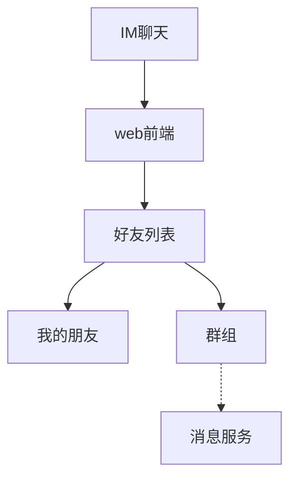

# Project Manager 插件 · 立项文档

> **交付形态**：DeepSeek Harness 插件（`@dsh-plugin/project-manager`），Host 面 + Web Client 面双入口。
> **一句话**：把「会话跑到哪了、还剩多少」从一堆说明文档，变成侧边栏里一张实时进度流程图。

---

## 0. 三分钟速览

**问题**：长任务会话没有进度可见性。用户不知道当前阶段、还剩多少没做完，只能靠翻超长文档猜。

**答案**：单一流程图文档 `project-manager.md` + 侧边栏实时看板 + AI 通过工具读写节点。

**四条铁律**：

| # | 铁律 | 违反后果 |
|---|---|---|
| 1 | `project-manager.md` 内**只有标题和流程图**，无任何叙述文字 | 写入被拒绝（FR-02 校验器拦截） |
| 2 | 节点状态**只能**通过工具或右键菜单变更，不支持裸文本编辑 | 文档损坏、状态漂移 |
| 3 | 同一节点的并发写入**绝不静默覆盖**，冲突必须仲裁 | 进度与实际脱节 |
| 4 | 插件入口在**侧边栏**，配置在**设置图标 → 设置页** | 找不到入口 |

**看板回答三个问题**：

| 用户疑问 | 由什么回答 |
|---|---|
| 现在到哪个阶段了？ | 流程图高亮当前**枝** + 进行中叶节点 loading |
| 还剩多少没整完？ | 未完成叶节点计数 + 未完成任务列表 + 完成度 `38% (31/50)`（百分比按工作量，不按件数） |
| 先干哪些、哪些能放？ | 关注枝高亮 + 旁枝降饱和；改旁枝须过审核框（FR-50） |

**两个开关（都关乎 token）**：

| 能力 | 是否耗 token | 关闭后 |
|---|---|---|
| **自动扫描建树** | 零 token 骨架必做；AI 建树耗 token | 仅保留零 token 骨架（可后续手动触发 AI 建树） |
| **AI 权重测量** | **耗 token**（仅测关注枝内叶节点） | 全部走零 token 启发式轨：**有结构数据 → 工作量口径；无结构差异 → 如实降级为按件数并标注** |

> **明确不做周期估算**：看板只给百分比与未完成计数，**不给"还需多久"**。理由见 §9.4。

**技术基准**：**以 DSH 的 rc 版本为基准**——当前 `baselineDsh = 0.1.5-rc.2`，不等待稳定版，每个新 rc 发布后 24h 内巡检评估（§19）。

**外部确认通道（与铁律 3 同级）**：破坏性操作的人工确认**走 DSH 既有两条 seam**，不新造通道——
`ctx.approval`（一次性授权，策略 `ask` / `never`）与 `ctx.userQuestions`（结构化提问，`ask_user_question`）。
**通道不可用时以拒绝方式关闭（fail-closed），绝不静默放行**；`never` 下沙箱升权与审批一律确定性被拒（§6.7f、FR-135–139）。

---

## 0.1 免责与使用边界（必读）

> **本插件只是一个方便工具，不保证任何结果，使用者需自行核实并承担全部后果。**

**为什么必须写这句**——不是法律套话，而是本插件有三处**技术上的固有不可靠**：

| # | 不可靠之处 | 技术原因 |
|---|---|---|
| 1 | **百分比是估算值** | 节点划分、状态判定、权重都含判断成分；AI 测量的工作量更是估算，不是事实 |
| 2 | **AI 判断可能出错** | 自动扫描会漏建任务、错建任务、误判完成；权重测量可能明显偏离实际 |
| 3 | **回滚无法保证完整恢复** | 只覆盖已记录的 `touchedPaths` 与快照 diff；**外部进程、其他工具、用户手动改动产生的副作用不在覆盖范围内**，无法还原 |

**使用者责任**：插件不代替你验证代码与产物，不代替你做发布决策。
**破坏性操作（删除、回滚、整枝操作）的最终后果由使用者承担。**

**边界声明（明确不做的事）**：

- 不保证任务清单完整——扫描是抽样与推断，不是穷举；
- 不保证百分比与"实际完成度"一致——它只反映**节点表的状态**；
- 不保证回滚能恢复到期望状态——回滚是尽力而为，不是事务；
- 不保证项目能按时收口——本插件不做周期估算（§9.4），更不构成任何工期承诺。

**插件提供的保险机制**（降低风险，而非消除风险）：

| 机制 | 作用 |
|---|---|
| 外部确认通道 | 破坏性操作交由人确认（`ctx.approval` / `ctx.userQuestions`）；通道不可用时**拒绝而非放行**（§6.7f） |
| 回滚点（细粒度） | 给一个可退回的锚点，但不保证覆盖全部副作用 |
| 回滚可撤销 | `pre-rollback` 快照让误回滚可挽回 |
| 删除三方案 | 提供"仅注释、可恢复"选项，避免不可逆删除 |
| 冲突不静默覆盖 | 宁可停下来问，也不悄悄改数据（§10） |
| 全程留痕 | 每次写入可审计、可追溯来源 |

**声明的呈现位置**（不能只写在文档里）：

| 位置 | 形态 |
|---|---|
| 首次加载 | 引导页显式勾选「我已了解：本工具为辅助工具，需自行核实结果」后才继续 |
| 每个破坏性确认框 | 底部固定一行提示：「本操作不可保证完整恢复，请自行确认」 |
| 设置页「关于」 | 常驻完整声明文本，可随时查阅 |

---

## 1. 背景与痛点

| # | 痛点 | 现状 | 本方案覆盖 |
|---|---|---|---|
| P1 | 会话一直在跑，不知道当前阶段、还剩多少 | 会话进度只存在于模型的上下文里，用户不可见 | 看板「完成度 + 未完成计数」（FR-31/33） |
| P2 | 还剩多少地方没整完，不知道 | 无任务清单，或清单散落在对话里 | 节点树 + 未完成计数 + 过滤视图（FR-32） |
| P3 | 文档说明特大，看得头疼，没有直观进度 | 说明性 md 膨胀，阅读成本高 | 文档强制极简（FR-02）+ 图形化渲染（FR-40） |

**根因**：进度信息被编码在**非结构化自然语言**中。模型能理解，人不能一眼理解，且无法被校验。

**推论**：需要把进度抽成**结构化、可校验、可渲染**的一等实体，文档只是它的一个投影。

---

## 2. 目标与非目标

### 2.1 目标（本期必达）

| ID | 目标 | 度量 |
|---|---|---|
| G1 | 任意时刻可读出整体/关注枝的完成度百分比与未完成计数 | 侧边栏看板首屏可见，刷新延迟 ≤ 1s |
| G2 | 目标：AI 会话/子任务/子代理能可靠地推进节点状态 | 统计口径：单次会话内 `pm_*` 写工具调用中，**首次尝试即成功**的比例 ≥ 99.5%（重试成功不计入成功、计入分母）；冲突率 = 触发 C1–C12 之一的调用数 / 总写调用数 ≤ 1%；采样窗口 = 最近 1000 次写调用 |
| G3 | `project-manager.md` 始终保持「标题 + 流程图」形态 | 非法写入拦截率 100% |
| G4 | 操作者能对任意节点执行关注/暂停/回滚/继续/拦停/放行/增删改/描述 | 12 项菜单按父/叶可见性全部可用，破坏性操作有确认框 |
| G5 | 暂停与拦停不丢任务上下文 | 生成交接文档，恢复后可从断点续跑 |

### 2.2 非目标（本期明确不做）

| ID | 不做 | 理由 |
|---|---|---|
| N1 | 不做通用项目管理（人员排期、甘特图、工时审批） | 面向 AI 会话收口，不是 Jira |
| N2 | 不替代会话历史与 todo 工具 | todo 是会话内瞬时清单，本插件是跨会话持久化项目进度 |
| N3 | 不做代码自动生成 | 只描述与推进任务，代码由会话/子代理执行 |
| N4 | 不做多用户协作与权限体系 | 单机单用户场景，共享写入仅指多会话/多子代理并发 |
| N5 | **不做周期估算** | 不展示"还需多久"、不做用时外推；只给百分比与未完成计数。既有 `estimateMin` 仅供 AI 权重决策内部使用，**不对外展示为周期** |

---

## 3. 术语表

> 术语先定义再使用，避免「节点/任务/功能」混用。

### 3.1 「链路」正名（重要）

口语里说的「链路」在本项目里实际指两件不同的事，必须分开，否则文档、UI 文案与实现会长期漂移：

| 说法 | 实际含义 | 本项目正式用词 | 关键性质 |
|---|---|---|---|
| 「某条链路」 | **以某节点为根、向下展开的整个子树** | **枝**（branch） | 由一个或多个叶节点组成；关注、暂停、拦停、删除、回滚都以**枝**为作用单位 |
| 「一条链路」 | 从根到某叶节点的**一条路径** | **链路**（chain，仅此一义） | 一整条链路恰好对应**一个叶节点**；只用于描述"端到端一个任务单元" |
| — | 最小可执行任务 | **叶节点**（leaf） | 这就是「一条」的真实单位 |

**一句话**：**叶子才是「一条」；父节点指的是一枝。**

因此：

- **关注一个节点 = 关注该节点及其全部子孙**（即该节点封顶的整枝），不是关注一条路径；
- 暂停/拦停/删除一个父节点 = 作用于**一枝**；
- 「还有几条没做完」这句话的主语是**叶节点**，不是枝；
- 只有当需要强调"这整条端到端流程"时才用「链路」，且此时它等价于一个叶节点。

### 3.2 关注的合并语义（关键）

既然「关注节点 = 关注其整枝」，多个关注点之间就必须有确定的合并规则，否则进度百分比会重复计算。

| 情形 | 规则 |
|---|---|
| 只关注 A | 主枝 = A 枝（A 及其全部子孙）。A 的后代**不需要**再标记 |
| 同时关注 A 与其后代 B | **冗余**，自动归一化：只保留 A，丢弃 B 的标记（写入时即合并，UI 给出轻提示） |
| 关注 A，又关注与 A 无祖先关系的 C | 主枝 = A 枝 ∪ C 枝（**并集**），两枝各自独立统计后合并 |
| 取消关注 A | 只清除 A 的标记；A 的后代若原本**显式**标记过，则恢复其各自的关注范围 |
| 关注根节点 | 主枝 = 全树，等价于"关注整体"；此时关注指标与整体指标一致 |

**归一化不变量**：任意时刻，被关注的节点集合中**不存在**祖先-后代关系——即所有关注节点两两互不包含（构成一棵"森林的根集合"）。

**主枝判定的实现后果**：

- 存储上 `focus` 仍是节点上的布尔字段（简单、可审计），归一化在写入校验时强制执行；**另设 `focusShadow` 布尔字段**保存"该节点是否曾被显式标记"，使取消祖先关注后能恢复后代的关注状态（C11 / FR-19）。两者关系见 §7.2；
- 计算"关注枝进度"时，遍历关注节点集合（已保证互不包含），取并集内的**叶节点**套用 §9.3 的加权式（**不是**按叶节点数等权平均）；
- UI 高亮 = 各关注节点封顶的枝取并集；
- 「关注枝完成度百分比」同样按并集内叶节点计算，不重复计算共享的中间节点。

**为什么不在后代重复标记**：用户说"我关注了这个节点"就已经涵盖其下所有内容；要求逐个子节点标记会增加操作负担，且必然导致重复计数。

### 3.3 术语表

| 术语 | 英文/标识 | 定义 |
|---|---|---|
| **立项文档** | — | 本文档。回答「为什么做、做什么、怎么做」 |
| **项目文档** | `project-manager.md` | **仅含**项目标题 + 流程图代码块的 md 文件。其他内容一律非法 |
| **其他文档** | — | 除 `project-manager.md` 以外的任意 md |
| **资源** | resource | 文件、代码、生成物、目录的统称 |
| **节点** | node | 流程图上的一个方框。可以是功能点或任务点，统一称「节点」 |
| **父节点** | parent | 有子节点的节点。指代的是**一枝** |
| **叶节点** | leaf | 无子节点的节点，是可执行的最小任务单位。**一条任务 = 一个叶节点** |
| **枝** | branch | **以某节点为根、其下全部子孙构成的子树**。关注/暂停/拦停/删除/回滚的作用单位 |
| **链路** | chain | 从根到某叶节点的一条路径。**严格一义**：一整条链路 = 一个叶节点 |
| **主枝** | main branch | 关注节点及其以下的枝。AI 以此为主 |
| **旁枝** | side branch | 非主枝。AI 以辅，改动需审核 |
| **关注** | focus | 用户标记的优先枝。**关注某节点 = 关注该节点及其全部子孙**；看板单独统计该枝的完成度百分比 |
| **自身状态** | self state | 节点自己被直接设置的状态 |
| **计算状态** | derived state | 由自身状态 + 子孙状态 + 门控标记推导出的对外状态（§9.1） |
| **门控** | gate | 作用在父节点上的暂停/拦停/放行标记，递归影响该枝 |
| **交接文档** | handoff doc | 暂停或拦停时生成的上下文快照，恢复时消费并删除 |
| **回滚点** | snapshot / rollback point | 暂停、拦停或手动时建立的现场快照，可将枝还原到该时刻（§7.5） |
| **节点文本块** | node block | 每个节点独占的写入空间，防止并发写入交错覆盖 |
| **写入尝试** | attempt | 一次带序号的写入事件，追加而非覆盖 |
| **仲裁** | resolve | 冲突写入由人工或规则裁决的过程 |

---

## 4. 项目形式与入口位置

**形式**：DeepSeek Harness **出树插件**（out-of-tree plugin），符合 Cordis 插件模型。

**装配方式**：`dsh plugin --profile web add <包名>` 装入 `$DSH_HOME/profiles/web/`。

**入口（硬约束，不可变更）**：

| 入口 | 位置 | 实现槽位 | 内容 |
|---|---|---|---|
| 主面板 | **Harness 页面侧边栏** | `sidebar.panellist`（list，root scope）+ layout `main` keyed 槽（**同 id 配对**） | 图标 + 标签；点击后主列渲染流程图看板 |
| 配置页 | **页面内设置图标 → 设置页** | `sidebar.settings` 已由 ui-settings-general 占据；本插件注册 `settings.section` | 刷新间隔、**扫描/AI/token 预算参数**、冲突策略、外观、导入导出等偏好 |
| 节点操作 | 流程图节点**右键菜单** | 面板内自绘 | 关注/暂停/回滚/打回滚点/继续/拦停/整枝回滚/放行/添加/修改/删除/描述（共 12 项，父/叶可见性不同，见 §6.6） |
| AI 通道 | **工具（tool）** | Host 面注册 Cordis 工具 | 会话、子任务、子代理读写节点 |

> `sidebar.settings` 是**单值槽**，本插件**不得**抢占；设置项一律以 `settings.section` 贡献页注册。

---

## 5. 锁定技术栈

> 本节为**决策记录**，实现阶段不得自行替换；如需变更须修订本文档。

### 5.1 运行时与语言

| 项 | 选型 | 版本 | 说明 |
|---|---|---|---|
| 宿主框架 | `@deepseek-ai/cordis` | ^4.0.2 | DSH 插件底座，`peerDependencies` |
| 语言 | TypeScript | ~5.6 | 全仓统一，Host/Client 两套 tsconfig face |
| 运行环境 | Node.js | ≥ 20 | Host 面 |
| 包管理 | pnpm | workspace | 与 DSH 生态一致 |
| 构建 | `tsdown` | 与 DSH 各包一致 | `bundle` / `watch` 两个脚本 |
| 插件形态 | ESM（`"type": "module"`） | — | 与 `dsh-client-ui-*` 一致 |

> **基准版本（立项时实测）**：`@deepseek-ai/dsh` CLI = `0.1.5-rc.1`；其下 230 个包 = `0.1.5-rc.2`。
> **复核（审批策略变更同日）**：本机 `@deepseek-ai/dsh` = `0.1.5-rc.2`，其下 `dsh-user-approval`、`dsh-user-questions`、
> `dsh-tool-ask-user`、`dsh-client-ui-user-questions`、`dsh-client-ui-approval`、`dsh-permission-presets` **均为 `0.1.5-rc.2`，已在依赖树内**——
> 即 §6.7f 所需的审批与提问 seam **无需新增外部依赖**。
> 结论：**以 rc 为基准**（§19）——前 1.0 的 rc 阶段无 semver 稳定性保证，因此本节所有 `^` 范围仅为书写便利，实际以 §19.2 的精确 rc 带为准。

### 5.2 Host 面（Node）

| 用途 | 选型 | 说明 |
|---|---|---|
| **持久化（主路线）** | **`@deepseek-ai/dsh-storage` + `dsh-storage-domain` + `dsh-storage-json`** | 复用 DSH 的 schema 校验 KV 领域：单记录写入原子持久、每领域单条写链、`domain/changed` 变更事件（§7.1） |
| 持久化（兜底路线） | 自建 JSONL + 快照 + 压实 | 仅在能力探测发现 storage 缺失时启用（§19.4） |
| **结果裁剪与省略提示** | **`@deepseek-ai/dsh-output-retention`** | `ItemRetainer`（有序窗口 + 精确省略计数）、`TextRetainer`（头/尾字节窗口，不切断 UTF-8）、`formatRetentionNotice`。**用于工具返回上限、交接文档截断、列表分页提示**，不自造截断逻辑 |
| **文件访问** | **`@deepseek-ai/dsh-fs`（`ctx.fs`）** | 版本守卫的原子写与字面编辑；用于 `project-manager.md` 投影、交接文档、WAL。**不直接 `node:fs`** |
| **原子写** | `@deepseek-ai/dsh-atomic-write` | 原子替换 + 跨进程写锁（`ctx.fs` 不足时的底层补充） |
| **ID 生成** | `@deepseek-ai/dsh-util-crypto` | 浏览器安全的 UUID；仓库级 lint 规则禁止直接用 `crypto.randomUUID`，必须走此包 |
| **超时/截止** | `@deepseek-ai/dsh-timeout` | `clampTimeout` / `deadline` / `timeoutOf`；用于 C10 停止确认超时、订阅 `expiresAt`、等待让路 |
| **敏感动作授权（审批通道）** | **`@deepseek-ai/dsh-user-approval`（`ctx.approval`）** | `request({agent, toolName, callId?, reason, signal})` → 封闭结果 `allowed-once｜rejected｜cancelled｜unavailable`。**一次性**授权：无 `allow-always`、无已记住规则、无撤销存储；会话策略 `ask`（默认）/ `never`，`never` 在应答者分发**之前**确定性拒绝；无应答者时以拒绝方式关闭。**只传工具名与原因、不传参数**，故 preview/影响范围不放这里（见下一行）；请求**必须处于未结束的轮次内** |
| **向人提问/澄清（提问通道）** | **`@deepseek-ai/dsh-user-questions`（`ctx.userQuestions`）+ `@deepseek-ai/dsh-tool-ask-user`（`ask_user_question`）** | 结构化问题：`id` / `header` / `question` / `detail` / `options[]` / `multiSelect` / `intent`；**破坏性操作的 preview 与影响范围由 `detail` 承载**。**归属其他 agent 的存活子代理不能调用**（`DELEGATED_CALLER` 被拒），只能把未决问题写进最终结果 |
| **有界队列** | `@deepseek-ai/dsh-deque` | 零依赖环形双端队列；用于写入队列与等待队列的有界实现 |
| 有界保留 | `@deepseek-ai/dsh-output-retention` | **仅用于工具返回裁剪**（`ItemRetainer` 为 head-only 窗口，`TextRetainer` 为字节 head/tail 窗口）。**存储清理不适用**：保留最新、淘汰最旧的策略须自研（FR-131） |
| 文件监听 | `chokidar` | 已在 DSH 依赖树内；外部改动热感知 + 跨进程改动兜底 |
| 文档解析/校验 | `mdast-util-from-markdown` + 自研校验器 | 强制执行 FR-02「只允许标题 + 流程图」 |
| 流程图解析 | 自研 Mermaid 子集解析器 | 见 §5.4 |
| Schema 校验（工具入参 / 配置） | `@deepseek-ai/schemastery` | 与 DSH 配置模型同源 |
| Schema 校验（存储领域） | `zod` | DSH `defineDomain` 要求 zod 记录 schema |
| 通信 | DSH Remote（`ctx.remote` 命名空间）+ `dsh-api-remotes` 事件白名单 | 复用框架传输，不自建 WebSocket |

#### 参考实现（照抄模式，减少设计风险）

| DSH 包 | 借鉴什么 |
|---|---|
| **`@deepseek-ai/dsh-workspace`** | **最重要**：它就是"基于 domain form 的持久化实体注册表"（工作区记录 + zod schema + 组合装配）。本插件的节点/订阅存储**照此模式实现**；它还提供了可挂载的 `workspaceId` 关联点 |
| `@deepseek-ai/dsh-chunked-list` | 不可变追加列表 + **JSON 检查点校验**；兜底路线的追加日志与审计可复用其检查点机制 |
| `@deepseek-ai/dsh-session-format` | **流式相邻版本迁移机制**；§19.6 的迁移器链可借鉴其"唯一相邻序列、单次消费"的做法 |
| `@deepseek-ai/dsh-invariants` | 包级运行时不变式注册服务；§12.4 的关键不变量可注册为可校验断言 |
| `@deepseek-ai/dsh-scope` | 作用域标签 + 作用域过滤事件分发；订阅的按会话裁剪可复用 |
| `@deepseek-ai/dsh-util-workspace-path` | 浏览器安全的工作区路径与展示助手；引用路径校验复用 |
| `@deepseek-ai/dsh-time-context` | 每步时间与耗时上下文（若将来需要，但**注意与"不做周期"决策不冲突**：那是给模型的时间感知，不是进度周期展示） |
| `@deepseek-ai/dsh-plan-mode` | `ask_user_question` 的 `intent: 'plan-review'` 呈现意图的消费方；**借鉴其"计划 → 审阅 → 批准/拒绝/再聊"的确认编排**，本插件的删除/回滚确认照此编排（不新造 `intent` 标签：未识别标签的 UI 会回落通用选项列表，行为等价但呈现更弱——§13.1） |

> **关于 SQLite 后端**：`dsh-storage-json` 的 README 提到"选 SQLite 后端用于大数据量/高并发"，
> 但**当前 rc 版本（`0.1.5-rc.2`）只发布了 `json` 后端，没有 `dsh-storage-sqlite` 包**。
> 因此本插件**不依赖**它：默认路由 `json`；若将来该后端发布，可通过组合配置切换，**插件代码无需改动**。
> 运行环境为 **Node v22.21.1**，具备 `node:sqlite`（实验性），可作为自研后端的备选实现手段，但**本期不实现自研后端**。

### 5.3 Web Client 面（浏览器）

| 用途 | 选型 | 说明 |
|---|---|---|
| UI 框架 | **React ^18.2** + `react-dom` | 与全部 `dsh-client-ui-*` 一致，**无第二选择** |
| 槽位系统 | `@deepseek-ai/dsh-client-ui-slots` | `SlotMap` 声明式合并 |
| 面板槽 | `sidebar.panellist` + layout `main` | 侧边栏入口 |
| 设置槽 | `settings.section` | 设置页贡献 |
| 面板选择态 | `usePanelInfo((info) => info.activePanelId === id)` | 侧边栏行高亮 |
| **对话区提问/审批 UI（已被占用）** | `@deepseek-ai/dsh-client-ui-user-questions`、`@deepseek-ai/dsh-client-ui-approval` | 提问界面会接管 `conversation.composer`，审批面板渲染审批请求。**本插件不得争抢这两个槽**；插件面板内的弹窗只承载**面板自发起**的交互确认（§6.7f） |
| 状态订阅 | `@deepseek-ai/dsh-client-store`（`ObservableSnapshot`） | 会话投影、面板元数据 |
| 宿主通信 | `ctx.remote.<namespace>` + `ctx.remote.$on(...)` | Client 侧唯一通道 |
| 设置持久化 | `ctx.settingsScope.bind(spec)` + `ctx.settingsSchema` | 复用设置镜像，禁止自建配置读取 |
| 国际化 | `@deepseek-ai/dsh-client-locale` | 中英双语，与 GUI 语言联动 |
| 基础组件 | `@deepseek-ai/dsh-client-ui-primitives` | 按钮、弹窗、提示等 |
| 图渲染 | **自绘 SVG 画布**（已实现，§5.4a）；~~`@xyflow/react`~~ 降为可选升级 | 见 §5.4 / §5.4a |
| 图布局 | **`elkjs`**（`layered` 算法） | 分层自动布局，支持主枝/旁枝分离布线与正交连线 |
| 动画 | CSS transition / `requestAnimationFrame` | 尊重 `prefers-reduced-motion` |
| 图表 | ~~`lightweight-charts`~~（**已移除**：不做周期，无需时间序列图表） | — |

### 5.4 渲染方案决策（关键）

**需求**：渲染独立化，作为 **Mermaid 超集**；Mermaid 实现不了就重写机制。

**决策**：**不使用 Mermaid 运行时**，改为「Mermaid 兼容语法 + 自研渲染器」。

| 维度 | Mermaid | 本方案 |
|---|---|---|
| 定位 | 文本 → 静态 SVG | 结构化数据 → 交互式画布 |
| 交互 | 无（除查看器缩放） | 拖拽、右键菜单、tooltip、点击、框选 |
| 状态表达 | 无 | 状态色、进度条、loading、角标 |
| 实时更新 | 整图重渲，闪烁 | 增量 diff 更新，节点级重渲 |
| 子图 | 支持但不可交互 | 可折叠分组、可下钻 |
| 布局控制 | 黑盒 | 自研分层布局（tidy tree 简化版）+ 主枝/旁枝分离 |
| 虚线连旁枝 | 需 hack | 一等公民，独立渲染层 |

**副作用（必须接受）**：模型不能再随意手写 Mermaid 语法；节点变更**只能**走工具/菜单。这与铁律 2 一致，是**收益**而非损失。

**理由**：Mermaid 的输出是静态 SVG，交互、状态、增量更新都要靠 hack 其内部结构，成本远高于自绘。

### 5.4a 客户端画布的实现决策（**实测修订**）

**结论：自绘 SVG 画布**（已实现，`src/client/flow-canvas.tsx` + `src/client/flow-layout.ts`），
~~React Flow + elkjs~~ 降级为"若将来平台支持 CSS 管线再考虑"的可选升级。

| 事实（实测） | 后果 |
|---|---|
| 客户端插件产物是 **classic script**，平台只取工厂返回的 exports，**没有 CSS 管线** | React Flow 的节点定位/手柄强依赖它的 `.css`；硬接必须把 CSS 当字符串内嵌再手注入 `<head>` |
| 平台**冻结** 9 个 `require` 目标，其余依赖必须打进 bundle | 布局引擎（elkjs 数百 KB）会直接进 combo，收益与体积不成比例 |
| 本插件需要的图形语义很收敛：分层树 + 正交连线 + 状态填充 + 角标 + 折叠 + tooltip | 自研 SVG 约 300 行即可覆盖，且零第三方运行时 |
| 布局必须是**纯函数**才能单测 | 自研布局可直接用 `node --test` 覆盖（分层、居中、不重叠、折叠、成环保护等 7 项断言） |

**保留的能力**：缩放/平移/适应视图、折叠展开子树、只看未完成、悬停权重依据、点击与未完成列表双向联动、
两层视觉编码（§11.2）。**暂缺**：框选、拖拽改结构、右键菜单（§6.6，仍在路线图上）。

**后续实测补入的三块画布能力（用户逐条提的）**：

| 能力 | 落法 | 语义/代价 |
|---|---|---|
| **枝桠折叠**（FR-47a） | 纯逻辑 `src/client/fold.ts`（有单测）+ 按钮只出现在**真分叉**（子节点 ≥ 2）上、画在**节点框外正对分叉处** | 普通点击 = 整枝折 / 逐层展开；**Shift+点击 = 从最下游逐层折 / 折到底后全展开**；`+N` = 藏起来的节点数；折叠是按项目的本地视图状态（localStorage），**不写事实源** |
| **领航图**（FR-47b） | 画布右下角独立 SVG 图层：整棵树缩略（枝色 + 关注枝加亮）+ 当前视口框 | 点击/拖动即跳转（只改平移不改缩放）；**代价**：压住右下角一块，那块内的节点右键被挡，尺寸 **336×122**（用户反馈"太小"后放大一倍） |
| **节点属性栏**（FR-47c） | 画布**外面**的右列（`src/client/node-inspector.tsx`），选中节点时出现 | 画布相应变窄并重新适配 ⇒ 属性栏不会盖住树（浮层方案实测评过：压住节点最难用）。展示名称/类型/状态/版本/路径/进度/权重口径/结构计数/最后改动/旗标/描述/引用 + 动作入口 |
| **选中态**（FR-47d） | 主题前景色双环 + 同色外发光；SVG 里**最后绘制** | 与"关注枝"的蓝色语义分层（不靠色相区分）；选中落在旁枝也满不透明；选中在视野外（如从「未完成 N 项」列表点选）时**自动带进视野并居中**，已在视野内则不动视图 |

三者的共同口径：**不编造数据**（权重没有来源就写"按件数"）、**折叠不改事实源**、
**属性栏的进度与画布同源**（都来自 `/pm/board` 投影）。

### 5.5 外部依赖红线

- **禁止重复实现 DSH 已提供的基础设施**：持久化优先用 `ctx.storageDomain`，原子写用 `dsh-atomic-write`，
  文件访问用 `ctx.fs`，传输用 DSH Remote。自建实现只允许出现在**降级兜底路径的业务逻辑层**
  （如追加日志、压实、归档），且**必须**复用上述基础包而非重写它们（§7.1b、FR-127）。
- 禁止引入第二套 UI 框架（Vue/Svelte/Solid）或第二套状态库。
- 禁止自建 HTTP/SSE 传输，一律走 DSH Remote。
- **禁止自建第二套确认/授权通道**：破坏性操作的人工确认一律走 `ctx.approval`（一次性授权）与 `ctx.userQuestions` / `ask_user_question`（提问与澄清）；**禁止**自造对话区问答协议、自造审批弹窗协议，或把"确认"实现为只能由模型自行满足的参数。理由与失败语义见 FR-135–139（§6.7f）与 §5.2 的审批/提问行。
- 禁止直接读写 `$DSH_HOME` 下非本插件目录。
- 新增运行时依赖须在本文档登记。

---

### 5.6 可复用技术栈审核清单（立项实测）

> 对外部依赖逐项做过"DSH 是否已提供等价能力"的核实。**结论（本表逐行统计）：12 项可直接复用（含本次补入的"敏感动作人工授权"与"向人提问"两项）、5 项借鉴照抄或可注册、8 项确需自研或新增。**
> 下表为可追溯记录；新增依赖时须补齐本表（FR-134）。

| 能力 | 原计划 | 审核结论 | 依据 |
|---|---|---|---|
| 持久化 KV | 自建 JSONL + WAL + 压实 | **改为复用** `ctx.storageDomain` | `dsh-storage-domain` 提供 schema 校验 KV、原子单记录写、单条写链、变更事件 |
| 存储实体范式 | 自行设计 | **照抄** `dsh-workspace` | 它是基于 domain form 的持久化实体注册表（zod + 组合装配），含可挂载 `workspaceId` |
| 结果裁剪 | 自写截断逻辑 | **改为复用** `dsh-output-retention` | `ItemRetainer`/`TextRetainer`/`formatRetentionNotice`，且自带"省略了什么"的诚实提示 |
| 文件读写 | 直接 `node:fs` + 自写原子写 | **改为复用** `ctx.fs` + `dsh-atomic-write` | `ctx.fs` 支持版本守卫的原子写与字面编辑；`dsh-atomic-write` 提供跨进程写锁 |
| ID 生成 | 自定方案 | **改为复用** `dsh-util-crypto` | 浏览器安全 UUID；仓库 lint 禁止直接用 `crypto.randomUUID` |
| 超时处理 | 自写 `setTimeout` | **改为复用** `dsh-timeout` | `clampTimeout`/`deadline`/`timeoutOf` + `TimeoutReason` 分类 |
| 有界队列 | 自写数组队列 | **改为复用** `dsh-deque` | 零依赖环形双端队列，摊还 O(1) |
| 有界保留 | 自写上限清理 | **改为复用** `dsh-output-retention`（**仅工具返回裁剪**；其窗口是 head-only，`保留最新/淘汰最旧` 的存储清理策略不适用，须自研——见 FR-131） | 有界保留原语 + 中性省略提示；`ItemRetainer` 只支持 `head` |
| 路径助手 | 自写路径校验 | **改为复用** `dsh-util-workspace-path` | 浏览器安全的工作区路径与展示助手 |
| **敏感动作人工授权** | 自建确认弹窗 + 自造 `confirmToken` 握手（"工具的确认通道"） | **改为复用** `ctx.approval`（`dsh-user-approval`） | DSH 已提供一次性授权 seam + 逐请求审计（`approval/asked`/`approval/decided`）+ 会话策略 `ask`/`never`，且**无应答者时以拒绝方式关闭**；自造通道在 `never` 策略下无从授权。**注意其请求不携带参数**，故 preview/影响范围另见下一行 |
| **向人提问 / 描述歧义澄清 / 成本确认** | 自建提问弹窗协议 | **改为复用** `ctx.userQuestions` + `ask_user_question`（`dsh-user-questions` + `dsh-tool-ask-user`） | 已提供结构化多问题、选项、`detail`、自定义文本、`plan-review` 意图；**自带"子代理不可提问"边界**（`DELEGATED_CALLER`），正是本插件必须显式处理的场景 |
| 追加日志 + 检查点 | 自建 | **借鉴** `dsh-chunked-list` | 不可变追加列表 + JSON 检查点校验（兜底路线用） |
| 版本迁移 | 自建迁移器框架 | **借鉴** `dsh-session-format` | 相邻版本唯一序列、单次消费；迁移器本身仍需自写 |
| 运行时不变式 | 写文档里就完事 | **可注册** `dsh-invariants` | 包级不变式注册服务，把 §12.4 变成可校验断言 |
| 作用域事件 | 自写按会话过滤 | **可复用** `dsh-scope` | 作用域标签 + 作用域过滤事件分发 |
| 图渲染 | `@xyflow/react` | **仍需新增**（依赖树内无） | DSH 未提供图渲染能力 |
| 图布局 | `elkjs` | **仍需新增**（依赖树内无） | DSH 未提供自动布局能力 |
| Markdown 解析 | `mdast-util-from-markdown` | **仍需新增** | DSH 未提供 mdast 解析（其 `turndown`/`domino` 方向相反） |
| 文件监听 | `chokidar` | **已在依赖树** | 直接复用 |
| 测试框架 | 待定 | **仍需自带**（依赖树内无 vitest/jest） | 参照 DSH 自身的测试组织方式 |
| 流程图解析 | 自研 Mermaid 子集 | **确需自研** | 无等价能力；§5.4 已论证不用 Mermaid 运行时 |
| 文档合法性校验 | 自研 `doc-guard` | **确需自研** | 无等价能力（这是本插件的核心约束） |

**审核纪律**：上表"仍需新增/确需自研"的每一行都成立过"DSH 无等价能力"的检查；
后续如发现更优复用点，须回填此表并同步 §5.2/5.3。

---

## 6. 功能需求

> 编号用于追溯；**必须**项为本期交付范围，**可选**项可延后。

### 6.1 文档治理

| ID | 需求 | 级别 |
|---|---|---|
| FR-01 | 单一项目文档 `project-manager.md`，位于工作区根或 `DSH_WORKSPACE` 指定目录 | 必须 |
| FR-02 | 该文件内**有且仅有**项目标题 + 一个流程图代码块；校验器拒绝任何额外标题、说明、列表、注释文本 | 必须 |
| FR-03 | 禁止 AI 向该文件写入不相关内容；写入路径唯一（工具/菜单），并做 schema 校验 | 必须 |
| FR-04 | 校验失败时拒绝写入并返回**可执行的修正提示**（哪个字段、为什么不合法） | 必须 |
| FR-05 | 支持一键「规范化」：把外部手改造成的非法文档收敛回合法形态（保留可解析的节点） | 可选 |

### 6.2 节点模型

| ID | 需求 | 级别 |
|---|---|---|
| FR-10 | 节点 = 名称 + 唯一 id + 状态 + 进度 + 权重 + 描述 + 引用 + 标记 | 必须 |
| FR-11 | 节点名称即节点简称，**不写详细描述**；详细描述放在 `description` 字段 | 必须 |
| FR-12 | 支持父子嵌套（递归），层级不限 | 必须 |
| FR-13 | 支持 `::` 并列同级节点语法（如 `我的朋友 :: 群组`） | 必须 |
| FR-14 | 引用类型：注释、md 文档、代码、生成物、目录；统一为 `{type, target, label?}` | 必须 |
| FR-15 | 中途新增的分支必须**显式标记**为 `addedMidway`，看板以角标提示 | 必须 |
| FR-16 | 关注点（关注/风险/待确认）可标注在任意节点 | 必须 |
| FR-17 | 节点间依赖关系线：支持 `dependsOn` 声明，独立于父子层级 | 必须 |
| FR-18 | 支持节点间通信能力的元数据（绑定会话 id / 子任务 id / 子代理 id） | 必须 |
| FR-19 | **关注归一化**：关注集合中不得存在祖先-后代关系（关注父节点即涵盖其整枝），写入时自动合并并提示 | 必须 |

### 6.3 写入与并发

| ID | 需求 | 级别 |
|---|---|---|
| FR-20 | 节点文本块化管理：每节点独占写入空间，物理上不可能交错覆盖 | 必须 |
| FR-21 | 支持共享写入（多会话、多子代理同时推进不同节点） | 必须 |
| FR-22 | 队列化写入：写入请求进队列顺序应用，保证最终一致 | 必须 |
| FR-23 | 同功能区并发写入时做**语义校验**，冲突不得静默覆盖 | 必须 |
| FR-24 | 冲突自动修正优先；无法自动修正时进入仲裁队列并通知用户 | 必须 |
| FR-25 | 已完成节点不得被静默改回未完成（需显式 `force` 且留痕） | 必须 |
| FR-26 | 每次写入记录来源（会话/子代理/用户）与时间戳，可审计 | 必须 |

### 6.4 看板与进度

| ID | 需求 | 级别 |
|---|---|---|
| FR-30 | 顶部标题看板：项目名称 | 必须 |
| FR-31 | 顶部看板：整体任务**完成度百分比**（括号内同时给「已完成叶节点/总叶节点」计数） | 必须 |
| FR-32 | 顶部看板：关注枝**完成度百分比**（同样带计数） | 必须 |
| FR-33 | 顶部看板：**未完成叶节点数**、进行中节点数、异常节点数（口径统一为叶节点，见 §9.3） | 必须 |
| FR-34 | **只做百分比，不做周期**：不展示"还需多久"、不做用时外推；权重口径与来源（AI / 启发式估算 / 混合）必须在百分比旁标注 | 必须 |
| FR-35 | **未完成任务展示**：看板下方常驻未完成任务列表（按状态与是否关注排序），支持点击定位到流程图节点；列表与流程图双向联动 | 必须 |
| FR-36 | 未完成任务列表展示字段：节点名、所属枝路径、状态、进度、是否关注、是否中途新增 | 必须 |
| FR-37 | 未完成任务支持导出/复制为清单文本，便于粘贴到会话继续推进 | 可选 |

### 6.4b 首次使用：扫描与自动建树

> **场景**：第一次加载插件时，工作区里往往没有任何项目树。若直接显示空白，插件等于不可用。
> **硬约束**：首次加载会调用 AI 生成文档与树，**必须**控制 token 节奏（§9.5）。

| ID | 需求 | 级别 |
|---|---|---|
| FR-38 | 检测到工作区**无项目树**时，自动进入**引导式首次扫描**，而不是显示空白页 | 必须 |
| FR-39 | **默认建树路径：AI 从仓库生成**（用户确认）——模型读目录骨架与关键文件**签名**，产出**功能点/任务点**，并在**同一次调用**里给出每个任务点的相对工作量与"看起来做到哪了"的初值。零 token 粗扫（阶段 A）降级为 **AI 关闭/不可用时的起点**：只给骨架、不建树、不估权重 | 必须 |
| FR-39a | 无论走哪条路，**先给可见界面**：AI 建树前先渲染"待建树"的空态与操作入口，不允许全屏 loading 到底（§9.5 T4 分级渲染） | 必须 |
| FR-39b | 阶段 B 执行前**必须**弹出 token 成本提示框：说明将扫描的文件范围、预估调用规模、以及「跳过 AI 建树」选项。**确认经提问通道承载（§6.7f）；通道不可用视为未确认 → 不发起 AI 调用、回落零 token 骨架** | 必须 |
| FR-39c | 扫描**必须**按 §9.5 的分层顺序**渐进式呈现**，每完成一层即渲染并更新骨架屏，禁止"全屏 loading 到最后一次性弹出" | 必须 |
| FR-39d | 自动建出的节点标记 `autoCreated`，与用户手建节点在 UI 上可区分（角标），并支持一键「全部转正」 | 必须 |
| FR-39e | 扫描结果**必须**写入事实源并投影出 `project-manager.md`（即首次加载确实会走 AI 出文档的路径） | 必须 |
| FR-39j | **节点语义硬约束**：树上每个节点**必须是功能点或任务点**。文件只能作为节点的引用路径（`refs`）与证据，**不得**成为节点本身；"其余 N 个文件"这类文件语气节点**禁止**出现 | 必须 |
| FR-39f | 支持「重新扫描」与「增量扫描」：仅对新增/变更的文件重新分析，避免重复计费 | 必须 |
| FR-39g | 扫描支持**中断与续跑**：中途取消不丢已建节点，下次可继续；支持"只扫到某层深度" | 必须 |
| FR-39h | 用户可预先设置扫描范围（包含/排除 glob）与深度上限，默认排除 `node_modules`、构建产物、`.git` | 必须 |
| FR-39i | 扫描完成后给出摘要：新建节点数、消耗 token 估算、跳过的文件数、下一步建议 | 必须 |

### 6.5 渲染与交互

| ID | 需求 | 级别 |
|---|---|---|
| FR-40 | 三段式布局：上=标题看板，中=流程图渲染，下=状态条/日志（可折叠） | 必须 |
| FR-41 | 鼠标悬停节点显示 tooltip：描述 + 简报（状态、进度、引用）。**不含周期信息** | 必须 |
| FR-42 | 进行中的整个枝视为「进行中」（**枝**级高亮，自叶节点向上传播至该枝根） | 必须 |
| FR-43 | 递归收敛：任一子孙异常或未完成，父节点即异常或未完成 | 必须 |
| FR-44 | 进行中的叶节点（即每**一条**任务的末端）以 loading 动画表达 | 必须 |
| FR-45 | 主枝节点与旁枝以虚线连接；悬停时虚线高亮；虚线渲染在主枝**下层**，不遮挡 | 必须 |
| FR-46 | 关注节点及其**枝**高亮；非关注枝降饱和显示 | 必须 |
| FR-46a | **未完成视觉编码（两层）**：完成态层区分枝/叶的未完成与已完成（枝未完成=虚线边框+未完成叶节点计数，叶未完成=空心方点），状态层再叠加 `pending`/`running`/`error`/`paused`/`held` 等具体状态（§11.2） | 必须 |
| FR-46b | **枝的未完成判定必须递归**：任一子孙叶节点未完成，该枝即显示为未完成，不得出现"父节点显示已完成但子节点未完成"的矛盾呈现 | 必须 |
| FR-46c | **未完成扫描带**：看板顶部密集竖条带，每个叶节点一条，颜色映射计算状态；点击定位到对应节点 | 必须 |
| FR-47 | 支持缩放、平移、适应视图、折叠展开子树 | 必须 |
| FR-47a | **折叠的按键语义**（用户口径）：折叠按钮画在**分叉根部**（真分叉 = 子节点 ≥ 2 的节点）、**节点框外**正对分叉处；普通点击 = 整枝折起 / **一次展开一层**；**Shift+点击 = 从下游最远端一层层折（点一次折一层）**；已经折到底时 Shift+点击 = 全展开；收起后按钮显示 `+N`（N = 该枝被藏起来的节点数，**不是**直接子节点数）；两处入口同一套语义（分叉按钮、双击节点）；折叠是视图状态，按项目存浏览器本地，**不写事实源**。**枝标签已删**（用户实测反馈"名称和节点一样，没啥意义"：枝名就是枝根节点自己的名字，且折叠入口已由分叉按钮承担） | 必须 |
| FR-47b | **领航图（minimap）**：画布右下角显示整棵树缩略图（枝色 + 关注枝加亮）与当前视口框；**点击/拖动地图上的位置，主流程图跳转到对应位置**（只改平移、不改用户的缩放级别） | 必须 |
| FR-47c | **节点属性栏**：选中节点后展示节点名称、描述、进度（枝给未完成件数）、状态、类型、版本、路径、权重与口径来源、结构计数、最后改动人与时间、旗标、引用清单，并给出关注/改名/写描述/加子节点/暂停/拦停/打回滚点的入口；属性栏放在画布**之外**（画布变窄重新适配），不得浮在画布上盖住树 | 必须 |
| FR-48 | 支持按状态/关注/负责人过滤视图 | 可选 |
| FR-49 | 大图性能：500 节点下交互帧率 ≥ 30fps，首屏 ≤ 1.5s | 必须 |

### 6.6 节点右键菜单

> 操作均需确认框（标注「需确认」者）；破坏性操作需二次确认。
> **确认怎么落地**：模型侧发起的破坏性操作走准入审批（`ctx.approval`）+ 提问通道展示 preview，通道不可用时**拒绝而非放行**；
> 面板内右键发起的操作走本面板确认弹窗（用户在场）。逐项清单与失败语义见 §6.7f（FR-135–139）与 §13.1。

| ID | 菜单项 | 作用域 | 行为 |
|---|---|---|---|
| FR-50 | **关注** | 父子皆有 | 标记节点及其以下**整枝**为主枝（**关注某节点 = 关注该节点及其全部子孙**），AI 优先推进；需改旁枝时弹出审核框。若其后代已被关注，写入时自动归一化为仅保留本节点 |
| FR-51 | **暂停** | 叶节点操作优先展示 | 暂停节点及其以下任务。**需确认**。生成可删的《继续交接文档》**并自动建立回滚点**；恢复时消费并删除，避免从头重扫项目 |
| FR-51b | **回滚** | 叶节点操作优先展示 | 回滚该任务产生的副作用到暂停前状态。**需确认**，确认框列出将还原的文件数/将重置的节点数/快照时间；默认先建 `pre-rollback` 快照以便撤销；范围可选（仅代码/仅节点状态/两者） |
| FR-52 | **继续** | 叶节点操作优先展示 | 从《继续交接文档》恢复任务。恢复后按参数删除文档 |
| FR-53 | **拦停** | **仅父节点** | 该父节点下所有子任务全部停止。**需确认**。生成《放行交接文档》，内含多任务交接，**并为整枝建立回滚点** |
| FR-53b | **整枝回滚** | **仅父节点** | 一次性回滚该枝内所有节点的副作用（拦停后展示）。**需确认**，展示受影响节点与文件汇总；`sharedPaths` 一并列出 |
| FR-54 | **放行** | **仅父节点** | 按《放行交接文档》恢复该父节点下所有可继续任务。恢复后按参数删除文档 |
| FR-55 | **添加** | 父子皆有 | 在当前节点下新增子功能或子任务，输入名称 |
| FR-56 | **修改** | 父子皆有 | 修改当前节点名称；名称变更需同步更新所有引用与依赖线 |
| FR-57 | **删除** | 父子皆有 | 删除**整枝**（该节点及其所有子孙）。**严重警告确认框**，三选一：① 仅删枝的记录（节点树）；② 代码一并删除；③ 可恢复注释（代码仅注释，保留后期恢复可能） |
| FR-58 | **描述** | 父子皆有 | 对节点补充详细描述，相当于受节点名称约束的会话输入；描述必须契合名称语义 |
| FR-58b | **打回滚点** | 父子皆有 | 手动建立回滚点（`reason: manual`），不暂停任务，仅留一个可回到的时间锚点 |
| FR-59 | 描述歧义澄清 | — | 当描述归属存在歧义时，**必须**发出提问框确认（经 `ctx.userQuestions` / `ask_user_question`；**子代理不可提问，须回落父会话**）。示例：`IM聊天 --> web前端 --> 好友列表 --> 我的朋友 :: 群组`，在 `群组` 上点「描述」输入「添加」——是添加「好友」（父级）还是添加好友入「群组」？需提问 |
| FR-60 | 描述回溯影响名称 | — | 描述输入可能反向影响节点名称，**必须**由使用者确认后才落库 |

**回滚相关菜单的可见性**：无可用回滚点时不显示「回滚」（而非置灰），避免用户误以为功能损坏；状态条给出"该节点尚无回滚点"的说明入口。

### 6.6b 回滚（暂停 / 拦停 / 手动）

> **决策**：暂停与拦停**支持回滚副作用**（已生成的代码、文件、生成物），不是"只停不撤"。
> **前提**：DSH 的检查点（`session-checkpoint-policy`）只保证**会话事件**持久化，**不含文件系统**，因此文件回滚必须由本插件自建快照层（§7.5）。

| ID | 需求 | 级别 |
|---|---|---|
| FR-61 | 叶节点**首次执行前**建立回滚点（若该节点已有有效点则跳过）；暂停/拦停时另建一份；哈希无变化或 60s 内重复则跳过不建 | 必须 |
| FR-62 | 叶节点提供「回滚」操作：把该任务产生的副作用恢复到暂停前状态 | 必须 |
| FR-63 | 父节点拦停后提供「整枝回滚」：一次性回滚该枝内所有节点 | 必须 |
| FR-64 | 回滚前**必须**确认框，明确列出将还原的文件数、将重置的节点数、以及快照时间；**展示经提问通道的 `detail` 承载，执行经准入审批（§13.1）；通道不可用时拒绝执行** | 必须 |
| FR-65 | 回滚默认**先备份当前现场**（`pre-rollback` 快照），支持「撤销这次回滚」 | 必须 |
| FR-66 | 回滚范围可选：仅代码 / 仅节点状态 / 两者（默认两者） | 必须 |
| FR-67 | **回滚后节点状态回到快照点记录的状态**（时间点快照=写入前状态；枝快照=该枝当时的聚合状态）；进度与 `gate` 一并回到快照点；若快照未记录该节点则回落 `pending`。**例外**：若绑定会话停止确认超时（C10），先标记 `needsConfirm` 与「已失联」，允许回滚继续，不阻塞节点恢复可用 | 必须 |
| FR-68 | 回滚**必须**留痕：记录 `rollback` attempt（来源、时间、范围、还原文件清单、快照 id） | 必须 |
| FR-69 | 回滚可只针对**单个节点**：仅还原该节点声明的 `touchedPaths`，`sharedPaths` 需二次确认 | 必须 |
| FR-69b | 快照存储有体积上限与保留上限；超限时**按 §7.5 的清理优先级**清理（**不是**简单"最旧优先"），且**永不**清理每个未完成节点的**最新**回滚点 | 必须 |
| FR-69c | 非 git 工作区、无 git、**或 git 元数据不可写（沙箱受限）**时，自动降级补丁模式或全量模式，并在看板与设置页提示当前档位与原因 | 必须 |
| FR-69d | 回滚**不触碰**工作区外路径；对**事实源自身**与快照目录**永不**回滚 | 必须 |

### 6.7 与 AI 的接口

| ID | 需求 | 级别 |
|---|---|---|
| FR-70 | 注册 Host 工具集，使会话/子任务/子代理可读写节点（见 §13） | 必须 |
| FR-71 | 工具调用与 UI 操作走同一服务层与校验器，行为一致 | 必须 |
| FR-72 | 提供会话绑定：节点可关联 `sessionId` / `subagentId` / `jobId`，点击可从节点跳到会话 | 必须 |
| FR-73 | 支持由插件主动向会话投递进度上下文（如收口前提醒） | 可选 |
| FR-74 | 工具返回精简、稳定的文本，避免污染模型上下文（控制 token）；裁剪与省略提示统一走 `dsh-output-retention`（FR-126） | 必须 |

### 6.7b Token 控制需求

| ID | 需求 | 级别 |
|---|---|---|
| FR-100 | **尽可能省 token** 为贯穿性硬约束：一切 AI 调用经 `src/ai/` 集中收口，执行 §9.5 的 T1–T12 | 必须 |
| FR-101 | **预算前置**：每次 AI 调用前估算规模，超阈值**必须**先取得用户确认；不得静默发起大范围分析 | 必须 |
| FR-102 | **成本可见**：每次调用记录 token 用量；扫描/测量结束给出汇总；设置页显示累计消耗 | 必须 |
| FR-103 | **默认省着用**：AI 权重测量默认关闭；首次扫描的 AI 建树阶段默认需显式确认 | 必须 |
| FR-104 | **缓存必备**：按内容哈希缓存分析结论，增量只处理变更文件（T6） | 必须 |
| FR-104a | **AI 调用场景封闭清单**：本插件的 AI 调用**只有**这五类——① 首次扫描阶段 B 建树 ② 权重测量 ③ 增量扫描 ④ 进度回写的模型侧增强（若有）⑤ **交接文档的模型补写**（§9.6.4）。**任何新增 AI 调用必须回填此清单**，且每类都必须走预算前置（FR-101）与 `src/ai/` 唯一出口（FR-100） | 必须 |

### 6.7c 绑定与会话治理（Q3）

> **背景**：允许一个节点绑定多个会话/子代理可提升并行度，但**并行有真实风险**——两个会话同时改同一批文件会互相覆盖。
> 因此不是"禁止绑定多个"，而是**用专门的管理工具把风险管住**。

| ID | 需求 | 级别 |
|---|---|---|
| FR-105 | **订阅管理工具集**（Q3 写入面 + Q6 通知面统一入口）：申请/释放订阅、查询冲突、等待让路、请求人工仲裁（§13.4） | 必须 |
| FR-106 | **订阅风险分级**：按订阅声明的写入意图（`read` / `write` / `exclusive`）决定可否并行；`exclusive` 独占节点及其枝，其余申请被拒或排队 | 必须 |
| FR-107 | **文件级锁**：多个 `write` 订阅若声明的 `touchedPaths` 有交集，**必须**先取得文件锁或排队，不得同时写 | 必须 |
| FR-108 | **订阅生命周期**：会话结束/失联/超时**自动释放**订阅与文件锁，不留僵尸锁；释放须写审计 | 必须 |
| FR-109 | **回滚时的多订阅协同**：回滚一个节点必须停止其**全部**订阅（不止主订阅），并统一等待确认（C10） | 必须 |
| FR-110 | **可见性**：看板显示每个进行中节点的订阅数量与风险等级；冲突中的订阅以警示色标注 | 必须 |
| FR-111 | 同一节点的订阅数超阈值时提示用户（默认 > 3 即提示），不硬性禁止 | 可选 |

### 6.7d 进度回写会话上下文（Q6）

> **决策：做**——只有把进度写回会话投影，模型才能真正实时感知，否则"实时"只对人可见。
> **但必须做省 token 处理**（§9.6），否则每次状态变化都往历史里塞消息，长会话成本会失控。

| ID | 需求 | 级别 |
|---|---|---|
| FR-112 | 节点进度变更**可回写**会话投影，使模型直接可见（默认开启） | 必须 |
| FR-113 | 回写**只发关键事件**：节点完成、进入异常、枝状态由未完成变完成、门控置位/解除；**不为每次 `progress` 微增发事件** | 必须 |
| FR-114 | 回写内容**必须极简**：单行结构化文本（节点id + 名称 + 状态 + 完成度），不含描述、引用、子节点展开 | 必须 |
| FR-115 | 回写**按会话范围裁剪**：只推送与该会话绑定或关注枝相关的节点，不推送全树 | 必须 |
| FR-116 | 回写**去重**：同一节点的同一状态不重复推送；提供"静默模式"完全关闭回写 | 必须 |
| FR-117 | 回写消耗计入成本统计（FR-102），并在设置页可查看 | 必须 |
| FR-118 | 模型需要全树时走**按需读取**（`pm_tree`）而非推送；推送只负责"变化通知" | 必须 |
| FR-119 | **压实触发有阈值**（**仅兜底路线需要**）：`graph.jsonl` 超阈值必须折叠进 `snapshot.json` 并归档；`snapshot.json` 体积恒为 O(节点数)。主路线为 KV 覆盖写，**无追加日志、无压实需求** | 必须（兜底） |
| FR-120 | **归档与 `wal` 有界**（**仅兜底路线**）：归档日志与 `wal` 均有保留上限与保留天数，超限最旧优先清理 | 必须（兜底） |
| FR-121 | **机器内部数据不进上下文**：存储数据（两路线）均不主动读取或注入提示词，工具只读内存派生视图 | 必须 |
| FR-122 | 存储总占用有上限与告警；超限给出清理入口而非静默失败 | 必须 |
| FR-123 | **存储端口抽象**：领域层只依赖 `storage/port.ts`，不依赖具体后端；主路线与兜底路线跑**同一组契约测试**，**功能等价**（顺序/持久性等差异须在 §7.1b 明确列出，不要求逐项相同） | 必须 |
| FR-124 | **能力探测与降级**：`ctx.storageDomain` 不可用时自动切兜底路线，并在设置页明示当前路线与能力差异 | 必须 |
| FR-125 | **多记录操作幂等化**：因 DSH KV 无跨记录事务，回滚/批量删除/批量重置必须实现为**幂等可重放序列**（操作前写 checkpoint，成功后清除，崩溃可续跑至收敛） | 必须 |

### 6.7e 复用优先约束（消解重复实现）

| ID | 需求 | 级别 |
|---|---|---|
| FR-126 | **结果裁剪必须用 `dsh-output-retention`**：工具返回上限、交接文档截断、列表分页提示统一走 `ItemRetainer`/`TextRetainer`/`formatRetentionNotice`，且**必须诚实报告省略了什么**；禁止自造截断与省略提示 | 必须 |
| FR-127 | **文件访问必须走 `ctx.fs`**：`project-manager.md` 投影、交接文档、兜底日志的读写一律经文件系统 seam（版本守卫 + 原子写），**禁止直接 `node:fs`** | 必须 |
| FR-128 | **ID 生成走 `dsh-util-crypto`**（浏览器安全 UUID）；禁止直接用 `crypto.randomUUID`（仓库 lint 禁止） | 必须 |
| FR-129 | **超时/截止走 `dsh-timeout`**：C10 停止确认超时、订阅 `expiresAt`、等待让路超时统一用其原语 | 必须 |
| FR-130 | **队列走 `dsh-deque`**：写入队列与等待队列使用有界环形双端队列，不自造队列 | 必须 |
| FR-131 | **有界保留分两类，不得混用**：① **工具返回裁剪**用 `dsh-output-retention`（`ItemRetainer` 仅支持 `head` 窗口 + 省略计数、`TextRetainer` 支持 head/tail/headTail 字节窗口）；② **存储清理**（审计条数、归档份数、`wal` 保留期、回滚点清单）**不能用它**——因为其窗口是 head（保留前面的、丢最新的），而存储策略是**保留最新、淘汰最旧**。存储清理须用**自己实现的有界保留**（按键排序取最新 N，或按时间淘汰最旧），并把淘汰结果计入审计 | 必须 |
| FR-132 | **存储实现照 `dsh-workspace` 模式**：基于 domain form 的持久化实体注册表（zod schema + 组合装配），不另立范式 | 必须 |
| FR-133 | **迁移器借鉴 `dsh-session-format`**：相邻版本唯一序列、单次消费；不重复设计迁移框架 | 必须 |
| FR-134 | **复用审计纪律**：新增自研实现前必须先在 DSH 依赖树中检索等价能力；确需自研的须在技术栈表登记理由（§5.5 红线） | 必须 |

### 6.7f 外部确认通道（审批 / 提问的复用与失败语义）

> **背景**：DSH 把"敏感动作需人授权"这件事已经做成了 seam：`ctx.approval`（一次性授权，策略 `ask` / `never`）与
> `ctx.userQuestions`（结构化提问，`ask_user_question`）。本插件**不新造确认通道**，只做两件事：把确认**接上去**，
> 以及把"接不上"这件事**如实拒绝**。
>
> **为什么必须单列一节**：审批策略可被用户/SDK 在会话中切成 `never`——此时审批请求在应答者分发**之前**就被确定性拒绝，
> 沙箱升权同样被拒。若插件把自己的破坏性操作写成"反正会弹框给我确认"，在 `never` 与无人值守场景下就是**静默失效**。

**确认对象的封闭清单**（每项必须写明「谁发起 / 走哪条通道 / 通道不可用时怎么办」）：

| 确认对象 | 发起方 | 通道 | 不可用时 |
|---|---|---|---|
| 删除整枝（三方案）、回滚、整枝回滚、撤销回滚（FR-57/51b/53b/65） | 模型（工具调用） | `ctx.approval` 一次性授权 → `allowed-once` 才执行 | 以拒绝结算并说明策略/通道原因；**提示改用面板菜单**，不得自行放行 |
| 同上（用户在面板内点击） | 面板 UI | 面板内确认弹窗（应用层流程） | 不适用（用户在场），但仍写审计 |
| preview 与影响范围展示（将还原文件数 / 将重置节点数 / 快照时间 / 未覆盖项，FR-64/FR-69/R10） | 模型 | `ctx.userQuestions` 的 `detail`（审批请求**不携带参数**，放不下 preview） | 拒绝执行；错误里给出「面板可看完整影响范围」的入口 |
| 描述歧义澄清（FR-59）、描述反向影响名称（FR-60） | 模型 | `ctx.userQuestions`（多问、选项、自定义文本） | 拒绝落库并保留草稿；不得自行猜测归属 |
| AI 建树成本确认（FR-39b/101）、分级扫描每级确认（T4） | 模型 | `ctx.userQuestions`（成本/范围写在 `detail`） | 视为未确认 → **不发起 AI 调用**，回落零 token 骨架（FR-103） |
| 首次加载免责勾选（FR-89a） | 面板 UI | 面板内引导页勾选 | 不适用（用户在场），未勾选不进入主面板 |
| 交接文档模型补写（FR-104a 第 ⑤ 类） | 模型 | `ctx.userQuestions` 或直接跳过 | 跳过补写、机械部分照常产出（§9.6.4 已有降级） |

| ID | 需求 | 级别 |
|---|---|---|
| FR-135 | **确认通道封闭清单**：上表逐项实现；**每项必须显式声明**发起方、通道与不可用时的失败语义，禁止"某个弹窗"这类模糊表述 | 必须 |
| FR-136 | **失败即拒绝（fail-closed）**：所需通道不可用时（策略 `never`、无应答者、无 `ctx.approval`、提交不在未结束轮次内、调用方是子代理），破坏性操作**必须拒绝并给出可执行的替代路径**；**禁止**静默降级为"默认同意"、禁止把确认实现为"调用方自己传一个 `confirmed: true`" | 必须 |
| FR-137 | **拒绝原因可区分**：错误文案必须区分「策略拒绝（`never`）」「无审批/提问通道」「授权已取消」「校验失败（C1–C12）」「准入被拒」五类，避免用户误判为插件损坏（R11） | 必须 |
| FR-138 | **一次性授权 + 审计**：每次破坏性执行都要有对应的一次性授权；授权结果与来源写入本插件审计（FR-26/68）并指向 `approval/asked`/`approval/decided` 事件；**不做** `allow-always`、不做已记住规则、不做批量授权（DSH 无此能力，自造即违反复用纪律） | 必须 |
| FR-138a | **子代理/作业边界**：归属其他 agent 的子代理**不能**调用 `ask_user_question`（`DELEGATED_CALLER`），因此**涉及人工裁决的操作必须回落到父会话或面板**；子代理只能返回「待人工确认」状态（与 §13.3、`pm_watch_arbitrate` 一致） | 必须 |
| FR-139 | **能力探测与降级**：启动时探测 `ctx.approval` 与 `ctx.userQuestions`（§19.4）；两者皆缺时破坏性操作**只读呈现**并在状态条提示"请在面板内确认后执行"，绝不假设用户已知情 | 必须 |
| FR-139a | **设置页新增两项追踪**：① 确认通道现状（策略值 / 应答者是否可用 / 已降级项）；② 快照追踪范围与当前降级档位（见 §7.5）。对应 FR-89c / FR-89d | 必须 |
| FR-140 | **按工作区根分项目（多工作区不串树）**：KV 主路线是**全机器共享**一份存储（不是每工作区一份），因此**必须**在项目 meta 里记录 `workspaceRoot`，并按根把项目分开；切换工作区 = 切换当前项目。**禁止**把两个工作区的节点写进同一棵树。兜底文件路线的 `.pm/` 天然在工作区内，行为等价（FR-123） | 必须 |
| FR-140a | **根的解析优先级（从最可信到兜底）**：① 工具调用报告的 per-call cwd（`exec.agent.session.header.cwd`，**按会话**记录，A 会话的调用不得把 B 会话带偏）；② 面板上报的当前会话 id → `ctx.agents.get(sessionId).session.header.cwd`；③ 同一会话在 `ctx.workspaceRegistry.list()` 的 `sessionIds` 里反查到的那个工作区；④ 注册表里 `updatedAt` 最新（最近使用）；⑤ 宿主环境变量（`DSH_WORKSPACE`/`PWD`/`INIT_CWD`，可信度最低）。**解析不出时必须如实说明原因并且不读任何目录**——禁止"挑一个目录当作工作区"（FR-91 同精神） | 必须 |
| FR-140b | **根可见 + 老数据认领**：看板与 `/pm/debug` 必须显示"当前项目绑定的根"与"根从哪来"（来源 + 说明），避免用户被"面板锁错工作区"迷惑；升级前已有的**无根项目**在只有一个时被**认领**（写回 `workspaceRoot`）而不是被孤立；有多个无根项目时新建，**不猜** | 必须 |

### 6.7g 工作区绑定与多工作区（实测补充）

> **背景（实测踩过）**：DSH 把"会话工作区 cwd"作为**每次调用**的值（`exec.agent.session.header.cwd`）传给工具，
> 宿主 `ctx` 上**没有**它；而面板读看板时**没有工具调用**。于是首版面板只能显示"未命名项目 / 0 个节点"——
> 插件根本不知道"该管哪个工作区"。用户的第一反应是"我是不是应该选工作区才对"，这正说明**绑定关系必须显式可见**。
>
> **第二个坑**：KV 主路线（`ctx.storageDomain`）是**全机器共享**一份存储，不是每个工作区一份。
> 不按根分项目 → 在 A 工作区建的树和 B 工作区的树混进同一棵（"切换工作区"看起来像数据串了）。

**绑定规则**：

| 环节 | 规则 |
|---|---|
| 谁来定根 | ① 工具调用报告的 per-call cwd（**按会话**记录）；② 面板上报当前会话 id → `ctx.agents.get(sessionId).session.header.cwd`；③ 注册表 `sessionIds` 反查；④ 注册表 `updatedAt` 最新；⑤ 环境变量。详见 FR-140a |
| 谁来定项目 | 项目 meta 的 `workspaceRoot`（FR-140）：同一个根 → 同一个项目；新根 → 新项目；**老数据认领**（FR-140b） |
| 切换的副作用 | 切换项目时**必须**重置绑在根上的缓存：快照管理器、档位判定、外部改动面包屑、监听句柄（否则会在新根上操作旧根的快照/监听） |
| 不许做什么 | 不猜目录（解析不出就如实说明并**不读任何目录**）；不把不同工作区的节点写进同一棵树；不让 A 会话的工具调用改写 B 会话的绑定 |
| 可见性 | 看板头部显示「工作区：<路径>（来源：…）」；`/pm/debug` 显示「已绑定工作区根」+「根从哪来（来源 + 说明）」（FR-140b） |

### 6.7h 右侧边栏「实时进度」页签（实测补充）

> **背景（用户口径）**："我其实原本打算把页面放在这里（右侧栏空区），每个工作区都有自己的可观测进度，
> 而且也利于观察、审查会话和审查、关注进度"。右栏宽度只有几百像素，放不下流程图，
> 因此这里做**只读的进度快照**，完整画布仍在主面板（页签里有「打开完整看板」一键跳过去）。

| 环节 | 规则 |
|---|---|
| 注册路径 | 走**官方两阶段公开路径**：`ctx.sidebarRightTabs.register({ id, kind, title, guide, priority })` 注册类型；`ctx.slots.inject('sidebar.right.pane.tab', () => ctx.slots.register({ name, key }, Body))` 挂内容，`key` 必须等于类型的 `id`。`dsh-client-ui-sidebar-documentpreview` 是同款活证据 |
| 用户怎么打开 | 右栏 guide 页的「项目进度」胶囊（`guide` 项是**唯一**的用户入口，"页类型"不参与地址 glob 匹配）；诊断上另有 `__PM_DEBUG__.openRightTab()` |
| 内容 | 整体完成度（含口径标注）+ 关注枝完成度 + 未完成前 8 项（带状态点、进度、可直接关注/取消关注）+ 冲突/未绑定工作区提示 + 「打开完整看板」 |
| 依赖姿态 | 服务依赖**按官方姿态写进 `inject`**（`slots` / `sidebarRightTabs` / `sidebarRight` / `layout`）—— 与官方 `dsh-client-ui-sidebar-documentpreview` 一致；真拿不到服务时**留痕上报**（`right-tab:service`），而不是静默少一个页签让人去猜 |
| 数据来源 | 与主面板**同一条**通路（`/pm/board?sessionId=…`），不引入第二套查询；轮询间隔默认 2s（比主面板慢一档，右栏是"瞄一眼"场景） |
| 已知限制 | 无头浏览器实测时右栏座位不挂载（`sidebarRight: no session surface is mounted`），页签本体只过了 SSR 自检；引用（refs）目前只展示，还不能点开跳到文件预览 |

### 6.8 设置页

| ID | 设置项 | 默认值 |
|---|---|---|
| FR-80 | 刷新间隔 | 1s |
| FR-81 | 扫描与权重参数（扫描深度上限、包含/排除 glob、批量大小） | 深度 3；排除 `node_modules`/`dist`/`.git` |
| FR-81a | **AI 分析专用模型**（可与主会话模型不同，便于选更便宜的） | 跟随主会话 |
| FR-81b | **单次 AI 测量 token 预算上限**；达到上限即停并回落启发式轨 | 可配，默认保守值 |
| FR-81c | 压实与归档参数（压实阈值、归档保留份数、`wal` 保留天数） | 50×叶节点数 / 3 份 / 30 天 |
| FR-81d | 回写策略（关键事件回写开关、静默模式、按会话裁剪） | 开启关键事件，不静默 |
| FR-81e | 交接文档策略（长度上限、排除路径/关键字黑名单、是否加密） | 200 KB；黑名单空；不加密 |
| FR-82 | 冲突策略（自动修正优先 / 一律人工仲裁） | 自动修正优先 |
| FR-83 | 节点状态色与主题 | 跟随 GUI 主题 |
| FR-84 | 交接文档命名与存放目录 | `.pm/handoff/` |
| FR-85 | 删除策略默认项 | 仅删枝的记录 |
| FR-86 | 导入 / 导出项目文档 | — |
| FR-87 | **AI 权重测量开关**：默认**关闭**。开启时明确提示「此功能会消耗 token」并给出预估（**仅测关注枝**）；关闭后全部走零 token 启发式轨，**仍是工作量口径** | 关闭 |
| FR-87a | **双轨权重与归一化对标**：AI 轨仅覆盖关注枝；启发式轨覆盖其余节点；两轨按 `k = mean(aiW/h)` 对标为同尺度（§9.3a） | 必须 |
| FR-87b | **权重可核对**：每个权重可追溯到 AI 评语或启发式信号构成，UI 提供查看入口 | 必须 |
| FR-88 | 快照策略：git 优先（专属 ref + 防 gc）/ 仅补丁 / 全量拷贝；**保留以总占用容量为主、份数仅作兜底**，超限且无可清理时停止建点并告警 | git 优先；总量 1 GB，份数兜底 200 |
| FR-89 | 回滚默认范围（代码 / 节点状态 / 两者）与是否默认先备份当前现场 | 两者，默认先备份 |
| FR-89a | **免责声明呈现**（§0.1）：首次加载需勾选确认；破坏性确认框底部固定提示；设置页「关于」常驻全文。文案不得弱化为纯法律套话 | 必须 |
| FR-89b | **快照可达性自检**：设置页提供「校验快照可达性」，标出被 gc 或损坏的孤立快照 | 必须 |
| FR-89c | **确认通道现状**（FR-139a）：显示当前审批策略（`ask` / `never`）、提问通道是否可用、已降级项，以及"破坏性操作当前需要在哪里确认"的一句话说明 | 必须 |
| FR-89d | **快照追踪范围**（FR-139a）：显示当前快照档位（`git` / `patch` / `full`）与降级原因（无 git / git 元数据不可写 / 沙箱受限），并提供「重新探测」入口 | 必须 |

---

## 7. 数据模型

### 7.0 关系复杂度评估（先回答"有没有庞杂关系"）

**结论：没有。全部关系只有"树 + 若干列表"，无多对多、无图查询、无聚合。因此 KV 完全够用。**

| 关系 | 形态 | 是否需要独立索引 |
|---|---|---|
| 父子层级（枝） | **树**（单亲，`parentId`） | 否，内存按 parentId 建树 |
| 节点间依赖 | 节点上的 `dependsOn: id[]` 列表 | 否 |
| 节点 ↔ 订阅方 | 节点上的 `subscriptions: []` 列表 | 否 |
| 文件 ↔ 节点（共享文件判定） | 由 `touchedPaths` **在建树时**内存反转 | 否（派生） |
| 节点 ↔ 交接文档 | 一对一 | 否 |
| 快照 ↔ 节点集合 | 快照记录内的 `nodeIds[]` | 否 |

**真正的复杂度不来自关系，而来自并发正确性**。§10 的块化写入、CAS、rev、锁——这些在我原方案里是靠
**自建 append-only 日志 + WAL + 压实 + 跨进程写锁**实现的。而 DSH 已经提供了这套能力（§7.1）。

> **因此：原方案是"用自建日志系统解决一个已被框架解决的问题"。** 改为优先复用 `ctx.storageDomain`，
> 自建文件存储降级为**兜底路径**（仅在能力探测发现 storage 缺失时启用，§19.4）。

### 7.1 存储方案：主路线（DSH storageDomain KV）与兜底路线

#### 主路线：`ctx.storageDomain`（KV 领域）

DSH 自带这套设施，语义正好匹配本插件的需求：

| DSH 提供的能力 | 对本插件的价值 |
|---|---|
| 声明式 KV 领域（`defineDomain` + zod 表 schema） | 节点、审计等数据有 schema 校验，**写入即校验** |
| **单条记录写入原子且持久**（resolve 即已落盘） | 直接满足"每次写入先落盘后推送"（§14 持久性） |
| **每领域单条写链**（`put`/`delete`/`update` 串行排队） | 单领域内不交错；**但不保证跨领域顺序**，故本插件队列仍是权威（见下） |
| `update(key, fn)` 变换在链槽位上执行 | **CAS 必须折叠进这个变换**（见下），不能靠"先读再 put" |
| 读取同步、来自内存的已校验状态 | 免去"读盘解析"；`pm_tree` 等查询零 IO |
| `domain/changed` 变更事件（按写入顺序） | 直接驱动客户端增量更新（§11.4） |
| 后端原子发布（JSON 后端逐文件原子写） | 无需自建原子写 |
| 无模型可见副作用（不产生会话事件、不进提示词） | 天然满足 §9.6.2「机器内部数据不进上下文」 |

**CAS 的正确写法（必须，否则有丢失更新）**：

`put(key, value)` 是**整条记录替换、不做部分合并**，因此「先读 → 校验 → put」会丢掉读与写之间落地的其他字段更新。
**唯一原子路径是把 rev 比对放进 `update` 的变换里**：

```text
// 正确：变换在链槽位上执行，rev 比对与字段合并同时原子完成
await domain.table('state').update(id, (cur) => {
  if (cur.revision !== expectedRev) throw new StaleWrite(cur.revision)   // → C1
  return { ...cur, ...patch, revision: cur.revision + 1, updatedAt, updatedBy }
})

// 错误（禁止）：读与写分离，中间窗口会丢更新
const cur = table.get(id); assert(cur.revision === expectedRev); table.put(id, {...cur, ...patch})
```

`StaleWrite` 被捕获后按 C1 处理（拒绝并返回最新 rev）。**§10.1 的 ② 与 ⑤ 因此在实现上合并为同一步**。

**声明两个领域**（按写入频率划分，避免高频写放大）：

**⚠ 领域 `version` 永久冻结为 1**——这是硬约束，不是随手写的数字：

| 事实 | 后果 |
|---|---|
| `defineDomain` 的 `version` 与存储版本不符时，**打开阶段**即 `version-mismatch` 拒绝 | 一旦递增 `version`，旧数据永远读不出来，**迁移代码没有机会运行** |
| 因此"用领域 version 表达数据格式版本"是**死锁** | 领域 version **永远保持 1**；数据格式版本走记录内的 `dataFormat` 字段 |
| `meta` 记录表的 schema **不得做破坏性变更**（删字段/改名/改类型） | 它成为**引导锚点**：任何版本下都能先读它，得知当前 `dataFormat`，再决定如何迁移其余记录 |
| **加"可选"字段是允许的**（非破坏性、双向兼容） | 老记录缺该字段仍然合法（可选），新记录被旧代码读取时多余字段被忽略。`workspaceRoot`（FR-140）就是这样加的：**不递增 version、不需要迁移器链** |

```text
// 结构领域：低频写（建树、改名、关注、门控）
// version 冻结为 1，永不递增
// 注意（实测）：领域名不允许连字符 → `pm-structure` / `pm-progress` 非法，
// 必须写作 `project_manager_structure` / `project_manager_progress`
const structureSpec = defineDomain({ name: 'project_manager_structure', version: 1, tables: {
  nodes: domainTable(nodeRecordSchema),      // 含订阅列表：结构 + 订阅（单一权威，不再单列 subs 表）
  meta:  domainTable(metaRecordSchema),      // 引导锚点：'{projectId}' → {dataFormat, schemaEpoch, baselineDsh, createdAt, workspaceRoot?}
}})

// 进度领域：高频写（进度推进、状态、审计、冲突、检查点）
const progressSpec = defineDomain({ name: 'project_manager_progress', version: 1, tables: {
  state:      domainTable(stateRecordSchema),      // id → {selfState, progress, weight, weightSource, attempt, revision, updatedAt, updatedBy}
  audit:      domainTable(auditRecordSchema),      // '<ts>-<seq>' → {by, ts, nodeId, attempt, rev, block, op, reason}
  conflict:   domainTable(conflictRecordSchema),   // '<conflictId>' → {nodeId, candidates[], status, createdAt}
  checkpoint: domainTable(checkpointRecordSchema), // 幂等重放锚点（下方详述）
}})
```

**`revision` 与 `structRev` 归属（两个领域各有一个版本号）**：

| 领域 | 版本字段 | 覆盖的写入 | 说明 |
|---|---|---|---|
| `pm-progress.state` | `revision` | 状态、进度、权重 | 高频；CAS 权威版本 |
| `pm-structure.nodes` | `structRev` | 名称、父子、`refs`、`dependsOn`、`focus`、`flags`、`gate`、订阅列表 | 低频；结构写入的 CAS 版本 |

**为什么必须两个**：它们是两个领域、两条独立写链，**无法共用同一个计数器**（跨域写入无事务）。
只用一个会导致某一域的写入没有版本可比对，C1 与 §12.4 不变量 4 在该域不可实现。
**代价（诚实交代）**：跨域操作（如回滚同时改 `gate` 与 `state`）需要两次 CAS，且中途失败要重试——这正是 FR-125 要求把跨域写入也纳入 checkpoint 的原因。

**`conflictRecordSchema`（仲裁面板的数据基础）**：

```text
conflictRecordSchema = {
  conflictId,           // ULID/UUID，作为表键
  nodeId,               // 冲突所属节点
  block,                // 冲突字段所属块：state | progress | name | refs | structure
  rule,                 // 触发的规则：'C2' | 'C1' | 'C6' | ...
  status,               // 'pending' | 'resolved' | 'abandoned'
  candidates: [         // 至少 2 条：仲裁面板的左右两侧
    { candidateId, by, at, rev, value, reason? }
  ],
  resolution: {         // status='resolved' 时必填
    mode,               // 'takeA' | 'takeB' | 'manual' | 'split'
    value?,             // mode='manual' 时的最终值
    splitNodeIds?,      // mode='split' 时为"两者都保留（拆为子节点）"新建的节点 id
    resolvedBy, resolvedAt
  },
  createdAt
}
```

- **`candidates` 必须完整**：`by`/`at`/`rev`/`value`/`reason` 直接对应仲裁面板要展示的"来源、时间、值、理由"。
- **两条写入在 `status='pending'` 期间处于挂起态**：目标记录保持**原值**，不取任一候选（C2）。
- **`mode='split'` 的语义**：把两个候选各建为一个子节点（`kind='task'`），父节点的目标字段落为仲裁人的选择；新建节点 id 记入 `splitNodeIds` 以便回滚。
- **生命周期**：`pending` → `resolved`（人工裁决）或 `abandoned`（原写入者撤回/节点被删除）。`abandoned` 同样留痕。

**`checkpoint` 表（FR-125 的落地）**：

```text
checkpoint: domainTable({
  opId,            // 操作唯一 id（dsh-util-crypto 生成）
  kind,            // 'rollback' | 'batchDelete' | 'batchReset' | 'focusNormalize'
  rootNodeId,      // 作用枝的根
  plan,            // 完整操作计划：目标记录 (table, key, 目标值) 列表 —— 不是仅"目标状态"
  cursor,          // 已应用到第几项（续跑起点）
  lock,            // 是否持有回滚锁（C9），以及锁的范围 subtreeRoot
  createdAt, state // 'applying' | 'done'
})
```

**关键约定**：
- **定位方式**：崩溃后需枚举未完成操作 → 用 `entries()` 遍历 `checkpoint` 表（表极小）。
  若存在 `state === 'applying'` 的条目，即为未完成操作，**启动时先续跑它再接受新写入**。
- **计划必须完整**：`plan` 存**每条目标记录的目标值**，而不只是"目标状态"——因为批量重置无法从抽象状态反推具体值。
- **回滚锁必须持久化**：C9 的锁写在 `checkpoint.lock` 里，而**不是**仅内存队列态。否则崩溃重启后新写入会与续跑中的回滚交错。
- **文件副作用参与幂等**：补丁反向应用**不是**幂等的，因此 `plan` 中每项文件操作带 `appliedAt`；
  续跑时**跳过已 `appliedAt` 的项**；全量拷贝先还原到临时目录再原子替换，使"半完成"对外不可见。
- **续跑优先于新写入**：启动流程固定为「打开领域 → 续跑未完成 checkpoint → 才开始服务请求」。

**FR-125 覆盖的操作类型（必须全部走 checkpoint，不止回滚）**：

| 操作 | 为什么是多记录 |
|---|---|
| 整枝回滚 | 枝内每个节点的状态/进度重置 + 文件还原 |
| 批量删除（FR-57） | 整枝节点记录移除 |
| 批量状态重置 | 门控清除 + 多个节点状态改写 |
| **关注归一化（C11 / FR-19）** | 清除后代 `focus` + 置祖先 `focus`，≥2 条记录 |
| 跨域写入（如回滚需同时改 `pm-structure.gate` 与 `pm-progress.state`） | 两个领域 = 两条写链，**无跨域事务** |

> **不变式自检（必须）**：启动续跑完成后、以及每次多记录操作提交后，运行一次**不变式校验**：
> 关注集合两两互不包含（§3.2）、门控与状态自洽、无孤立节点。发现违反则**修复并留痕**，
> 避免崩溃后违反不变式导致完成度静默重复计数。

**为什么分两个领域**：结构字段（名称、父子、引用）改动少，进度字段改动频繁。
分开后，一次 `progress` 推进只写 `pm-progress`，不会连带重写结构记录，减少后端写放大。

**写入顺序由谁保证（结论，消除歧义）**：

| 层次 | 保证范围 | 说明 |
|---|---|---|
| **本插件项目级写入队列** | **全部写入的全局顺序**（含跨领域） | **权威**。所有写入（工具、菜单、回写、多记录操作）都先入此队列。领域写链只在单领域内串行，**不保证跨领域顺序** |
| storageDomain 每领域写链 | 单领域内不交错 | **辅助**。作为第二道保障，不作为顺序的权威来源 |

因此 FR-22 的队列**在两路线都必须存在**，storageDomain **不能替代**它——它只覆盖单领域。
`pm-structure` 与 `pm-progress` 是两条独立写链，跨域操作（如回滚同时清 `gate` 与重置状态）的顺序**只能**由本插件队列保证。

**存储介质**：
- 默认路由到 `json` 后端（本 rc 版本唯一已发布的后端，见下）；
- 数据量大或写入频繁时可切换后端——后端由组合配置选择，**本插件代码无需改动**。

#### ⚠ 三条必须承认的约束（来自 DSH 契约）

| 约束 | 原文依据 | 对本插件的影响与对策 |
|---|---|---|
| **无跨记录事务** | `No cross-table transactions`（known limitations） | 多记录操作（**回滚整枝**、批量删除、批量状态重置）**不能原子完成**。对策：设计为**幂等 + 可重放**——操作前写一条 `checkpoint` 记录（目标状态 + 操作 id），逐条应用，全部成功后清除 checkpoint；崩溃后按 checkpoint 续跑至收敛。**绝不依赖"要么全成要么全败"的语义** |
| **无二级索引** | `No secondary indexes` | 全部查询走内存派生结构（建树、反转 `touchedPaths`）。节点规模（≤ 数千）下内存索引足够 |
| **无数据迁移** | `No data migration`；版本不符直接 `version-mismatch` 拒绝打开 | 与 §19.6 的迁移器策略一致，但**迁移必须自己做**：读旧版本 → 转换 → 写新领域版本。故领域 `version` 必须与 `dataFormat` 联动，不可随意递增 |
| **单进程可见性** | `domain/changed` 是进程内事件 | 本插件是单 Host + 浏览器客户端架构，无跨进程需求；跨进程改动由文件监听（`chokidar`）兜底 |
| **后端不串行化并发写** | `The unit does not serialize concurrent writes — ordering belongs to the caller` | 由领域层的单条写链 + 本插件的写入队列共同保证顺序 |

> **`rev` 仍然保留**：领域层写链保证"同领域内不交错"，但**跨请求的陈旧检测**（C1）仍需 `rev`
> ——调用方拿到的 rev 与当前 rev 不一致，说明它读到的是旧快照。两者是互补的，不是替代关系。

#### 兜底路线：自建文件存储（仅在能力探测失败时启用）

若 `ctx.storageDomain` 不可用（旧版 DSH 或裁剪过的组合，见 §19.4 能力探测），降级为自建存储：

```
<workspace>/
├── project-manager.md              # 人类可读投影：仅标题 + 流程图代码块
└── .pm/                            # 兜底路线的事实源
    ├── graph.jsonl                 # 节点事件追加日志（真源）
    ├── snapshot.json               # 定期压实快照（节点树最新值，含 revision）
    ├── wal/                        # 写入尝试日志（审计 + 重放，保留 30 天）
    ├── handoff/                    # 交接文档
    ├── snapshots/                  # 回滚点（git 对象引用 / 补丁 / 全量）
    │   ├── index.json
    │   └── <snapshotId>/
    └── conflicts/                  # 待仲裁冲突
```

兜底路线**只需自行实现**「追加日志 + 压实 + 归档」这三层业务逻辑：
原子写与跨进程写锁**复用** `ctx.fs` 与 `dsh-atomic-write`（FR-127 同样约束兜底路线，禁止直接 `node:fs`），
写入队列两路线共用同一实现（FR-130）。
因此兜底路线是**功能等价但顺序保证更弱**的实现：其日志重放与压实是自有的，而原子性来自复用包。

**两条路线共用**：领域模型、状态机、进度公式、校验规则、文档投影、工具契约——**仅存储适配层不同**（§12.1 `storage/`）。

**双写原则（两路线一致）**：存储是**唯一事实源**；`project-manager.md` 是**派生投影**，可随时重建。

#### 可读性由投影负责，不靠存储格式

原始文件（`project-manager.md`、交接文档、`snapshots/`）仍然**在磁盘上是普通文件**，
人类可直接阅读、可纳入版本控制、可在脱离插件时读懂。JSON 后端也保持可读。
**唯一不保证可读的是 SQLite 类后端**——那属于为实现简单而接受的取舍，且 `project-manager.md` 始终是兜底可读面。

### 7.1b 存储路线与关键需求的影响（诚实交代）

| 需求 | 主路线（storageDomain） | 兜底路线（自建文件） |
|---|---|---|
| FR-20 块化写入 | 由领域写链保证不交错 | 由 append-only 日志保证 |
| FR-22 队列化写入 | 复用领域单条写链 | 自建 FIFO 队列 |
| FR-26 审计 | `audit` 表（有界保留） | `wal/`（30 天） |
| FR-53b 整枝回滚 | **幂等可重放序列**（无事务） | 同左 |
| FR-94 数据格式迁移 | 自行实现（领域版本联动） | 自行实现 |
| FR-119–122 压实/归档 | **不需要**（KV 单条覆盖写，无追加日志膨胀） | 必须实现压实与归档 |
| §14 持久性 | 写入 resolve 即持久 | 依赖 fsync + 重放 |

### 7.2 节点字段

| 字段 | 类型 | 必填 | 说明 |
|---|---|---|---|
| `id` | string | ✓ | 稳定唯一标识（创建后不变，由 `dsh-util-crypto` 生成 UUID） |
| `name` | string | ✓ | 节点简称，图上显示。**同一父节点下必须唯一**（全树可重名，但同一父下不得重名），否则文档投影与反解析会产生歧义 |
| `parentId` | string \| null | ✓ | 父节点，null 为根 |
| `kind` | `'feature' \| 'task'` | ✓ | 功能点 / 任务点 |
| `selfState` | enum | ✓ | 自身状态，见 §9.1 |
| `derivedState` | enum | 计算 | 对外状态，见 §9.1 |
| `progress` | number 0–1 | ✓ | 自身完成度（叶节点有效） |
| `estimateMin` | number | — | 预计工作量（分钟）。**内部提示量，不对 UI 展示为周期**（§9.4） |
| `actualMin` | number | — | 实际已耗时（累计）。仅审计用，不进 UI |
| `weight` | number | — | 进度权重。AI 测量值或启发式对标值（同尺度） |
| `weightSource` | `'ai' \| 'heuristic'` | — | 权重来源轨；AI 测量关闭时全为 `heuristic` |
| `weightDetail` | object | — | 权重依据：AI 评语，或启发式信号构成（`refCount`/`lineCount`/`depFanIn` 等，供用户核对） |
| `autoCreated` | boolean | — | 是否由首次扫描自动创建（UI 角标区分） |
| `description` | string | — | 详细描述，**名称之外的说明都在这里** |
| `refs` | Ref[] | — | 引用列表，见 §7.3 |
| `focus` | boolean | ✓ | 生效中的关注标记（受归一化约束：关注集合两两互不包含） |
| `focusShadow` | boolean | — | **该节点是否曾被显式标记关注**。归一化清除 `focus` 时**不动 shadow**；取消祖先关注时按 shadow 恢复后代的 `focus`（C11/FR-19）。无 shadow 信息时该"恢复"能力无法实现 |
| `flags` | Flag[] | — | `addedMidway` / `risk` / `blocked` / `needsConfirm` / **`rolledBack`**（回滚过，需重做） |
| `lastRollbackAt` | ISO | — | 最近一次回滚时间；与 `flags.rolledBack` 配套用于审计 |
| `gate` | `null \| 'paused' \| 'held'` | — | 门控标记，见 §9.2 |
| `dependsOn` | string[] | — | 依赖的节点 id |
| `bindings` | Subscription[] | — | 支持**多订阅**；每项 `{subscriptionId, actor, actorId, intent, notify, touchedPaths, claimedAt, expiresAt}`，见 §13.4 |
| `revision` | number | ✓ | CAS 版本号，每次写入 +1 |
| `updatedAt` / `updatedBy` | ISO / string | ✓ | 审计信息 |

### 7.3 引用类型

```ts
type Ref =
  | { type: 'note';   target: string }              // 注释
  | { type: 'md';     target: string; label?: string } // md 文档
  | { type: 'code';   target: string; symbol?: string; lines?: [number, number] }
  | { type: 'artifact'; target: string }            // 生成物
  | { type: 'dir';    target: string }              // 目录
```

`target` 一律为**工作区相对路径**，禁止绝对路径与 `..` 逃逸（安全校验）。

### 7.4 节点文本块布局

Fire concept「节点文本块化」的落地：每个节点在 `graph.jsonl` 中拥有**固定前缀的独立记录流**，并以 `attempt` 单调递增追加。

```jsonl
{"nodeId":"n_7f3a","attempt":1,"block":"state","op":{"selfState":"running"},"by":"session:abc","rev":4,"ts":"..."}
{"nodeId":"n_7f3a","attempt":2,"block":"progress","op":{"progress":0.6},"by":"subagent:xyz","rev":5,"ts":"..."}
{"nodeId":"n_7f3a","attempt":3,"block":"desc","op":{"description":"..."},"by":"user","rev":6,"ts":"..."}
```

- **不覆盖，只追加**：交错写入在物理上不可能互相破坏。
- **块隔离**：`block` 区分 `state` / `progress` / `desc` / `refs` / `name` / `structure`，不同块并发互不冲突。
- **压实**：达阈值时按 `nodeId + block` 折叠为最新值写入 `snapshot.json`，`graph.jsonl` 归档。

### 7.5 快照与回滚点

> **边界（对应 §0.1）**：快照只覆盖**已记录的 `touchedPaths` 与工作区 diff**。外部进程、其他工具、用户手动改动产生的副作用**不在覆盖范围内**，因此回滚是**尽力而为**，不是事务保证。

`snapshots/index.json` 每条记录：

```jsonc
{
  "id": "snap_20260730_141255_a1b2",
  "nodeIds": ["n_7f3a"],           // 覆盖的节点（整枝回滚含该枝全部子孙）
  "reason": "pause",               // pause | hold | manual | pre-rollback
  "mode": "git",                   // git | patch | full —— 主模式
  "aux": "patch",                  // 辅助层：git 模式下用于记录未跟踪文件（'patch' | 'none'）
  "auxPaths": ["src/new-file.ts"], // 辅助层覆盖的路径（git 未跟踪但被本次任务写入的）
  "ref": "refs/pm/snap_...",       // git 模式的 ref；patch/full 模式为目录名
  "touchedPaths": ["src/im/chat.ts"],   // 本次快照覆盖的写入路径
  "sharedPaths": ["src/shared/api.ts"], // 被多节点写过的路径
  "nodeState": { "n_7f3a": { "selfState": "running", "progress": 0.6, "gate": null } },
  "sizeBytes": 184320,             // 该快照占用的**实际可回收字节数**（见下方计量规则）
  "createdAt": "2026-07-30T14:12:55Z",
  "createdBy": "user"
}
```

| 追踪范围（诚实交代） | **只能**从结构化文件工具观测：`fs` 写入、`str-replace-editor`。**`pwsh`/shell 的任意写目标无法在插件侧观测**，因此 shell 副作用**不进入** `touchedPaths`，只能靠快照 diff 兜底（优先级 2）。确认框必须明示这一未覆盖面 |
| **沙箱约束（新增，必须探测）** | 快照的 git 档需要写 **`.git/` 下的 `refs/pm/*`**——它在工作区根**之外**语义上属于 git 元数据目录。`dsh-fs-sandbox` 的 `workspace-write` 只放行工作区内路径，`read-only` 拒绝一切变更；沙箱 bash 同样受限。**因此在受限会话中 git 档会写入失败**，而 FR-61「每个未完成节点恒有可退回点」会**静默失效**（用户在真正需要回滚时才发现）。处理：启动时探测沙箱模式与 git 档可写性 → 不可写则**自动降级补丁/全量档**并在看板与设置页明示当前档位与原因；探测失败不得阻断加载（FR-91） |
| **git 调用方式（必须登记）** | 快照用 `git commit-tree` / `git update-ref`（基准）。**调用途径必须明确并登记**：优先复用 DSH 的子进程 seam；若确需 `node:child_process`，须在此登记为新增运行时依赖（§5.5 红线），且**不开新终端、不长期持有句柄**。本表原先只写了"用 git 做什么"，未写"怎么调 git"，属登记缺失，已补齐 |
| **降级档位可见** | 当前快照档位（`git` / `patch` / `full`）与降级原因在看板状态条 + 设置页「快照追踪范围」两处可见（FR-139a）；从 git 档降级到 patch/full 时，体积与耗时口径随档位变化，设置页给出说明 |

**保留与清理**：

| 规则 | 值 |
|---|---|
| **保留以容量为准，不以份数为准** | 份数上限（默认 200，可配）仅作**兜底**；真正的硬约束是**总占用上限**。原因是 git 模式下单个快照只是 ref 增量、开销极小，用份数卡会误删本该保留的历史点 |
| 建点跳过 | 内容哈希无变化 → 不建新点；同节点 60s 内不重复建点 |
| 单快照体积上限 | 100 MB。**例外**：全量模式（无 git 兜底档）**不受单体上限约束**，否则大工作区将永远无法使用最稳档；此时只受总占用上限约束 |
| 清理前置动作 | **先把被清理的 tip 从 `refs/pm/keep` 移除，再 `update-ref -d` 删除该 ref**。否则 keep 使所有对象永久可达，任何清理都无从生效（顺序写死，不可颠倒） |
| 总占用上限 | 1 GB（可配）；达到 80% 时在看板提示并提供「提高上限 / 立即清理」入口 |
| 清理优先级（从先到后） | ① 已删除/已回滚节点的历史点 → ② 已完成节点的中点（保留每枝最新一个） → ③ 已完成节点的最旧点 → ④ 暂停/拦停点（保留最新） |
| **永不清理** | 每个未完成节点的最新回滚点、`pre-rollback` 快照、所有 `refs/pm/keep` 可达对象、当前被引用枝的最新点 |
| 超限且无可清理 | **停止新建快照**并显著告警（而非静默丢弃最旧点）；同时提示用户提高上限或清理 |
| 可达性自检 | 设置页「校验快照可达性」：检查每个索引项在 git 中是否仍可解析，标出被 gc 的孤立项 |
| 索引损坏 | 从 `.pm/` 与 git ref 重建索引；无法重建的快照标记为孤立并提示 |

> **诚实交代的能力边界**：在叶节点数很多的项目里，历史回滚点**一定会因容量上限被淘汰**，
> 最终能保证的是「每个未完成节点有一个可退回的点」+「最近一段历史」。若要无上限保留，
> 需用户显式提高总占用上限并自行承担磁盘成本。

**`.gitignore` 约定**：`.pm/snapshots/` 与 `.pm/wal/` 默认加入忽略（体积大且是本机状态）；`.pm/graph.jsonl`、`.pm/meta.json`、`project-manager.md` **应当**纳入版本控制，让项目进度随代码一起被追踪。

---

## 8. 项目文档格式

### 8.1 合法形态（唯一形态）

````markdown
# <项目名称>


````

### 8.2 校验规则

| 规则 | 检查 |
|---|---|
| R1 | 文件**仅**包含 1 个一级标题 |
| R2 | 仅包含 **1 个** ```mermaid 代码块 |
| R3 | 代码块外**零**非空文本行 |
| R4 | 代码块内**仅**允许 `flowchart` / `graph` 声明、连线、节点定义 |
| R5 | 节点名必须存在于事实源的节点表，或可作为新节点被接受 |
| R6 | 禁止内联样式、classDef、点击事件等任意指令（状态由事实源驱动） |

违反任一规则 → 拒绝写入 + 返回修正提示（FR-04）。

### 8.3 Mermaid 兼容子集

**支持**：`flowchart TD/LR`、`-->`、`-.->`（旁枝虚线）、`::` 并列同级、嵌套 `subgraph`（映射为父节点/枝）、节点文本。

**不支持（由本插件扩展替代）**：`classDef`/`style`（状态自动着色）、`click`（改右键菜单）、其他图类型。

---

## 9. 状态机与进度计算

### 9.1 节点状态

**自身状态枚举（5 个，只有这些能被写入）**：`pending` 待开始 · `running` 进行中 · `done` 已完成 · `error` 异常 · `removed` 已删除

> **`paused` / `held` 不是自身状态**，而是 §9.2 的门控标记所**派生**出的对外状态。
> 这样规定的理由：暂停/拦停的作用范围是**整枝**（继承），而自身状态是**单节点**的。若两者混用，
> 同一件事会有两个可写对象，且"父节点暂停后子节点仍显示进行中"这类矛盾无法避免。

#### 删除是「操作」而非叶节点的状态迁移（消除 C5 冲突）

`removed` 与"父节点不写自身状态"看似冲突，用一条**显式删除操作**解决：

| 项 | 规则 |
|---|---|
| 谁来写 `removed` | **只有删除操作**（FR-57 的 ①/②/③）能写 `selfState = removed`，**也可以作用于父节点**；这是迁移表之外的唯一合法写入路径 |
| 语义 | 在删除的节点上打一个**删除标记（tombstone）**；**不递归改写子孙**（子树整体视为已删除） |
| 中间祖先的状态 | 中间祖先**不需要**改状态：派生规则先判"自身或任一祖先是否 tombstone" |
| 与 C5 的关系 | C5 拒绝的是**推进类**写入父节点 `selfState`（pending/running/done/error）；**删除操作**是独立入口，不受 C5 约束 |

因此派生规则与迁移表都长出一条：

> **派生规则 0（优先级最高，先于门控）**：**自身或任一祖先为 `removed`** → 计算状态 = `removed` 已删除。

**`removed` 对统计的影响（两处必须一致）**：

| 统计 | 规则 |
|---|---|
| 完成度分母 | 被删除的节点及其全部子孙**不计入** |
| 未完成计数 | 同上，**不计入** |
| 实现方式 | 统计前先按 tombstone 过滤；因此不会出现"父已删、子仍算未完成" |
| 硬删除（FR-57 方案①） | 记录物理移除，等价于过滤后不存在；软删除（打 tombstone）保留审计痕迹 |

> 这样 `removed` 既可用于叶节点（删单个任务），也可用于父节点（删整枝），且**不违反 C5**。

**自身状态迁移（仅叶节点可写入自身状态，删除除外）**：

| 从 \ 到 | pending | running | done | error |
|---|---|---|---|---|
| pending | — | ✓ 开始 | ✓ 直接完成 | ✓ 失败 |
| running | ✓ 回退* | — | ✓ | ✓ |
| done | ✗ | ✓** | — | ✓** |
| error | ✓ 重试 | ✓ 重试 | ✓ 修复后完成 | — |

\* 回退需 `force`（FR-25）。 \*\* 重开已完成节点需 `force` **且**来源为 `user`（与 C6 一致，需确认并留痕）。

**计算状态收敛规则（递归，FR-43）**——按优先级从高到低，**命中即止**：

| 优先级 | 条件 | 计算状态 |
|---|---|---|
| **0** | **自身或任一祖先为 `removed`（tombstone）** | `removed` 已删除 |
| 1 | **自身或任一祖先** `gate === 'held'` | `held` 已拦停 |
| 2 | **自身或任一祖先** `gate === 'paused'` | `paused` 已暂停 |
| 3 | 自身为 `error`，或存在任一子孙为 `error` | `error` 异常 |
| 4 | 存在任一子孙为 `running`，或自身为 `running` | `running` 进行中 |
| 5 | 自身为 `done` 且所有子孙为 `done`/`removed`（无子孙的叶节点：自身为 `done`） | `done` 已完成 |
| 6 | 其余（未启动态） | `pending` 未完成 |

**规则 0 的存在意义**：删除父节点后，其子孙的计算状态自动变为 `removed`，无需递归改写；
且统计时按 `removed` 过滤，因此**被删除的枝既不进分母也不进未完成计数**。
规则 5 中的 `done`/`removed` 是指"已完成或已被删除的子孙不阻碍父节点完成"——与规则 0 无冲突（规则 0 优先命中）。

**墓碑的三条不变量（实测补充，缺一条就会出事故）**：删除是 tombstone（记录保留以便回滚/审计），
但在**语义上这个节点已经不存在**，因此：

| # | 不变量 | 反例（实测踩过） |
|---|---|---|
| T-a | 墓碑**不参与同名唯一性（C12）** | 删掉一个枝后想重建同名节点，被自己的删除记录判成"同级已存在同名节点"，21 个节点全部被跳过 |
| T-b | 墓碑**不参与重新扫描的去重**（键 `(父,名)` 只对活节点生效） | 整枝删除后重新扫描，`created=14 / skipped=21`，节点数反而增加 |
| T-c | 墓碑**不进看板/画布**（含扫描带与未完成列表） | 删掉的节点仍被画出来，用户以为删除没生效 |

**门控继承是规则 1/2 的关键**：门控写在父节点上，但**沿枝向下继承到每个子孙**。
因此"拦停一个枝"会使其下所有叶节点的计算状态立即变为 `held`，不会出现"父节点已拦停、子节点仍显示进行中"。
若同一枝上存在多个门控，**`held` 优先于 `paused`**（规则 1 在规则 2 之前）。

**父节点不写自身状态**：父节点的状态**完全**由本表算出（规则 3–5 已覆盖"自身"分词，用于叶节点）。
父节点只承载两类可写内容：**门控标记**（§9.2）与**结构/元数据**。
因此不存在"父节点 hand-edit 状态与子节点冲突"的情形——C5 由此被简化为**拒绝一切对父节点 `selfState` 的写入**。

> **「进行中的整个枝视为进行中」（FR-42）** 由规则 4 自然满足：枝内任一叶节点 running，会使该枝自叶向上到枝根的每个祖先节点都变为 running。
> **「有一个异常或未完成算父级异常或未完成」（FR-43）** 由规则 3 与规则 5 的否定条件满足。
>
> **回滚挂起态的处理**：回滚时若绑定会话尚未确认停止（C10），节点带 `needsConfirm` 标记。
> 此时**不进 `pending`**，计算状态按规则 6 呈现为 `pending` 但在 UI 上叠加「待确认停止」角标，
> 直到停止确认后才清除标记。标记不改变规则 1–6 的判定顺序，只影响呈现与后续可否写入。
>
> **`removed` 的处理**：`removed` 是**软删除**（保留记录，`selfState = removed`）；硬删除（从节点树物理移出）见 FR-57 方案①。
> 无论软硬删除，**该节点及其子孙都不再计入完成度分母与未完成计数**。

### 9.2 门控语义

| 门控 | 可写在哪 | 作用域 | 语义 | 交接文档 |
|---|---|---|---|---|
| `paused` 暂停 | 叶节点或父节点 | 该节点及其整枝（**向下继承**） | **可继续**：保留现场，从断点续跑 | 《继续交接文档》 |
| `held` 拦停 | **仅父节点** | 该节点及其整枝（**向下继承**） | **强制停止**：整枝全部停止，重新走评审 | 《放行交接文档》（多任务） |

**门控是标记，不是状态覆写**：解除门控后节点自动回落到其原计算状态，无需重建。
**作用域靠继承实现**：门控只写在被操作的那个节点上（`gate` 是单值字段），
其子孙的 `paused`/`held` 呈现由 §9.1 规则 1/2 的"自身或任一祖先"条件派生，**不复制字段**。

**「暂停」只写门控，不改自身状态**（消除"paused 三重身份"）：

| 操作 | 写入内容 |
|---|---|
| 点「暂停」 | `gate = 'paused'`（**不**改 `selfState`） |
| 点「继续」 | `gate = null`；若需重新执行则另行显式置 `selfState = running` |
| 点「拦停」 | 父节点 `gate = 'held'` |
| 点「放行」 | `gate = null` |

因此 `paused` / `held` **从不**出现在 `selfState` 中，`gate` 是它们的唯一来源。

### 9.2b 回滚语义

**决策**：暂停/拦停时**自动建立回滚点**，回滚是显式操作（不自动执行）。

| 项 | 语义 |
|---|---|
| 回滚点何时建 | **① 每个叶节点开始执行前自动建立**（最细粒度，安全优先）；② 暂停、拦停时建立；③ 手动「打回滚点」 |
| 细粒度快照的代价控制 | 建点前先做**内容哈希比对**：工作区自上次快照以来无变化则**跳过不建**（不产生新快照）；同一节点两次建点间隔 < 60s 也节流跳过。因此"每任务一点"的实际开销远小于任务数 |
| 回滚点包含什么 | ① 工作区文件快照 ② 该子树节点状态与进度 ③ 该子树的 `touchedPaths` 清单 ④ 时间戳与建立原因 |
| 回滚后节点状态 | **回到快照点记录的状态**（快照在写入前建立，故该状态即"本次写入之前的状态"）。若快照缺失该节点状态，则回落为 `pending`。**不是**无条件 `pending` |
| 回滚后是否自动重做 | **否**。回滚是"撤销并停下"，重新开始需要显式「继续」或重新开始任务 |
| 与原状态机的关系 | 回滚 = **状态重置**，不是新状态。`rolledBack` **不在**自身状态枚举中，而是 `flags` 里的一个标记（配合 `lastRollbackAt` 时间戳），用于审计与视觉提示（"此处回滚过，需重做"） |
| 回滚是否可撤销 | 可以。回滚前默认先建 `pre-rollback` 快照，支持「撤销这次回滚」 |
| 与交接文档的关系 | 回滚**不删除**交接文档；交接文档记录"做到哪了"，回滚还原"文件长什么样"，两者互补 |

**为什么取最细粒度（决策记录）**：回滚的价值只在"能回到最近一个正确状态"时才成立。若只在暂停/拦停时建点，一个跑了很久、尚未暂停的**枝中途出错**时，用户只能回滚到很久以前的点，等于白做大量工作。**安全优先 → 选最细粒度**，代价用哈希跳过 + 节流压下去。

**回滚差异计算（回滚哪些文件）**——三级来源合并：

| 优先级 | 来源 | 说明 |
|---|---|---|
| 1 | 节点 `touchedPaths` | 该任务的写入记录（工具调用观测所得），最精确 |
| 2 | 快照与当前的工作区 diff | git 模式由 git 计算；补丁/全量模式由文件哈希比对 |
| 3 | 兜底 | 无从属记录时，仅回滚快照 diff，不猜测归属 |

**共享文件保护**：被多个节点写过的文件记为 `sharedPaths`。**整枝回滚**可直接处理；单节点回滚触碰 `sharedPaths` 时**必须**二次确认，因为会连带撤销其他任务的成果。

**三档快照模式**（对应 FR-69c / FR-88）：

| 模式 | 实现 | 体积 | 还原速度 | 适用 |
|---|---|---|---|---|
| **git 优先**（默认） | **提交到插件专属 ref**（`refs/pm/snapshots/<id>`），并同时写 `refs/pm/keep` 防 gc | 极小（增量） | 快 | 工作区已是 git 仓库（AI 开发常态） |
| **补丁模式** | 快照时记录全量文件哈希 + 差异补丁；还原时反向打补丁 | 小 | 中 | 非 git 但变更集中 |
| **全量模式** | 复制整个工作区（排除 `.git`、`node_modules`、`.pm/snapshots`） | 大 | 快 | 无 git 且要求最稳 |

自动选择顺序：`git 优先 → 补丁模式 → 全量模式`，选择结果在看板状态条显示当前模式。

**模式不是单值的：git 模式带辅助层**。git 只能覆盖**已跟踪**文件，未跟踪文件必须另行记录：

| 主模式 | 辅助层 | 还原顺序 |
|---|---|---|
| `git` | `patch`（记录未跟踪文件的差异）或 `none`（本次无未跟踪变更） | **先 git 还原已跟踪文件，再反向应用辅助补丁**；两步都带 `appliedAt` 标记以支持幂等续跑 |
| `patch` | `none` | 反向应用补丁 |
| `full` | `none` | 先从临时目录还原，再原子替换 |

**容量计量规则（清理策略的支点）**：

| 模式 | `sizeBytes` 记什么 |
|---|---|
| `git` | 该快照**新增** git 对象的大小（`git cat-file --batch-check` 汇总 diff 链新增部分），非整个工作区 |
| `patch` | 补丁文件 + 哈希清单大小 |
| `full` | 目录实际占用（扣除硬链接/重复块） |
| 通用 | 辅助补丁大小计入同一条目 |

只有如此，1 GB 总量上限、80% 告警与"超限停止建点"才是**可判定**的。

**快照排除规则（必须，否则快照会吞掉存储自身）**：

| 路线 | 事实源位置 | 排除处理 |
|---|---|---|
| 主路线（KV） | **工作区之外**（DSH 存储根） | 天然不在快照范围内，无需处理 |
| 兜底路线 | 工作区内 `.pm/` | 快照**必须**排除 `.pm/`（事实源自身 + `snapshots/` + `wal/`）；各模式排除项：git 模式用 `.gitignore` 语义、补丁/全量模式用显式排除表 |

其余排除项（两路线一致）：`.git`、`node_modules`、构建产物目录。

**git ref 而非 `git stash create`（决策记录）**：取**持久性**，因为快照被 gc 回收等于回滚能力静默失效，而这个失败**用户察觉不到**——直到真的需要回滚时才发现点不在了，那已是不可挽回的损失。代价（reflog 变脏、ref 增多）只是噪音，可接受。

具体做法（避开两个已知陷阱）：

| 陷阱 | 规避 |
|---|---|
| 独立 ref 的对象被 `git gc` 回收 | 写 `refs/pm/keep` 指向当前所有保留快照的 tip，使对象可达；并在设置页提供「校验快照可达性」自检 |
| 不污染用户工作区与索引 | 用 `git commit-tree` + `git update-ref` 直接构造提交，**不切分支、不动索引、不改 `HEAD`**，因此不需要 stash、也不会干扰用户正在做的事 |
| 用户工作区有未跟踪文件 | 未跟踪文件不进 commit（避免 `git add` 副作用）；其内容由**辅助补丁层**记录，还原时先 git 后补丁（见上方模式表） |

### 9.3 进度计算

**权重定义（先定死，否则公式不闭合）**：

```
叶节点:  weight  = aiWeight 或 heurWeight（§9.3a，取值 (0,10]）
         progress = clamp(0, 1, p)                    ← p 是该叶节点自身完成度
父节点:  weight  = Σ weight(子节点)                    ← 递归求和，非独立测量
         progress = Σ(子 progress × 子 weight) / Σ(子 weight)
整体:    overall  = progress(根节点)
         focused  = 关注枝并集内的叶节点套用同一加权式（见下）
```

**两条等价记法**：上面是自底向上递归式；由于 `weight(父) ≡ Σ weight(其后代叶节点)`，整体也可写成**扁平式**：

```
overall = Σ(叶节点 progress_i × weight_i) / Σ(weight_i)      ← 对全部叶节点求和
focused = 同一扁平式，仅对「关注枝并集内的叶节点」求和
```

两种写法**结果相同**，实现取其一即可（递归式更易做增量更新，扁平式更易做关注枝过滤）。

**关注枝并集**：关注集合已归一化为两两互不包含（§3.2），故并集内每个叶节点**恰好被计入一次**，不存在重复计数。

**父节点不参与权重测量**：AI 与启发式都**只对叶节点**评分，父节点权重完全由子节点求和得出。这样避免了"父节点权重未定义"或"父子重复计数"，也不存在除零风险（有叶节点则分母 > 0）。

**权重（weight）是什么**——它决定「一个大任务」和「一个小任务」在百分比里各占多少分量。同一份节点树，权重口径不同，看板数字会不一样。

假设根下有 3 个叶节点：A 已完成、B 已完成、C 未完成；C 的**工作量权重**是 A（或 B）的 8 倍。

| 口径 | 计算 | 结果 | 含义 |
|---|---|---|---|
| **按件数**（仅作括号内参照，非看板百分比） | 2/3 | 67% | 3 件事干完 2 件 |
| **按工作量**（看板百分比的实际口径） | (1+1)/(1+1+8) | **20%** | C 才是大头，其实还早 |

> 注意这两个数**不相等**正是重点：`20%` 是按工作量、`67%` 是按件数。
> 只有当所有叶节点权重相等时二者才重合（如全部未测量、启发式分恰好相同）。
> 看板百分号外的括号里永远放件数比 —— 但按工作量与按件数一般不同（§9.2/§9.3a）。
> 权重来源见 §9.3a：AI 建树时同批估算的相对工作量，或人工/会话显式填写（与"预计用时"无关；没有 AI 时按件数）。

### 9.3a 任务工作量口径（**修订：不再由代码量推算**）

> **为什么改（实测复盘）**：本节早先的写法是"用阶段 A 的文件元数据（`fileCount` / `lineCount` /
> `subtreeCount` / `kind`）算权重"，理由是"零 token 也能给出工作量口径"。实测证明它有两处硬伤：
> 1. **它算出来的是"已写代码占多少"，不是"任务做到哪了"**——没做的任务代码还不存在，
>    行数是未来值；于是百分比把"已写代码量"冒充成"任务进度"；
> 2. 它把"读文件数行数"这套统计引入了进度链路，而**进度只该由任务本身决定**。
>
> **修订后的口径（用户确认）**：

| 项 | 规则 |
|---|---|
| **默认口径** | **按件数**：每个叶任务点等权，整体 = Σ(叶进度) / 叶任务点数；括号给「已完成/总数」 |
| **权重来源** | 只允许两种：① **AI 在建树时同批给出**的相对工作量（同一次调用内产出，几乎不额外花 token）；② 人工/会话显式给出。**禁止**由文件数、行数等仓库现状反推 |
| **有 AI 时** | 建树同批给出任务级相对工作量 → 看板转为工作量口径并标注来源（`AI 估算`） |
| **没有 AI 时** | 按件数，看板标注「按件数（未启用 AI 估算）」，**不出现**任何"还需多久"的数字 |
| **值域与聚合** | 权重 ∈ `(0, 10]`；父节点权重 = Σ 子权重（§9.3 不变） |
| **可核对** | 每个权重都能追到来源（AI 评语 / 人工填写），UI 可查（FR-16） |

**已撤回**：早先的 `h_i = α·log(1+lineCount) + β·fileCount + γ·subtreeCount + δ·kindFactor`
公式、α/β/γ/δ 系数设置项、以及"读文件统计行数"一并撤回，不再实现。
仓库现状（文件数、行数、`TODO` 计数）可以作**给模型或人看的证据**，但**不得**直接换算成进度或权重。

### 9.3b 进度从哪来（**新增：补上最大的定义缺口**）

| 优先级 | 来源 | 说明 | 覆盖关系 |
|---|---|---|---|
| ① | **会话 / 人显式写入**（`pm_progress` / `pm_finish` / 面板） | 权威值 | **永不**被自动来源覆盖 |
| ② | **AI 初判**（建树同批，可选） | 模型读仓库后给"这部分看起来做到哪了"的初值 | 只在①从未写过时生效，且明确标注来源 |
| ③ | 无信息 | 显示"未知" | —— |

- **非①来源必须可追溯**：带来源标记（`AI 初判`）与依据摘要，UI 上以角标区分，绝不与人工值混为一谈。
- **禁止用仓库现状冒充进度**（§9.3a 撤回原因）：文件数/行数/TODO 只能作证据，不能直接换算成百分比。
- 关闭 token 功能时：②整条消失，只剩①与③（见 §9.3c）。

### 9.3c token 档位与"关闭后"的行为（**新增**）

| 档位 | 能力 | 关闭后 |
|---|---|---|
| **AI 建树（阶段 B）** | 从仓库生成功能点/任务点 + 同批估相对工作量 + 初判完成度 | 入口消失；由「零 token 粗扫（仅骨架，不建树）」或人工/会话建树替代 |
| **AI 工作量估算** | 任务级相对工作量 | 口径回落**按件数**并标注 |
| **AI 完成度初判** | ②类进度 | 只显示①来源的进度 |
| 其余全部功能 | 树 / 状态 / 进度写入 / 看板 / 画布 / 快照与回滚 / 交接文档 / 文档投影 / 订阅 | **不缺席**（这是硬要求） |

### 9.4 估算的边界（**修订：不再一刀切"禁止周期"**）

> **修订说明**：本节早先写作"明确不做周期估算"，并把理由写成"用户诉求是还剩多少不是还要多久"。
> 后半句是**模型自行推断**的、不是用户要求，已删除。下面是修订后的规则。

| 规则 | 内容 |
|---|---|
| **不无依据外推** | 没有任务级估计时，**不得**给出"还需 X 小时"这类数字——没有输入就没有输出 |
| **有依据才谈估算** | 开启 AI 估算（§9.3c）时，模型给出的是**任务级相对工作量**；看板默认仍只给百分比与计数，"还剩多少工作量"以**相对口径**呈现 |
| **时间形态由用户决定** | 若要显示时间，必须有显式的任务级估计输入；属**可选**能力，默认关闭 |
| **关掉 token 功能** | 如实显示"未估算"，不回落到任何猜测值（§9.3c） |
| **字段处置** | `estimateMin` / `actualMin` 保留在数据模型中（AI 提示与审计可用），默认不进 UI |

对外**默认**只输出：完成度 `38% (31/50)` + 口径来源标注、未完成计数、未完成任务列表。

### 9.5 Token 成本控制（贯穿性约束）

> **总要求：尽可能省 token。** 本节规则对所有会调用 AI 的功能生效（首次扫描建树、权重测量、增量扫描）。
> 该约束由 `src/ai/`（§12.1）**集中收口**，不允许任何模块绕过预算检查直接调用模型。

| ID | 规则 |
|---|---|
| T1 | **零 token 优先**：能用规则、文件树、正则、`package.json`/README 解析得到的，绝不调 AI |
| T2 | **按需触发**：无用户显式动作或明确场景，不发起任何 AI 调用；不做后台轮询式分析 |
| T3 | **预算前置（不许为了估成本去读文件）**：只用**已有元数据**估规模（节点数、refs 数、`stat` 大小），超阈值先要用户确认；**禁止**为了估算 token 逐文件读取内容或统计行数 |
| T4 | **AI 建树的分级顺序**（默认路径）：① 目录骨架 + 关键文件**签名** → ② 入口文件签名 → ③ 被引用最多的文件签名 → ④ 按关注枝下钻。每级都渲染并询问是否继续 |
| T5 | **采样而非全量**：大仓库按目录抽样代表文件，不逐个分析 |
| T6 | **内容哈希缓存**：文件未变则复用上次结论，键为 `hash(路径+内容)`；增量扫描只处理变更文件 |
| T7 | **批量合并**：建树 + 相对工作量估算 + 完成度初判**合并为同一次调用**（§9.3a/§9.3b），禁止每节点一次 |
| T8 | **提示词最小化**：只发必要片段（路径、大小、有无测试、函数签名、关键注释），不发整文件 |
| T9 | **可中断可续跑**：任何阶段取消都不浪费已得结果，结果落盘后复用 |
| T10 | **成本可见**：每次 AI 调用记录 token 用量；扫描结束给出汇总，设置页显示累计消耗 |
| T11 | **默认关闭高成本项**：AI 建树与工作量估算需用户显式触发；不因"打开面板"而自动发起任何 AI 调用 |
| T12 | **模型可配**：允许为扫描/测量指定更便宜的模型，与主会话模型解耦（设置项 FR-81a） |
| T13 | **默认建树路径 = AI 从仓库生成**（用户确认）：零 token 粗扫降级为"AI 关闭/不可用时的起点"，只给骨架、不建树、不估权重 |

**首次加载的 token 节奏（最关键的场景）**：

```
打开插件
  ↓ [零 token] 阶段 A：文件树 + package.json + README → 立即渲染草稿树   ← 用户此刻已能看到界面
  ↓ 弹窗：是否用 AI 细化建树？预估 ~N 次调用 / ~M tokens  [跳过] [继续]
  ↓ [若继续] 分级 T4：入口文件 → 高频引用文件 → 关注枝下钻，逐级确认
  ↓ [每级完成即渲染] 骨架屏渐进填充，进度条按层推进
  ↓ 写入事实源 → 投影 project-manager.md → 推送客户端
  ↓ 摘要：新建 N 节点 / 消耗 M tokens / 跳过 K 文件
```

**禁止的体验**：全屏 loading 且无进度、无取消入口、无成本提示、扫描完才第一次显示界面。

### 9.6 存储膨胀与 token 经济（大项目专项）

> **你问的问题**：大项目下单个文件会多大？管理是否有浪费 token 的风险？——**有，而且风险点在"日志"不在"文档"**。本节给出量化边界与方案。

#### 9.6.1 各文件增长量级（500 叶节点、每节点推进 20 次的项目）

| 文件 | 增长方式 | 估算大小 | 风险 |
|---|---|---|---|
| `project-manager.md` | 每叶节点一行 | ≈ 500 行 / 15 KB | **低**（可忽略） |
| `snapshot.json`（兜底路线） | 每节点一条定长记录 | ≈ 500 条 / 100 KB | **低** |
| **`graph.jsonl`（兜底路线）** | **每节点每次写入一条** | **≈ 10,000 条 / 1.5–3 MB** | **高，且无界增长** |
| **`wal/`（兜底路线）** | 每写入一条，按天分文件 | 与 graph 同量级，原设计永不清理 | **高，无界增长** |
| `snapshots/` | 每叶节点一个回滚点 | git 主模式增量小（辅以未跟踪文件补丁层）；全量模式可达 GB | 中（已有容量上限与计量规则） |
| `handoff/` | 每次暂停/拦停一份 | 若描述很长会偏大 | 中 |
| **主路线（storageDomain KV）** | **单记录覆盖写，无追加日志** | 恒定 O(节点数 + 订阅数 + 审计保留量) | **低**（结构上不膨胀） |

**两个结论**：
1. `project-manager.md` 随叶节点数**线性但系数极小**（每叶节点一行），文档本身不会失控；
2. **无界增长只存在于兜底路线的 `graph.jsonl` 与 `wal/`**。主路线用 KV 覆盖写，
   **这些文件根本不存在，压实与归档也不需要**——这是选择主路线的一个直接收益。

#### 9.6.2 token 浪费的四个来源与对策

| 来源 | 为什么费 token | 对策 |
|---|---|---|
| 工具返回全量树 | 500 节点全塞进上下文可达数万 token | **默认精简**：只返 `{id, name, state, progress}`，上限 50 条 + 分页（FR-74/§13.2） |
| 进度回写会话 | 每次微增都发消息，长会话累积巨大 | 只发关键事件 + 单行极简 + 去重 + 按会话裁剪（§6.7d、FR-113–116） |
| 日志进上下文 | 模型误读 `graph.jsonl` 全文 | `graph.jsonl` 与 `wal/` 标为**机器内部文件**，不主动读取、不进提示词；工具只读压实后的 `snapshot.json` |
| 重复分析 | 每次启动重扫同样的文件 | 内容哈希缓存 + 增量扫描（T6、FR-104） |
| **交接文档整篇进上下文** | 200 KB 中文 ≈ 5–7 万 token，一次工具调用就吃满 | `pm_handoff_read` **强制分页**（默认 ≤ 32 KB/次）+ `TextRetainer` 截断与省略说明（§13.2） |

#### 9.6.3 压实与上限（把无界变有界）

| 文件 | 触发阈值 | 动作 |
|---|---|---|
| `graph.jsonl`（兜底） | 追加行数 > `50 × 叶节点数`，或体积 > 5 MB | 按 `nodeId + block` 折叠最新值写入 `snapshot.json`，旧日志**归档**为 `graph.<ts>.jsonl.gz` |
| 归档日志（兜底） | 归档超过 **3 份** 或总计 > 20 MB | 最旧优先删除（`snapshot.json` 已能完整重建状态，归档仅用于审计） |
| `wal/`（兜底） | 单日文件 > 5 MB，或保留天数 > 30 天 | 压缩归档 → 到期删除。**默认 30 天保留期**（原设计为永不清理，改为有界） |
| `snapshots/` | 已有总占用上限 1 GB（§7.5） | 按 §7.5 优先级清理 |
| `handoff/` | 单份 > 200 KB | 截断描述并提示（交接文档的目的是**续接**，不是完整归档，见 §9.6.4） |
| 存储总量（兜底） | > 2 GB | 看板显著告警并给出清理入口 |
| 审计表（主路线） | 记录数 > 上限（默认 5000 条） | 最旧优先删除，保证 `audit` 表有界 |

**压实不做的事**：`snapshot.json` 只存**最新状态**，不存历史。历史留在归档日志里（有界保留）。
因此 `snapshot.json` 体积**恒定为 O(节点数)**，不随时间增长——这是它可作为唯一读取源的前提。

#### 9.6.4 交接文档的定位（Q5 决策）

**决策：交接文档的目的只是"能续接"，不是"完整归档"。**

| 项 | 规则 |
|---|---|
| 长度上限 | 单份默认 **200 KB**（可配）；超出时截断并提示 |
| 内容范围 | 只写**续接必需**：做到哪、下一步是什么、关键决策与坑、涉及文件清单 |
| 不写什么 | 不复制代码全文、不复制长描述、不堆砌日志；引用用路径而非内容 |
| 脱敏/加密 | **只提供功能，不替用户决定**：设置项提供"交接文档排除路径/关键字黑名单"与"是否加密"两个开关，**默认均关闭**；文档明确提示可能含敏感片段，由使用者自行取舍 |
| 生成前 | 显示预估大小，超阈值先询问；**截断必须走 `TextRetainer` 并给出省略说明**（FR-126） |

**交接文档的结构与作者（必须写死，否则不可实现）**：

| 项 | 规则 |
|---|---|
| 格式 | Markdown；固定小节顺序：`## 进度快照` / `## 下一步` / `## 关键决策与坑` / `## 涉及文件` / `## 未完成清单` |
| 文件命名 | `handoff/<kind>-<nodeId>-<yyyymmdd-HHmmss>.md`，`kind ∈ {pause, hold}`（FR-84 原只给目录，此处补全命名） |
| 多任务（放行）文档 | 一个父节点一份，内部按子节点分节；**不是**每子节点一份（§7.0 的"一对一"仅适用于单节点暂停文档） |
| **作者** | `## 进度快照`、`## 涉及文件`、`## 未完成清单` **由插件机械生成（零 token）**；`## 下一步`、`## 关键决策与坑` **由模型补写**（这两项无法从节点表推导） |
| 预算闸门 | 模型补写**属于 AI 调用**，必须走 §9.5 的预算前置（FR-101）与 `src/ai/` 唯一出口；**在 token 成本提示中与扫描/测量一并列出** |
| 降级 | 用户拒绝 AI 补写或超预算时：只产出机械部分，文首标注「模型补写部分已跳过」，**不阻塞暂停/拦停** |
| 消费语义 | "恢复时消费并删除"= 放行/继续时把文档内容作为一次**上下文注入**给恢复的会话，再按参数删除；`consumeDoc=false` 则保留归档 |
| 冲突 | 同一枝同时存在 pause 与 hold 文档时 **hold 优先**（范围更大）；pause 文档保留不删，直到该枝放行 |

> 这同时回答了"交接文档的 AI 生成"是否受省 token 约束：**受**。它被登记为**第 6 类 AI 调用场景**（§9.5），
> 与首次扫描建树、权重测量、增量扫描、模型补写同列，并共用同一预算闸门。

#### 9.6.5 大项目下的使用建议（文档内给用户看）

| 项目规模 | 建议动作 |
|---|---|
| > 200 叶节点 | 开启「只看未完成」过滤 + 折叠已完成枝，避免画布与列表膨胀 |
| > 500 叶节点 | 建议按枝下钻查看，不做全树展开；考虑拆分项目文档 |
| 长期演进项目 | 定期运行「压实与归档」（也可设自动），并检查快照可达性 |

---

## 10. 并发写入、校验与仲裁

> 这是本插件**技术上最关键**的部分，也是最容易做错的部分。

### 10.1 写入管线

```
写入请求（工具 / 右键菜单）
   ↓ ① 入队（每项目一条 FIFO 队列，FR-22）
   ↓ ② CAS 检查：请求携带的 rev 与节点当前 revision 比对
        一致 → 继续；不一致 → 判为 C1（陈旧写入），拒绝并返回最新 rev
   ↓ ③ schema 校验（字段合法、引用路径合法、名称合法且唯一）
   ↓ ④ 语义校验（§10.2，按固定的判定顺序执行）
   ↓ ⑤ 通过 → 写入存储（主路线：storageDomain 单条写链；兜底：追加日志）（携带 attempt+1、rev+1、来源）
   ↓    不通过 → ⑥ 冲突处理（§10.3）
   ↓ ⑦ 生成文档投影（去抖 200ms），原子写 project-manager.md
   ↓ ⑧ 推送 Remote 事件 → 客户端 store → 增量重渲
```

> **CAS 必须比对调用方携带的 `rev`**，而不是"取当前 rev"——在 FIFO 串行队列内后者永不失效，C1 将不可达。
> 携带 `rev` 是**并发正确性的来源**：调用方的 rev 只能来自它读到的那一次快照。

### 10.2 语义校验规则

**判定顺序（写死，命中即止）**，用于消除多规则同时命中时的歧义：

```
C7 安全违规 → C9 回滚锁 → C10 挂起态 → C6 状态倒退 → C5 父节点写状态
  → C1 版本陈旧 → C3/C4 自相矛盾修正 → C2 语义互斥 → C8 结构竞争
```

| ID | 冲突形态 | 判定 | 处理 |
|---|---|---|---|
| C1 | 同块同字段并发写（如 `progress` 两次） | 请求 rev ≠ 当前 rev | **拒绝后者**，返回最新 revision，调用方可重试 |
| C2 | 状态互斥：一个传「完成」、一个传「待完成」 | 语义矛盾（题目原文场景） | **一律不取值**：两条写入都挂起，落 `conflicts/` 并**进入仲裁队列**，由用户裁决（§10.3）。**禁止**按 revision 高者自动取其一，也**不存在**"同会话自动合并"（done 与 pending 无可实现的合并语义） |
| C3 | `done` 但 `progress < 1` | 自相矛盾 | 自动修正为 `progress = 1` 并记录修正 |
| C4 | `progress > 0` 但 `selfState = pending` | 自相矛盾 | 自动修正为 `running` |
| C5 | 对**父节点**写入 `selfState` | 违反"父节点状态纯派生"（§9.1） | **直接拒绝**（父节点无自身状态可写）；返回提示引导用户改用门控或修改子节点 |
| C6 | `done` 被改回非 `done` | 状态倒退 | 拒绝，除非带 `force` 且来源为 `user`（FR-25，与 §9.1 迁移表一致） |
| C7 | 引用路径逃逸工作区 | 安全违规 | 拒绝写入 |
| C8 | 结构写冲突（同时增删同一父节点的子节点） | 结构竞争 | 串行化，按队列顺序应用 |
| C9 | 回滚进行中，另一写入者推进同一节点 | 回滚与推进竞争 | **串行化并加回滚锁**：回滚期间该子树拒绝对外写入，后来者入队等待；回滚完成后必须携带新 `rev` 重试 |
| C10 | 回滚后节点状态与绑定会话仍在推进 | 状态/副作用撕裂 | 回滚**必须**同时向该节点的所有绑定会话/子代理发停止指令；未确认停止前不进 `pending`，而是标记 `needsConfirm`。**超时降级**：等待 30s（可配）无确认 → 标记该绑定会话为「已失联」、写审计记录、判定为停止失败但**允许继续回滚**（否则节点将永久不可写）；同时把未停止的事实显式呈现给用户 |
| C11 | 同时关注某节点与其后代 | 关注范围冗余，会导致进度重复计数 | **自动归一化**：仅保留祖先节点的关注标记，清除后代标记（§3.2）；反向取消关注时，后代若曾显式标记则恢复 |
| C12 | 并发在同一父节点下新增**同名**节点 | 名称唯一性冲突（§7.2），投影与反解析产生歧义 | 按队列顺序**先到者胜**，后者拒绝并返回「同级已存在同名节点」+ 该节点 id；调用方可改名重试 |

**核心原则**：**能自动修正就自动修正并留痕；不能修正就拒绝或仲裁，永不静默覆盖**（FR-23/24）。

### 10.3 冲突仲裁

```
冲突产生 → 写入 conflicts/<id>.json
        → 推送 Remote 事件 pm/conflict
        → 看板顶部出现警告条 + 相关节点闪烁警示色
        → 用户点击进入仲裁面板：
             左：写入 A（来源、时间、值、理由）
             右：写入 B（...）
             [采用 A] [采用 B] [手动输入] [两者都保留(拆为子节点)]
        → 裁决结果作为一条新的 attempt 追加（留痕）
```

**策略设置（FR-82）**：

| 策略 | 自动修正的对象 | 仍走仲裁的对象 |
|---|---|---|
| `自动修正优先`（默认） | **仅 C3、C4**（字段自相矛盾，修正方向唯一且无歧义） | C1、C2、C6、C11、C12 一律拒绝或进仲裁 |
| `一律人工仲裁` | 无（**所有**冲突都进仲裁队列，含 C3/C4） | C1、C2、C3、C4、C6、C11、C12 |

> **C5 不在任何"自动修正"列表里**：C5 是"对父节点写入 `selfState`"，
> 正确行为是**直接拒绝**并提示改用门控或改子节点（§10.2）——它既不是自相矛盾，也无"修正方向"。
> 早期文本把 C5 列入自动修正，属笔误，已删除。
>
> **C1/C6 也不进"自动修正"**：C1 是版本陈旧（应重试）、C6 是状态倒退（应拒绝或要求 `force`），
> 两者都**不是**可以"猜一个正确值"的矛盾。

**"自动修正"仅限 C3/C4 的理由**：只有这两条能从规则**唯一地**推出正确值（`done` ⇒ `progress=1`；`progress>0` ⇒ 非 `pending`），
其余冲突都涉及**两个都合理但互斥的意图**，必须由人裁决。

### 10.4 来源与审计

每次写入记录 `{by, ts, attempt, rev, block, op, reason?}`：

| 来源 | `by` 形态 | 权限 |
|---|---|---|
| 用户 | `user` | 全部操作（含 `force`） |
| 会话 | `session:<id>` | 除删除枝、`force` 外全部 |
| 子代理 / 子任务 | `subagent:<id>` / `job:<id>` | 仅推进自己绑定的节点 |
| 工作流 | `workflow:<runId>` | 批量推进，受节点绑定约束 |

---

## 11. 渲染与交互设计

### 11.1 三段式布局

```
┌──────────────────────────────────────────────────────────────┐
│ ① 标题看板                                                    │
│   项目名称                          [冲突警告条 ▸]             │
│   ┌──────────────┬──────────────┬──────────────┐             │
│   │ 整体 38%     │ 关注枝 0%    │ 未完成 19    │             │
│   │ (31/50,按件数)│ (0/8)        │ 进行中 3     │             │
│   └──────────────┴──────────────┴──────────────┘             │
│   ⚠ 未完成叶节点 19 项  [展开列表 ▸]   ← 不显示"还需多久"      │
│   ▍▍▍▎▍▍▎▍▎▍▍▍▎▍▍▍▎▍▍▎▍ ← 未完成扫描带（每条=一个叶节点）      │
├──────────────────────────────────────────────────────────────┤
│ ② 流程图渲染（React Flow 画布，可缩放/平移）                  │
│                                                              │
│        ┌────────┐      ┌─────────┐                           │
│        │ IM聊天 │─────▶│ web前端 │                           │
│        └────────┘      └────┬────┘                           │
│                        ┌────┴────┐                           │
│                   ┌────▼───┐ ┌───▼────┐                      │
│                   │好友列表│ │  群组  │◀── 进行中(loading)    │
│                   └────┬───┘ └────────┘                      │
│              ┈┈┈┈┈┈┈┈┈┈┈┘  ← 主枝/旁枝虚线（在主枝节点下层）  │
│                        ┌─────────┐                           │
│                        │ 消息服务│  ← 旁链路，降饱和          │
│                        └─────────┘                           │
├──────────────────────────────────────────────────────────────┤
│ ③ 状态条（可折叠）：最近写入 / 冲突 / 交接文档入口            │
└──────────────────────────────────────────────────────────────┘
```

### 11.2 视觉编码

**分两层编码，避免语义冲突**：① **完成态层**（枝/叶是否还有未竟之事）② **状态层**（当前具体处于何种状态）。两层叠加，互不覆盖。

#### 第一层：完成态（枝 / 叶）

| 对象 | 完成态 | 呈现 |
|---|---|---|
| **叶节点** | 未完成 | 灰色实线边框 + **右下角空心方点**（默认外观，表示"待办单元"） |
| **叶节点** | 已完成 | 绿色边框 + 内嵌进度条满格 + 实心勾角标 |
| **枝（父节点）** | 未完成 | 边框**虚线** + 节点内**未完成叶节点计数**（如 `未完成 6/8`）+ 部分填充的进度条 |
| **枝（父节点）** | 已完成 | 边框实线 + 满格进度条 + 勾角标 |

**判定依据**：枝是否完成完全由 §9.1 的计算状态决定——只要枝内还有任一叶节点未完成，该枝就是**未完成**（FR-43 的递归收敛），父节点不能自行"先算完成"。

**为什么要独立这一层**：用户扫图的第一诉求是「哪儿还没干完」，这不是某个具体状态，而是**一类集合**（`pending`/`running`/`error`/`paused`/`held` 都算未完成）。若只按具体状态上色，用户需要逐个辨认颜色才知道哪些是待办。

#### 第二层：状态叠加（使用**填充 / 角标 / 外发光**，不碰边框样式）

| 计算状态 | 呈现 |
|---|---|
| `pending` 待开始 | 无填充（视觉上等同"未完成 + 未启动"，**不额外表态**，靠第一层已足够） |
| `running` 进行中 | 浅蓝**填充** + 外发光流光动画；叶节点显示 loading 环（FR-44） |
| `done` 已完成 | 见第一层（绿边框 + 勾 + 满格进度条） |
| `error` 异常 | 浅红**填充** + 抖动一次 + 感叹角标 |
| `paused` 已暂停（派生自门控） | 琥珀色**填充** + 暂停角标 |
| `held` 已拦停（派生自门控） | 深红**填充** + 锁角标 + 整体降透明度 |
| `rolledBack` 回滚过（flags 标记） | 左下角「↺」角标，提示"此处已回滚，需重做" |
| `focus` 关注 | **外发光描边** + 显著提高饱和度（FR-46） |
| `addedMidway` | 右上角「+」角标（FR-15） |
| 旁枝 | 降饱和 40%，**链路**本身用虚线边；主枝与旁枝之间用虚线表示关系（FR-45） |

> **通道分离规则（避免两层互相覆盖）**：
> **边框线型（实线/虚线）与边框色由第一层独占**；第二层一律改用**填充色、角标、外发光**表达。
> 因此"未完成的枝"（第一层：虚线边框）与"进行中"（第二层：浅蓝填充）可以同时成立且清晰可辨。

#### 全局未完成导航

| 机制 | 说明 |
|---|---|
| 未完成任务列表 | 看板下方常驻（FR-35），按状态与关注排序，点击定位并高亮对应节点 |
| **未完成扫描带** | 看板顶部一条极窄的**密集竖条带**，每个叶节点一根竖条，颜色 = 其计算状态；点击某条即定位该节点。作用：一眼看出"未完成任务在整张图里有多分散、有多少" |
| 完成度总览 | 百分比 + `(已完成/总叶节点)` 计数（FR-31） |
| 视图过滤 | 按状态/关注/未完成过滤（FR-48），支持「只看未完成」一键切换 |

**视觉分层**：主枝与旁枝之间用**虚线**表示关系（如前端 ↔ 后台）。虚线渲染在**主枝节点的下层**（`z-index` 低于节点），永不遮挡主枝；悬停时虚线高亮并浮到可读层级，但仍不覆盖主枝节点。

**无障碍**：所有状态必须同时有**形状/角标**区分，不仅靠颜色；尊重 `prefers-reduced-motion`（关闭流光与抖动）。

### 11.3 交互

| 交互 | 行为 |
|---|---|
| 悬停节点 | tooltip：名称、状态、进度、描述摘要、引用列表、是否自动创建（FR-41）。**不显示预计/实际用时** |
| 悬停主枝与旁枝间的虚线 | 虚线高亮并浮到可读层级（仍不遮挡主枝，FR-45） |
| 单击节点 | 选中 + 状态条显示该节点详情 / 绑定会话跳转入口 |
| 双击节点 | 下钻：以该节点为根重新布局 |
| 右键节点 | 菜单（12 项）：关注/暂停/回滚/打回滚点/继续/拦停/整枝回滚/放行/添加/修改/删除/描述（FR-50–58b） |
| 拖拽节点 | 手动调整布局位置（持久化到本地视图状态，不回写文档） |
| 滚轮 / 拖拽画布 | 缩放 / 平移；工具栏提供「适应视图」 |
| 折叠子树 | 节点左侧折叠按钮，折叠后显示子树聚合状态 |
| 点击冲突警告条 | 打开仲裁面板（§10.3） |

### 11.4 实时更新

- Remote 事件推送增量 patch（节点级），前端做 diff 后只重渲受影响节点，**禁止整图重挂**。
- 布局仅在结构变化（增删节点、改父子关系）时重算；纯状态变化不动布局（避免节点乱跳）。
- 结构变化时用短暂过渡动画表现位置迁移。

---

## 12. 架构与模块划分

### 12.1 双面结构

```
@dsh-plugin/project-manager
├── package.json          # main(Host) + "./client"(Client) + dsh.client{inject, platform:"web"}
├── src/
│   ├── index.ts          # Host 入口：注册服务、工具、Remote 命名空间、事件
│   ├── client/
│   │   └── index.ts      # Client 入口：注册 sidebar.panellist + main + settings.section
│   ├── shared/           # 双面共享的纯类型与纯函数（无副作用，可被两侧编译）
│   ├── domain/           # 【Host】领域层
│   │   ├── graph.ts          # 节点树 CRUD、结构不变量
│   │   ├── state.ts          # 状态机与计算状态收敛（§9.1）
│   │   ├── progress.ts       # 进度与加权聚合（§9.3）
│   │   ├── weightHints.ts    # 仅供 AI 权重决策的内部提示量（**不做周期估算**，§9.4）
│   │   ├── validate.ts       # schema + 语义校验（§10.2）
│   │   ├── conflicts.ts      # 冲突检测与仲裁（§10.3）
│   │   ├── handoff.ts        # 交接文档生成与消费
│   │   ├── rollback.ts       # 回滚差异计算、范围裁决、留痕（§9.2b）
│   │   └── scanner.ts        # 首次扫描：零 token 骨架 + 候选任务识别 + 权重启发式所需元数据（§6.4b）
│   ├── ai/               # 【Host】AI 调用唯一出口（Token 成本控制，§9.5）
│   │   ├── budget.ts         # 预算前置检查、token 计量、成本汇总（T3/T10）
│   │   ├── cache.ts          # 内容哈希缓存，增量复用（T6）
│   │   ├── prompts.ts        # 最小化提示词模板（T8）
│   │   └── weigher.ts        # AI 权重测量（仅关注枝，批量合并调用，T7）
│   ├── adapter/          # 【Host】**唯一接触 DSH API 的地方**（§19.5 反腐层）
│   │   ├── approval.ts       # 审批通道：ctx.approval 探测 + 一次性授权请求（FR-135/136/138）
│   │   ├── questions.ts      # 提问通道：ctx.userQuestions / ask_user_question 适配（FR-135/138a）
│   │   ├── confirm.ts        # 确认路由入口：per-action → 通道选择 + 通道不可用时的拒绝语义（§6.7f）
│   │   ├── sandbox.ts        # 沙箱模式探测 + git 档可写性探测 → 快照档位裁决（§7.5）
│   │   ├── workspace-root.ts # 工作区根解析（工具 cwd → 会话 agent → 注册表反查 → 最近使用 → env；§6.7g/FR-140a）
│   │   └── capabilities.ts   # 启动能力探测与降级台账（§19.4，FR-91/139）
│   ├── weight/           # 【Host】零 token 启发式权重轨（§9.3a）
│   │   └── heuristic.ts      # refCount/lineCount/depFanIn 评分 + k 值对标换算
│   ├── storage/          # 【Host】存储适配层（两路线，同一接口）
│   │   ├── port.ts           # 存储端口接口：领域层只依赖它，不依赖具体后端
│   │   ├── kv-domain.ts      # 主路线：接入 ctx.storageDomain（结构域 + 进度域）
│   │   ├── file-fallback.ts  # 兜底路线：JSONL + 快照 + 压实 + 队列（经 ctx.fs）
│   │   ├── snapshots.ts      # 回滚点：git/补丁/全量三档 + 上限清理（§7.5，两路线共用）
│   │   ├── writer-tracking.ts # 节点 touchedPaths/sharedPaths 归属累积
│   │   ├── doc-projector.ts  # 事实源 → project-manager.md 投影（经 ctx.fs 版本守卫写）
│   │   ├── doc-guard.ts      # 文档合法性校验（§8.2）
│   │   └── retention.ts      # 有界保留与省略提示（封装 dsh-output-retention）
│   ├── queue/            # 【Host】写入队列与并发控制
│   ├── remote/           # 【Host】Remote 命名空间方法 + 事件发射
│   ├── subscriptions/    # 【Host】统一订阅治理（§13.4）
│   │   ├── registry.ts       # 订阅登记、意图分级、通知级别
│   │   ├── locks.ts          # 文件级锁、等待队列、冲突检测
│   │   └── lifecycle.ts      # 超时/失联自动释放、审计
│   ├── notify/           # 【Host】进度回写会话投影（关键事件 + 去重 + 按会话裁剪）
│   ├── compaction/       # 【Host】压实与归档治理（§9.6）
│   ├── tools/            # 【Host】AI 工具注册（§13）
│   └── ui/               # 【Client】React 组件
│       ├── panel/            # sidebar.panellist 图标 + main 主面板
│       ├── board/            # 标题看板
│       ├── canvas/           # React Flow 画布 + 自定义节点/边
│       ├── menu/             # 右键菜单与各操作弹窗
│       ├── arbitration/      # 冲突仲裁面板
│       └── settings/         # settings.section 设置页
```

### 12.2 Host 面职责

| 模块 | 职责 |
|---|---|
| 存储 | **主路线**：`ctx.storageDomain` KV 领域（schema 校验、原子单记录写、单条写链、`domain/changed`）；**兜底**：自建追加日志 + 压实 |
| 文档投影 | 从**事实源**生成 `project-manager.md`（不是从 `.pm/` —— 主路线的事实源是 KV 域）；反向校验外部改动 |
| 领域逻辑 | 状态机、进度、**权重**、校验、冲突、交接文档、回滚差异计算 |
| 权重 | 双轨：启发式轨零 token 全局覆盖；AI 轨仅关注枝；`k` 值对标使两轨同尺度（§9.3a） |
| 写入队列 | 单项目 FIFO 串行化；CAS + revision；回滚期子树写锁（C9） |
| 快照 | 回滚点建立/还原/撤销；三档模式自动选择；上限清理；永不回滚事实源自身与工作区外路径 |
| 工具 | 注册 AI 工具集（破坏性工具的准入经 `adapter/confirm.ts`，不自行判断确认） |
| **外部确认** | 敏感动作人工授权与提问的唯一出口：`adapter/approval.ts`（`ctx.approval`）+ `adapter/questions.ts`（`ctx.userQuestions`）；**通道不可用时按 FR-136 拒绝**，并在错误中给出面板替代路径 |
| **沙箱与档位探测** | `adapter/sandbox.ts`：探测沙箱模式与 git 元数据可写性，裁决快照档位并在看板/设置页明示（§7.5、FR-69c/89d） |
| Remote | 暴露命名空间方法与事件，供 Client 订阅 |
| 会话绑定 | 记录节点 ↔ 会话/子代理/作业的关联 |
| **订阅治理** | 统一订阅模型（写入面 + 通知面）：风险分级、文件级锁、等待队列、生命周期回收（§13.4） |
| 进度回写 | 按订阅的通知级别路由关键事件到会话投影，含去重与按会话裁剪（§6.7d） |
| 压实归档 | `graph.jsonl` 折叠、归档与 `wal` 保留治理，保证 `.pm/` 体积有界（§9.6） |
| 首次扫描建树 | 负责首次使用的树构建：**免责确认 → 零 token 骨架 → 分级 AI 细化**；增量扫描；中断续跑 |
| AI 成本控制 | 所有 AI 调用的唯一出口：预算前置、缓存、批量合并、计量与汇总 |

### 12.3 Client 面职责

| 模块 | 职责 |
|---|---|
| 槽位注册 | `sidebar.panellist` + layout `main`（同 id）+ `settings.section` |
| 数据订阅 | 通过 `ctx.remote` 读快照、`ctx.remote.$on` 收增量事件 |
| 看板 | 聚合指标渲染 |
| 画布 | React Flow 渲染、elkjs 布局、交互 |
| 菜单 | 12 项操作 + 弹窗与确认流（§6.6） |
| 设置 | `ctx.settingsScope.bind()` 持久化偏好 |

### 12.4 关键不变量

1. **存储是唯一事实源，`project-manager.md` 是单向派生投影**，可随时重建；领域层不反向依赖文档内容（外部改动只做校验与规范化，不回写为权威值）。
2. 任何状态变更**必须**经过写入队列与校验器，无旁路；主路线与兜底路线共用同一套校验规则。
3. `derivedState` **永不**持久化为权威值，只在读取时计算。
4. 每次写入必须携带 `by` / `ts` / `attempt` / `rev`。
5. UI 与工具共用同一服务层，行为一致（FR-71）。
6. 领域层**不依赖具体存储后端**，只依赖存储端口（FR-123）；后端能力差异不得泄漏进领域规则。
7. 多记录操作**永不假设事务性**，必须幂等且可从任意中断点续跑至收敛（FR-125）。

---

## 13. 与 AI 的接口

### 13.1 工具集

| 工具 | 用途 | 关键参数 |
|---|---|---|
| `pm_tree` | 读取节点树（可带过滤，支持分页） | `rootId?`, `depth?`, `filter?`, `limit?`, `cursor?`, `detail?` |
| `pm_node` | 读取单节点详情 | `nodeId`, `detail?` |
| `pm_add` | 新增节点 | `parentId`, `name`, `kind`, `refs?` |
| `pm_update` | 更新节点字段（名称/描述/引用/依赖/门控） | `nodeId`, `patch`, `rev`, `structRev`, `reason?` |
| `pm_remove` | **删除整枝**（tombstone 或硬删除） | `nodeId`, `policy: 'record' \| 'code' \| 'comment'`, `rev`, `structRev`, `confirmToken`（**需审批准入**，§13.1） |
| `pm_progress` | 推进进度/状态 | `nodeId`, `progress?`, `selfState?`, `rev`, `reason?`, **`force?`**（仅 C6 状态倒退时必需，且要求 `by='user'`） |
| `pm_finish` | 标记完成 | `nodeId`, `rev`, `evidence?` |
| `pm_focus` | 设置关注**枝** | `nodeId`, `focus`, `structRev` |
| `pm_depends` | 声明节点依赖 | `nodeId`, `dependsOn[]`, `structRev` |
| `pm_watch` | **申请订阅**（写入面 + 通知面统一入口） | `nodeId`, `actor`, `actorId`, `intent`, `touchedPaths[]`, `notify?`, `structRev` |
| `pm_pause` / `pm_hold` | 暂停 / 拦停（生成交接文档 + 回滚点） | `nodeId`, `reason`, `structRev` |
| `pm_resume` / `pm_release` | 继续 / 放行（消费交接文档） | `nodeId`, `consumeDoc: boolean`, `structRev` |
| `pm_snapshot` | 手动打回滚点 | `nodeId`, `reason?` |
| `pm_rollback` | 回滚到指定回滚点 | `nodeId`, `snapshotId?`, `scope: 'code' \| 'state' \| 'both'`, `confirmToken`（**需审批准入**） |
| `pm_rollback_undo` | 撤销上一次回滚（用 `pre-rollback` 快照还原） | `nodeId`, `confirmToken`（**需审批准入**） |
| `pm_snapshots` | 列出节点的可用回滚点 | `nodeId` |
| `pm_conflicts` | 列出/裁决待仲裁冲突 | `action: 'list' \| 'resolve'`, `conflictId?`, `resolution?` |
| `pm_handoff_read` | 读取交接文档（**分页**，见 §13.2） | `nodeId`, `offset?`, `limitBytes?` |
| `pm_report` | **批量汇报**（收尾时一次报多个节点，FR-119） | `updates[]`（每项 `nodeId`, `progress?`, `selfState?`, `finish?`, `rev?`, `evidence?`）, `reason?` |

**版本号选择规则（消除"该传哪个 rev"的歧义）**：

| 写入对象 | 需要携带 |
|---|---|
| 只改 `selfState`/`progress`/`weight` | `rev`（`pm-progress.state`） |
| 只改名称/引用/依赖/关注/门控/订阅 | `structRev`（`pm-structure.nodes`） |
| 两者都改（如回滚、删除整枝） | **两个都携带**；缺失者在执行时读取当前值并记入审计（因跨域无事务，最终一致性由 FR-125 的 checkpoint 保证） |

**`confirmToken` 的握手（FR-57/64 要求人工确认）——确认动作走 DSH 既有两条通道，不新造通道**

先说清三者的分工，避免长期漂移：

| 角色 | 谁负责 | 说明 |
|---|---|---|
| **准入**（这个动作该不该被允许执行） | **DSH 工具流水线的 pre-execute**（`kind: 'ask'`）→ `ctx.approval` | 插件把破坏性工具注册为需要审批；`allowed-once` 才执行；`never` / 无应答者 → **拒绝**（FR-136） |
| **preview 与影响范围**（人做判断需要看的材料） | **提问通道** `ctx.userQuestions` / `ask_user_question` 的 `detail` | 审批请求**只携带 toolName 与 reason、不携带参数**，因此 preview 放不进审批请求，必须走提问通道 |
| **`confirmToken`**（防重放、防模型自授权的一次性执行句柄） | **本插件自己** | 它不是"确认通道"，只是一个**执行句柄**：授权结果 → 句柄 → 执行。**任何人不得自行构造该句柄** |

```text
① 模型调 pm_remove(nodeId, policy, rev, structRev)
     → 返回 { status: 'needs-confirm', confirmToken, preview }（仅"待确认"占位，未执行任何动作）
② 插件按 §6.7f 的清单选通道：
     a. 准入：工具流水线对 pm_remove 走 approval 审批（kind:'ask'）→ 人批准 → allowed-once
     b. 材料：把 preview（将还原文件数 / 将重置节点数 / 快照时间 / 未覆盖项）作为
        ask_user_question 的 detail 展示，让人在知情下选择方案
③ 带 confirmToken 重发同一请求 → 校验 ①的句柄 与 ②的授权结果 同时成立 → 执行
```

**硬约束**：

- `confirmToken` **一次性且有时效**（默认 5 分钟），与 `nodeId` + `policy` + 参数哈希绑定，重放或参数变更即失效；
- 句柄**只能由插件在"人已确认"的路径上签发**：模型不能通过任何参数自造、复用或延长它（这也正是 §5.5 禁止"把确认实现为调用方自己传 `confirmed: true`"的原因）；
- ② 的任一步不可用（策略 `never`、无应答者、非未结束轮次、调用方为子代理）→ **拒绝执行**并返回可执行替代路径（"请在面板内对该节点右键确认"），**不得**降级为默认同意；
- 面板内右键发起的同一操作走**面板内确认弹窗**（用户在场，无需跨 seam 提问），但**仍写同一套审计**（FR-26/68/138），且**仍受准入校验约束**；

### 13.2 工具返回约定（FR-74）

- 只返回**必要字段**，默认精简模式：`{id, name, state, progress}`。
- 需要详情时显式请求 `detail: true`。
- **交接文档读取必须分页**（`pm_handoff_read`）：默认单次 ≤ 32 KB（≈ 1 万 token 量级），
  超出用 `TextRetainer` 截断并给出省略说明与 `nextOffset`。**200 KB 的交接文档绝不允许一次性进入上下文**（这是 §9.6.2 的第 5 类 token 浪费来源）。
- 冲突返回**结构化错误**（含最新 `rev` 与冲突原因），而非长文本。
- **准入/确认失败返回结构化原因**（FR-137）：`{ status: 'denied', reason: 'policy-never' | 'no-channel' | 'cancelled' | 'validation' | 'needs-human', action, hint }`。
  其中 `hint` 必须给出**可执行的替代路径**（如"在侧边栏对该节点右键 → 删除"）；`needs-human` 专用于子代理/作业场景（FR-138a）。
| 单次返回节点数上限默认 50，超出需分页；**裁剪与"省略了多少"的提示统一由 `dsh-output-retention` 生成**，不自造措辞。 |

### 13.3 会话 / 子任务 / 子代理协同

| 场景 | 机制 |
|---|---|
| 会话认领任务 | 会话调 `pm_watch` 订阅该节点（`intent: 'write'` + 声明 `touchedPaths`），并置 `state = running` |
| 子代理推进 | 子代理通过继承的工具集推进其绑定节点；`by` 记为 `subagent:<id>` |
| **子代理不能向人提问（硬边界）** | 归属其他 agent 的存活子代理调用 `ask_user_question` 会被拒（`DELEGATED_CALLER`）。因此子代理**不得**自行执行需人工确认的破坏性操作：它只能返回 `status: 'needs-human'` + preview，由**父会话或面板**完成确认（FR-138a）。这也顺带覆盖了"后台作业里怎么确认"这个问题——答案是**不确认，上报** |
| 作业（job）联动 | 绑定 `jobId`，作业完成事件驱动节点进度；作业内**不发起**人工确认请求（同上一行的边界） |
| 收口提醒 | 可选：全部叶节点 `done` 时向会话投递「可收口」上下文 |
| 暂停/拦停传导 | 门控置位后，插件向绑定会话投递停止指令，并生成交接文档与回滚点 |
| 回滚传导 | 回滚前向该子树所有绑定会话/子代理投递**强制停止**指令，确认停止后才还原，避免"边回滚边写入"（C10） |

### 13.4 绑定与订阅管理（Q3 + Q6 统一为一个工具）

**关键洞察**：Q3（并行治理）与 Q6（进度回写）**描述的是同一条关系**——「某个 actor 与某个节点的关联」。
- Q3 关心这条关系的**写入面**：谁能写、何时并行安全；
- Q6 关心这条关系的**通知面**：谁该收到进度变化。

拆成两套机制会导致同一条关系存两份、生命周期要同步两遍，且"会话失联"要处理两个回收路径。
**因此统一为一个「订阅登记（subscription）」**：`actor` 订阅 `node`，声明**意图**与**路径**，
由同一个服务负责并行治理 + 通知路由 + 生命周期回收。

#### 订阅的两个面

| 面 | 由什么决定 | 作用 |
|---|---|---|
| **写入面** | `intent` + `touchedPaths` | 决定可否并行、是否需要文件锁；写入权限校验 |
| **通知面** | `notify` 级别 | 决定该 actor 收到哪些进度事件（§6.7d 的关键事件） |

#### 风险分级与通知级别

| `intent` | 写入语义 | 并行规则 |
|---|---|---|
| `read` 只读 | 不写文件 | **可无限并行**，无需锁 |
| `write` 写入 | 会改文件 | 允许并行**前提**：`touchedPaths` 互不相交；相交则需取得文件锁 |
| `exclusive` 独占 | 独占该节点及其枝 | 同时只允许一个；其余申请**拒绝或排队**（可配） |

| `notify` | 通知范围 |
|---|---|
| `key`（默认） | 只收关键事件：节点完成、进入异常、枝状态翻转、门控置位/解除（FR-113） |
| `full` | 额外收进度推进事件（慎用，token 成本高） |
| `none` | 不通知（纯写入绑定，或其他 surface 已在看板上呈现） |

**文件级锁**：以工作区相对路径为锁键。两个 `write` 订阅的 `touchedPaths` 有交集时，
先到者持锁，后者收到 `wait` 或 `reject`（由策略决定）。

#### 工具（一个入口，两个面）

| 工具 | 用途 | 关键参数 |
|---|---|---|
| `pm_watch` | **申请订阅**（= 绑定 + 订阅通知） | `nodeId`, `actor`, `actorId`, `intent`, `touchedPaths[]`, `notify?` |
| `pm_unwatch` | 释放订阅（须带 token，防误释放他人的） | `nodeId`, `subscriptionId` |
| `pm_watchers` | 查询某节点的订阅列表、锁状态与冲突 | `nodeId` |
| `pm_watch_conflicts` | 查询当前全部锁冲突与等待队列 | — |
| `pm_watch_wait` | 等待让路（阻塞直到获锁或超时） | `subscriptionId`, `timeoutMs` |
| `pm_watch_arbitrate` | 冲突无法自动化解时请求人工裁决（**子代理调用时回落为 `needs-human` + preview，由父会话或面板裁决**，§13.3/FR-138a） | `conflictId` |

> 原有的 `pm_link` 由 `pm_watch` 取代（`pm_watch` 是 `pm_link` 的超集：多了意图、路径与通知级别）。
> 两者不并存，避免"绑定"与"订阅"两套概念漂移。

#### 与回滚、暂停的协同

| 场景 | 行为 |
|---|---|
| 暂停/拦停一个枝 | 该枝内所有订阅被置为「挂起」，不再接受写入，且**暂停对该枝的通知**（避免噪声） |
| 回滚一个节点 | 停止其**全部**订阅（不止主订阅），统一等待确认；超时走 C10 降级 |
| 订阅方结束/失联 | **自动释放**订阅与文件锁，写审计记录；不留僵尸锁 |
| 订阅超时 | `expiresAt` 到期自动释放；执行中的订阅可续期 |
| 关闭回写（FR-116 静默模式） | **只关通知面**，写入面与锁仍然生效——两face 独立 |

**设计原则**：工具**给出判断与拦截能力，不替用户决定并行策略**——策略（拒绝 / 排队 / 提示）由设置项选择。

**双向性（FR-72/73）**：节点 → 会话可跳转（UI 点击）；会话 → 节点可读写（工具）。

### 13.5 会话边界上的进度修正（FR-119–123）

**问题**：进度准不准，取决于"干活的那次会话有没有汇报"。只靠模型自觉，最常见的失败是
"活干完了、树上还挂着 0%"——这正是 §0.2 第 3 条要避免的"进度与实际脱节"。

**边界信号（官方事件表，实测自 `dsh-agent`）**：

| 事件 | 含义 | 本插件做什么 |
|---|---|---|
| `agent/status` → `idle` | 一次回合关闭（子任务做完一段） | 边界修正，**按 actor 去抖 5s** |
| `agent/status` → `running` | 开始干活 | **不做**（不是边界） |
| `agent/disposed` | 子代理 / 会话结束 | 最后一次边界修正（**不受去抖约束**） |
| `agent/turn-stopping` | 回合正在收尾（serial，可 await） | **不用**：写盘/投递不该拖慢别人的回合 |

**三层机制，全部零 token 触发**：

| 层 | 机制 | 为什么是它 |
|---|---|---|
| ① 状态推进 | 该 actor 订阅过、且仍是 `pending + 0` 的**叶**节点 → `running` | `running` 是"有人在动它"的忠实表达；更激进的推断（"文件改了算 50%"）是猜，**猜出来的进度会污染事实源** |
| ② 提醒 | 对仍未完成的进行中节点，用 `agent.inject()` 投一条极简提醒 | 官方口径：`inject` = "queue model-facing context for the next pre-step **without waking the driver**"。回合结束就唤醒 agent = 自动花钱（T11 禁止）；不唤醒的上下文会在下一次真实输入时被认领 |
| ③ 纪律 | `systemPrompt.section()` 静态段（收尾前用 `pm_report` 汇报）+ `systemPrompt.context()` 动态事实（你绑了哪些未做完的节点） | 官方两个机制：静态段渲染不变 ⇒ **不破坏前缀缓存**；动态上下文是"缓存安全的持久快照" |

**纪律（每条都有单测/端到端测试钉住）**：

| ID | 要求 | 级别 |
|---|---|---|
| FR-141 | 边界修正**只做** `pending + 0 → running`；**绝不覆盖**已报过的进度、不碰 `done`/`removed`、不碰被门控的枝 | 必须 |
| FR-142 | **父节点一律跳过**（C5 禁止写父节点自身状态）；被校验拒绝的写入**不得计入"已推进"**（不许假汇报） | 必须 |
| FR-143 | 边界**不得**自动发起任何 AI 调用（T11）；提醒走 `agent.inject`（不唤醒），因此不产生 turn、不产生 token | 必须 |
| FR-144 | 每个 actor 去抖（默认 5s），`agent/disposed` 例外；每次修正写审计（谁/何时/为什么/推了哪些节点） | 必须 |
| FR-145 | `pm_report` 一次汇报多个节点：逐项独立判定、逐项如实回传、上限 50 项且**超出部分如实说明**；与单条路径**共用同一实现**，不存在第二套写入规则 | 必须 |

**如实记录的限制**：DSH 没有"会话结束前再让模型说一句"的机制（回合的最后一条消息已经流完），
所以真实数字只能靠模型**在收尾之前**用 `pm_report` 报；宿主能做的是把纪律写进系统提示词、
把"你绑了哪些没做完的"实时摆在模型面前。`inject` 的提醒不会唤醒 agent ——
若用户此后再不输入，这条提醒就一直躺在 inbox 里（这正是"零 token"的代价）。

---

## 14. 非功能需求

| 维度 | 要求 |
|---|---|
| 性能 | 500 节点首屏 ≤ 1.5s；交互 ≥ 30fps；写入到界面更新 ≤ 1s |
| 一致性 | 单项目写入严格串行；跨会话最终一致（队列保证） |
| 持久性 | 每次写入先落盘后推送；崩溃恢复按路线：**主路线**由 KV 域持久性保证；**兜底路线**从压实快照 + 归档日志重放 |
| 安全 | 引用路径限制在工作区内；删除代码类操作需二次确认与可恢复注释选项；**回滚不触碰工作区外路径，且永不回滚 `.pm/` 与快照目录**；**破坏性操作必须取得一次性人工授权，确认通道不可用时以拒绝方式关闭（fail-closed），绝不静默放行**（§6.7f、FR-136） |
| 可移植 | 项目文档为纯文本 + 标准 Mermaid 子集，脱离插件仍可读 |
| 国际化 | 中英双语，跟随 GUI 语言 |
| 无障碍 | 状态不单靠颜色；键盘可达（菜单可用键盘操作）；支持 reduced-motion |
| 可测试 | 领域层纯函数化，单测覆盖状态机/进度/校验/冲突/回滚全部规则 |
| 可观测 | 写入、冲突、修正、仲裁、快照、回滚均有日志，可在状态条查看 |
| **可回滚** | 暂停/拦停必建回滚点；回滚本身可撤销；回滚期间该子树写入被锁定；`.pm/` 与工作区外路径永不回滚 |
| **磁盘占用** | 快照目录有份数/单体/总量三重上限；git 模式为常态，避免仓库膨胀 |

---

## 15. 风险与对策

| # | 风险 | 影响 | 对策 |
|---|---|---|---|
| R1 | 状态由计算得出，用户手改被忽略会困惑 | 信任下降 | 手改后显式提示「该状态由子节点决定」，并提供跳转到冲突子节点 |
| R2 | AI 扫描/权重测量消耗 token 过多，用户反感 | 直接违背"省 token"要求 | 零 token 骨架优先、预算前置确认、内容哈希缓存、批量合并、增量扫描、默认关闭高成本项（§9.5） |
| R2b | 首次加载体验差（长时间无界面） | 用户以为插件坏了 | 阶段 A 零 token 立即出草稿树；分级渐进渲染；全程可取消可续跑（§6.4b） |
| R2c | 用户误以为"未显示时间"是功能缺失 | 质疑完整性 | 看板明确标注「只做百分比，不做周期估算」，并在设置页说明理由（§9.4） |
| R3 | 并发写入冲突频繁 | 体验差 | 块隔离 + 节点级绑定 + CAS；高并发下退化为申请-授权模式 |
| R4 | 文档被外部工具改坏 | 事实源污染 | 文档仅派生；检测到外部改动时以**事实源**为准并提供规范化（FR-05） |
| R5 | 大图性能与可读性 | 不可用 | 折叠子树、过滤视图、下钻、虚拟化渲染 |
| R6 | 模型不用工具、直接写文档 | 铁律失效 | 文件监听拦截非法写入并返回修正提示；文档内嵌机器可读标识 |
| R7 | 过度设计偏离「简单进度」初心 | 项目本身不收敛 | 严守 §2.2 非目标；先打通 M0–M7b 核心闭环，其余需求按里程碑分批交付 |
| R8 | 与 DSH 槽位契约变更不同步 | 入口失效 | 依赖声明式 `slots.inject()` 与 `SlotMap` 合并，契约变更在编译期暴露 |
| R9 | 用户过度信任插件给出的百分比/状态 | 依据错误信息做决策 | §0.1 免责与边界声明；看板标注口径来源；首次加载强制勾选确认；破坏性操作固定提示 |
| R10 | 回滚被误认为"事务级保证" | 用户以为能完整恢复，实际有盲区 | 明确声明回滚范围仅覆盖已记录路径（§0.1）；确认框展示覆盖范围与未覆盖项 |
| **R11** | **审批策略切到 `never` 或应答者缺失**，模型侧所有需确认的破坏性操作被确定性拒绝 | 用户看到"删除/回滚全失败"，误判插件损坏；或被误读为"插件偷偷执行了" | ① 错误文案区分「策略拒绝 / 无通道 / 已取消 / 校验失败 / 待人工」五类（FR-137）；② 明确提示改用**面板内右键确认**；③ **永不**降级为默认同意（FR-136）；④ 设置页常驻显示当前策略与通道现状（FR-89c）；⑤ 首次遇到该策略时在看板状态条给一次说明 |
| **R12** | 受沙箱限制时 git 档快照写入失败 → `refs/pm/*` 建不上 | 回滚能力**静默失效**，等真正要用时才发现（不可挽回） | 启动探测沙箱模式与 git 元数据可写性，不可写即降级补丁/全量档并在看板 + 设置页明示档位与原因（§7.5、FR-69c/89d）；从不在未探测的情况下假装 git 档可用 |
| **R13** | 把"确认"实现成可由模型自行满足的参数或旁路 | 铁律 2/3 失效，破坏性操作无人把关 | §5.5 红线禁止自造确认通道；§13.1 规定 `confirmToken` 只能由插件在人工确认路径上签发；FR-136 禁止 `confirmed: true` 式的自我确认；验收项逐条检查 |

---

## 16. 里程碑

| 阶段 | 交付 | 验收标志 |
|---|---|---|
| **M0 首次可用** | 免责确认页 + 零 token 骨架扫描 + 草稿树立即可见 + 分级 AI 建树 + token 预算与提示 | 空工作区首次打开即有免责确认、有树、有界面、有成本提示；全程可取消 |
| **M1 存储与领域** | 领域模型与状态机（纯逻辑）+ 存储端口抽象 + 校验器 + 复用包接入（retention/fs/crypto/timeout/deque） | 领域层单测全绿（不依赖任何后端，端口可 mock）；并发压测无静默覆盖 |
| **M1b 存储后端双路线** | storageDomain KV 接入（结构域 + 进度域）+ 兜底文件存储（压实/归档）+ 能力探测与降级 + 多记录操作幂等化 | 两路线跑同一组契约测试且行为一致；storage 缺失时仍可启动并明示降级；整枝回滚崩溃后可续跑至收敛 |
| **M2 文档闭环** | 文档投影 + `doc-guard` + 规范化 | `project-manager.md` 始终保持合法形态 |
| **M3 插件骨架** | Host 入口 + Client 入口 + 侧边栏/设置槽注册 + **`adapter/` 能力探测骨架**（approval / userQuestions / sandbox） | 侧边栏出现图标，设置页出现本插件分区；探测结果可在设置页看到 |
| **M4 看板与画布** | 标题看板（仅百分比+计数）+ **未完成视觉编码（两层）** + 未完成扫描带 + 未完成任务列表 + React Flow 渲染 + elkjs 布局 + tooltip | 500 节点达标；未完成枝/叶编码正确；不出现任何周期数字 |
| **M5 节点操作** | 右键菜单 12 项 + 弹窗确认 + 交接文档生成/消费（**回滚相关项在 M7b 前不显示**，符合 §6.6 可见性规则）+ **`adapter/confirm.ts` 确认路由**（§6.7f 清单逐项接通） | 非回滚的 9 项按可见性可用；暂停/拦停可恢复到断点；破坏性操作在 `never` 策略下**拒绝并给出面板替代路径**，不静默放行 |
| **M6 AI 工具与订阅** | 工具集（含 `pm_watch` 基础订阅登记）+ 冲突返回约定 + 通知级别路由 | 会话/子代理可推进节点并订阅；契约测试通过 |
| **M7 冲突仲裁** | 冲突检测 + 自动修正（仅 C3/C4）+ 仲裁面板 + `conflict` 表 | C1–C12 全部有确定行为；判定顺序显式（§10.2）；仲裁留痕 |
| **M7b 快照与回滚** | 三档快照模式 + **档位探测与受限沙箱降级** + 叶节点首次执行前建点 + 回滚点索引 + 回滚/撤销回滚 + 共享文件保护 + 容量治理 | 每个未完成节点恒有可退回点；回滚可还原并可撤销；`.pm/` 自身永不回滚；超限时停止建点而非静默丢点；git 元数据不可写时**自动降级并明示档位** |
| **M8 打磨** | 设置页、i18n、无障碍、性能优化 | 验收标准全项通过 |
| **M9 版本治理** | 兼容带声明、能力探测、迁移器与回滚、兼容矩阵 CI、rc 基准台账 | 三档 rc 回归矩阵全绿；降级路径可用（§19） |
| **M10 Token 优化** | 内容哈希缓存、批量合并、增量扫描、成本看板、**关键事件回写去重与裁剪**、兜底路线压实归档 | 二次扫描接近零 token；累计消耗可查；兜底路线存储体积有界（§9.5/§9.6） |
| **M11 订阅治理** | 风险分级（intent）+ **文件级锁与等待队列** + 生命周期回收（失联/超时）+ 看板订阅可视化 | 多会话并行安全；失联自动释放无僵尸锁；冲突可查可裁决 |

---

## 17. 验收标准

**功能**

- [ ] `project-manager.md` 在任何操作后都只有标题 + 流程图；非法写入 100% 被拦截并给出可执行提示。
- [ ] 侧边栏图标可打开看板；设置图标内的设置页有本插件分区且偏好持久化。
- [ ] 看板正确显示整体/关注枝**完成度百分比**与未完成计数；**枝内有未完成叶节点时该枝显示为「未完成」**（派生为 `pending`/`running`/`error`/`paused`/`held` 之一，绝不显示 `done`）。
- [ ] 看板与 tooltip **不出现任何周期数字**（无小时/天/"还需多久"）；百分比旁标注口径来源。
- [ ] 流程图两层视觉编码正确：未完成的枝显示虚线边框与未完成叶节点计数，未完成叶节点显示空心方点；已完成节点不出现于未完成统计。
- [ ] 任意枝内存在未完成叶节点时，该枝必显示为未完成（无"父完成子未完成"的矛盾呈现）。
- [ ] 未完成扫描带每条竖条可点击定位；竖条数量等于叶节点总数，颜色与节点计算状态一致。
- [ ] 未完成任务列表常驻可展开，点击某条能定位并高亮对应流程图节点；列表字段完整。
- [ ] 空工作区首次打开：**立即可见**零 token 草稿树与界面，无需等待 AI；AI 建树前有 token 成本提示且可跳过。
- [ ] 首次扫描全程可取消、可续跑；每级完成即渲染，不出现全屏无进度 loading。
- [ ] 自动创建的节点有 `autoCreated` 角标，可一键转正。
- [ ] 增量扫描只处理变更文件；二次扫描的 token 消耗接近零（缓存命中）。
- [ ] AI 权重测量默认关闭；开启前提示消耗 token 且**仅测量关注枝**；关闭后仍为工作量口径且零 token 消耗。
- [ ] 旁枝节点全部走启发式轨（零 token），其权重与 AI 轨同尺度、可直接混入整体百分比。
- [ ] AI 测量超预算或失败时自动回落启发式轨并提示，看板不空转、数字不跳空。
- [ ] 每个权重可追溯来源：`weightSource` 为 `ai` 或 `heuristic`，且能查看其依据（AI 评语 / 启发式信号构成）。
- [ ] 看板百分比旁正确标注口径来源组合（全员 AI / 混合 / 全估算 / 已降级）。
- [ ] 每次 AI 调用有 token 计量记录，扫描/测量结束给出汇总，设置页可查累计消耗。
- [ ] 右键菜单全部 12 项按父/叶可见性正确呈现；破坏性操作有确认框；删除提供三种方案。
- [ ] **每个未完成节点都能退回某个锚点**：叶节点首次执行前必建点；未完成节点无自身点时，其所属枝的暂停/拦停点或最近祖先点可作退回目标。
- [ ] 工作区无变化或 60s 内重复时不产生冗余快照；容量超限且无可清理时**停止建点并显著告警**（此时允许"某节点暂无专属点"，但必须**显式提示**而不是静默失效）。
- [ ] 清理时先摘 `refs/pm/keep` 再删 ref，清理后受影响的点确实不可解析（即清理真实生效）。
- [ ] 破坏性确认框底部固定显示免责提示；首次加载必须勾选确认才能继续。
- [ ] 设置页「关于」常驻完整免责声明；「校验快照可达性」能识别被 gc 的孤立快照。
- [ ] 回滚确认框明确展示**覆盖范围**与**未覆盖项**（如外部进程/手动改动），不暗示事务级保证。
- [ ] 暂停/拦停生成交接文档；继续/放行从文档恢复到断点，并按参数删除文档。
- [ ] 暂停/拦停**自动建立回滚点**；「回滚」可将代码与节点状态还原到该点，并可「撤销这次回滚」。
- [ ] 回滚确认框准确列出将还原的文件数与将重置的节点数；无回滚点时该菜单项不显示。
- [ ] 关注某节点后，该节点及其**全部子孙**高亮，且关注指标不重复计数。
- [ ] 关注父节点后再关注其子节点会被自动归一化（只保留父节点），并有轻提示；取消父节点关注时子节点的原有标记状态正确恢复。
- [ ] 关注两个互不包含的节点时，主枝为两枝并集，**完成度与未完成计数**均不重复计算。
- [ ] 「整枝回滚」一次还原该枝内所有节点；单节点回滚触碰共享文件时**要求二次确认**。
- [ ] 回滚期间对同一子树的并发写入被拒绝并提示重试，不产生撕裂状态（C9/C10）。
- [ ] 回滚**不触碰**工作区外路径，也**不回滚** `.pm/` 自身与快照目录。
- [ ] 无 git 的工作区、或 git 元数据不可写（沙箱受限）时，自动降级补丁/全量模式，并在看板与设置页提示当前档位与原因；快照超限时按规则清理且不删除未完成节点的回滚点。

**确认通道与失败语义（§6.7f / FR-135–139）**

- [ ] 破坏性操作（删除/回滚/整枝回滚/撤销回滚）在**模型侧**必须取得 `ctx.approval` 的一次性授权（`allowed-once`）后才执行；授权结果与来源写入审计，并指向 `approval/asked` / `approval/decided`。
- [ ] 会话审批策略为 `never`（或无应答者）时，上述操作**被拒绝**，返回 `denied` + `hint`（面板确认路径），且**不产生任何副作用**；无"静默放行""默认同意"路径。
- [ ] 代码库中不存在 `confirmed: true` 之类的**调用方自证确认**参数；`confirmToken` 只能由插件在人工确认路径上签发（含"模型无法自造/复用/延长"的反例测试）。
- [ ] 未经人工确认时工具只返回 `status: 'needs-confirm'` 占位，**不执行**；`confirmToken` 过期（>5 分钟）、重放或参数变更后失效并被拒。
- [ ] preview 与影响范围（将还原文件数/将重置节点数/快照时间/未覆盖项）经**提问通道**的 `detail` 展示；审批通道不承载 preview 这一事实在实现注释中写明。
- [ ] 描述歧义澄清与成本确认走提问通道；提问通道不可用时**拒绝落库 / 不发起 AI 调用**，不自行猜测。
- [ ] 子代理/后台作业调用需人工确认的操作时返回 `needs-human` 与 preview，**不抛未捕获错误**，由父会话或面板完成确认。
- [ ] 五类拒绝原因（`policy-never` / `no-channel` / `cancelled` / `validation` / `needs-human`）在 UI 与工具返回中**可区分**，文案不指向"插件损坏"。
- [ ] 设置页显示当前审批策略、提问通道可用性与已降级项，并给出"破坏性操作当前需在哪里确认"的一句话说明。
- [ ] `ctx.approval` / `ctx.userQuestions` / `ctx.sandboxPolicy` 任一缺失时插件**仍能启动**，破坏性操作降级为"只读 + 提示面板确认"，不得抛错、不得放行。
- [ ] 只读沙箱会话下：投影与建点失败被**显式提示**（退化为只读看板），不出现"以为在正常写"的假象。
- [ ] 新增自研实现均在技术栈表登记了"为何 DSH 无等价能力"的理由；**未新增任何自造确认/提问协议**（§5.5 红线）。

**订阅治理与回写（Q3 + Q6）**

- [ ] 同一节点可有多个订阅；`read` 订阅可无限并行，`exclusive` 订阅同时只允许一个。
- [ ] 两个 `write` 订阅的 `touchedPaths` 相交时**必须**取锁或排队，未取锁的写入被拒绝。
- [ ] 订阅方会话结束/失联/超时后，订阅与文件锁**自动释放**，且不留僵尸锁（可用 `pm_watchers` 核实）。
- [ ] 回滚一个节点会停止其**全部**订阅（不止主订阅），超时按 C10 降级。
- [ ] 进度回写只发**关键事件**（完成/异常/枝状态翻转/门控变更），单行极简，且按会话范围裁剪。
- [ ] 同一节点同一状态**不重复推送**；开启静默模式后不再回写，但写入面与文件锁仍生效。
- [ ] 回写消耗计入成本统计并可在设置页查看。

**测试与断言**

- [ ] 领域层（状态机、进度、权重、校验、冲突、回滚）单测覆盖全部规则，且**在无任何存储后端时全部通过**（端口可 mock）。
- [ ] 主路线与兜底路线跑**同一组契约测试**套件，正向与降级行为均通过。
- [ ] §12.4 的关键不变量注册为可执行断言（可用 `dsh-invariants`），而非仅文档描述。
- [ ] 并发压测：20 个写入者 × 1000 次写入，零静默覆盖、零数据丢失（与「并发」块一致的可复现脚本）。
- [ ] 崩溃恢复：强杀进程后重启，主路线与兜底路线均能恢复到崩溃前状态；多记录操作可续跑至收敛。

**存储膨胀治理（兜底路线）**

- [ ] 兜底路线下 `graph.jsonl` 超阈值后自动压实，`snapshot.json` 体积保持 O(节点数) 不随时间增长。
- [ ] 兜底路线下归档日志与 `wal/` 受保留份数/天数约束并自动清理；清理后从 `snapshot.json` 仍能完整重建状态。
- [ ] 主路线下**不存在** `graph.jsonl`/`wal/`，且审计表有界（超限最旧优先清理）。
- [ ] 500 叶节点、每节点推进 20 次的项目下，存储总体积与 `pm_tree` 单次返回 token 量均在设定上限内。
- [ ] 交接文档超过 200 KB 时经 `TextRetainer` 截断并给出省略说明；脱敏/加密开关默认关闭且由用户控制。

**复用纪律**

- [ ] 工具返回、交接文档、列表分页的裁剪与省略提示均由 `dsh-output-retention` 生成，无自造截断代码。
- [ ] 全部文件读写经 `ctx.fs`（版本守卫生效），代码库中无直接 `node:fs` 写入。
- [ ] ID 全部由 `dsh-util-crypto` 生成；超时由 `dsh-timeout` 处理；队列由 `dsh-deque` 实现。
- [ ] 存储实现与 `dsh-workspace` 同范式（domain form + zod schema），未另立存储抽象。
- [ ] 新增自研实现均在技术栈表登记了"为何 DSH 无等价能力"的理由；**未新增任何自造确认/提问协议**（§5.5 红线，与下方「确认通道与失败语义」块合并核查）。

**存储抽象（主/兜底一致性）**

- [ ] 领域层不 import 任何具体后端；单元测试在**无存储后端**下全部通过（端口可 mock）。
- [ ] 主路线与兜底路线跑**同一组契约测试**，行为一致（含并发不交错、崩溃恢复、审计有界）。
- [ ] `ctx.storageDomain` 缺失时插件仍可启动，自动切兜底路线并在设置页明示当前路线。
- [ ] 整枝回滚等**多记录操作**在崩溃后可续跑至收敛（幂等重放），不产生半完成状态残留。
- [ ] 描述歧义时必定提问澄清；描述影响名称时必定要求确认。
- [ ] 会话、子任务、子代理均可通过工具推进节点，行为与 UI 一致。

**并发**

- [ ] 20 个并发写入者（10 会话 + 10 子代理）压测 1000 次写入：零静默覆盖、零数据丢失。
- [ ] 「一个传完成、一个传待完成」场景：产生冲突记录并进入仲裁，不静默取其一。
- [ ] C3/C4/C5 自相矛盾写入被自动修正且留痕可见。

**性能与质量**

- [ ] 500 节点首屏 ≤ 1.5s，交互 ≥ 30fps。
- [ ] 写入到界面更新 ≤ 1s。
- [ ] 进程强杀后重启，**主路线**从 KV 域恢复、**兜底路线**从压实快照 + 归档日志重放恢复，两者均回到崩溃前状态（`graph.jsonl` 仅兜底路线存在）。
- [ ] 中英双语可用；键盘可完成菜单操作；`prefers-reduced-motion` 下无动画。
- [ ] 领域层单测覆盖状态机、进度、**权重**、校验、冲突、**回滚**全部规则。

**版本兼容（§19）**

- [ ] 每个发布版本声明 `testedDsh` 兼容带，并与 `peerDependencies` 范围**构造性一致**（不一致时构建失败）。
- [ ] CI 对**基准 rc + 最低支持 rc + 最新已发布 rc** 三档跑完整回归矩阵，全绿才允许发版（与 §19.3 G3、FR-97 一致；不验证未发布的"下一个 minor"）。
- [ ] 缺少任一可选能力（`goals` / `jobs` / `subagents` / `session-projection` / **`approval`** / **`userQuestions`** / **`sandboxPolicy`**）时插件**仍能启动**，且在看板/设置页明确提示降级项。
- [ ] 审批/提问 seam 返回未知取值或抛错时，代码**按拒绝处理**（fail-closed），不存在"未知即允许"的分支。
- [ ] `@deepseek-ai/dsh` / `@deepseek-ai/cordis` 触发 `peer` 冲突时，插件启动失败**必须**给出可读的修复指引（期望版本、实测版本、升级命令）。
- [ ] 数据格式有版本号；v1 → v2 迁移器可正向迁移并**备份原数据**；迁移后可一键回滚到迁移前快照。
- [ ] 被移除的 DSH `SlotMap` 槽位或 Remote 命名空间在启动时被检出，降级到 JSON 独立视图，并**不导致整个插件树加载失败**。
- [ ] 保留策略满足：**最近 3 个 rc 带**可运行（§19.8）；更早版本给出明确不支持提示而非崩溃。

---

## 18. 待定问题

| # | 问题 | 影响 | 需谁决策 |
|---|---|---|---|
| ~~Q1~~ | ~~「拦停」是否允许回滚副作用~~ → **已决策：需要回滚**，见 §9.2b / §7.5（三档快照、回滚可撤销） | — | 已定 |
| Q2 | ~~用时估算是否计入等待确认时间~~ → **已随"不做周期估算"作废**（§9.4） | — | 已定 |
| ~~Q3~~ | ~~是否允许一个节点绑定多个会话~~ → **已决策：允许，但用统一的订阅管理工具治理并行风险**（§13.4、FR-105–111、M11） | — | 已定 |
| ~~Q4~~ | ~~`weight` 默认按 1 还是按 `estimateMin` 加权~~ → **已决策：由 AI 决策权重（仅关注枝），其余走零 token 启发式轨；可停止测量，关闭后仍为工作量口径；只做百分比不做周期**（§9.3/9.3a/9.4） | — | 已定 |
| ~~Q5~~ | ~~交接文档是否需要加密或脱敏~~ → **已决策：交接文档只求"能续接"（默认 ≤200 KB）；脱敏/加密只提供开关，由使用者决定**（§9.6.4、FR-81e） | — | 已定 |
| ~~Q6~~ | ~~是否把进度写回会话投影~~ → **已决策：做，但必须省 token**（只发关键事件、单行极简、按会话裁剪、去重、可静默）；**与 Q3 统一为同一订阅工具**（§6.7d、§13.4、FR-112–118） | — | 已定 |
| ~~Q7~~ | ~~回滚点是否每个节点执行前也自动建~~ → **已决策：需要，取最细粒度（安全优先）**，配哈希跳过 + 60s 节流控成本（§9.2b、FR-61） | — | 已定 |
| ~~Q8~~ | ~~git 模式用 `git stash create` 还是隐藏 ref~~ → **已决策：专属 ref `refs/pm/snapshots/*` + `refs/pm/keep` 防 gc**，用 `commit-tree`/`update-ref` 不切分支不动索引（§7.5）；**补充（审批策略变更同日）：git 元数据在受限沙箱下可能不可写 → 档位探测 + 自动降级（§7.5、FR-69c）** | — | 已定 |
| ~~Q9~~ | ~~破坏性操作的确认是否自建通道~~ → **已决策：不自建**。准入走 `ctx.approval`（一次性授权，策略 `ask`/`never`），preview 与澄清走 `ctx.userQuestions` / `ask_user_question`；`confirmToken` 降级为**插件自签的一次性执行句柄**。通道不可用时**拒绝执行**（fail-closed），子代理只能上报待人工（§6.7f、FR-135–139、§13.1） | — | 已定 |
| Q9 | **测试框架未定**：DSH 已发布产物中无 vitest/jest，但其源码仓库有测试（如共享契约测试套件 `tests/contract.ts`）。本插件"领域层单测全绿"需要确定框架与运行方式 | 影响 M1 验收方式 | 技术 |

---

## 附录 A：原文需求覆盖对照

| 原文条目 | 本文章节 |
|---|---|
| 痛点 1（阶段不可知） | §1 P1、FR-31/33、FR-42、§9.1、§11.2 |
| 痛点 2（剩余量不可知） | §1 P2、FR-32/33/35、§9.3a、§9.4 |
| 痛点 3（文档过重） | §1 P3、FR-02、FR-11、FR-40、§8 |
| 解决 1（单一文档仅流程图） | FR-01–02、§8 |
| 解决 2（禁止不相关内容） | FR-03–04、**FR-05**、§8.2 |
| 解决 3（渲染独立化/超集） | §5.4、FR-40 |
| 解决 4（进度汇总/状态/工作量/新增分支/关注点/依赖线/引用） | FR-10–18、FR-30–34 |
| 解决 5（实时更新/共享写入/块化管理） | FR-20–22、§7.4、**§11.4** |
| 解决 6（关注高亮） | FR-46、FR-46a–c、§11.2 |
| 解决 7（队列化写入/并发校验自修正） | FR-22–24、**FR-25/26**、§10 |
| 渲染 1（三段式） | FR-40、§11.1 |
| 渲染 2（tooltip / 枝进行中 / 递归收敛） | FR-41–43、§9.1 |
| 渲染 3（右键菜单 + 回滚项） | FR-50–58b（含菜单 12 项与描述确认 FR-59/60） |
| 渲染 4（末端 loading） | FR-44 |
| 渲染 5（虚线旁枝、不遮挡） | FR-45、§11.2 |
| 渲染 6–7（与会话/子任务/子代理通信，工具化） | FR-70–74、§13 |
| 菜单 ps（描述歧义澄清 / 描述影响名称需确认） | FR-59、FR-60 |
| 项目形式（DSH 插件） | §4、§5 |
| 用户补充（侧边栏入口 / 设置图标 → 设置页） | §4 入口表、§6.8、FR-80–89b |
| 用户补充（插件未来走向 / 版本兼容度） | §19、FR-90–99、M9 |
| 用户补充（拦停需要回滚） | §6.6b、FR-61–69d、§9.2b、§7.5、M7b |
| 用户补充（Q4 权重口径） | §9.3、FR-87 |
| 用户补充（「链路」即一枝，叶子才是一条） | §3.1 正名（**注意：§3.1 把"子树"改称为「枝」，「链路」专指从根到某叶节点的路径**）、§3.3 术语表 |
| 用户补充（关注某节点 = 其整枝） | §3.2 关注合并语义、FR-19、FR-50、C11 |
| 用户补充（权重由 AI 决策 + token 提示 + 可停止测量） | §9.3、FR-87、FR-103 |
| 用户补充（不做 AI 周期，只做百分比） | §9.4、FR-34、N5、R2c |
| 用户补充（未完成任务展示） | FR-35、FR-36、FR-37、§11.1 |
| 用户补充（首次加载扫描自动建树） | §6.4b、FR-38、FR-39 及 FR-39a–39i、M0、R2b |
| 用户补充（尽可能省 token） | §9.5 T1–T12、FR-100–104、M10 |
| 用户补充（Q7/Q8 自行判断，安全为主） | §9.2b 细粒度回滚点、§7.5 专属 ref + 防 gc |
| 用户补充（免责：辅助工具，不负责最终结果） | §0.1 免责与使用边界、FR-89a/89b、R9/R10 |
| 用户补充（权重归一化怎么省怎么好用） | §9.3a 双轨测量 + 启发式对标、FR-87a/87b、FR-81b |
| 用户补充（Q3 并行风险 → 专门管理工具） | §13.4 订阅治理、FR-105–111、M11 |
| 用户补充（Q5 交接文档只求能续接，功能给足由用户决定） | §9.6.4、FR-81e |
| 用户补充（Q6 进度回写做省 token 处理） | §6.7d、FR-112–118 |
| 用户补充（Q3+Q6 合并为同一工具） | §13.4 统一订阅模型（写入面 + 通知面） |
| 用户补充（第三次审查：两份独立报告） | §7.1 领域 version 冻结与引导锚点、§7.1 `conflict`/`checkpoint` schema、§9.1 规则 0 tombstone、§9.2b 回滚状态口径、§10.2 判定顺序补 C11/C12、§10.3 自动修正仅限 C3/C4、§13.1 工具版本号与 confirmToken、§7.5 模式辅助层与容量计量、§9.6.4 交接文档结构与作者、§6.4b/§9.3a 启发式信号 |
| 用户补充（大项目文档体积与 token 浪费风险） | §9.6 存储膨胀与 token 经济、FR-119–125、M10 |
| 用户补充（能否用 KV 存储 / 有无庞杂关系） | §7.0 关系复杂度评估、§7.1 主路线 storageDomain KV、§7.1b 路线差异、FR-123–125 |
| 用户补充（再次审核可复用技术栈） | §5.6 复用审核清单、FR-126–134 |
| 用户补充（**审批策略由 `ask` 改为 `never`** → 外部确认通道与 fail-closed） | §5.2 审批/提问 seam 行、§5.3 被占槽位、§5.5 禁自造确认通道红线、§5.6 复用清单（授权/提问两行）、**§6.7f + FR-135–139**、§13.1 确认三方分工与 `confirmToken` 握手重写、§13.2 拒绝原因结构化、§13.3 子代理提问边界、§7.5 沙箱档位降级与 git 调用登记、FR-69c、§6.8 FR-89c/89d、§12.1 `adapter/` 树、§14 安全行、§15 R11–R13、§19.4 能力探测、§19.5 适配层、§17 验收「确认通道与失败语义」块 |
| 实测补充（**面板空着 / 工作区锁错**：KV 路线是共享存储，`ctx` 上没有 per-call cwd） | **§6.7g + FR-140/140a/140b**（按根分项目、根的解析优先级、根可见 + 老数据认领）、§7.1 meta 允许加可选字段（`workspaceRoot`）与领域名实测纠正、§12.1 客户端把当前会话 id 交给宿主 |
| 实测补充（**零 token 权重轨落地口径**） | §9.3a：信号来自阶段 A 文件元数据（行数有读盘预算、超预算按字节估算并如实标注）、退化判据取"所有结构分相同"（而非仅触硬下限）、`k` 与权重收敛**复用** `domain/progress.ts` 的既有实现（FR-134）；看板口径标注 `（按件数·无结构数据）`、节点 hover 展示权重依据 |
| **用户纠偏（本轮，重要）** | ① **撤回**"用文件元数据算权重"（§9.3a 全节重写）：它算的是"已写代码占比"，不是任务进度；② **撤回**"不做周期估算"及其伪引用（§9.4 重写）：那句话不是用户要求；③ 默认建树路径改为 **AI 从仓库生成**（FR-39、§9.5 T13），零 token 粗扫降为兜底；④ 新增 **§9.3b 进度来源与优先级**、**§9.3c token 档位关闭后的行为**（此前全文没有定义"进度从哪来"）；⑤ T3/T7 改为"不为了估成本读文件"、"建树+工作量+完成度初判合并一次调用"；⑥ 补 **FR-39j 节点必须是功能/任务点**；⑦ 补 §9.1 墓碑三条不变量；⑧ 登记 §5.4a 画布实现决策（自绘 SVG 取代 React Flow + elkjs） |
| **实现补充（AI 建树落地）** | §9.3a/§9.3b/§9.3c 落成 `src/ai/`：① 路由解析（设置 → 宿主默认模型 → 拒绝并给可执行指引，**没配就一次调用都不发**）；② **成本前置**（只用手上元数据估，面板确认框写明"发什么 / 几次调用 / 约多少 token（粗估）"）；③ **一次调用**产出功能·任务点 + 相对工作量 + 完成度初判；④ 模型输出按**不可信输入**校验（非法 JSON / 越界权重与进度 / 逃逸路径 / 同父重名 → 拒绝或丢弃并记录说明）；⑤ 完成度初判**只在人没写过进度时**生效，绝不覆盖人工值；⑥「先清阶段 A 草稿」只清**没人动过且无 AI 权重来源**的节点，**绝不碰上次 AI 建出的树**（防重跑埋掉人工进度）。e2e 用假模型覆盖全链路，**测试不花 token** |
| **用户纠偏（画布交互，本轮）** | ① 右下角**加领航图**，且**点击地图对应位置 = 主流程图跳转**；② 折叠按钮**放到分叉根部**、只给**真分叉**（子节点 ≥ 2）；③ 折叠语义定死为「普通点击 = 整枝折 / 逐层展开，**Shift = 从下游最远端逐层折 / 折到底后全展开**」；④ 画布右侧空区**加节点属性**（名称/描述/进度…）。对应 **FR-47a / FR-47b / FR-47c** 与 §5.4a 的三行实现登记 |
| **实现补充（剩余清单第 2 批：AI 缓存与增量、快照档位）** | ⑥ **T6/T9 内容哈希缓存**（`src/ai/cache.ts` + `.pm/ai-cache.json`）：输入指纹（提示词逐字节 + 路由 + 输出上限 + 提示词版本）相同即**零调用复用**；骨架指纹（关键文件用签名、其余用**大小 + 修改时间**）用于**如实报告增量**与判定能否复用；失败/取消把已得文本落 `partial` 供续跑（**原先失败路径根本不返回文本，T9 只是口号**，已修 `tree-builder`）；`forceRebuild` 逃生口 + README 如实写明"同刻同尺寸改动可能漏检"。⑦ **快照档位**：`full` 档可用（豁免单快照上限）；**单快照体积上限这条规则原先只声明不执行**，现抽成 `checkSingleSnapshotLimit` 纯函数并真正执行；git 档的 `aux` 不再谎称 `patch`（临时索引本就把未跟踪文件写进树，实测能还原且不弄脏用户索引），改为 `none` + `auxPaths` 如实列出覆盖路径；**修掉补丁/全量档不删"快照后新增文件"的半截回滚**（与 git 档对齐）。测试 232 → **244** |
| **用户诉求（会话边界实时修正）** | §13.1 工具表加 **`pm_report`**；新增 **§13.5 会话边界上的进度修正 + FR-141–145**（`agent/status(idle)` / `agent/disposed` 两个官方边界事件 → 零 token 状态推进 + `agent.inject` 不唤醒提醒 + `systemPrompt.section/context` 纪律与事实 + 批量汇报工具）。与用户原话"每次子代理或者子任务或者会话结束时进行进度实时修正""让 AI 主动的在会话结束时用工具修正"对应；机制选择与限制（DSH 无"收尾前再问模型一句"的钩子）§13.5 末尾如实登记 |
| **实现补充（会话边界修正）** | ① `src/session/boundary.ts`（纯逻辑：只做 `pending+0 → running`、父节点跳过（C5）、去抖 5s、`disposed` 例外）+ `src/session/prompt.ts`（静态纪律段 + 缓存安全的动态事实，order 9000/9010）；② `src/index.ts` 挂 `agent/status`/`agent/disposed`，提示词贡献走 `ctx.get('systemPrompt')` 探测式注册（拿不到就如实降级）；③ 提醒走官方 `agent.inject()`（**不唤醒 driver** ⇒ 零 token，T11 不破）；④ `pm_report` 批量工具（逐项独立、逐项回传、上限 50 项且如实说明、复用单条写入路径）；⑤ 设置页两个开关 + 「会话边界进度修正」统计卡（`/pm/settings` 的 `boundary` 字段）。**e2e 抓到两个真 bug**：(a) 审计写 `nodeId: ''` 撞 `min(1)` ⇒ 整个边界回调在写审计时抛掉，推进发生了而统计与提醒全丢；(b) `always-arbitrate` 下 `arbitrate` 结果没有 `nodeId`，冲突记录被写成空串 ⇒ "语义冲突"这条路**走不到返回**（领域结果里补 `nodeId` + 回归测试）。测试 244 → **257** |
| **实现补充（剩余清单第 1 批：回滚/设置/引用跳转/订阅并行/回写）** | ① **FR-51b/53b 回滚与整枝回滚**（面板路径：菜单+属性栏，两阶段，选回滚点+选范围，共享文件二次确认，checkpoint 幂等重放）。端到端测试抓到**两个真 bug**：C9 回滚锁把回滚**自己**的状态还原也挡了、`done → pending` 根本不在迁移表里（于是已完成的节点状态永远回不去）→ 新增 **`restore` 还原通道**（只给回滚用，跳过 C6/C9，仍要求 force + user，不放过 C7 等），模型路径同步修。② **设置页可编辑**（FR-80/81/81a/81b/82/87/88），走官方 `settings.update()` + `applies: 'live'` + 订阅变更套用到运行中服务；扫描参数（深度/单目录子项/节点上限/包含排除 glob）进 Config 与扫描路径。③ **节点引用点击 → 右栏文件预览**（官方 `dsh-resource://file/session/<id>/<path>`，逐段编码；目录引用不给打开、无右栏时降级为复制路径并说明）。④ **FR-106–111 订阅并行**（§13.4）：`src/subscriptions/locks.ts` 纯逻辑锁管理器（只读不占锁 / 写路径相交排队 / 独占节点、**不许插队**、**整批授予不半持锁**、FIFO 让路、过期自动释放并审计），队列用 `dsh-deque`、截止用 `dsh-timeout`（FR-129/130）；工具面补齐 `pm_unwatch`/`pm_watchers`/`pm_watch_conflicts`/`pm_watch_wait`/`pm_watch_arbitrate`（子代理回落 needs-human）；看板带 `subscriptionRisk`/`subscriptionWaiting`（FR-110/111）。⑤ **FR-112–118 进度回写**：`src/notify/` 只发关键事件、极简单行、按会话裁剪、去重 + 静默模式，走官方 `agent.inbox.append('next-step')`；e2e 抓到一处**含义写反**（把"订阅了该节点的会话集合"当成"该会话订阅的节点集合"用，导致一条回写都发不出去）。测试从 205 增至 **232** |

---

## 19. 版本兼容与插件生命周期

> **背景（立项实测）**：`@deepseek-ai/dsh` CLI 为 `0.1.5-rc.1`，其下 230 个包为 `0.1.5-rc.2`。
> 这意味着：**前 1.0、rc 阶段、内部包互相精确 pin、无 semver 稳定性承诺**。
> **基准决策：本插件以 rc 版本为开发与验证基准**——`0.1.5-rc.*` 是正式基线而非"临时水位"，
> 不等待 DSH 发布稳定版；DSH 每个新 rc 都要评估并纳入回归。兼容策略见本节。

### 19.1 三层兼容模型

| 层 | 兼容对象 | 失效表现 | 对策 |
|---|---|---|---|
| **L1 宿主 API 兼容** | DSH Host 服务、`ctx.remote`、槽位契约、工具注册接口 | 插件加载失败 / 槽位注册抛错 | 能力探测 + 优雅降级（§19.4） |
| **L2 数据格式兼容** | 事实源数据（KV 域或 `.pm/`）、`project-manager.md`、项目配置 | 老项目打不开 / 数据被误解 | 数据版本号 + 迁移器 + 回滚（§19.6） |
| **L3 功能行为兼容** | 节点语义、状态计算、估算口径 | 升级后进度数字跳变，用户困惑 | 语义版本纪律 + 变更日志（§19.7/19.8） |

**原则**：**L1 可降级、L2 必迁移、L3 不变更**（除非 minor/major 明确声明）。

### 19.2 package.json 兼容带声明

```jsonc
{
  "name": "@dsh-plugin/project-manager",
  "version": "0.1.0",
  "type": "module",
  "engines": { "node": ">=20" },

  "peerDependencies": {
    // 以 rc 为基准：rc 带必须显式写全，因为 0.1.5-rc.2 与 0.1.5 在 semver 上不可比
    "@deepseek-ai/dsh": ">=0.1.5-rc.1 <0.2.0",
    "@deepseek-ai/cordis": "^4.0.2"
  },

  "devDependencies": {
    // 基准 rc 版本精确锁定，作为全部开发与测试的基线
    "@deepseek-ai/dsh": "0.1.5-rc.2"
  },

  "dsh": {
    "client": {
      "inject": [ /* DSH 客户端包，见下 */ ],
      "platform": "web"
    },
    // 本插件自己的兼容元数据，供运行时校验与自检
    "compat": {
      "dataFormat": 1,                 // 数据格式版本（兜底路线存于 .pm/meta.json，主路线存于 meta 表）
      "baselineDsh": "0.1.5-rc.2",     // 开发与验证基准（rc 为正式基线）
      "testedDsh": ["0.1.5-rc.1", "0.1.5-rc.2"],  // 已实测通过的 rc 集合
      "dshRange": ">=0.1.5-rc.1 <0.2.0",
      "optionalCapabilities": [        // 缺失则降级，不阻断加载
        "goals", "jobs", "subagents", "session-projection", "settings"
      ]
    }
  }
}
```

**声明纪律**：

| 规则 | 说明 |
|---|---|
| RC-1 | **rc 带必须显式写全**（`>=0.1.5-rc.1 <0.2.0`）：`0.1.5-rc.2` 与 `0.1.5` 在 semver 上不可比，`^0.1.5` 会静默跨到未验证版本 |
| RC-2 | `baselineDsh` 与实际 `devDependencies` **必须一致**，由构建期校验强制 |
| RC-3 | 提升 DSH 依赖水位前**必须**跑完 §19.3 回归矩阵 |
| RC-4 | 客户端 `inject` 只列**真正使用**的包，减少契约面（面越小，破坏概率越低） |
| RC-5 | **rc 是正式基线**：不等待稳定版；DSH 每发布一个新 rc，均须评估并纳入回归矩阵 |
| RC-6 | 只验证**已发布**的 rc；不为未发布的 rc 预告适配 |

**客户端 `inject` 最小面（RC-4 目标）**：

```
@deepseek-ai/dsh-client-ui-slots        # 槽位注册（必需）
@deepseek-ai/dsh-client-ui-layout       # main keyed 槽（必需）
@deepseek-ai/dsh-client-ui-sidebar      # sidebar.panellist 声明方（必需）
@deepseek-ai/dsh-client-store           # ObservableSnapshot（必需）
@deepseek-ai/dsh-client-locale          # 必需
@deepseek-ai/dsh-api-remotes            # 必需
@deepseek-ai/dsh-client-ui-settings     # 仅设置页需要（可选）
@deepseek-ai/dsh-client-ui-primitives    # 仅 UI 组件需要（可选）
```

### 19.3 兼容矩阵与 CI

| 列 | 含义 |
|---|---|
| DSH 版本 | 被验证的 DSH 包集合版本 |
| 状态 | ✅ 支持 · ⚠️ 可用但降级 · ❌ 不支持 |
| 备注 | 已知问题 |

> 基准规则：**能通过的 rc = 最低支持版本**；**基准 rc = 开发与全部测试的锚点**。

| DSH 版本 | 状态 | 备注 |
|---|---|---|
| `0.1.4.*` | ❌ | 立项前版本，非 rc，不验证 |
| `0.1.5-rc.1` | ✅ | 立项时 CLI 水位 = **最低支持 rc** |
| `0.1.5-rc.2` | ✅ | **当前基准 rc**（`baselineDsh`，全部开发与测试锚点）。**含本插件依赖的审批/提问 seam**：`dsh-user-approval`、`dsh-user-questions`、`dsh-tool-ask-user`、`dsh-client-ui-user-questions`、`dsh-client-ui-approval`、`dsh-permission-presets` 均为该 rc 带内包（已实测核对） |
| `0.1.6-rc.*` | ⏳ | 发布后纳入回归；首个新 rc 经全矩阵通过后，基准随之升级 |
| `0.1.7-rc.*` | ⏳ | 同上，保持最近 3 个 rc 带可运行 |
| `0.2.0-rc.*` | ⏳ | 出现即评估；应对必须早于 `0.2.0` 正式发布 |
| `0.2.x` | ⚠️ | 若出现过破坏性变更：插件须在 `0.2.0` **正式发布前**给出兼容版本 |

**CI 门禁（每次 PR + 每次发版）**：

| 门 | 内容 | 失败处理 |
|---|---|---|
| G1 | 类型检查：宿主 API 全量类型比对（对基准 rc） | 阻断 |
| G2 | 契约测试：`SlotMap` 合并、`ctx.remote` 命名空间方法存在性 | 阻断 |
| G3 | 回归矩阵：基准 rc + 最低支持 rc + 最新已发布 rc，三档全量测试 | 阻断 |
| G4 | 降级测试：逐项关闭 `optionalCapabilities`，断言插件仍可启动；**含 `approval` / `userQuestions` / `sandboxPolicy` 三项**，并断言破坏性操作在缺项时**以拒绝结算**（不静默放行） | 阻断 |
| G5 | 迁移测试：v1 数据 → 迁移 → 断言语义等价 → 回滚 → 断言还原 | 阻断 |
| G6 | 数据格式冻结检查：未升 `dataFormat` 时禁止改字段语义 | 阻断 |
| G7 | 每日巡检：对 DSH 最新已发布 rc 跑 G1–G4，**不阻断**当前开发但必须开 issue | 告警 |
| G8 | 基线一致性：`baselineDsh` == `devDependencies` == 矩阵基准行，三者不一致即失败 | 阻断 |

### 19.4 运行时能力探测与优雅降级

**不变量**：**任何"可选能力"缺失都不得导致插件加载失败**（否则一个 DSH 更新就让整个侧边栏消失）。

```ts
// 启动自检（Host 面，伪码）
function probeCapabilities(ctx) {
  return {
    settings:  has(ctx, 'settingsScope'),        // 无 → 设置项退化为本地 config.json
    goals:     has(ctx, 'remote.goals'),         // 无 → 隐藏「目标联动」入口
    jobs:      has(ctx, 'remote.jobs'),          // 无 → 隐藏作业绑定列
    subagents: has(ctx, 'remote.subagents'),     // 无 → 仅支持会话绑定
    projection: has(ctx, 'session.projection'),  // 无 → 会话跳转降级为 id 文本
    approval:  has(ctx, 'approval'),             // 无 → 模型侧破坏性操作无准入门（§6.7f 降级）
    questions: has(ctx, 'userQuestions'),        // 无 → 无法向人提问/展示 preview（回落面板提示）
    sandbox:   has(ctx, 'sandboxPolicy'),        // 无 → 视为不限制；有 → 探测模式与 git 档可写性（§7.5）
  }
}
```

| 缺失能力 | 降级行为 | 用户可见提示 |
|---|---|---|
| `settingsScope` | 偏好写本地配置文件（兜底路线 `.pm/config.json`） | 设置页显示「使用项目本地配置」 |
| `goals` | 隐藏「目标联动」区块 | 状态条一行灰字 |
| `jobs` | 隐藏作业绑定与作业列 | 同上 |
| `subagents` | 绑定仅支持会话 | 同上 |
| `session.projection` | 会话跳转降级为复制 id | tooltip 注明 |
| **`approval`（无审批 seam / 策略 `never`）** | 模型侧破坏性调用**不可授权**：返回 `denied: policy-never \| no-channel` + 面板替代路径；**不执行**，**不降级为同意**（FR-136） | 状态条 + 设置页「确认通道现状」显示策略与原因（FR-89c）；首次遇到时给一次说明 |
| **`userQuestions`（无提问 seam）** | 无法展示 preview / 无法做描述歧义澄清：相关操作拒绝并指向面板；成本确认视为**未确认** → 不发起 AI 调用、回落零 token 骨架 | 同上 |
| **`sandboxPolicy`（无沙箱服务）** | 视为不限制；但 git 档仍做**写入失败即降级**的运行时兜底（§7.5） | 设置页显示当前快照档位 |
| 沙箱受限（`read-only`） | 投影与快照写入全部失败可能：`project-manager.md` 无法投影、无法建回滚点 → **退化为只读看板**并显著提示 | 看板顶部横幅：「当前会话为只读沙箱，看板可看不可改」 |
| 槽位 `sidebar.panellist` 被移除 | **回退入口**：注册为独立面板或提供命令入口 | 看板顶部横幅告知 |

**槽位契约漂移检测**：启动时校验依赖的槽位是否仍在 `SlotMap` 中；缺失则走回退入口，而非抛错。理由：`dsh-client-ui-sidebar` 明确「selecting a missing main entry throws」——**必须**在注册前探测，不能等到用户点击才炸。

### 19.5 破坏性变更应对（DSH 是 rc，破坏会来）

| DSH 变更类型 | 本插件应对 | 响应时限 |
|---|---|---|
| 新增槽位/能力 | 无痛采用，标注为可选能力 | 按需 |
| 槽位名或 props 变更 | 适配层隔离：内部统一模型 ↔ 外部槽位契约 | 1 个 patch 版本 |
| Remote 命名空间方法变更 | 适配层 + 运行时形状校验 | 1 个 patch 版本 |
| **审批/提问 seam 的词表或语义变更**（`ApprovalOutcome` 取值、`ask_user_question` 参数、`DELEGATED_CALLER` 边界、策略取值） | 收敛在 `src/adapter/approval.ts` / `questions.ts` / `confirm.ts`；运行时校验返回值，遇未知取值一律**按拒绝处理**（fail-closed），绝不按"允许"兜底 | 1 个 patch 版本 |
| **沙箱模式或 `ctx.fs` 围栏语义变更** | 收敛在 `adapter/sandbox.ts`；档位探测与写入失败兜底各一份实现，二者不一致时以**失败兜底**为准 | 1 个 patch 版本 |
| Cordis 主版本变更 | 收紧 `peerDependencies`，发布新 minor | 1 个 minor 版本 |
| 移除本插件依赖的能力 | 触发降级路径；若为必需能力则发版声明不支持 | 明确公告 |

> **rc 基准的代价（必须接受）**：破坏可能在 **rc → rc** 之间到来，而非等到正式版。
> 因此不得依赖「等 0.2.0 正式版再说」，SOP 为：**新 rc 发布 → 24h 内跑 G7 巡检 → 有破坏立即开适配分支 → 随下一个插件 patch 版本发布适配**。

**适配层（Anti-Corruption Layer）**：所有 DSH API 访问**只经** `src/adapter/` 一层（目录见 §12.1），领域层不直接触碰宿主 API。收益：DSH 破坏性变更只改一层，领域层与测试零改动。**审批、提问、沙箱探测三者都收口在这一层**——尤其是"确认"：领域层只表达"这个动作需要人工确认"这一**意图**，由 `adapter/confirm.ts` 决定走哪条 seam、以及接不上时如何拒绝。

```
domain/ (纯逻辑，零宿主依赖)  ←  adapter/ (唯一接触 DSH API 的地方)  ←  DSH
```

### 19.6 数据格式版本与迁移

`dataFormat` 的存放位置随存储路线不同：

| 路线 | `dataFormat` 存放处 |
|---|---|
| 主路线（KV） | `pm-structure` 域的 `meta` 表（`'{projectId}' → { dataFormat, baselineDsh, createdAt }`）；同时与领域 `version` 联动 |
| 兜底路线 | `.pm/meta.json`：`{ "dataFormat": 1, "pluginVersion": "0.1.0", "createdAt": "...", "baselineDsh": "0.1.5-rc.2" }` |

| 场景 | 行为 |
|---|---|
| `dataFormat` < 当前 | 自动**备份事实源**（主路线：导出领域快照；兜底：`.pm/` → `.pm.backup.<ts>/`），执行迁移器链，写回新版本号 |
| `dataFormat` > 当前 | **拒绝打开**，提示「项目由更新版本创建，请升级插件」，并进入只读预览 |
| 迁移失败 | 回滚到备份，保留原数据不动，报告失败原因 |
| 回滚 | 设置页提供「回滚到迁移前快照」，一键还原 |
| `project-manager.md` | **无需迁移**（纯派生投影，随时从事实源重建） |

**迁移器纪律**：每个 `dataFormat` 递增对应一个**幂等、可测试、带前后断言**的迁移函数；迁移器一旦发布**永不修改**（只新增）。

### 19.7 插件自身版本策略与 API 冻结

插件版本遵循 semver：

| 组件 | 稳定级别 | 冻结时点 |
|---|---|---|
| 工具名与参数（§13.1） | **公开 API** | 1.0.0 起冻结；变更需 major |
| 事实源数据格式（`dataFormat`） | **持久契约** | 一经发布只增不改 |
| `project-manager.md` 语法（§8.3） | **持久契约** | 同上 |
| Remote 命名空间与方法 | 半公开 | 1.0.0 起冻结 |
| 内部模块（`domain/`、`ui/`） | 私有 | 可自由重构 |

**弃用流程**：标注 deprecated → 保留 ≥ 2 个 minor → 移除（major）。移除前在工具返回值与 UI 状态条给出迁移提示。

### 19.8 生命周期阶段

| 阶段 | 版本 | 目标 | 兼容承诺 |
|---|---|---|---|
| **技术预览** | `0.1.x` | 打通 M1–M9 闭环（含 rc 兼容治理） | 数据格式可能变（每次变更必带迁移器） |
| **Beta** | `0.2.x – 0.9.x` | 稳定性与体验打磨 | 数据格式冻结；工具参数尽量稳定 |
| **GA** | `1.0.0` | 生产可用 | 公开 API 冻结；数据格式永久向后兼容 |
| **维护** | `1.x` | 持续跟进 DSH rc | **支持最近 3 个 rc 带**；更早版本明确不支持 |

> GA 的触发条件是**本插件自身稳定**（数据格式冻结、工具 API 收敛），**不以 DSH 脱离 rc 为前提**。DSH 长期处于 rc 也不阻碍本插件达到 GA。

### 19.9 版本治理实践

| 实践 | 内容 |
|---|---|
| **兼容台账** | 仓库内 `docs/dsh-compat.md` 记录「rc 版本 ↔ 插件版本 ↔ 验证结果 ↔ 已知问题」，并标出当前 `baselineDsh` |
| **订阅上游** | 关注 DSH 仓库 release 与 CHANGELOG；**每个 rc 发布都要看**，不看正式版节奏 |
| **自动巡检** | 每日 CI（G7）对 DSH 最新已发布 rc 跑回归矩阵，破坏在正式版之前就暴露 |
| **基准滚动** | 新 rc 全矩阵通过后，才把 `baselineDsh` 与 `devDependencies` 一起升级（G8 校验一致） |
| **升级分支策略** | 适配新 rc 走独立分支，**不阻塞**当前版本功能开发 |
| **双版本共存** | 迁移期允许同时发布「支持旧 rc」与「支持新 rc」两个 minor |
| **不追新** | 只为**已发布**的 rc 适配；不依据预告或未发布分支提前改造 |

### 19.10 相关需求

| ID | 需求 | 级别 |
|---|---|---|
| FR-90 | 插件声明 `engines`、`peerDependencies`、`dsh.compat`（含 `baselineDsh` / `testedDsh` / `dataFormat` / `optionalCapabilities`）。**`optionalCapabilities` 至少覆盖** `settingsScope` / `goals` / `jobs` / `subagents` / `session.projection` / **`approval`** / **`userQuestions`** / **`sandboxPolicy`** | 必须 |
| FR-91 | 启动时做能力探测，缺失可选能力时降级并**明确提示**，绝不阻断加载 | 必须 |
| FR-92 | 启动时检测所依赖的槽位与 Remote 命名空间是否存在，缺失走回退入口 | 必须 |
| FR-93 | 所有 DSH API 访问收敛到 `src/adapter/`，领域层零宿主依赖 | 必须 |
| FR-94 | 事实源带 `dataFormat` 与备份/迁移/回滚能力（主路线存于 `meta` 表并与领域 `version` 联动；兜底存于 `.pm/meta.json`） | 必须 |
| FR-95 | 设置页展示「DSH 兼容信息」：基准 rc、兼容范围、已测 rc 集合、已降级项、当前数据格式 | 必须 |
| FR-96 | peer 冲突或数据格式不支持时给出**可执行的修复指引**（期望版本、实测版本、升级命令） | 必须 |
| FR-97 | CI 具备回归矩阵（基准/最低支持/最新 rc 三档）、降级测试、迁移测试、基线一致性四类门禁 | 必须 |
| FR-98 | 兼容矩阵与 rc 台账随版本发布更新 | 必须 |
| FR-99 | **以 rc 为基准**：`baselineDsh` 指向具体 rc 版本、DSH 依赖显式写全 rc 带、每个新 rc 发布后 24h 内完成巡检评估 | 必须 |
